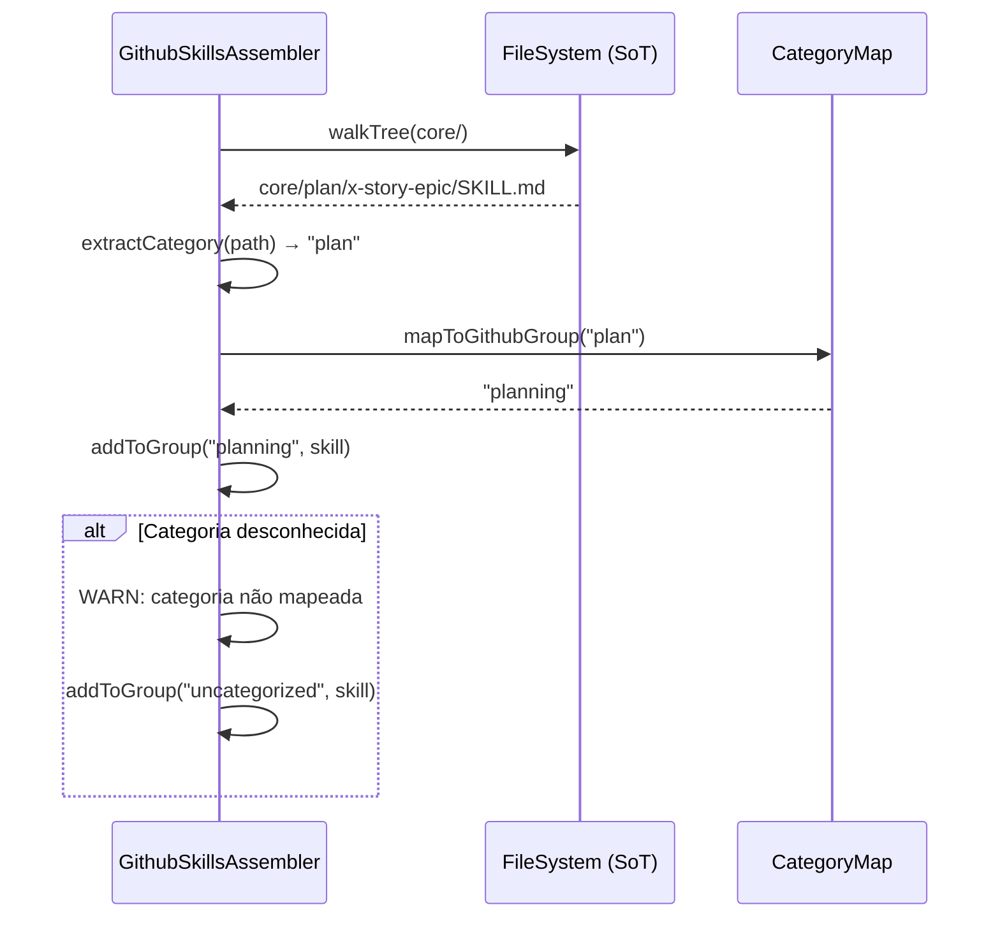

# História: Exclusão do SkillGroupRegistry

**ID:** story-0036-0003
**Chave Jira:** —
**Status:** Pendente

## 1. Dependências

| Blocked By | Blocks |
| :--- | :--- |
| story-0036-0002 | — |

## 2. Regras Transversais Aplicáveis

| ID | Título |
| :--- | :--- |
| RULE-002 | SoT Hierárquico, Output Flat |
| RULE-003 | Taxonomia de 10 Categorias |
| RULE-007 | Golden File Regeneration |
| RULE-008 | Documentação como Deliverable |

## 3. Descrição

Como **Desenvolvedor do ia-dev-env**, eu quero excluir o `SkillGroupRegistry.java` e derivar o agrupamento de skills diretamente do filesystem, garantindo que exista um single source of truth para categorias de skills sem lista hardcoded que possa divergir.

O `SkillGroupRegistry.java` atualmente hardcoda 8 grupos (`story`, `dev`, `review`, `testing`, `infrastructure`, `knowledge-packs`, `git-troubleshooting`, `lib`) usados exclusivamente pelo `GithubSkillsAssembler` para particionar skills no output do GitHub Copilot. Com a reorganização física (story-0036-0002), o filesystem agora é a fonte autoritativa de agrupamento — a classe Java se torna redundante e garantidamente divergente.

O `GithubSkillsAssembler` será atualizado para derivar grupos percorrendo o filesystem (`targets/github-copilot/skills/*/` ou via mapa categoria→github-group do `SkillsAssembler`). O mapeamento das 8 categorias antigas para as 10 novas deve ser documentado.

### 3.1 Exclusão do SkillGroupRegistry

- Deletar `SkillGroupRegistry.java`
- Deletar `SkillGroupRegistryTest.java` (se existir)
- Remover imports e referências em todas as classes que usam `SkillGroupRegistry`

### 3.2 Atualização do GithubSkillsAssembler

- Substituir chamadas a `SkillGroupRegistry` por derivação do filesystem
- O assembler deve usar a estrutura `core/{category}/{name}/` para determinar o grupo
- Se o mapeamento 10-categorias → github-groups não é 1:1, criar um mapa estático simples no assembler
- O output do GitHub Copilot deve permanecer funcional e correto

### 3.3 Mapeamento de Grupos Antigos → Novos

| Grupo Antigo (SkillGroupRegistry) | Categorias Novas (filesystem) |
| :--- | :--- |
| `story` | `plan` |
| `dev` | `dev` |
| `review` | `review` |
| `testing` | `test` |
| `infrastructure` | `ops`, `security` |
| `knowledge-packs` | `knowledge-packs` (inalterado) |
| `git-troubleshooting` | `git`, `code` |
| `lib` | `lib` (inalterado, fora das 10 categorias) |

## 3.5 Entrega de Valor

- **Valor Principal:** Eliminação de fonte duplicada de agrupamento — o filesystem passa a ser o single source of truth, removendo risco de divergência entre código Java e diretórios
- **Métrica de Sucesso:** `SkillGroupRegistry.java` excluído; `GithubSkillsAssembler` produz output correto derivado do filesystem; `mvn clean verify` green
- **Impacto no Negócio:** Redução de custo de manutenção — novos contribuidores não precisam mais atualizar uma lista hardcoded ao adicionar ou mover skills

## 4. Definições de Qualidade Locais

### DoR Local (Definition of Ready)

- [ ] story-0036-0002 concluída (filesystem reorganizado em 10 categorias)
- [ ] Mapeamento grupos antigos → categorias novas validado
- [ ] `GithubSkillsAssembler` identificado e compreendido

### DoD Local (Definition of Done)

- [ ] `SkillGroupRegistry.java` excluído
- [ ] `GithubSkillsAssembler` derivando grupos do filesystem
- [ ] Output GitHub Copilot funcional e correto
- [ ] Todos os testes passando: `mvn clean verify`
- [ ] Golden files regeneradas
- [ ] Pelo menos 1 teste automatizado validando derivação de grupo via filesystem
- [ ] Smoke test: output Copilot gerado com agrupamento correto

### Global Definition of Done (DoD)

- **Cobertura:** ≥ 95% Line, ≥ 90% Branch
- **Testes Automatizados:** Unit tests para assemblers, golden file tests
- **Relatório de Cobertura:** JaCoCo por módulo
- **Documentação:** Código auto-documentado (remoção de classe + atualização de assembler)
- **Persistência:** N/A
- **Performance:** Tempo de assembly sem degradação > 10%

## 5. Contratos de Dados (Data Contract)

> Nenhum endpoint REST declarado nesta story. O contrato é a interface do GithubSkillsAssembler.

### 5.1 Interface do GithubSkillsAssembler (antes vs depois)

| Aspecto | Antes | Depois |
| :--- | :--- | :--- |
| Fonte de agrupamento | `SkillGroupRegistry.getGroup(skillName)` | Filesystem: `core/{category}/{name}/` |
| Número de grupos | 8 (hardcoded) | 10 categorias + lib + knowledge-packs |
| Adição de nova skill | Requer edição do Registry + diretório | Apenas criar diretório na categoria |
| Output | Partição de skills por grupo no Copilot instructions | Idêntico (mesmo formato, grupos atualizados) |

## 6. Diagramas

### 6.1 Derivação de Grupo via Filesystem



## 7. Critérios de Aceite (Gherkin)

```gherkin
Cenario: SkillGroupRegistry ausente não causa erro de compilação
  DADO que o arquivo "SkillGroupRegistry.java" foi excluído
  QUANDO "mvn compile" é executado
  ENTÃO o build deve compilar com sucesso
  E nenhuma referência a SkillGroupRegistry deve existir no código

Cenario: GithubSkillsAssembler deriva grupos do filesystem
  DADO que skills estão organizadas em "core/plan/", "core/dev/", "core/review/"
  QUANDO o GithubSkillsAssembler é executado
  ENTÃO cada skill deve ser atribuída ao grupo correspondente à sua categoria no filesystem
  E skills em "core/plan/" devem aparecer no grupo "planning"

Cenario: Skill em categoria desconhecida gera warning
  DADO que existe uma skill em "core/unknown-category/x-test/"
  QUANDO o GithubSkillsAssembler processa a skill
  ENTÃO um warning deve ser logado indicando categoria não mapeada
  E a skill deve ser incluída em um grupo default

Cenario: Output Copilot contém todas as skills agrupadas
  DADO que o GithubSkillsAssembler foi executado com filesystem reorganizado
  QUANDO o output do GitHub Copilot é inspecionado
  ENTÃO todas as skills devem estar presentes
  E cada skill deve estar em exatamente 1 grupo
  E o número total de skills deve ser idêntico ao anterior

Cenario: Nenhuma referência a SkillGroupRegistry no codebase
  DADO que a exclusão foi concluída
  QUANDO um grep por "SkillGroupRegistry" é executado no diretório java/
  ENTÃO o resultado deve ser vazio (zero matches)

Cenario: mvn clean verify green após exclusão
  DADO que SkillGroupRegistry foi excluído e GithubSkillsAssembler atualizado
  QUANDO "mvn clean verify" é executado
  ENTÃO o build deve passar com sucesso
  E a cobertura deve ser ≥ 95% line e ≥ 90% branch
```

## 8. Tasks

| ID | Descrição | Camada | Dependências | Tag | Padrão de Testabilidade | Estimativa LOC |
| :--- | :--- | :--- | :--- | :--- | :--- | :--- |
| TASK-0036-0003-001 | Excluir SkillGroupRegistry.java e remover imports/referências | Domain | — | [Dev] | Domain+UnitTest | 80 |
| TASK-0036-0003-002 | Atualizar GithubSkillsAssembler para derivar grupos do filesystem | Application | TASK-0036-0003-001 | [Dev] | Domain+UnitTest | 120 |
| TASK-0036-0003-003 | Atualizar testes unitários e regenerar golden files | Test | TASK-0036-0003-002 | [Test] | Migration+Smoke | 100 |
