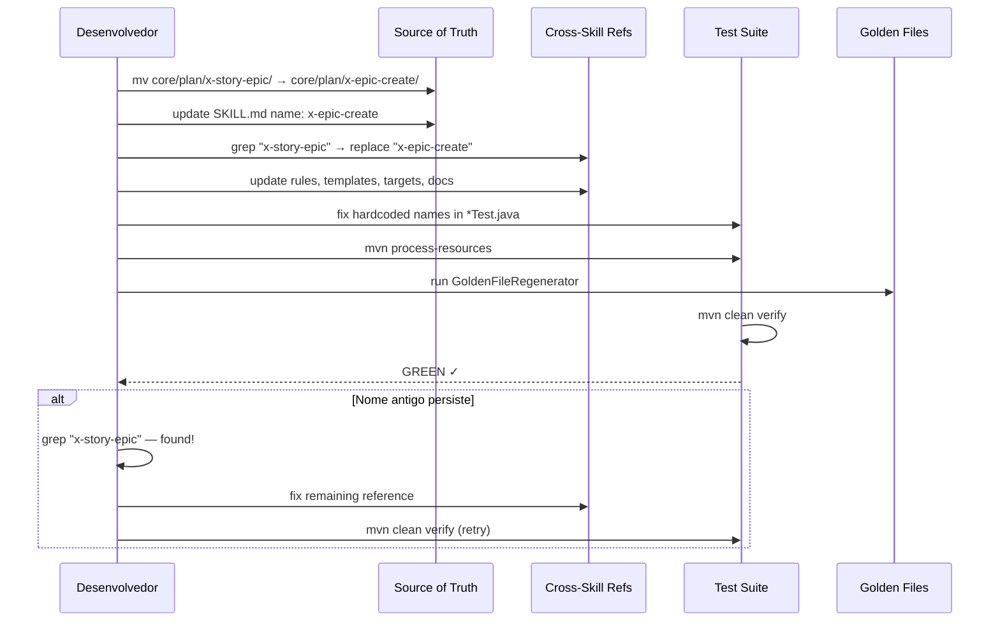

# História: Rename do Cluster Primário (10 skills)

**ID:** story-0036-0004
**Chave Jira:** —
**Status:** Concluída

## 1. Dependências

| Blocked By | Blocks |
| :--- | :--- |
| story-0036-0002 | story-0036-0005, story-0036-0006 |

## 2. Regras Transversais Aplicáveis

| ID | Título |
| :--- | :--- |
| RULE-001 | Prefixo x- Obrigatório |
| RULE-004 | Esquema Verbal de Nomenclatura |
| RULE-005 | Hard Rename sem Aliases |
| RULE-006 | Checklist de Atualização por Rename |
| RULE-007 | Golden File Regeneration |
| RULE-008 | Documentação como Deliverable |

## 3. Descrição

Como **Usuário do ia-dev-env**, eu quero que os nomes das skills do cluster primário (epic/story/task/dev/arch/adr) sejam inequívocos, garantindo que `/x-epic-create` crie um épico, `/x-task-implement` execute uma task, e `/x-story-implement` implemente uma story — sem confusão com os nomes atuais ambíguos.

Esta história executa os 10 renames do cluster primário que resolvem a ambiguidade mais crítica do projeto: o eixo `epic → story → task`. Atualmente, `x-story-epic` cria um épico (não uma story), `x-dev-implement` executa uma task (não um "dev"), e `x-story-map` gera o mapa de um épico (não de uma story).

Cada rename segue o checklist de 8 categorias de superfícies (RULE-006), atualizado em uma única PR atômica. Após os renames, golden files são regeneradas (RULE-007) e um grep sanity confirma que nenhum nome antigo persiste fora de locais permitidos.

### 3.1 Tabela de Renames (10 entradas)

| # | Current | New | Category |
| :--- | :--- | :--- | :--- |
| 1 | `x-story-epic` | `x-epic-create` | plan |
| 2 | `x-story-epic-full` | `x-epic-decompose` | plan |
| 3 | `x-story-map` | `x-epic-map` | plan |
| 4 | `x-epic-plan` | `x-epic-orchestrate` | plan |
| 5 | `x-dev-implement` | `x-task-implement` | dev |
| 6 | `x-dev-story-implement` | `x-story-implement` | dev |
| 7 | `x-dev-epic-implement` | `x-epic-implement` | dev |
| 8 | `x-dev-architecture-plan` | `x-arch-plan` | plan |
| 9 | `x-dev-arch-update` | `x-arch-update` | plan |
| 10 | `x-dev-adr-automation` | `x-adr-generate` | plan |

### 3.2 Superfícies a Atualizar (por rename)

Para cada um dos 10 renames:
1. **Diretório SoT:** Renomear `targets/claude/skills/{category}/{old}/` → `{new}/`
2. **Frontmatter:** Atualizar `name:` em SKILL.md e README.md
3. **Cross-skill refs:** Grep e atualizar `Skill(skill: "{old}")` → `Skill(skill: "{new}")`
4. **Regras:** `13-skill-invocation-protocol.md` e demais rules
5. **Templates:** `_TEMPLATE-*.md` e `_README-TEMPLATES.md`
6. **Outros targets:** GitHub Copilot instructions/prompts, Codex templates
7. **Documentação:** CLAUDE.md, README.md, ADRs
8. **Testes:** `*SkillsTest*.java`, `*AssemblerTest*.java`, `*GoldenTest*.java`

### 3.3 Skills Mantidas (sem rename neste cluster)

- `x-story-create` — já claro
- `x-story-plan` — multi-agent planning de story, sem ambiguidade
- `x-task-plan` — sem ambiguidade
- `x-threat-model` — sem ambiguidade

## 3.5 Entrega de Valor

- **Valor Principal:** Eixo epic/story/task inequívoco para usuários — `x-epic-create` cria épico, `x-task-implement` executa task, eliminando confusão recorrente documentada no ADR-0003
- **Métrica de Sucesso:** 10 skills renomeadas; zero ocorrências de nomes antigos em grep (fora locais permitidos); `mvn clean verify` green; invocação de skill renomeada funciona
- **Impacto no Negócio:** Redução de erros de invocação por usuários — a nomenclatura reflete a ação real, eliminando tentativa-e-erro ao procurar a skill certa

## 4. Definições de Qualidade Locais

### DoR Local (Definition of Ready)

- [ ] story-0036-0002 concluída (filesystem reorganizado)
- [ ] Tabela de 10 renames validada sem conflitos
- [ ] Checklist de 8 superfícies documentado no staging document

### DoD Local (Definition of Done)

- [ ] 10 diretórios renomeados no SoT
- [ ] Frontmatter `name:` atualizado em todos os 10 SKILLs
- [ ] Cross-skill refs atualizadas: zero ocorrências de nomes antigos em grep
- [ ] Regra 13 atualizada com exemplos de nomes novos
- [ ] Templates atualizados
- [ ] GitHub Copilot e Codex targets atualizados
- [ ] CLAUDE.md, README.md, ADRs atualizados
- [ ] Testes Java corrigidos e golden files regeneradas
- [ ] `mvn clean verify` green
- [ ] Pelo menos 1 teste automatizado validando resolução de nome novo
- [ ] Smoke test: invocação de `/x-epic-create` funciona em projeto de teste

### Global Definition of Done (DoD)

- **Cobertura:** ≥ 95% Line, ≥ 90% Branch
- **Testes Automatizados:** Unit tests para assemblers, golden file tests
- **Relatório de Cobertura:** JaCoCo por módulo
- **Documentação:** Todas as 8 superfícies atualizadas na mesma PR
- **Persistência:** N/A
- **Performance:** Tempo de assembly sem degradação > 10%

## 5. Contratos de Dados (Data Contract)

> Nenhum endpoint REST. O contrato é o mapeamento nome-antigo → nome-novo aplicado consistentemente em todas as superfícies.

### 5.1 Mapeamento de Nomes (contrato de rename)

| Campo | Tipo | M/O | Validação | Exemplo |
| :--- | :--- | :--- | :--- | :--- |
| `old_name` | `String` | M | Deve existir no SoT atual | `x-story-epic` |
| `new_name` | `String` | M | Prefixo `x-`, sem duplicatas, esquema `x-{subject}-{action}` | `x-epic-create` |
| `category` | `String` | M | Uma das 10 categorias | `plan` |
| `frontmatter_name` | `String` | M | Idêntico a `new_name` | `x-epic-create` |

### 5.2 Superfícies Impactadas (contrato de atualização)

| Superfície | Padrão de Busca | Ação |
| :--- | :--- | :--- |
| SKILL.md frontmatter | `name: {old_name}` | Substituir por `name: {new_name}` |
| Cross-skill body | `Skill(skill: "{old_name}")` | Substituir por `Skill(skill: "{new_name}")` |
| References | `skills/{old_name}/references/` | Renomear diretório |
| Rules | String literal `{old_name}` | Substituir |
| Templates | String literal `{old_name}` | Substituir |
| Tests | String literal `{old_name}` em assertions | Substituir |

## 6. Diagramas

### 6.1 Fluxo de Rename Atômico



## 7. Critérios de Aceite (Gherkin)

```gherkin
Cenario: Diretório com nome antigo não existe mais
  DADO que o rename de "x-story-epic" para "x-epic-create" foi executado
  QUANDO o diretório "targets/claude/skills/core/plan/" é listado
  ENTÃO "x-epic-create/" deve existir
  E "x-story-epic/" NÃO deve existir

Cenario: Frontmatter name: atualizado corretamente
  DADO que o diretório "x-epic-create/" existe
  QUANDO o arquivo "SKILL.md" é lido
  ENTÃO o campo "name:" no frontmatter deve ser "x-epic-create"
  E NÃO deve conter "x-story-epic"

Cenario: Todas as 10 skills renomeadas com sucesso
  DADO que os 10 renames do cluster primário foram executados
  QUANDO um grep por cada nome antigo é executado no SoT
  ENTÃO zero matches devem ser encontrados para cada um dos 10 nomes antigos
  E cada nome novo deve existir como diretório no SoT

Cenario: Cross-skill refs não contêm nomes antigos
  DADO que os renames foram executados
  QUANDO grep -rn "x-story-epic|x-story-epic-full|x-story-map|x-epic-plan|x-dev-implement|x-dev-story-implement|x-dev-epic-implement|x-dev-architecture-plan|x-dev-arch-update|x-dev-adr-automation" é executado em targets/claude/
  ENTÃO zero matches devem ser encontrados
  MAS matches em locais permitidos (staging doc, ADR-0003) são aceitos

Cenario: Regra 13 atualizada com nomes novos
  DADO que a regra "13-skill-invocation-protocol.md" existe
  QUANDO o conteúdo é inspecionado
  ENTÃO exemplos de invocação devem usar nomes novos (x-epic-create, x-task-implement)
  E nenhum nome antigo deve aparecer nos exemplos

Cenario: Golden files regeneradas com nomes novos
  DADO que mvn process-resources foi executado
  E GoldenFileRegenerator foi executado
  QUANDO os golden files são inspecionados
  ENTÃO devem conter os nomes novos
  E NÃO devem conter nomes antigos

Cenario: mvn clean verify green após 10 renames
  DADO que todos os 10 renames e atualizações foram concluídos
  QUANDO "mvn clean verify" é executado
  ENTÃO o build deve passar com sucesso
  E a cobertura deve ser ≥ 95% line e ≥ 90% branch

Cenario: Skill renomeada é invocável
  DADO que "x-epic-create" foi criada via rename de "x-story-epic"
  QUANDO um usuário invoca "/x-epic-create" em um projeto de teste
  ENTÃO a skill deve ser carregada e executada corretamente
  E o output deve ser idêntico ao que "/x-story-epic" produziria
```

## 8. Tasks

| ID | Descrição | Camada | Dependências | Tag | Padrão de Testabilidade | Estimativa LOC |
| :--- | :--- | :--- | :--- | :--- | :--- | :--- |
| TASK-0036-0004-001 | Renomear 10 diretórios SoT e atualizar frontmatter name: em SKILL.md e README.md | Config | — | [Dev] | Config+VerificationTest | 150 |
| TASK-0036-0004-002 | Atualizar cross-skill refs: Skill(skill:) calls, references/, body text | Application | TASK-0036-0004-001 | [Dev] | Domain+UnitTest | 200 |
| TASK-0036-0004-003 | Atualizar regras, templates e targets (Copilot, Codex) | Config | TASK-0036-0004-001 | [Dev] | Config+VerificationTest | 150 |
| TASK-0036-0004-004 | Atualizar CLAUDE.md, README.md, ADRs e documentação do projeto | Doc | TASK-0036-0004-002, TASK-0036-0004-003 | [Doc] | — | 100 |
| TASK-0036-0004-005 | Corrigir testes Java (hardcoded names) e regenerar golden files | Test | TASK-0036-0004-002 | [Dev] | Migration+Smoke | 150 |
| TASK-0036-0004-006 | Verificação pós-rename: mvn clean verify + grep sanity (zero nomes antigos) | Test | TASK-0036-0004-004, TASK-0036-0004-005 | [Test] | Migration+Smoke | 80 |
