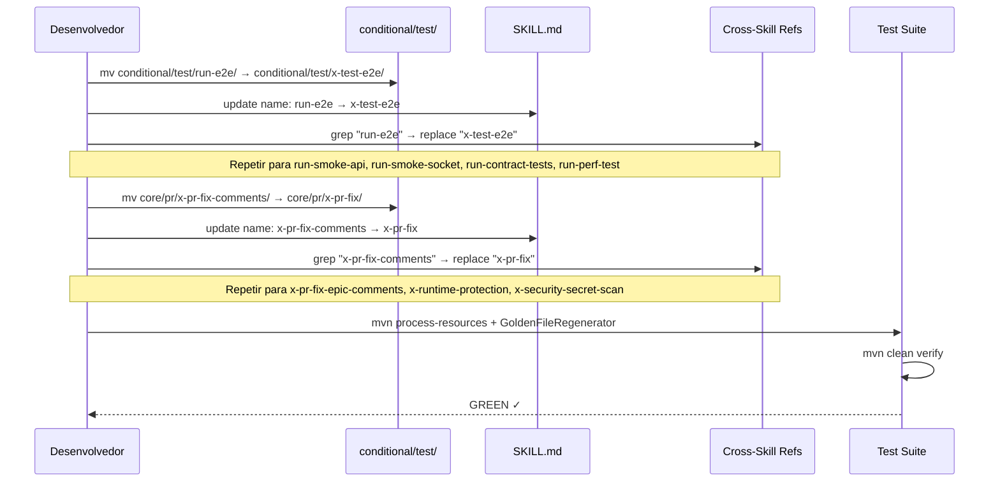

# História: Rename Global Remanescente (9 skills)

**ID:** story-0036-0005
**Chave Jira:** —
**Status:** Concluida

## 1. Dependências

| Blocked By | Blocks |
| :--- | :--- |
| story-0036-0004 | story-0036-0006 |

## 2. Regras Transversais Aplicáveis

| ID | Título |
| :--- | :--- |
| RULE-001 | Prefixo x- Obrigatório |
| RULE-004 | Esquema Verbal de Nomenclatura |
| RULE-005 | Hard Rename sem Aliases |
| RULE-006 | Checklist de Atualização por Rename |
| RULE-007 | Golden File Regeneration |
| RULE-008 | Documentação como Deliverable |

## 3. Descrição

Como **Usuário do ia-dev-env**, eu quero que todas as skills usem exclusivamente o prefixo `x-` e sigam nomenclatura consistente, garantindo que não precise alternar mentalmente entre `run-*` e `x-*` ao invocar skills de teste, e que nomes como `x-pr-fix-comments` e `x-runtime-protection` sejam simplificados.

Esta história executa os 9 renames remanescentes divididos em dois sub-clusters:

**Sub-cluster A — Unificação `run-*` → `x-test-*` (5 renames):** Elimina o prefixo `run-` que viola a convenção `x-` do projeto. Todas as skills de teste condicional passam a usar `x-test-*`, alinhando-as com `x-test-plan`, `x-test-tdd` e `x-test-run` que já existem.

**Sub-cluster B — Simplificações pontuais (4 renames):** Remove redundâncias (`-comments` no contexto `pr/`), corrige simetria no cluster de security (`-protection` → `-eval` para alinhar com `x-hardening-eval`), e normaliza sufixo (`-secret-scan` → `-secrets`).

### 3.1 Sub-cluster A — `run-*` → `x-test-*`

| # | Current | New | Category |
| :--- | :--- | :--- | :--- |
| 11 | `run-e2e` | `x-test-e2e` | test |
| 12 | `run-smoke-api` | `x-test-smoke-api` | test |
| 13 | `run-smoke-socket` | `x-test-smoke-socket` | test |
| 14 | `run-contract-tests` | `x-test-contract` | test |
| 15 | `run-perf-test` | `x-test-perf` | test |

### 3.2 Sub-cluster B — Simplificações Pontuais

| # | Current | New | Category | Rationale |
| :--- | :--- | :--- | :--- | :--- |
| 16 | `x-pr-fix-comments` | `x-pr-fix` | pr | "comments" redundante na categoria pr |
| 17 | `x-pr-fix-epic-comments` | `x-pr-fix-epic` | pr | Idem |
| 18 | `x-runtime-protection` | `x-runtime-eval` | security | Simetria com `x-hardening-eval` |
| 19 | `x-security-secret-scan` | `x-security-secrets` | security | Consistência com siblings `x-security-*` |

### 3.3 Superfícies a Atualizar

Mesmo checklist de 8 categorias da story-0036-0004 (RULE-006), aplicado a cada um dos 9 renames.

## 3.5 Entrega de Valor

- **Valor Principal:** Prefixo unificado `x-` em 100% das skills — usuários digitam apenas `/x-...`, eliminando a alternância cognitiva entre `run-*` e `x-*`
- **Métrica de Sucesso:** 9 skills renomeadas; zero ocorrências de nomes antigos em grep (fora locais permitidos); `mvn clean verify` green; todos os skills `x-test-*` invocáveis
- **Impacto no Negócio:** Consistência de UX na interface de skills — redução de tempo para encontrar e invocar skills de teste de ~5s (lembrar prefixo) para ~1s (sempre `x-`)

## 4. Definições de Qualidade Locais

### DoR Local (Definition of Ready)

- [ ] story-0036-0004 concluída (cluster primário renomeado)
- [ ] Tabela de 9 renames validada sem conflitos com cluster primário
- [ ] Nenhum nome novo colide com nome existente ou nome do cluster primário

### DoD Local (Definition of Done)

- [ ] 9 diretórios renomeados no SoT
- [ ] Frontmatter `name:` atualizado em todos os 9 SKILLs
- [ ] Cross-skill refs atualizadas: zero ocorrências de nomes antigos
- [ ] Regras, templates e targets atualizados
- [ ] CLAUDE.md, README.md atualizados
- [ ] Testes Java corrigidos e golden files regeneradas
- [ ] `mvn clean verify` green
- [ ] Pelo menos 1 teste automatizado validando resolução de nome novo
- [ ] Smoke test: invocação de `/x-test-e2e` e `/x-pr-fix` funciona

### Global Definition of Done (DoD)

- **Cobertura:** ≥ 95% Line, ≥ 90% Branch
- **Testes Automatizados:** Unit tests para assemblers, golden file tests
- **Relatório de Cobertura:** JaCoCo por módulo
- **Documentação:** Todas as 8 superfícies atualizadas na mesma PR
- **Persistência:** N/A
- **Performance:** Tempo de assembly sem degradação > 10%

## 5. Contratos de Dados (Data Contract)

> Nenhum endpoint REST. O contrato é o mapeamento nome-antigo → nome-novo, idêntico em estrutura à story-0036-0004.

### 5.1 Mapeamento de Nomes (contrato de rename)

| Campo | Tipo | M/O | Validação | Exemplo |
| :--- | :--- | :--- | :--- | :--- |
| `old_name` | `String` | M | Deve existir no SoT atual | `run-e2e` |
| `new_name` | `String` | M | Prefixo `x-`, sem duplicatas | `x-test-e2e` |
| `category` | `String` | M | Uma das 10 categorias | `test` |
| `is_conditional` | `Boolean` | M | true para skills em conditional/ | `true` |

### 5.2 Validação de Conflito com Cluster Primário

| Validação | Regra | Ação se violada |
| :--- | :--- | :--- |
| Nome novo não existe como diretório | `ls targets/claude/skills/*/{new_name}` vazio | Abort — conflito de nome |
| Nome novo não aparece em nomes mantidos | `new_name ∉ kept_names` | Abort — colisão |
| Nome novo segue esquema `x-{subject}-{action}` | Regex match | Warning — verificar manualmente |

## 6. Diagramas

### 6.1 Fluxo de Unificação run-* → x-test-*



## 7. Critérios de Aceite (Gherkin)

```gherkin
Cenario: Diretório run-e2e não existe mais
  DADO que o rename de "run-e2e" para "x-test-e2e" foi executado
  QUANDO o diretório "targets/claude/skills/conditional/test/" é listado
  ENTÃO "x-test-e2e/" deve existir
  E "run-e2e/" NÃO deve existir

Cenario: Todos os 5 runners unificados sob x-test-*
  DADO que os 5 renames run-* foram executados
  QUANDO grep por "^run-" é executado nos frontmatters de skills condicionais
  ENTÃO zero matches devem ser encontrados
  E as 5 skills devem existir com prefixo "x-test-"

Cenario: x-pr-fix é simplificação válida de x-pr-fix-comments
  DADO que "x-pr-fix-comments" foi renomeada para "x-pr-fix"
  QUANDO o SKILL.md de x-pr-fix é inspecionado
  ENTÃO o campo name: deve ser "x-pr-fix"
  E o conteúdo funcional deve ser preservado

Cenario: x-runtime-eval alinhado com x-hardening-eval
  DADO que "x-runtime-protection" foi renomeada para "x-runtime-eval"
  QUANDO os nomes das skills de security são listados
  ENTÃO devem existir "x-hardening-eval" e "x-runtime-eval" (simetria -eval)
  E "x-runtime-protection" NÃO deve existir

Cenario: Zero nomes antigos no codebase (exceto locais permitidos)
  DADO que os 9 renames foram executados
  QUANDO grep por "run-e2e|run-smoke-api|run-smoke-socket|run-contract-tests|run-perf-test|x-pr-fix-comments|x-pr-fix-epic-comments|x-runtime-protection|x-security-secret-scan" é executado
  ENTÃO matches devem existir APENAS em locais permitidos (staging doc, ADR-0003, CHANGELOG)

Cenario: Nenhum conflito com nomes do cluster primário
  DADO que os 9 renames do remanescente foram executados
  E os 10 renames do cluster primário já estão aplicados
  QUANDO todos os 19 novos nomes são listados
  ENTÃO não deve haver duplicatas

Cenario: mvn clean verify green após 9 renames
  DADO que todos os 9 renames e atualizações foram concluídos
  QUANDO "mvn clean verify" é executado
  ENTÃO o build deve passar com sucesso
  E a cobertura deve ser ≥ 95% line e ≥ 90% branch
```

## 8. Tasks

| ID | Descrição | Camada | Dependências | Tag | Padrão de Testabilidade | Estimativa LOC |
| :--- | :--- | :--- | :--- | :--- | :--- | :--- |
| TASK-0036-0005-001 | Renomear 5 diretórios run-* para x-test-* e atualizar frontmatter | Config | — | [Dev] | Config+VerificationTest | 120 |
| TASK-0036-0005-002 | Renomear 4 skills pointwise (x-pr-fix-*, x-runtime-*, x-security-*) e atualizar frontmatter | Config | — | [Dev] | Config+VerificationTest | 100 |
| TASK-0036-0005-003 | Atualizar cross-skill refs, regras, templates e targets | Application | TASK-0036-0005-001, TASK-0036-0005-002 | [Dev] | Domain+UnitTest | 180 |
| TASK-0036-0005-004 | Atualizar CLAUDE.md, README.md e documentação do projeto | Doc | TASK-0036-0005-003 | [Doc] | — | 80 |
| TASK-0036-0005-005 | Corrigir testes Java e regenerar golden files | Test | TASK-0036-0005-003 | [Dev] | Migration+Smoke | 150 |
| TASK-0036-0005-006 | Verificação pós-rename: mvn clean verify + grep sanity | Test | TASK-0036-0005-004, TASK-0036-0005-005 | [Test] | Migration+Smoke | 80 |
