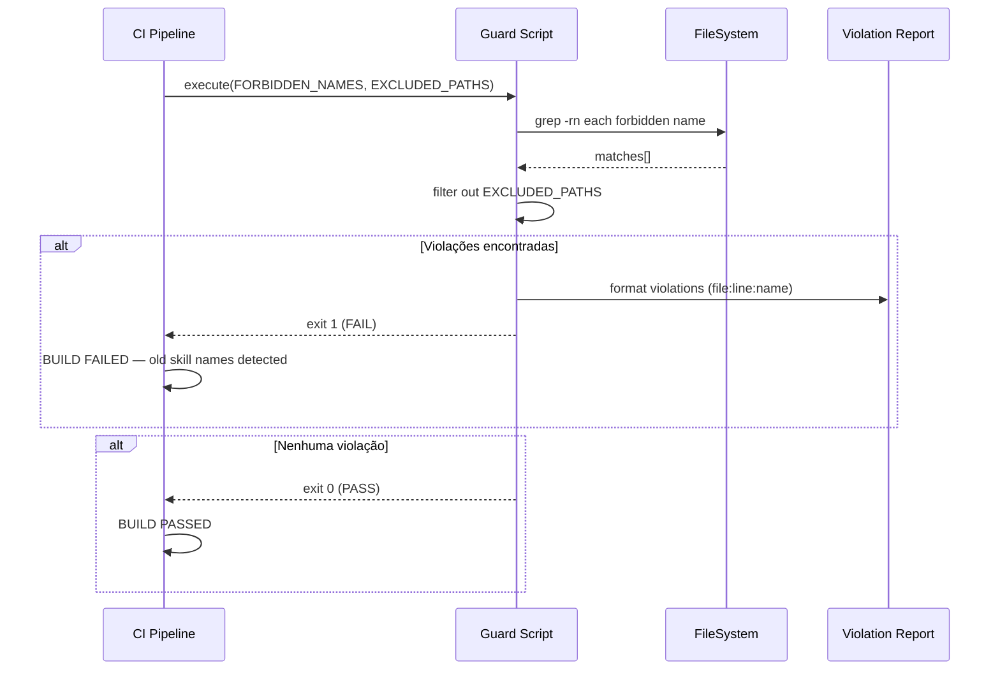

# História: Guard Script de CI e Release Notes

**ID:** story-0036-0006
**Chave Jira:** —
**Status:** Pendente

## 1. Dependências

| Blocked By | Blocks |
| :--- | :--- |
| story-0036-0004, story-0036-0005 | — |

## 2. Regras Transversais Aplicáveis

| ID | Título |
| :--- | :--- |
| RULE-005 | Hard Rename sem Aliases |
| RULE-008 | Documentação como Deliverable |
| RULE-009 | Guard Script de CI |

## 3. Descrição

Como **Mantenedor do ia-dev-env**, eu quero um guard script de CI que impeça regressões de nomenclatura e release notes que documentem a migração, garantindo que nomes antigos nunca reapareçam no codebase e que consumidores saibam exatamente quais skills mudaram.

Esta história é a camada de proteção final do EPIC-0036. Após os 19 renames executados nas stories 0004 e 0005, o guard script garante que nenhum nome antigo volte ao codebase — seja por merge de branch desatualizada, copy-paste de documentação antiga, ou contribuição de novo desenvolvedor.

O script é integrado ao CI (Maven build ou GitHub Actions) e falha o build se qualquer dos 19 nomes antigos for detectado fora de locais explicitamente permitidos. Além do script, esta história produz release notes documentando a tabela completa de migração e atualiza o CHANGELOG.md.

### 3.1 Guard Script

- Linguagem: Shell script (bash) ou classe Java de teste
- Input: lista de 19 nomes proibidos (hardcoded no script)
- Busca: `grep -rn` recursivo no repositório
- Exclusões (locais permitidos):
  - `plans/epic-0036/skill-renames.md`
  - `adr/ADR-0003-skill-taxonomy-and-naming.md`
  - `CHANGELOG.md`
  - `docs/release-notes/**`
  - O próprio guard script
  - `.git/`, `java/target/`, `node_modules/`, `.claude/worktrees/`
- Output: lista de violações com arquivo:linha ou exit code 0 (clean)
- Integração: executar como parte do `mvn verify` ou como step no CI workflow

### 3.2 Release Notes

- Documento em `docs/release-notes/` ou seção no CHANGELOG.md
- Tabela completa de migração: 19 linhas com nome antigo → nome novo
- Nota de breaking change: "Skills renomeadas. Pipelines e scripts que invocam skills por nome devem ser atualizados."
- Referência ao ADR-0003 para contexto completo

### 3.3 CHANGELOG.md

- Adicionar entry sob `[Unreleased]` ou próxima versão
- Seção `Changed`: listar os 19 renames agrupados por cluster
- Seção `Removed`: `SkillGroupRegistry.java`
- Seção `Added`: Guard script de CI, 10 categorias no SoT

### 3.4 Documentação Final

- Revisão final de todos os documentos do projeto
- Confirmar que CLAUDE.md nota "In progress — EPIC-0036" será removida após merge
- Confirmar que ADR-0003 status será atualizado para "Accepted" após merge do épico

## 3.5 Entrega de Valor

- **Valor Principal:** Proteção automatizada contra regressão de nomenclatura em CI, garantindo que os 19 renames sejam permanentes e não revertidos acidentalmente
- **Métrica de Sucesso:** Guard script detecta 100% dos nomes antigos em teste de regressão; CHANGELOG atualizado; release notes publicadas; `mvn clean verify` green com guard ativo
- **Impacto no Negócio:** Comunicação clara de breaking changes para consumidores externos — tabela de migração completa permite atualização mecânica de pipelines e scripts

## 4. Definições de Qualidade Locais

### DoR Local (Definition of Ready)

- [ ] story-0036-0004 concluída (10 renames do cluster primário)
- [ ] story-0036-0005 concluída (9 renames remanescentes)
- [ ] Lista de 19 nomes proibidos validada
- [ ] Lista de locais permitidos (exclusões) definida

### DoD Local (Definition of Done)

- [ ] Guard script implementado e integrado ao CI
- [ ] Guard script detecta nomes antigos corretamente (teste positivo)
- [ ] Guard script ignora locais permitidos (teste negativo)
- [ ] Release notes documentando 19 renames
- [ ] CHANGELOG.md atualizado com seções Changed, Removed, Added
- [ ] `mvn clean verify` green com guard ativo
- [ ] Pelo menos 1 teste automatizado validando detecção de nome antigo
- [ ] Smoke test: inserir nome antigo em arquivo temporário → guard falha → remover → guard passa

### Global Definition of Done (DoD)

- **Cobertura:** ≥ 95% Line, ≥ 90% Branch
- **Testes Automatizados:** Unit tests para guard script, integration test com nome antigo proposital
- **Relatório de Cobertura:** JaCoCo por módulo
- **Documentação:** Release notes, CHANGELOG, documentação final
- **Persistência:** N/A
- **Performance:** Guard script executa em < 5s

## 5. Contratos de Dados (Data Contract)

> Nenhum endpoint REST. O contrato é a interface do guard script.

### 5.1 Interface do Guard Script

| Campo | Tipo | M/O | Descrição | Exemplo |
| :--- | :--- | :--- | :--- | :--- |
| `FORBIDDEN_NAMES` | `List<String>` | M | 19 nomes antigos proibidos | `["x-story-epic", "run-e2e", ...]` |
| `EXCLUDED_PATHS` | `List<String>` | M | Caminhos excluídos da busca | `["plans/epic-0036/skill-renames.md", ...]` |
| `exit_code` | `Integer` | M | 0 = clean, 1 = violações encontradas | `0` |
| `violations` | `List<Violation>` | O | Lista de violações (se exit_code = 1) | `[{file, line, name}]` |

### 5.2 Formato de Violação

| Campo | Tipo | Descrição |
| :--- | :--- | :--- |
| `file` | `String` | Caminho do arquivo com violação |
| `line` | `Integer` | Número da linha |
| `name` | `String` | Nome antigo encontrado |
| `context` | `String` | Linha completa para contexto |

## 6. Diagramas

### 6.1 Fluxo do Guard Script no CI



## 7. Critérios de Aceite (Gherkin)

```gherkin
Cenario: Guard script sem violações retorna exit 0
  DADO que nenhum dos 19 nomes antigos existe no codebase (fora de locais permitidos)
  QUANDO o guard script é executado
  ENTÃO o exit code deve ser 0
  E nenhuma violação deve ser reportada

Cenario: Guard script detecta nome antigo em arquivo proibido
  DADO que o arquivo "java/src/main/resources/targets/claude/skills/core/plan/x-epic-create/SKILL.md" contém a string "x-story-epic"
  QUANDO o guard script é executado
  ENTÃO o exit code deve ser 1
  E a violação deve listar o arquivo, linha e nome "x-story-epic"

Cenario: Guard script ignora locais permitidos
  DADO que "plans/epic-0036/skill-renames.md" contém "x-story-epic" (legítimo)
  E "adr/ADR-0003-skill-taxonomy-and-naming.md" contém "x-story-epic" (legítimo)
  QUANDO o guard script é executado
  ENTÃO esses matches NÃO devem ser reportados como violações
  E o exit code deve ser 0 (se nenhuma outra violação existir)

Cenario: Guard script valida todos os 19 nomes
  DADO que a lista FORBIDDEN_NAMES contém exatamente 19 entradas
  QUANDO a lista é comparada com a seção 4 do staging document
  ENTÃO todas as 19 entradas devem coincidir exatamente

Cenario: CHANGELOG.md atualizado com renames
  DADO que o CHANGELOG.md existe
  QUANDO a seção "[Unreleased]" é inspecionada
  ENTÃO deve conter subsecção "Changed" com referência aos 19 renames
  E deve conter subsecção "Removed" com "SkillGroupRegistry"
  E deve conter subsecção "Added" com "Guard script de CI"

Cenario: Release notes com tabela de migração completa
  DADO que release notes foram criadas
  QUANDO o conteúdo é inspecionado
  ENTÃO deve conter tabela com 19 linhas (nome antigo → nome novo)
  E deve conter nota de breaking change

Cenario: mvn clean verify green com guard ativo
  DADO que o guard script está integrado ao CI
  E o codebase não contém nomes antigos em locais proibidos
  QUANDO "mvn clean verify" é executado
  ENTÃO o build deve passar com sucesso incluindo o guard step
```

## 8. Tasks

| ID | Descrição | Camada | Dependências | Tag | Padrão de Testabilidade | Estimativa LOC |
| :--- | :--- | :--- | :--- | :--- | :--- | :--- |
| TASK-0036-0006-001 | Implementar guard script com lista de 19 nomes proibidos e busca recursiva | Domain | — | [Dev] | Domain+UnitTest | 120 |
| TASK-0036-0006-002 | Configurar permitted locations (exclusões) e integrar ao mvn verify | Config | TASK-0036-0006-001 | [Dev] | Config+VerificationTest | 80 |
| TASK-0036-0006-003 | Redigir release notes com tabela de migração e nota de breaking change | Doc | — | [Doc] | — | 100 |
| TASK-0036-0006-004 | Atualizar CHANGELOG.md com entries Changed/Removed/Added | Doc | TASK-0036-0006-003 | [Doc] | — | 50 |
| TASK-0036-0006-005 | Validar guard: teste positivo (detecta nome antigo) + teste negativo (ignora permitidos) + mvn clean verify | Test | TASK-0036-0006-002, TASK-0036-0006-004 | [Test] | Migration+Smoke | 80 |
