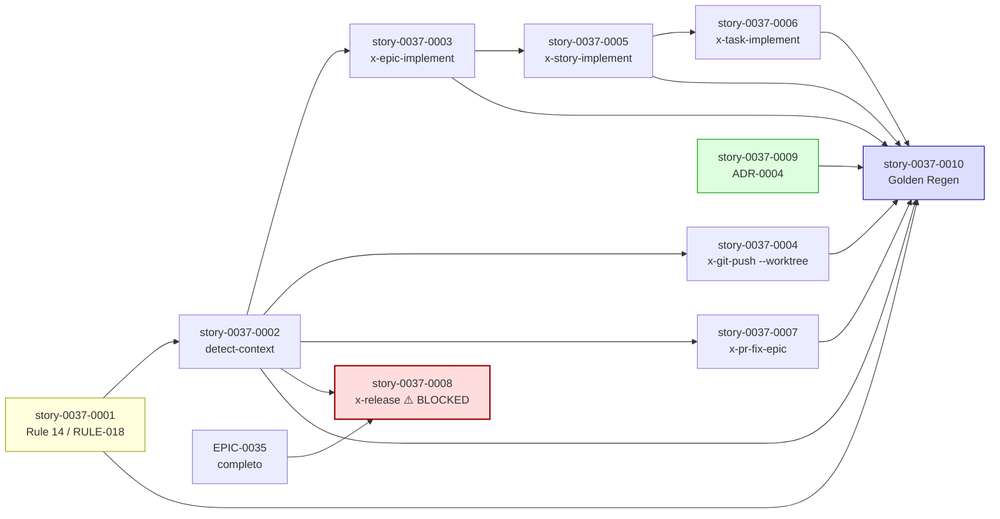

# Mapa de Implementação — Épico 0037 (Worktree-First Branch Creation Policy)

**Gerado a partir das dependências BlockedBy/Blocks das histórias do epic-0037.**

---

## 1. Matriz de Dependências

| Story | Título | Chave Jira | Blocked By | Blocks | Status |
| :--- | :--- | :--- | :--- | :--- | :--- |
| [story-0037-0001](./story-0037-0001.md) | Promover RULE-018 a Rule File `14-worktree-lifecycle.md` | — | — | 0002, 0003, 0004, 0005, 0006, 0007, 0010 | Concluída |
| [story-0037-0002](./story-0037-0002.md) | Adicionar Operação `detect-context` a `x-git-worktree` | — | 0001 | 0003, 0004, 0005, 0006, 0007, 0008 | Concluída |
| [story-0037-0003](./story-0037-0003.md) | Migrar `x-epic-implement` para `/x-git-worktree` Explícito | — | 0001, 0002 | 0005, 0010 | Concluída |
| [story-0037-0004](./story-0037-0004.md) | `x-git-push` Ganha Flag `--worktree` | — | 0002 | 0010 | Concluída |
| [story-0037-0005](./story-0037-0005.md) | `x-story-implement` Phase 0 Worktree-Aware | — | 0002, 0003 | 0006, 0010 | Concluída |
| [story-0037-0006](./story-0037-0006.md) | `x-task-implement` Worktree-Aware | — | 0002, 0005 | 0010 | Concluída |
| [story-0037-0007](./story-0037-0007.md) | `x-pr-fix-epic` Cria Worktree para Branch de Correção | — | 0002 | 0010 | Concluída |
| [story-0037-0008](./story-0037-0008.md) | `x-release` Worktree para Release/Hotfix | — | 0002, **EPIC-0035 completo** | — | Concluída |
| [story-0037-0009](./story-0037-0009.md) | ADR-0004 — Worktree-First Branch Creation Policy | — | — | 0010 | Concluída |
| [story-0037-0010](./story-0037-0010.md) | Regenerar Golden Files e Validar End-to-End | — | 0001, 0002, 0003, 0004, 0005, 0006, 0007, 0009 | — | Concluída |

> **Valores de Status:** `Pendente` (padrão) · `Em Andamento` · `Concluída` · `Falha` · `Bloqueada` · `Parcial`

> **Nota crítica:** Story 0037-0008 está **Bloqueada** por EPIC-0035. Quando EPIC-0035 mergear todas as suas 8 stories, esta story será desbloqueada (`Bloqueada → Pendente`) e uma story `0037-0010b` (mini-regen post-EPIC-0035) será criada para fechar o ciclo. STORY 10 deste épico **NÃO** depende da STORY 8 — fecha o épico para as 9 stories executáveis (1-7, 9, 10).

> **Nota sobre paralelismo:** STORIES 4, 7 são paralelizáveis após STORY 2. STORY 9 é totalmente independente (paralela a tudo). STORY 5 espera STORY 3 (sequência crítica). STORY 6 espera STORY 5 (sequência crítica). Sem essa sequência, x-task-implement modificaria branch de criação assumindo padrões que ainda não existem em x-story-implement.

---

## 2. Fases de Implementação

```
╔══════════════════════════════════════════════════════════════════════════╗
║                    FASE 0 — Foundation (sequencial)                    ║
║                                                                        ║
║   ┌─────────────────────────────────────────────────────────┐          ║
║   │  story-0037-0001  Rule 14 — Worktree Lifecycle          │          ║
║   │  (Foundation — bloqueia TODAS as outras stories)        │          ║
║   └──────────────────────────┬──────────────────────────────┘          ║
╚══════════════════════════════╪═════════════════════════════════════════╝
                               │
                               ▼
╔══════════════════════════════════════════════════════════════════════════╗
║                    FASE 1 — Mecanismo (sequencial)                    ║
║                                                                        ║
║   ┌─────────────────────────────────────────────────────────┐          ║
║   │  story-0037-0002  detect-context Operation              │          ║
║   │  (snippet canonical de detecção, base para STORIES 3-8) │          ║
║   └──────────────────────────┬──────────────────────────────┘          ║
╚══════════════════════════════╪═════════════════════════════════════════╝
                               │
              ┌────────────────┼─────────────────┬─────────────────┐
              ▼                ▼                 ▼                 ▼
╔══════════════════════════════════════════════════════════════════════════╗
║              FASE 2 — Migração + Standalone (paralelo)                 ║
║                                                                        ║
║  ┌──────────────────┐  ┌────────────────┐  ┌────────────────┐         ║
║  │ story-0037-0003  │  │ story-0037-0004│  │ story-0037-0007│         ║
║  │ epic-implement   │  │ git-push       │  │ pr-fix-epic    │         ║
║  │ (migração CRÍTICA│  │ --worktree     │  │ auto-worktree  │         ║
║  │  comportamental) │  │  flag (opt-in) │  │  + idempotent  │         ║
║  └────────┬─────────┘  └────────────────┘  └────────────────┘         ║
║           │                                                            ║
║           ▼                                                            ║
║  ┌──────────────────┐                                                  ║
║  │ story-0037-0005  │                                                  ║
║  │ story-implement  │                                                  ║
║  │ Phase 0 worktree │                                                  ║
║  └────────┬─────────┘                                                  ║
║           │                                                            ║
║           ▼                                                            ║
║  ┌──────────────────┐                                                  ║
║  │ story-0037-0006  │                                                  ║
║  │ task-implement   │                                                  ║
║  │ worktree-aware   │                                                  ║
║  └──────────────────┘                                                  ║
╚══════════════════════════════════════════════════════════════════════════╝

╔══════════════════════════════════════════════════════════════════════════╗
║          FASE 3 — ADR (paralela com FASES 0-2)                         ║
║                                                                        ║
║   ┌─────────────────────────────────────────────────────────┐          ║
║   │  story-0037-0009  ADR-0004                              │          ║
║   │  (decisão arquitetural — pode rodar a qualquer momento) │          ║
║   └─────────────────────────────────────────────────────────┘          ║
╚══════════════════════════════════════════════════════════════════════════╝
                               │
              ┌────────────────┴────────────────┐
              ▼                                 ▼
╔══════════════════════════════════════════════════════════════════════════╗
║                    FASE 4 — Sync Barrier (sequencial)                  ║
║                                                                        ║
║   ┌─────────────────────────────────────────────────────────┐          ║
║   │  story-0037-0010  Golden Regen + Validação End-to-End   │          ║
║   │  (depende de STORIES 1-7, 9; smoke epic paralelo)       │          ║
║   └─────────────────────────────────────────────────────────┘          ║
╚══════════════════════════════════════════════════════════════════════════╝
                               │
                               ▼
                    ┌─────────────────────┐
                    │  ÉPICO CONCLUÍDO    │
                    │  (9 stories)        │
                    └─────────────────────┘

╔══════════════════════════════════════════════════════════════════════════╗
║          FASE 5 (FUTURA) — Bloqueada por EPIC-0035                    ║
║                                                                        ║
║   ┌─────────────────────────────────────────────────────────┐          ║
║   │  story-0037-0008  x-release worktree (BLOCKED)          │          ║
║   │  Aguarda EPIC-0035 todas 8 stories mergeadas            │          ║
║   └──────────────────────────┬──────────────────────────────┘          ║
║                              │                                         ║
║                              ▼                                         ║
║   ┌─────────────────────────────────────────────────────────┐          ║
║   │  story-0037-0010b (futura, a criar) Mini-regen          │          ║
║   │  Golden regen apenas para x-release                     │          ║
║   └─────────────────────────────────────────────────────────┘          ║
╚══════════════════════════════════════════════════════════════════════════╝
```

---

## 3. Caminho Crítico

```
0001 → 0002 → 0003 → 0005 → 0006 → 0010 → DONE
```

**6 stories no caminho crítico** (1, 2, 3, 5, 6, 10). Tamanhos: S + S + L + M + S + S = ~M total.

Stories fora do caminho crítico (paralelizáveis): 4, 7, 9.

---

## 4. Mermaid Dependency Graph



---

## 5. Tabela Resumo de Phases

| Phase | Stories | Paralelismo | Tamanho Estimado | Stories Críticas |
| :--- | :--- | :--- | :--- | :--- |
| **Phase 0 — Foundation** | 0001 | Sequencial | S | 0001 |
| **Phase 1 — Mecanismo** | 0002 | Sequencial (após 0001) | S | 0002 |
| **Phase 2 — Migração + Standalone** | 0003, 0004, 0007 (paralelo) → 0005 → 0006 | Paralelo parcial | L+M+M+M+S | 0003, 0005, 0006 |
| **Phase 3 — ADR** | 0009 | Paralelo a tudo | S | — |
| **Phase 4 — Sync Barrier** | 0010 | Sequencial (sync barrier) | S | 0010 |
| **Phase 5 — Futura (BLOCKED)** | 0008 (+ 0010b futura) | Sequencial após EPIC-0035 | M | 0008 |

---

## 6. Observações Estratégicas

### 6.1 Por que migrar `x-epic-implement` é a story mais arriscada

STORY 3 é a **única** story do épico que muda comportamento real de execução (todas as outras adicionam capabilities opt-in ou só editam docs). Isso significa:

- **Maior risco de regressão**: se a migração quebra parallel dispatch, o épico inteiro fica em estado degradado.
- **Maior necessidade de smoke**: STORY 3 inclui smoke manual com 2 stories paralelas como AC obrigatório.
- **Sequenciamento explícito**: STORY 3 NÃO pode mergear até que STORY 1 (rule file) e STORY 2 (detect-context) estejam disponíveis, porque o cleanup defensivo e o nesting prevention dependem deles.

### 6.2 Por que STORIES 5, 6 são sequenciais (não paralelas)

Tecnicamente STORIES 5 e 6 modificam skills diferentes e poderiam rodar em paralelo. Mas:

- STORY 5 (`x-story-implement`) estabelece o padrão `STORY_OWNS_WORKTREE` que STORY 6 (`x-task-implement`) reusa.
- Mergir STORY 6 antes de STORY 5 cria documentação inconsistente: task-implement referenciaria padrões de story-implement que ainda não existem.
- A sequência adiciona ~1-2 dias de wall-clock mas elimina churn.

### 6.3 Por que STORY 9 (ADR) é independente

ADRs descrevem decisões já tomadas. A decisão de adotar worktree-first foi tomada quando este épico foi planejado, então ADR-0004 pode ser escrito a qualquer momento — não depende de implementação.

A única razão para incluí-la na FASE 4 (sync barrier de STORY 10) é garantir que ela esteja indexada em `adr/README.md` antes do épico ser declarado completo. Pode ser PR-merged em paralelo com STORIES 1-7.

### 6.4 Por que STORY 8 fica fora do épico inicial

STORY 8 depende de EPIC-0035, que reescreve `x-release` extensivamente. Tentar implementar STORY 8 contra o `x-release` atual seria retrabalho garantido (todo o código mudaria após EPIC-0035 mergear). Melhor:

1. Mergear EPIC-0037 com STORIES 1-7, 9, 10.
2. Esperar EPIC-0035 mergear.
3. Refinar STORY 8 contra o novo formato.
4. Mergear STORY 8 + STORY 10b (mini-regen) como adendo do EPIC-0037.

Esta abordagem evita acoplamento entre os dois épicos e permite paralelismo no time.

### 6.5 Phasing de Merge Sugerido

**Sprint 1 (semana 1-2):**
- Phase 0: STORY 1
- Phase 1: STORY 2
- Phase 3: STORY 9 (paralela)

**Sprint 2 (semana 3-4):**
- Phase 2: STORIES 3, 4, 7 (paralelas)
- Phase 2 cont.: STORY 5

**Sprint 3 (semana 5):**
- Phase 2 cont.: STORY 6
- Phase 4: STORY 10

**Sprint futuro (após EPIC-0035 mergear):**
- Phase 5: STORY 8 + STORY 10b

---

## 7. Riscos de Sequenciamento

| Risco | Probabilidade | Impacto | Mitigação |
| :--- | :--- | :--- | :--- |
| STORY 3 migração quebra epic dispatch | Média | Crítico | Smoke manual obrigatório como AC; rollback plan via revert do PR |
| STORY 5/6 sequence cria churn se invertida | Baixa | Médio | Sequência declarada explicitamente; review do PR verifica ordem |
| EPIC-0035 nunca mergeia, STORY 8 fica órfã | Baixa | Baixo | STORY 8 isolada; épico pode ser declarado completo sem ela |
| Golden regen conflita com outros épicos em paralelo | Média | Médio | Coordenar STORY 10 com mantenedores de outros épicos abertos antes do merge |
| Detect-context snippet diverge entre skills | Baixa | Médio | Snippet canonicalizado em STORY 2; review verifica copy-paste fiel |
