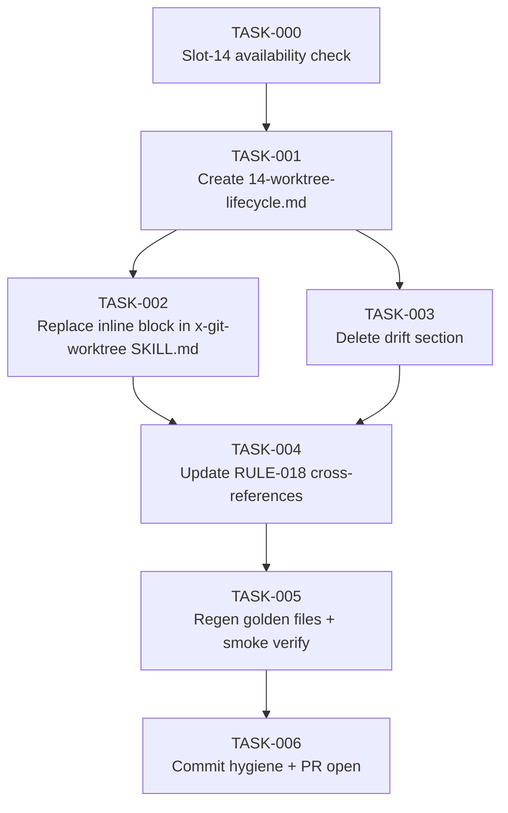

# Task Breakdown — story-0037-0001

## Header

| Field | Value |
|-------|-------|
| Story ID | story-0037-0001 |
| Epic ID | 0037 |
| Date | 2026-04-13 |
| Author | x-story-plan (multi-agent) |
| Template Version | 1.0.0 |

## Summary

| Metric | Value |
|--------|-------|
| Total Tasks | 7 |
| Parallelizable Tasks | 2 (TASK-002, TASK-003 after TASK-001) |
| Estimated Effort | S total (doc-only) |
| Mode | multi-agent |
| Agents Participating | Architect, QA, Security, Tech Lead, PO |

## Dependency Graph

## Tasks Table

| Task ID | Source Agent | Type | TDD Phase | TPP Level | Layer | Components | Parallel | Depends On | Estimated Effort | DoD |
|---------|-------------|------|-----------|-----------|-------|-----------|----------|-----------|-----------------|-----|
| TASK-000 | merged(PO,TechLead) | validation | VERIFY | N/A | cross-cutting | targets/claude/rules/ | no | — | XS | Slot 14 free; slots 10/11/12 still reserved; branch `feature/story-0037-0001-rule-file` cut from develop; baseline `mvn clean verify` green |
| TASK-001 | merged(Architect,QA,Security,PO) | documentation | GREEN | nil→collection | cross-cutting | targets/claude/rules/14-worktree-lifecycle.md | no | TASK-000 | S | File exists at correct SoT path; H1 = "# Rule 14 — Worktree Lifecycle"; 7 H2 sections in spec order (Naming, Protegidas, Não-Aninhamento, Lifecycle, Ownership, Quando Usar, Anti-Patterns); naming table 6 rows × 3 cols; ownership matrix ≥5 skill rows; anti-patterns explicitly forbid `Agent(isolation:"worktree")`, protected-branch checkout, worktree outside `.claude/worktrees/`; .gitignore guidance for `.claude/worktrees/` documented (SEC); structural shape mirrors `13-skill-invocation-protocol.md`; line width ≤120; no TODO/FIXME |
| TASK-002 | merged(Architect,QA,PO) | documentation | GREEN | scalar | cross-cutting | targets/claude/skills/core/x-git-worktree/SKILL.md | yes (with TASK-003) | TASK-001 | XS | Lines 49-57 replaced by single-line `> **See:** [RULE-018 — Worktree Lifecycle](relative-path)` pointer; inline naming table absent; relative link path verified to resolve to rule file; frontmatter intact |
| TASK-003 | merged(Architect,QA,PO) | documentation | GREEN | scalar | cross-cutting | targets/claude/skills/core/x-git-worktree/SKILL.md | yes (with TASK-002) | TASK-001 | XS | Section "Integration with Epic Execution" (lines 355-379) deleted; HTML comment placeholder pointing to story-0037-0003 left at deletion site; grep "Integration with Epic Execution" returns 0 in SKILL.md; grep for interior diagram labels returns 0; surrounding sections render valid markdown |
| TASK-004 | merged(Architect,QA,Security,TechLead,PO) | documentation | GREEN | conditional | cross-cutting | targets/**/*.md (all RULE-018 hits) | no | TASK-002, TASK-003 | XS | `grep -rn "RULE-018" java/src/main/resources/targets/` returns ONLY links resolving to `14-worktree-lifecycle.md`; zero references to removed inline block lines; no false positives (historical/comment context excluded by inspection); zero absolute filesystem paths (`/Users/`, `/home/`, `C:\`) introduced (SEC) |
| TASK-005 | merged(Architect,QA,TechLead,PO) | verification | VERIFY | iteration | cross-cutting | java/src/test/resources/golden/**, .claude/ | no | TASK-004 | S | `mvn process-resources` runs first, then `GoldenFileRegenerator` (per memory feedback); new `14-worktree-lifecycle.md` present in EVERY profile golden under `.claude/rules/`; x-git-worktree golden SKILL.md reflects pointer + section deletion in every profile; `.claude/rules/14-worktree-lifecycle.md` byte-identical to source; `mvn clean verify` green; PlatformDirectorySmokeTest green; AssemblerRegressionSmokeTest green; ContentIntegritySmokeTest green; CrossProfileConsistencySmokeTest green; zero spurious diffs on unrelated golden files |
| TASK-006 | TechLead | quality-gate | VERIFY | N/A | cross-cutting | git history, GitHub PR | no | TASK-005 | XS | Each commit follows `^(docs\|chore)\(story-0037-0001\): ` Conventional Commits pattern; minimum 5 atomic commits separated as (rule-file create / inline-replace / drift-delete / cross-refs / golden-regen); regen commit isolates generated output from SoT edits; PR target = `develop`; PR labeled `epic-0037`; PR body links story file and declares RULE-001/005/006/007 compliance; branch name follows `feature/story-0037-0001-*` (Rule 09) |

## Escalation Notes

| Task ID | Reason | Recommended Action |
|---------|--------|--------------------|
| TASK-005 | Golden regen across multiple profiles can produce noisy diffs if templates have placeholders | Run `git diff --stat src/test/resources/golden/` first; if files outside scope appear, re-run regen on clean working tree |
| TASK-004 | False-positive risk in RULE-018 grep (historical mentions in changelogs/ADRs) | Manual inspection of every match; document each redirect target in PR description |
