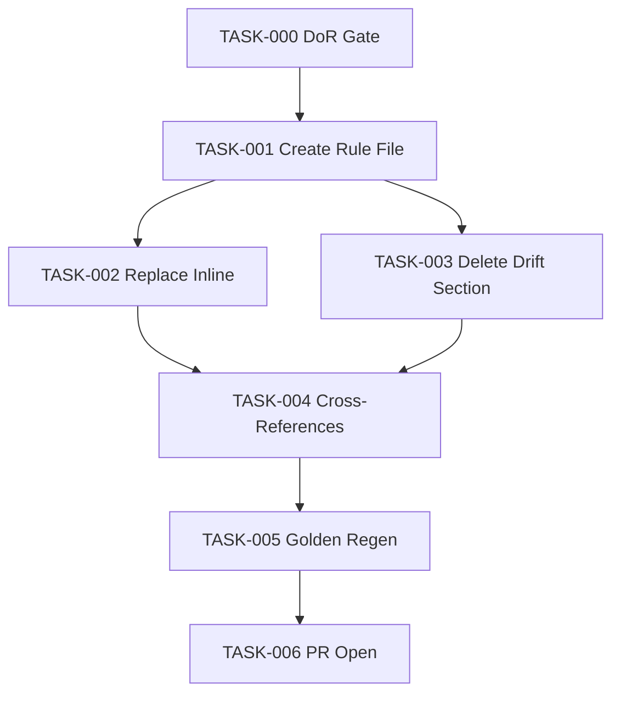

# Task Breakdown — story-0037-0001

## Header

| Field | Value |
|-------|-------|
| Story ID | story-0037-0001 |
| Epic ID | 0037 |
| Title | Promover RULE-018 a Rule File `14-worktree-lifecycle.md` |
| Date | 2026-04-13 |
| Author | x-story-plan (multi-agent consolidated from story content) |
| Template Version | 1.0.0 |

## Summary

| Metric | Value |
|--------|-------|
| Total Tasks | 7 |
| Parallelizable Tasks | 2 (TASK-002 e TASK-003) |
| Estimated Effort | S total (docs-only) |
| Mode | multi-agent (consolidated) |
| Agents Participating | Architect, QA, Security, Tech Lead, PO |

## Dependency Graph

## Tasks Table

| Task ID | Source | Type | TDD Phase | Layer | Components | Parallel | Depends On | Effort | DoD |
|---------|--------|------|-----------|-------|-----------|----------|-----------|--------|-----|
| TASK-000 | TL+PO | validation | VERIFY | cross-cutting | rules/, docs | no | — | XS | Slot 14 available; baseline `mvn verify` green; branch `feature/story-0037-0001-rule-file` created |
| TASK-001 | ARCH+PO | documentation | GREEN | cross-cutting | `targets/claude/rules/14-worktree-lifecycle.md` | no | TASK-000 | S | 7 sections present (Naming, Protected, Non-Nesting, Lifecycle, Creator Owns Removal, When to Use, Anti-Patterns); matrix with 5+ rows; anti-patterns explicit; markdown lint clean |
| TASK-002 | ARCH | documentation | GREEN | cross-cutting | `targets/claude/skills/core/x-git-worktree/SKILL.md` (L49-57) | yes (with TASK-003) | TASK-001 | XS | Inline naming table removed; single-line pointer to RULE-018 present; anchor stable |
| TASK-003 | ARCH | documentation | GREEN | cross-cutting | `targets/claude/skills/core/x-git-worktree/SKILL.md` (L355-379) | yes (with TASK-002) | TASK-001 | XS | Section "Integration with Epic Execution" removed; grep returns zero hits; comment marker "will be rewritten by STORY 3" present |
| TASK-004 | ARCH+TL | documentation | GREEN | cross-cutting | `targets/**/*.md` | no | TASK-002, TASK-003 | XS | `grep -rn RULE-018 targets/` returns only links to `14-worktree-lifecycle.md`; zero references to removed inline block |
| TASK-005 | QA | verification | VERIFY | test | `src/test/resources/golden/**/rules/14-worktree-lifecycle.md` | no | TASK-004 | S | `mvn process-resources` + `GoldenFileRegenerator` executed; `mvn clean verify` green; `PlatformDirectorySmokeTest` green; rule file appears in all profiles |
| TASK-006 | TL | quality-gate | VERIFY | cross-cutting | git | no | TASK-005 | XS | Conventional Commit(s) present; PR opened against `develop` with label `epic-0037`; CHANGELOG entry added |

## Security Augmentation Notes

This story is markdown-only (no executable code). No OWASP Top 10 applies. Security review: ensure rule file does not leak paths/hostnames from contributor environments. Anti-patterns section itself is a security-positive output (documents deprecation of `Agent(isolation:"worktree")`).

## Escalation Notes

| Task ID | Reason | Recommended Action |
|---------|--------|--------------------|
| — | None flagged | Proceed as planned |
