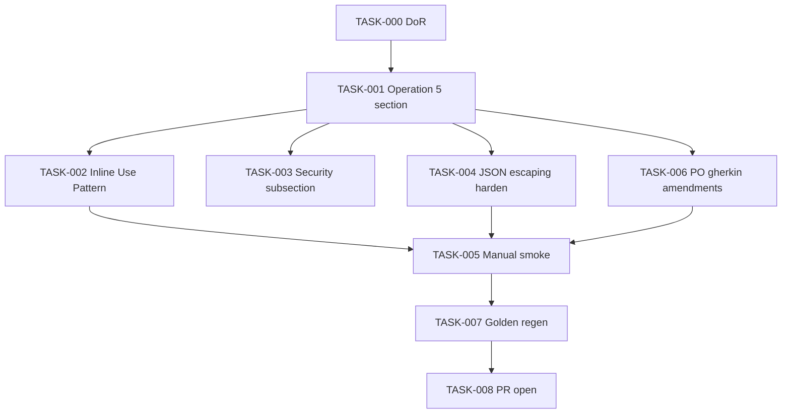

# Task Breakdown — story-0037-0002

## Header

| Field | Value |
|-------|-------|
| Story ID | story-0037-0002 |
| Epic ID | 0037 |
| Title | Adicionar Operação `detect-context` a `x-git-worktree` |
| Date | 2026-04-13 |
| Author | x-story-plan (multi-agent consolidated from story content) |

## Summary

| Metric | Value |
|--------|-------|
| Total Tasks | 9 |
| Estimated Effort | S total (docs + snippet) |
| Mode | multi-agent (consolidated) |
| Agents | Architect, QA, Security, Tech Lead, PO |

## Dependency Graph

## Tasks Table

| Task ID | Source | Type | TDD Phase | Layer | Components | Depends On | Effort | DoD |
|---------|--------|------|-----------|-------|-----------|-----------|--------|-----|
| TASK-000 | TL+PO | validation | VERIFY | cross-cutting | prereqs | — | XS | Story-0001 merged; baseline green; branch cut |
| TASK-001 | ARCH | documentation | GREEN | cross-cutting | `x-git-worktree/SKILL.md` | TASK-000 | S | Operation 5 section after Operation 4; snippet; 3 sample outputs; Mermaid; RULE-018 xref |
| TASK-002 | ARCH | documentation | GREEN | cross-cutting | `x-git-worktree/SKILL.md` | TASK-001 | XS | Inline Use Pattern subsection; jq prereq noted; heredoc safety |
| TASK-003 | SEC | security | VERIFY | cross-cutting | `x-git-worktree/SKILL.md` | TASK-001 | XS | Security Considerations subsection (CWE-209 path leak risk + redaction guidance) |
| TASK-004 | SEC | security | GREEN | cross-cutting | snippet | TASK-001 | XS | JSON escaping hardened (CWE-116); path strings quoted via printf `%s`-safe encoding |
| TASK-005 | QA | verification | VERIFY | smoke | 5 Gherkin + 3 from story | TASK-002, TASK-004, TASK-006 | XS | All 5 cases exercised (main repo, inside-worktree, not-git, deep subdir, empty worktrees dir); evidence captured in PR body |
| TASK-006 | PO | validation | GREEN | cross-cutting | `story-0037-0002.md` Section 7 | TASK-001 | XS | Gherkin amendments for detached HEAD + symlinked worktree paths; path examples standardized |
| TASK-007 | QA | verification | VERIFY | test | golden/ | TASK-005 | XS | `mvn process-resources` + `GoldenFileRegenerator` + `mvn verify` green |
| TASK-008 | TL | quality-gate | VERIFY | cross-cutting | git | TASK-007 | XS | Conventional Commits; PR opened; label `epic-0037`; smoke evidence attached |

## Security Augmentation Notes

- Snippet emits `toplevel` path in JSON — could leak home directories in shared logs. TASK-003 documents redaction expectation for consumers.
- JSON construction uses `printf` with `%s`; paths containing `"` or `\` must be escaped. TASK-004 hardens the escaping.

## Escalation Notes

None.
