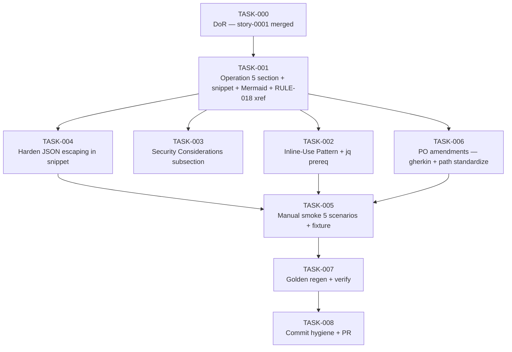

# Task Breakdown — story-0037-0002

## Header

| Field | Value |
|-------|-------|
| Story ID | story-0037-0002 |
| Epic ID | 0037 |
| Date | 2026-04-13 |
| Author | x-story-plan (multi-agent) |
| Template Version | 1.0.0 |

## Summary

| Metric | Value |
|--------|-------|
| Total Tasks | 9 |
| Parallelizable Tasks | 3 (TASK-002, TASK-003, TASK-006 after TASK-001) |
| Estimated Effort | M total (doc-only with snippet validation) |
| Mode | multi-agent |
| Agents Participating | Architect, QA, Security, Tech Lead, PO |

## Dependency Graph

## Tasks Table

| Task ID | Source Agent | Type | TDD Phase | TPP Level | Layer | Components | Parallel | Depends On | Estimated Effort | DoD |
|---------|-------------|------|-----------|-----------|-------|-----------|----------|-----------|-----------------|-----|
| TASK-000 | merged(PO,TechLead) | validation | VERIFY | N/A | cross-cutting | — | no | — | XS | story-0037-0001 merged in develop; branch `feature/story-0037-0002-detect-context` cut from updated develop; baseline `mvn clean verify` green; `targets/claude/skills/core/x-git-worktree/SKILL.md` read in full |
| TASK-001 | merged(Architect,QA,PO) | documentation | GREEN | nil→constant→scalar | cross-cutting | targets/claude/skills/core/x-git-worktree/SKILL.md | no | TASK-000 | S | "Operation 5: detect-context" section added between Operation 4 (cleanup) and "Git Flow Integration"; canonical bash function `detect_worktree_context()` present (POSIX, no jq dep); 3 sample outputs (main repo, in-worktree, detached HEAD); JSON schema (Section 5.1) embedded; exit codes 0/1/2 documented; Mermaid flowchart from story Section 6.1 embedded; RULE-018 cross-reference at section top using relative path `../../../../rules/14-worktree-lifecycle.md` (current 4-level layout — verify before commit; if EPIC-0036 has merged renames, use 5-level path) |
| TASK-002 | merged(Architect,Security,TechLead) | documentation | GREEN | scalar | cross-cutting | targets/claude/skills/core/x-git-worktree/SKILL.md | yes (with TASK-003,004,006) | TASK-001 | XS | "Inline Use Pattern" subsection present below snippet; rationale states "canonical source of truth" + "avoid shell-out cost"; x-git-push example uses heredoc with single-quoted delimiter `'BASH'` (variable-expansion-safe); jq prereq declared with fail-fast snippet (`command -v jq \|\| exit 127`); function name `detect_worktree_context` reused verbatim |
| TASK-003 | Security | security | VERIFY | N/A | cross-cutting | targets/claude/skills/core/x-git-worktree/SKILL.md | yes | TASK-001 | XS | "Security Considerations" subsection added under Operation 5; documents that JSON output contains absolute filesystem paths (CWE-209 information disclosure); concrete redaction example (jq replace `$HOME` with `~`); cross-references Rule 06 |
| TASK-004 | Security | security | GREEN | scalar | cross-cutting | targets/claude/skills/core/x-git-worktree/SKILL.md | yes | TASK-001 | XS | Snippet emits valid JSON when worktree path contains `"`, `\`, newline (CWE-116, OWASP A03); replace fragile `\"$wt_path\"` substitution with jq-based escaping when available, or documented bash escape routine for `\`, `"`, control chars; new Gherkin "Edge — worktree path with double-quote" added in Section 7 |
| TASK-005 | merged(QA,Architect,TechLead) | verification | VERIFY | iteration | cross-cutting | plans/epic-0037/plans/smoke-evidence-story-0037-0002.md, PR body | no | TASK-002, TASK-004, TASK-006 | XS | Self-contained fixture script in PR body (`git worktree add` → run snippet → `git worktree remove`); 5 captured outputs covering all Gherkin scenarios (main repo, in-worktree, not-a-repo, deep-subdir, empty worktrees dir + detached HEAD + symlinked path if PO amendments merged); each output includes stdout, stderr, exit code; fixture is idempotent; evidence file committed |
| TASK-006 | ProductOwner | validation | GREEN | conditional | cross-cutting | plans/epic-0037/story-0037-0002.md | yes | TASK-001 | XS | Gherkin amended: add "Detached HEAD inside main repo" scenario (matches Sample Output #3); add "Worktree path with symlink in middle" scenario (macOS `/private/var`); standardize all path examples to `/repo` (remove `/Users/dev/repo`); validate snippet emits literal `null` (not string `"null"`) for worktreePath when not in worktree |
| TASK-007 | merged(Architect,QA,TechLead) | verification | VERIFY | iteration | cross-cutting | java/src/test/resources/golden/**, .claude/ | no | TASK-005 | XS | `mvn process-resources` run before `GoldenFileRegenerator`; updated x-git-worktree SKILL.md with Operation 5 present in EVERY profile golden; `mvn clean verify` green; PlatformDirectorySmokeTest, AssemblerRegressionSmokeTest, ContentIntegritySmokeTest green; `git status` clean post-regen; `.claude/skills/x-git-worktree/SKILL.md` byte-identical to source |
| TASK-008 | TechLead | quality-gate | VERIFY | N/A | cross-cutting | git history, PR | no | TASK-007 | XS | All commits match `^(docs\|chore)\(story-0037-0002\): ` Conventional Commits; minimum 5 atomic commits; regen commit isolated; PR base = develop; PR labeled `epic-0037`; PR body links story file + smoke fixture; declares RULE-001/002/007 compliance; branch name `feature/story-0037-0002-*` |

## Escalation Notes

| Task ID | Reason | Recommended Action |
|---------|--------|--------------------|
| TASK-001 | Architect flagged that post-EPIC-0036 the path becomes `skills/core/git/x-git-worktree/` requiring 5-level relative path (`../../../../../rules/...`); current SoT is 4-level | Verify directory depth at branch cut; adjust relative path accordingly; add note in PR body |
| TASK-004 | JSON escaping hardening may require non-trivial bash work; jq fallback simplifies | Prefer jq-based escaping; document bash fallback only if jq is not yet a project dep |
| TASK-005 | Manual smoke needs reviewer reproducibility | Embed fixture script in PR body so any reviewer can run end-to-end without environment setup |
| TASK-006 | Story spec mixes path examples (`/Users/dev/repo` vs `/repo`); creates test churn | Standardize early in TASK-006 to prevent drift in TASK-005 evidence |
