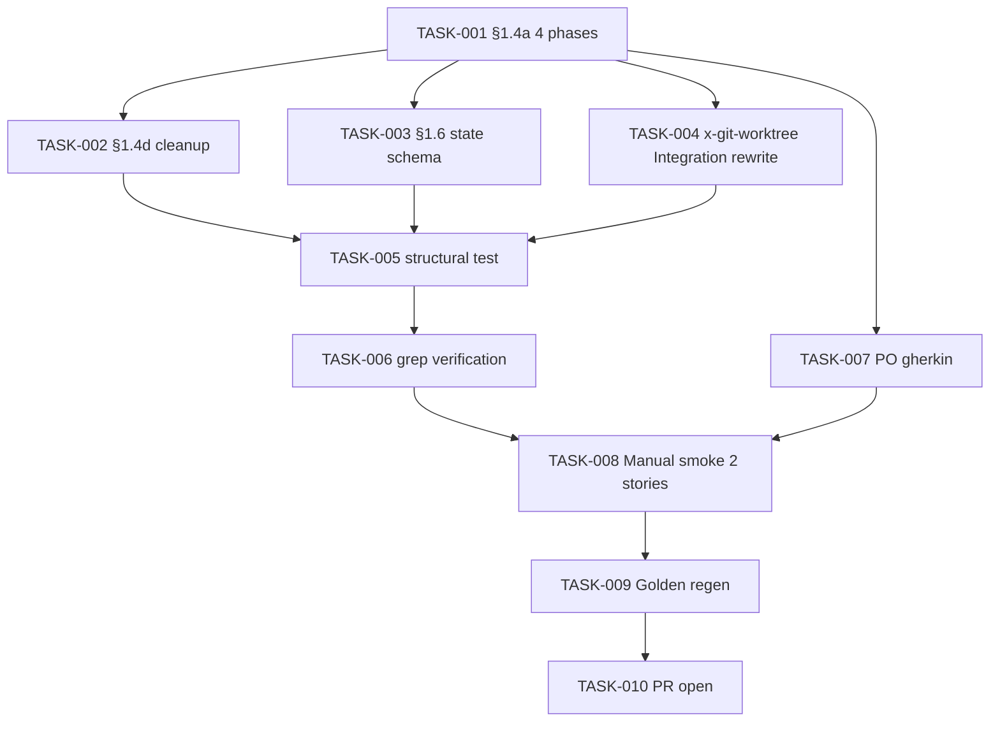

# Task Breakdown — story-0037-0003

## Header

| Field | Value |
|-------|-------|
| Story ID | story-0037-0003 |
| Epic ID | 0037 |
| Title | Migrar `x-epic-implement` para `/x-git-worktree` Explícito |
| Date | 2026-04-13 |
| Author | x-story-plan (multi-agent consolidated from story content) |

## Summary

| Metric | Value |
|--------|-------|
| Total Tasks | 10 |
| Estimated Effort | L total (behavioral migration, highest risk) |
| Mode | multi-agent (consolidated) |
| Agents | Architect, QA, Security, Tech Lead, PO |

## Dependency Graph

## Tasks Table

| Task ID | Source | Type | TDD Phase | Layer | Components | Depends On | Effort | DoD |
|---------|--------|------|-----------|-------|-----------|-----------|--------|-----|
| TASK-001 | ARCH | documentation | GREEN | cross-cutting | `x-epic-implement/SKILL.md` §1.4a | — | L | 4 explicit phases (A/B/C/D); `Agent(isolation:"worktree")` removed; subagent prompt includes `cd <wt>` as Step 0 |
| TASK-002 | ARCH | documentation | GREEN | cross-cutting | §1.4d | TASK-001 | M | Explicit `/x-git-worktree remove` calls; preservation matrix; defensive cleanup dry-run; RULE-018 xref |
| TASK-003 | ARCH | documentation | GREEN | cross-cutting | §1.6 | TASK-001 | S | `worktreePath` per story documented; JSON schema example; `--resume` semantics |
| TASK-004 | ARCH | documentation | GREEN | cross-cutting | `x-git-worktree/SKILL.md` | TASK-001 | M | Integration section rewritten with ASCII diagram; ADR-0004 reference placeholder |
| TASK-005 | QA | test | RED→GREEN | test | `EpicImplementWorktreeMigrationTest` | TASK-001..004 | S | Structural assertions: section 1.4a contains 4 phases; no `isolation:"worktree"` literal; schema includes worktreePath |
| TASK-006 | QA+SEC | test | GREEN | test | `targets/` | TASK-001..004 | XS | `grep -rn "isolation.*worktree" targets/` returns zero non-historical hits |
| TASK-007 | PO | validation | GREEN | cross-cutting | `story-0037-0003.md` §7 | — | XS | Gherkin amendments: PR-rejected branch, `--resume` replay, concurrent epic runs |
| TASK-008 | QA | smoke | VERIFY | smoke | ephemeral fixture epic | TASK-001..007 | M | 2-story parallel epic runs end-to-end; logs show create 2× + remove 2×; `.claude/worktrees/` empty at end |
| TASK-009 | QA | verification | VERIFY | test | golden/ | TASK-008 | S | `mvn process-resources` + `GoldenFileRegenerator` + `mvn verify` green; diffs reviewed for correctness |
| TASK-010 | TL | quality-gate | VERIFY | cross-cutting | git | TASK-009 | XS | Conventional Commits; PR opened; label `epic-0037`; smoke evidence in body |

## Security Augmentation Notes

- Preserved worktrees of failed stories may contain partial source trees (not a CWE per se, but operator-visibility requirement). Logged path is expected to be attacker-trusted (same repo owner). No elevation risk.
- Epic migration removes harness-native magic (positive security outcome: fewer implicit behaviors).

## Escalation Notes

| Task ID | Reason | Recommended Action |
|---------|--------|--------------------|
| TASK-008 | Manual smoke is the **primary gate** for behavioral correctness — automated tests cannot exercise the epic orchestration fully | Block PR approval until smoke evidence present in PR body |
| — | Memory `project_agent_worktree_isolation_leak` documents a prior incident where Agent(worktree) leakage wiped untracked sibling files | Highlights why this migration is worth the risk |
