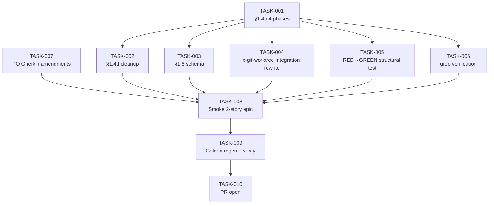

# Task Breakdown — story-0037-0003

| Field | Value |
|-------|-------|
| Story ID | story-0037-0003 |
| Epic ID | 0037 |
| Date | 2026-04-13 |
| Total Tasks | 10 |
| Mode | multi-agent (Architect, QA, Security, TechLead, PO) |
| Risk Profile | **HIGH** — only behavior-changing story of the epic |

## Dependency Graph

## Tasks Table

| Task ID | Source Agent | Type | TDD Phase | Layer | Components | Depends On | Effort | DoD |
|---------|-------------|------|-----------|-------|-----------|-----------|--------|-----|
| TASK-001 | merged(Arch,Sec,TL) | documentation | GREEN | cross-cutting | targets/.../x-dev-epic-implement/SKILL.md §1.4a | — | L | 4 explicit phases (A pre-dispatch / B dispatch / C post-success / D post-failure); subagent prompt includes `cd <worktreePath>` Step 0; `${slug}` sanitized to `[a-z0-9-]+` regex (Sec CWE-22); RULE-018 cross-ref (4-level current SoT); zero `Agent(isolation:"worktree")` literal in section |
| TASK-002 | merged(Arch,Sec) | documentation | GREEN | cross-cutting | x-dev-epic-implement SKILL.md §1.4d | TASK-001 | M | Explicit `/x-git-worktree remove` for SUCCESS+merged; FAILED preserved + `WT_PRESERVED` log; defensive `--dry-run` reports only (no auto-delete); RULE-018 §5 xref; CWE-209 note (no abs paths in user-facing logs) |
| TASK-003 | merged(Arch,QA) | documentation | GREEN | cross-cutting | x-dev-epic-implement SKILL.md §1.6 + 1.6.1 | TASK-001 | S | `worktreePath` field added to JSON example; full schema from story §5.1 mirrored; `--resume` semantics noted (state restores worktreePath) |
| TASK-004 | merged(Arch,TL) | documentation | GREEN | cross-cutting | x-git-worktree SKILL.md "Integration with Epic Execution" | TASK-001 | M | ASCII sequence diagram matches story §3.4; ADR-0004 cross-ref (placeholder TODO if story-0037-0009 unmerged: "ADR-0004 will be added by story-0037-0009"); `isolation:"worktree"` only as historical note |
| TASK-005 | merged(QA,TL) | test | RED→GREEN | cross-cutting | new Java test (e.g., `EpicImplementWorktreeMigrationTest`) | TASK-001..004 | S | RED commit asserts on current SKILL.md (4 phases absent); GREEN passes after TASK-001..004; assertions: 4-phase headings, `worktreePath` token, Mermaid sequence block, defensive cleanup paragraph |
| TASK-006 | QA | test | GREEN | cross-cutting | CI grep script or Java test | TASK-001..004 | XS | `grep -rn "isolation.*worktree" java/src/main/resources/targets/` returns 0; allowlist for ADR-0004 historical mention |
| TASK-007 | PO | validation | GREEN | cross-cutting | plans/epic-0037/story-0037-0003.md §7 | — (parallel) | XS | New Gherkin: "PR rejected by reviewer → worktree preserved"; new Gherkin: "epic --resume restores worktreePath from state"; standardize naming `story-${id}` form throughout |
| TASK-008 | merged(QA,TL) | smoke | VERIFY | cross-cutting | ephemeral 2-story epic fixture, plans/epic-0037/plans/smoke-evidence-story-0037-0003.md | TASK-001..006 | M | Fixture epic with 2 parallel stories created; `/x-dev-epic-implement` run; logs show `/x-git-worktree create` 2x + `remove` 2x; `.claude/worktrees/` empty post-run; mixed scenario (1 SUCCESS + 1 FAILED) verified preserves correctly; output captured in PR body |
| TASK-009 | TL | verification | VERIFY | cross-cutting | java/src/test/resources/golden/** | TASK-008 | S | `mvn process-resources` + `GoldenFileRegenerator`; updated x-dev-epic-implement + x-git-worktree SKILL.md present in EVERY profile; `mvn clean verify` green; smoke tests green; diffs reviewed |
| TASK-010 | TL | quality-gate | VERIFY | cross-cutting | git history, GitHub PR | TASK-009 | XS | Atomic Conventional Commits per task with `(story-0037-0003)` scope; PR base = develop; label `epic-0037`; PR body links story + smoke evidence + ADR-0004 status; declares RULE-001/002/003/005/007 compliance |

## Escalation Notes

| Task ID | Reason | Action |
|---------|--------|--------|
| TASK-004 | Forward dependency on ADR-0004 (story-0037-0009) | Use placeholder TODO if 0009 not yet merged; coordinate with author |
| TASK-005 | Adding Java test for markdown-only changes is unusual but justified by behavior-migration risk | Confirm test infrastructure supports markdown content assertions |
| TASK-008 | Manual smoke is mandatory blocker — biggest risk in epic | Allocate dedicated review time; 2-story fixture must be deterministic |
