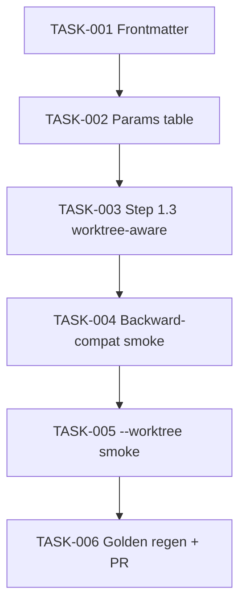

# Task Breakdown — story-0037-0004

| Field | Value |
|-------|-------|
| Story ID | story-0037-0004 |
| Epic ID | 0037 |
| Title | `x-git-push` Ganha Flag `--worktree` |
| Date | 2026-04-13 |

## Summary

6 tasks. Docs-only. Opt-in behavior (backward-compat default preserved).

## Dependency Graph

## Tasks Table

| Task ID | Source | Type | TDD Phase | Components | Depends On | Effort | DoD |
|---------|--------|------|-----------|-----------|-----------|--------|-----|
| TASK-001 | ARCH | doc | GREEN | `x-git-push/SKILL.md` frontmatter | — | XS | `argument-hint` includes `[--worktree]`; `allowed-tools` includes `Skill` |
| TASK-002 | ARCH | doc | GREEN | Parameters table | TASK-001 | XS | New `--worktree` row with default=false noted |
| TASK-003 | ARCH+SEC | doc | GREEN | Step 1.3 subsection | TASK-002 | S | Detect → branch-on-context; slug sanitization regex; RULE-018 xref; decision tree; caller-owns-cleanup noted |
| TASK-004 | QA | smoke | VERIFY | regression baseline | TASK-003 | S | Without `--worktree` → byte-identical behavior to baseline; `.claude/worktrees/` unchanged |
| TASK-005 | QA | smoke | VERIFY | 5 scenarios | TASK-004 | S | 5 Gherkin scenarios exercised (backward, happy main, happy nested, error, boundary); evidence attached |
| TASK-006 | TL+QA | quality-gate | VERIFY | golden/ + git | TASK-005 | XS | Golden regen green; Conventional Commits; PR opened |

## Security Augmentation Notes

- Slug derivation uses regex `^[a-z]+/` strip — ensure no path injection via crafted branch names (TASK-003 notes sanitization).
- Worktree path is under `.claude/worktrees/{slug}/` relative to repo root; no traversal risk if slug is alphanumeric/`-`.

## Escalation Notes

None.
