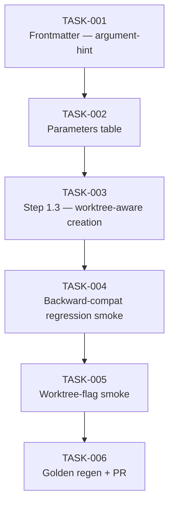

# Task Breakdown — story-0037-0004

| Field | Value |
|-------|-------|
| Story ID | story-0037-0004 |
| Epic ID | 0037 |
| Date | 2026-04-13 |
| Total Tasks | 6 |
| Mode | multi-agent |
| Risk Profile | LOW (opt-in flag, RULE-004 backward-compat enforced) |

## Dependency Graph

## Tasks Table

| Task ID | Source Agent | Type | TDD Phase | Layer | Components | Depends On | Effort | DoD |
|---------|-------------|------|-----------|-------|-----------|-----------|--------|-----|
| TASK-001 | merged(Architect,PO) | documentation | GREEN | cross-cutting | targets/.../x-git-push/SKILL.md frontmatter | — | XS | `argument-hint` includes `[--worktree]`; description mentions opt-in worktree mode; `allowed-tools` includes Skill (for /x-git-worktree create call); no behavior change |
| TASK-002 | Architect | documentation | GREEN | cross-cutting | x-git-push/SKILL.md parameters table | TASK-001 | XS | New row `--worktree` (optional, default false, opt-in); column order preserved; table renders correctly; description matches story §3.2 |
| TASK-003 | merged(Architect,Security,PO) | documentation | GREEN | cross-cutting | x-git-push/SKILL.md new Step 1.3 (after Step 1.2) | TASK-002 | S | 4-step flow (detect / decide / cd / cleanup-note); slug regex `^[a-z]+/` documented with multi-segment example (`feature/sub/story` → `sub/story`? clarify); slug sanitization rejects `..`, `/`, shell metachars (CWE-22), enforces `[a-z0-9-]` only; example slug = `story-0037-0003-foo`; Mermaid decision tree from §6.1 embedded; cross-ref to RULE-018 + Operation 5; drift note pointing to x-git-worktree as canonical `detect_worktree_context()` source; jq prereq fail-fast |
| TASK-004 | merged(QA,TechLead) | smoke | VERIFY (regression) | cross-cutting | manual smoke + plans/epic-0037/plans/smoke-evidence-story-0037-0004.md | TASK-003 | S | Without `--worktree`: `/x-git-push feature/test-default` cwd=repo root creates branch in cwd; `.claude/worktrees/` unchanged; output byte-identical to baseline pre-epic; **mandatory blocker per RULE-004** |
| TASK-005 | merged(QA,Security,PO) | smoke | VERIFY | cross-cutting | manual smoke + evidence file | TASK-004 | S | With `--worktree`: worktree created at `.claude/worktrees/<slug>/`; cd succeeds; subsequent git ops happen inside worktree; nested-detection scenario (run from inside existing worktree) reuses cwd; error scenario (jq missing) fails fast; boundary scenario (slug with non-standard prefix); cleanup is caller-owned (skill does NOT remove); 5 Gherkin scenarios covered |
| TASK-006 | TechLead | quality-gate + verification | VERIFY | cross-cutting | java/src/test/resources/golden/**, git history, PR | TASK-005 | XS | `mvn process-resources` + `GoldenFileRegenerator`; updated x-git-push SKILL.md present in EVERY profile; `mvn clean verify` green; smoke tests green; atomic Conventional Commits with `(story-0037-0004)` scope; PR base = develop; label `epic-0037`; PR body links story + smoke evidence + RULE-001/002/004/007 compliance |

## Escalation Notes

| Task ID | Reason | Action |
|---------|--------|--------|
| TASK-003 | Slug regex `^[a-z]+/` may not cover all cases (multi-segment branch like `feature/sub/story`) | Clarify in spec: strip everything up to LAST `/` or only first? Document edge case |
| TASK-004 | Backward-compat mandatory blocker (RULE-004) | Allocate dedicated review; output byte-identical comparison required |
| TASK-005 | Multiple smoke scenarios in one task — manageable but doc-heavy | Embed fixture script in PR body for reproducibility |
