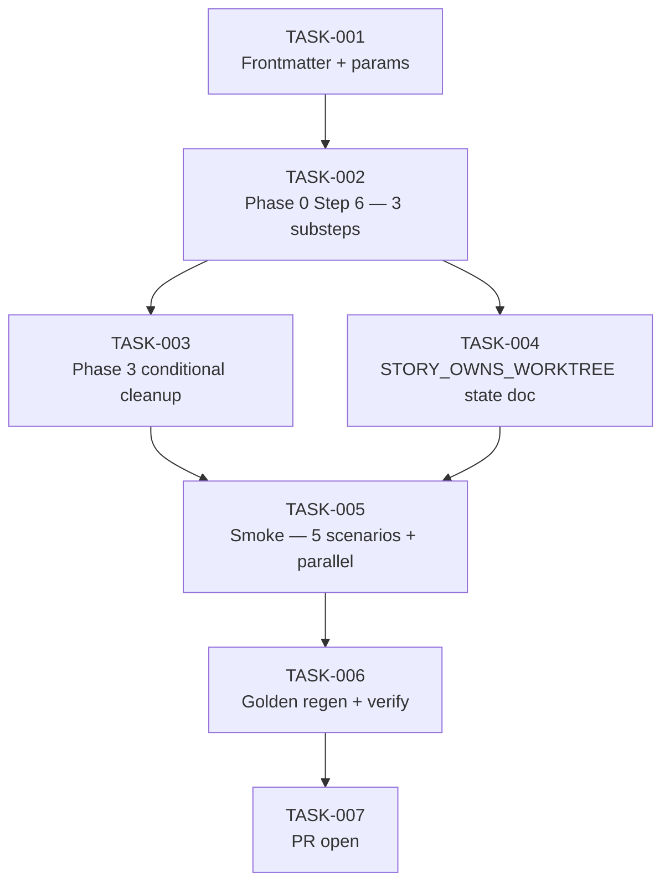

# Task Breakdown — story-0037-0005

| Field | Value |
|-------|-------|
| Story ID | story-0037-0005 | Epic ID | 0037 | Date | 2026-04-13 |
| Total Tasks | 7 | Mode | multi-agent | Risk Profile | LOW-MEDIUM |

## Dependency Graph

## Tasks Table
| ID | Source | Type | TDD | Layer | Components | Depends | Effort | Key DoD |
|----|--------|------|-----|-------|-----------|---------|--------|---------|
| TASK-001 | merged(Architect,PO) | doc | GREEN | cross-cutting | x-dev-story-implement SKILL.md frontmatter+params | — | XS | argument-hint includes [--worktree]; allowed-tools has Skill; params row added |
| TASK-002 | Architect | doc | GREEN | cross-cutting | SKILL.md Phase 0 Step 6 | TASK-001 | M | 3 substeps (6.1 detect / 6.2 decide w/ 3-row table / 6.3 persist STORY_OWNS_WORKTREE); RULE-018 §5 xref; nested prevention explicit |
| TASK-003 | merged(Architect,Security,PO) | doc | GREEN | cross-cutting | SKILL.md Phase 3 cleanup | TASK-002 | S | Conditional cleanup: SUCCESS+OWNS=true→remove; FAILED+OWNS=true→preserve+log; OWNS=false/unset→skip (defensive); no abs path in user-facing error msgs (CWE-209) |
| TASK-004 | merged(Architect,Security) | doc | GREEN | cross-cutting | SKILL.md §5.1 STORY_OWNS_WORKTREE state table | TASK-002 | XS | State table authoritative; ${STORY_ID} regex validation `story-\d{4}-\d{4}` documented; env-var only (not file-persisted); reused verbatim by Phase 3 |
| TASK-005 | merged(QA,TechLead) | smoke | VERIFY | smoke | smoke evidence file | TASK-003, TASK-004 | M | 5 Gherkin ATs pass (backward / standalone wt / orchestrated reuse / failure preservation / parallel); parallel smoke (2 standalone runs concurrent, distinct worktrees, no conflict) is critical blocker; orchestrated path verifies skips remove (RULE-003) |
| TASK-006 | TechLead | verification | VERIFY | cross-cutting | java/src/test/resources/golden/** | TASK-005 | XS | mvn process-resources + GoldenFileRegenerator; updated SKILL.md in every profile; mvn verify green |
| TASK-007 | TechLead | quality-gate | VERIFY | cross-cutting | git, PR | TASK-006 | XS | Atomic Conventional Commits with `(story-0037-0005)`; PR base develop, label epic-0037; body links story + smoke evidence + RULE-001/002/003/004/007 compliance |
