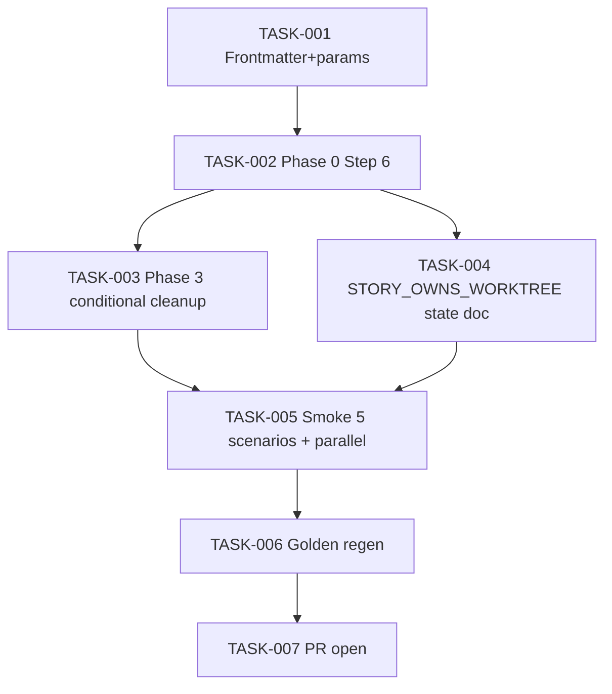

# Task Breakdown — story-0037-0005

| Field | Value |
|-------|-------|
| Story ID | story-0037-0005 |
| Epic ID | 0037 |
| Title | `x-story-implement` Phase 0 Worktree-Aware |
| Date | 2026-04-13 |

## Summary

7 tasks. Docs-only. Dual-mode: standalone opt-in creates; orchestrated detects and reuses. Cleanup respects creator-owns-removal matrix.

## Dependency Graph

## Tasks Table

| Task ID | Source | Type | TDD Phase | Components | Depends On | Effort | DoD |
|---------|--------|------|-----------|-----------|-----------|--------|-----|
| TASK-001 | ARCH | doc | GREEN | frontmatter + params | — | XS | `argument-hint` adds `[--worktree]`; new params row |
| TASK-002 | ARCH | doc | GREEN | Phase 0 Step 6 (6.1/6.2/6.3) | TASK-001 | M | 3 substeps (detect / decide via table / persist flag); decision table; RULE-018 xref |
| TASK-003 | ARCH | doc | GREEN | Phase 3 cleanup | TASK-002 | S | Conditional cleanup based on `STORY_OWNS_WORKTREE`; failure preservation branch |
| TASK-004 | ARCH | doc | GREEN | `STORY_OWNS_WORKTREE` state + STORY_ID regex | TASK-002 | XS | State variable documented; naming matches `story-XXXX-YYYY` |
| TASK-005 | QA | smoke | VERIFY | 5 Gherkin + parallel | TASK-003, TASK-004 | M | All 5 scenarios exercised; 2-terminal parallel standalone proven; orchestrated nesting prevention verified |
| TASK-006 | QA | verification | VERIFY | golden/ | TASK-005 | XS | `mvn process-resources` + `GoldenFileRegenerator` + `mvn verify` green |
| TASK-007 | TL | quality-gate | VERIFY | git | TASK-006 | XS | Conventional Commits; PR opened; label `epic-0037`; smoke evidence in body |

## Escalation Notes

Smoke test (TASK-005) includes a **parallel-standalone** scenario requiring 2 terminals; operator coordination needed.
