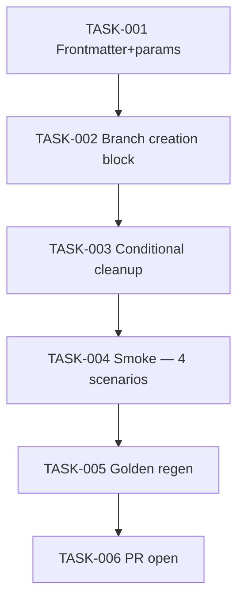

# Task Breakdown — story-0037-0006

| Field | Value |
|-------|-------|
| Story ID | story-0037-0006 |
| Epic ID | 0037 |
| Title | `x-task-implement` Worktree-Aware |
| Date | 2026-04-13 |

## Summary

6 tasks. Docs-only. Mirrors story-0005 pattern at the task layer. Closes the last direct-branch-creation point in the implementation flow.

## Dependency Graph

## Tasks Table

| Task ID | Source | Type | TDD Phase | Components | Depends On | Effort | DoD |
|---------|--------|------|-----------|-----------|-----------|--------|-----|
| TASK-001 | ARCH | doc | GREEN | frontmatter + params | — | XS | `argument-hint` adds `[--worktree]` |
| TASK-002 | ARCH | doc | GREEN | Step 0 detect + branch creation block | TASK-001 | M | Inline `detect_worktree_context()`; 3-context decision table; `TASK_OWNS_WORKTREE` flag |
| TASK-003 | ARCH | doc | GREEN | Cleanup block | TASK-002 | S | Conditional cleanup respects RULE-018 §5; failure preservation |
| TASK-004 | QA | smoke | VERIFY | 4 scenarios | TASK-003 | S | Standalone sem flag, standalone com flag, orchestrated inside story worktree, orchestrated inside epic worktree |
| TASK-005 | QA | verification | VERIFY | golden/ | TASK-004 | XS | `mvn process-resources` + `GoldenFileRegenerator` + `mvn verify` green |
| TASK-006 | TL | quality-gate | VERIFY | git | TASK-005 | XS | Conventional Commits; PR opened; label `epic-0037` |

## Escalation Notes

Final implementation-flow skill to become worktree-aware. After merge, `grep -rn "git checkout -b" targets/claude/skills/core/` should show only documentation references (not executable instructions outside worktree context).
