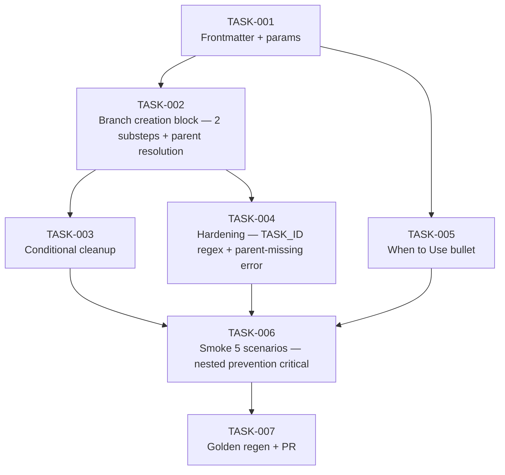

# Task Breakdown — story-0037-0006

| Field | Value |
|-------|-------|
| Story ID | story-0037-0006 | Epic ID | 0037 | Date | 2026-04-13 |
| Total Tasks | 7 | Mode | multi-agent | Risk Profile | MEDIUM (nested-prevention is largest epic risk) |

## Dependency Graph

## Tasks Table
| ID | Source | Type | TDD | Layer | Components | Depends | Effort | Key DoD |
|----|--------|------|-----|-------|-----------|---------|--------|---------|
| TASK-001 | Architect | doc | GREEN | cross-cutting | x-dev-implement SKILL.md frontmatter+params | — | XS | argument-hint includes [--worktree]; allowed-tools has Skill; params row added with default=false + nested-detection note |
| TASK-002 | Architect | doc | GREEN | cross-cutting | SKILL.md branch-creation block (~L150) | TASK-001 | M | 2 substeps (detect / decide+persist); 3-row decision table; §5.3 parent resolution table embedded (--parent flag / detected story branch / fallback develop); TASK_OWNS_WORKTREE state from §5.1; RULE-018 §5 xref |
| TASK-003 | merged(Architect,Security) | doc | GREEN | cross-cutting | SKILL.md cleanup block | TASK-002 | S | Conditional cleanup gated on TASK_OWNS_WORKTREE; SUCCESS+OWNS=true→remove; FAILED+OWNS=true→preserve+`[PRESERVED]` log; OWNS=false/unset→skip; no cwd/abs paths in failure log (CWE-209) |
| TASK-004 | merged(Security,PO) | security+doc | GREEN | cross-cutting | SKILL.md hardening | TASK-002 | S | TASK_ID regex `^task-\d{4}-\d{4}-\d{3}$` validation documented; `--parent <branch>` existence check via `git rev-parse --verify` BEFORE worktree create; fail-fast with clear message; all `$VAR` quoted in shell snippets (CWE-78) |
| TASK-005 | PO | doc | GREEN | cross-cutting | SKILL.md "When to Use" section | TASK-001 | XS | New bullet: standalone task --worktree for concurrent multi-story isolation; single-invocation example shown |
| TASK-006 | merged(QA,TechLead) | smoke | VERIFY | smoke | smoke evidence file | TASK-003, TASK-004, TASK-005 | M | 5 scenarios: backward compat / standalone+flag→develop / standalone+flag+story→story branch / **nested prevention (critical blocker)** / `--parent <missing>` fail-fast; cleanup success + failure observed; nested-prevention scenario verifies task inside story worktree does NOT create nested |
| TASK-007 | TechLead | quality-gate + verification | VERIFY | cross-cutting | golden + PR | TASK-006 | XS | mvn process-resources + GoldenFileRegenerator; updated SKILL.md in every profile; mvn verify green; atomic Conventional Commits with `(story-0037-0006)`; PR base=develop, label=epic-0037; body links story + smoke evidence + RULE compliance |

## Escalation Notes
| Task ID | Reason | Action |
|---------|--------|--------|
| TASK-006 | Nested prevention is largest epic risk per epic risk table | Allocate dedicated review; smoke must run inside actual story worktree fixture |
| TASK-002 | 3-case parent resolution must be deterministic | Decision tree documented + smoke covers all 3 cases |
| TASK-004 | Parent branch from `git branch --show-current` is untrusted input | Apply same validation as TASK_ID; quote all expansions |
