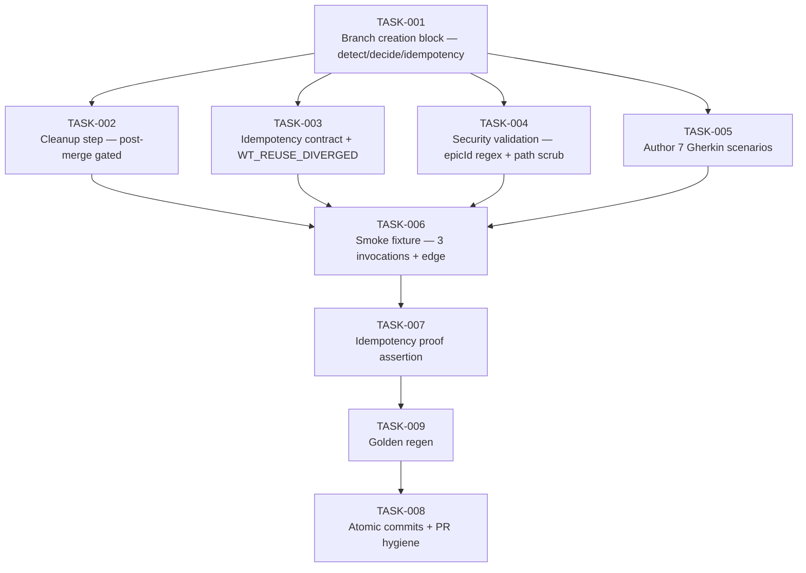

# Task Breakdown — story-0037-0007

| Field | Value |
|-------|-------|
| Story ID | story-0037-0007 | Epic ID | 0037 | Date | 2026-04-13 |
| Total Tasks | 9 | Mode | multi-agent | Risk Profile | LOW-MEDIUM |

## Dependency Graph

## Tasks Table

| Task ID | Source Agent | Type | TDD Phase | Layer | Components | Depends On | Effort | DoD |
|---------|-------------|------|-----------|-------|-----------|-----------|--------|-----|
| TASK-001 | merged(Architect,QA) | documentation | GREEN | cross-cutting | targets/.../x-pr-fix-epic-comments/SKILL.md (~L795 block) | — | M | 3 substeps (detect / decide / idempotency check); fixed worktree id `fix-epic-${epicId}` (canonical form per PO); RULE-018 §5 cross-ref; idempotency check `[ -d ".claude/worktrees/fix-epic-${epicId}" ]` returns reused vs newly-created path; cd works in both branches |
| TASK-002 | Architect | documentation | GREEN | cross-cutting | x-pr-fix-epic-comments SKILL.md cleanup step | TASK-001 | S | New step at end of workflow; cleanup gated on PR merged (NOT on skill exit); `cd` back to main repo BEFORE `/x-git-worktree remove` (avoid removing cwd); preservation path documented for non-merged PRs; RULE-003 (creator-owns-removal) compliance |
| TASK-003 | merged(Architect,Security) | documentation | GREEN | cross-cutting | x-pr-fix-epic-comments SKILL.md idempotency section | TASK-001 | XS | RULE-010 idempotency contract clause added; new error code `WT_REUSE_DIVERGED` documented (existing worktree on different branch); remediation guidance |
| TASK-004 | Security | security | GREEN | cross-cutting | x-pr-fix-epic-comments SKILL.md | TASK-001 | XS | `epicId` validated against `^[0-9]{4}$` regex BEFORE shell interpolation (prevent injection); replace `git checkout fix/... \|\| true` masking with explicit error handling (don't swallow); user-facing error messages scrub absolute worktree paths (CWE-209); document each control |
| TASK-005 | PO | validation | GREEN | cross-cutting | plans/epic-0037/story-0037-0007.md §7 | — (parallel) | XS | 7 Gherkin scenarios total (5 existing + 2 PO additions): "WT_REUSE_DIVERGED — existing worktree on wrong branch"; "PR merge conflict — cleanup deferred until rebase resolves"; standardize id form to `fix-epic-${epicId}` throughout |
| TASK-006 | merged(QA,TechLead) | smoke | VERIFY | cross-cutting | smoke fixture script + plans/epic-0037/plans/smoke-evidence-story-0037-0007.md | TASK-002, TASK-003, TASK-004, TASK-005 | M | Ephemeral epic + mock PR comments fixture; 3 invocations: (a) first run creates worktree; (b) re-run reuses worktree (idempotency proof); (c) cleanup after merge removes worktree; edge scenario (invocation from inside another worktree) emits warning + proceeds; evidence file committed |
| TASK-007 | QA | test | VERIFY | cross-cutting | smoke evidence file | TASK-006 | XS | Idempotency proof: worktree path identical across runs; no duplicate creation; assertion captured in evidence file with timestamps |
| TASK-008 | TechLead | quality-gate | VERIFY | cross-cutting | git history, GitHub PR | TASK-009 | XS | Atomic Conventional Commits per task with `(story-0037-0007)` scope; PR base = develop; label `epic-0037`; PR body links story + smoke evidence; declares RULE-001/002/003/007 compliance |
| TASK-009 | TechLead | verification | VERIFY | cross-cutting | java/src/test/resources/golden/** | TASK-007 | XS | `mvn process-resources` + `GoldenFileRegenerator`; updated x-pr-fix-epic-comments SKILL.md present in EVERY profile; `mvn clean verify` green; `.claude/skills/x-pr-fix-epic-comments/SKILL.md` byte-identical to source |

## Escalation Notes

| Task ID | Reason | Action |
|---------|--------|--------|
| TASK-002 | `cd` back to main repo before remove is critical to avoid removing cwd | Document with example; may need explicit `git worktree list --porcelain \| awk` snippet |
| TASK-006 | Smoke fixture needs mock PR comments — non-trivial | Document fixture creation in plans dir; may require GitHub API mocking |
| TASK-001 | "Edge: invoked inside worktree" should-not-happen path needs warning behavior | Document warning; do not abort skill (graceful degradation) |
