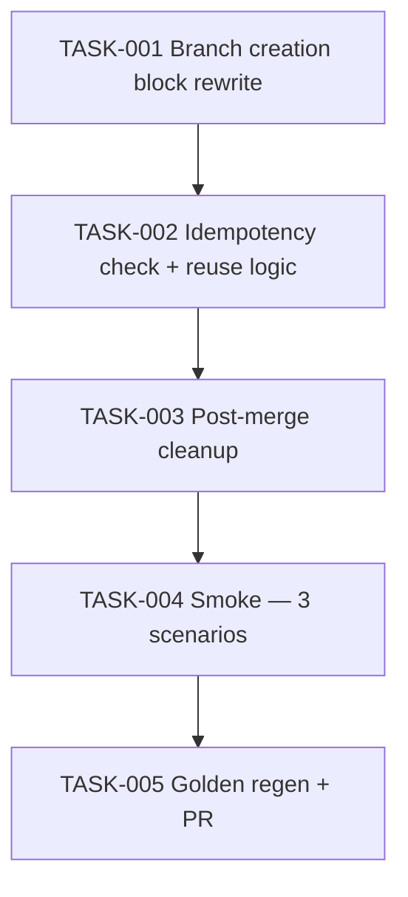

# Task Breakdown — story-0037-0007

| Field | Value |
|-------|-------|
| Story ID | story-0037-0007 |
| Epic ID | 0037 |
| Title | `x-pr-fix-epic` Cria Worktree Automaticamente |
| Date | 2026-04-13 |

## Summary

5 tasks. Automatic (not opt-in) worktree creation for the correction branch. Idempotent: reuses existing `.claude/worktrees/fix-epic-{id}/` on resumed runs.

## Dependency Graph

## Tasks Table

| Task ID | Source | Type | TDD Phase | Components | Depends On | Effort | DoD |
|---------|--------|------|-----------|-----------|-----------|--------|-----|
| TASK-001 | ARCH | doc | GREEN | `x-pr-fix-epic/SKILL.md` (~line 795) | — | M | Detect → decision table → create/reuse; `IN_WT=true` edge-case warning documented |
| TASK-002 | ARCH | doc | GREEN | Idempotency subsection (RULE-010) | TASK-001 | S | Existing `fix-epic-{id}/` path reused; resumed-run scenario documented |
| TASK-003 | ARCH | doc | GREEN | Post-merge cleanup | TASK-002 | S | `/x-git-worktree remove --id fix-epic-{id}` after correction PR merged |
| TASK-004 | QA | smoke | VERIFY | 3 scenarios | TASK-003 | S | First-run (create), resumed-run (reuse), post-merge (cleanup) |
| TASK-005 | TL+QA | quality-gate | VERIFY | golden/ + git | TASK-004 | XS | Golden regen + `mvn verify` + PR open |

## Escalation Notes

No smoke-against-real-PRs required for planning DoR; test fixture epic + simulated PR merge is sufficient.
