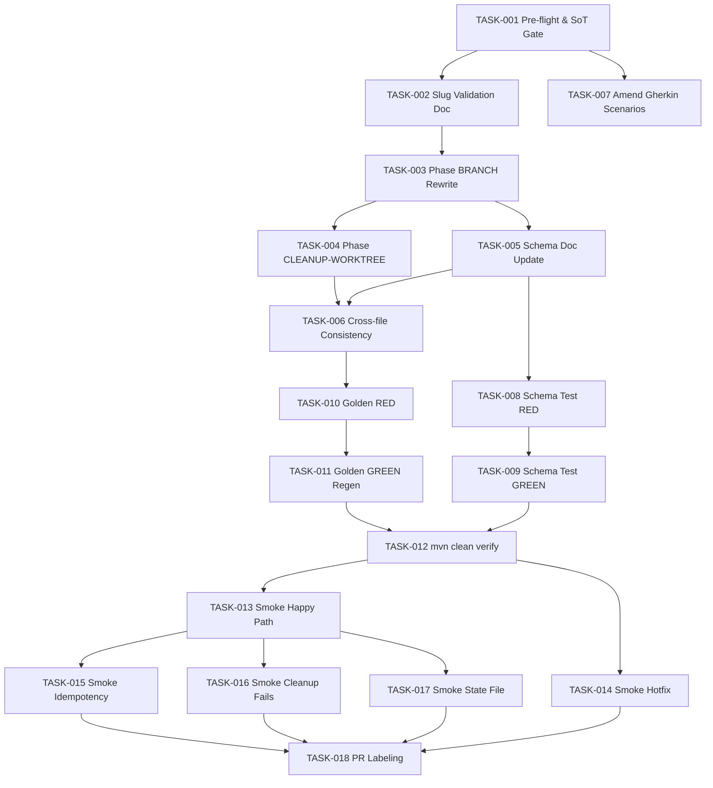

# Task Breakdown — story-0037-0008

## Header

| Field | Value |
|-------|-------|
| Story ID | story-0037-0008 |
| Epic ID | 0037 |
| Title | `x-release` Worktree para Release/Hotfix Branches |
| Date | 2026-04-13 |
| Author | x-story-plan (multi-agent consolidated: Architect, QA, Security, TechLead, PO) |
| Template Version | 1.0.0 |

## Summary

| Metric | Value |
|--------|-------|
| Total Tasks | 18 |
| Parallelizable Tasks | 4 (TASK-008..011 schema/golden RED-GREEN pairs, partial) |
| Estimated Effort | L total (5×M smoke, rest XS/S; doc-only code edits) |
| Mode | multi-agent (consolidated) |
| Agents Participating | Architect, QA Engineer, Security Engineer, Tech Lead, Product Owner |
| Raw Proposals | 37 (ARCH: 6, QA: 9, SEC: 5, TL: 7, PO: 10) |
| Consolidation | MERGE: 8 · AUGMENT: 1 · PAIR RED→GREEN: 2 |

## Dependency Graph

## Tasks Table

| Task ID | Source | Type | TDD Phase | TPP | Layer | Components | Parallel | Depends On | Effort | DoD |
|---------|--------|------|-----------|-----|-------|-----------|----------|-----------|--------|-----|
| TASK-001 | ARCH+TL+SEC+QA+PO | validation | VERIFY | N/A | cross-cutting | plans/epic-0035, git diff audit | no | — | XS | 8/8 EPIC-0035 stories `Concluída` via grep; branch `feature/story-0037-0008-release-worktree` criada de `develop` (Rule 09); `git diff --name-only origin/develop...HEAD \| grep '^\.claude/'` = vazio; `x-release/SKILL.md` post-EPIC-0035 + `references/state-file-schema.md` lidos; anchors (phase names, insertion points) catalogados |
| TASK-002 | SEC | security | VERIFY | N/A | documentation | `targets/claude/skills/core/x-release/SKILL.md` | no | TASK-001 | XS | Regex `^[a-z0-9][a-z0-9-]{0,62}$` documentada; rejeita `..`, `/`, `\`, `$`, backticks, whitespace, metachars; erro `WT_SLUG_INVALID` documentado; exemplo de input malicioso (`../../etc`) mostrando rejeição; grep confirma zero `${HOTFIX_SLUG}` / `${WT_ID}` sem guarda |
| TASK-003 | ARCH+SEC (augmented) | implementation | GREEN | N/A | documentation | `targets/claude/skills/core/x-release/SKILL.md` Phase BRANCH | no | TASK-002 | M | 3 substeps (detect-context, idempotent create, persist `worktreePath` via jq atomic `.tmp`+mv); `Skill(skill: "x-git-worktree", ...)` form (RULE-013); hotfix variant (base=main, `hotfix-{slug}`) vs release (base=develop, `release-{X.Y.Z}`); idempotent reuse com `git -C "$WT_PATH" rev-parse --abbrev-ref HEAD` match check; state-file path canonicalizado via `realpath` + prefix assert; error msgs sem caminho absoluto; sem `git checkout -b release/` direto |
| TASK-004 | ARCH | implementation | GREEN | N/A | documentation | `targets/claude/skills/core/x-release/SKILL.md` Phase CLEANUP-WORKTREE | no | TASK-003 | S | Nova phase após RESUME-AND-TAG; cd main repo via `git worktree list --porcelain \| awk '/^worktree/{print $2; exit}'`; `Skill(skill: "x-git-worktree", args: "remove --id {WT_ID}")`; sucesso → `phase=WORKTREE_CLEANED` + `worktreePath=null`; falha → log `WT_RELEASE_REMOVE_FAILED` + `phase=COMPLETED` (worktree preservado para inspeção) |
| TASK-005 | ARCH+TL | implementation | GREEN | N/A | documentation | `targets/claude/skills/core/x-release/references/state-file-schema.md` | no | TASK-003 | XS | `worktreePath` documentado como opcional (string, abs path); populado em BRANCH, limpo em CLEANUP-WORKTREE; `phase` enum estendido additively com `WORKTREE_CLEANED`; `schemaVersion=1` preservado (justificado); error codes `WT_RELEASE_CREATE_FAILED`, `WT_RELEASE_REMOVE_FAILED`, `WT_SLUG_INVALID`, `WT_RELEASE_BRANCH_MISMATCH` no catálogo; exemplo pré/pós-cleanup |
| TASK-006 | ARCH+TL | quality-gate | VERIFY | N/A | cross-cutting | `targets/claude/skills/core/x-release/SKILL.md`, `references/state-file-schema.md` | no | TASK-004, TASK-005 | XS | Zero `git checkout -b release/\|hotfix/` em prosa produção; invocações `x-git-worktree` usam RULE-013 Pattern 1 uniformemente; phase names batem entre SKILL.md, sequence diagram §6.1 da story, e schema enum; rule 14 referenciada em cada decisão de worktree; `bash -n` nos snippets passa |
| TASK-007 | PO | validation | N/A | N/A | cross-cutting | `plans/epic-0037/story-0037-0008.md` §7 | yes (w/ TASK-002) | TASK-001 | XS | 4 novos Gherkin scenarios adicionados: (a) stale worktree com branch divergente → conflict abort; (b) dry-run não cria worktree; (c) invocação de dentro de worktree → WARNING + reuse cwd; (d) cleanup success clears `worktreePath` (complementa cenário de erro); total de 10 scenarios mantidos consistentes com §7.2 mandatory categories |
| TASK-008 | QA | test | RED | N/A | test | `ReleaseStateFileSchemaTest` (Java) | yes (w/ TASK-010) | TASK-005 | S | 3 casos parametrizados adicionados: (a) state sem `worktreePath` é válido (backward-compat); (b) `worktreePath` string abs path é válido; (c) `worktreePath` non-string (number/null inválido) rejeitado; teste RED (falha contra schema pre-TASK-005) |
| TASK-009 | QA | test | GREEN | N/A | test | `ReleaseStateFileSchemaTest` | no | TASK-008 | XS | Testes de TASK-008 verdes após schema doc atualizado (TASK-005 mergeado); `mvn -Dtest=ReleaseStateFileSchemaTest` verde; coverage mantido |
| TASK-010 | QA | test | RED | N/A | test | `src/test/resources/golden/**/.claude/skills/x-release/` | yes (w/ TASK-008) | TASK-006 | XS | `mvn verify` falha com golden mismatch em `x-release/SKILL.md` e `references/state-file-schema.md` (prova que harness capta a mudança); diff identifica seções BRANCH/CLEANUP-WORKTREE/`worktreePath`; sem outros mismatches (escopo isolado) |
| TASK-011 | QA+ARCH+TL | test | GREEN | N/A | test | `src/test/resources/golden/**/.claude/skills/x-release/` | no | TASK-010 | S | `mvn process-resources` executado **antes** do `GoldenFileRegenerator` (memory); regenerator executa; diff escopo-limpo (só `x-release/SKILL.md` + `references/state-file-schema.md` sob todas as variantes target); `mvn verify` verde |
| TASK-012 | TL | quality-gate | VERIFY | N/A | cross-cutting | `pom.xml`, `src/test/` | no | TASK-009, TASK-011 | S | `mvn clean verify` exit 0; `ReleaseStateFileSchemaTest` verde; zero falhas, zero warnings compilação; build log capturado na PR |
| TASK-013 | QA+PO | test | VERIFY | N/A | test | smoke (repo teste) | no | TASK-012 | M | Happy path `/x-release 2.4.0`: worktree em `.claude/worktrees/release-2.4.0/`; state file `worktreePath` populado; fases UPDATE/CHANGELOG/COMMIT dentro do worktree; `gh pr create --base main` (não `git merge`); approval halt; após `--continue-after-merge` + RESUME-AND-TAG → CLEANUP-WORKTREE remove; state `phase=WORKTREE_CLEANED`; main checkout limpo |
| TASK-014 | QA+PO | test | VERIFY | N/A | test | smoke (repo teste) | yes (w/ TASK-013) | TASK-012 | M | `/x-release --hotfix auth-leak`: worktree `.claude/worktrees/hotfix-auth-leak/`; branch `hotfix/auth-leak` baseado em `main`; state `hotfix=true`, `baseBranch=main`; `gh pr create --base main`; CLEANUP executa após tag |
| TASK-015 | QA+PO | test | VERIFY | N/A | test | smoke (repo teste) | no | TASK-013 | M | Pre-seed worktree + state `phase=APPROVAL_PENDING`; `/x-release 2.4.0 --continue-after-merge`; log contém `[IDEMPOTENT] Reusing existing release worktree`; `x-git-worktree create` NÃO invocado (trace/audit); resume completa RESUME-AND-TAG + CLEANUP |
| TASK-016 | QA+PO | test | VERIFY | N/A | test | smoke (repo teste) | no | TASK-013 | M | Simular falha em `x-git-worktree remove` (lock/chmod 000); tag `v2.4.0` aplicado em main; worktree dir preservado; log `WT_RELEASE_REMOVE_FAILED`; state `phase=COMPLETED` (não rollback); exit code warning-level, sem corrupção do main |
| TASK-017 | QA+PO | test | VERIFY | N/A | test | smoke + schema | no | TASK-013 | S | `jq '.worktreePath' plans/release-state-2.4.0.json` retorna abs path não-null; path existe e é git worktree (`git worktree list`); `state-file-schema.md` golden pós-TASK-011 lista `worktreePath` com type=string, required=no; zero divergência entre schema doc e `ReleaseStateFileSchemaTest` |
| TASK-018 | TL | quality-gate | VERIFY | N/A | cross-cutting | PR metadata, git history | no | TASK-014, TASK-015, TASK-016, TASK-017 | XS | PR target=`develop`; label `epic-0037`; body com nota explícita "Depends on EPIC-0035 completion — verified 2026-04-13"; link para story-0037-0010b mini-regen; título Conventional Commits (`docs(x-release): add worktree-aware release/hotfix flow`); commits atômicos, test-first onde automatizado |

## Security Augmentation Notes

OWASP A03:2021 (Injection) é risco primário — bash snippets documentados são copy-paste para operadores. Mitigações consolidadas no TASK-003 (augmented):

| SEC ID | Controle | Integrado em |
|--------|---------|--------------|
| SEC-001 | Slug regex validation antes de interpolação shell | TASK-002 (standalone) + TASK-003 (aplica) |
| SEC-002 | Branch match check em idempotent reuse (CWE-367) | TASK-003 DoD |
| SEC-003 | State file path canonicalization via realpath (CWE-22/59) | TASK-003 DoD |
| SEC-004 | Error message sanitization (CWE-209) | TASK-003 DoD + TASK-005 error codes |
| SEC-005 | RULE-001 Source-of-Truth audit | TASK-001 DoD |

## Consolidation Decisions

| Decision | Rationale |
|---------|-----------|
| MERGE ARCH-001 + TL-001 + QA-009 → TASK-001 | Todas as 3 propostas convergem em "pre-flight gate" (EPIC-0035 check + branch off develop + SoT audit) |
| AUGMENT ARCH-002 with SEC-001..004 → TASK-003 | SEC proposals são controles técnicos do BRANCH phase; augmentation evita task fragmentation |
| MERGE ARCH-004 + TL-005 → TASK-005 | Schema doc update + backward-compat review são o mesmo edit review |
| MERGE ARCH-005 + TL-006 → TASK-006 | Consistência cross-file + doc completude rodam na mesma verificação |
| MERGE ARCH-006 + QA-002 + TL-003 → TASK-011 | Golden regeneration é um único gesto (mvn process-resources + regenerator + mvn verify) |
| MERGE PO-007..010 → TASK-007 | Amendments à §7 são um único PR touch na story file |
| PAIR QA-001 (RED) → QA-002 (GREEN) → TASK-010/011 | RULE consolidação #3 (RED before GREEN) |
| PAIR QA-003 RED → GREEN → TASK-008/009 | RULE consolidação #3 |
| PO-001..006 absorbed into QA smoke tasks (013..017) | PO validation é AC verification; as smokes já executam a Gherkin |
| TL-002 + SEC-005 absorbed into TASK-001 | Mesma gate (no `.claude/` edits) |

## Escalation Notes

| Task ID | Reason | Recommended Action |
|---------|--------|--------------------|
| TASK-013..017 | Smoke tests requerem repo de teste disposable e `gh` CLI autenticado | Preparar test-repo fixture antes; documentar setup em `references/smoke-setup.md` (fora do escopo desta story) |
| TASK-007 | Novos scenarios de §7 podem conflitar com outros artefatos já planejados | Re-check IMPLEMENTATION-MAP após amendment |
| TASK-018 | PR body deve referenciar story-0037-0010b mesmo que ainda não exista | Criar placeholder issue no tracker ou nota "(a criar)" |

## Parallelism Hints

- TASK-008 (schema test RED) e TASK-010 (golden RED) podem rodar em paralelo após TASK-006
- TASK-013 (smoke happy) e TASK-014 (smoke hotfix) são independentes — podem paralelizar
- TASK-015/016/017 dependem do happy path estabilizado (TASK-013) por ordem de debug

## Metrics Snapshot

| Metric | Value |
|--------|-------|
| Architecture tasks | 3 (TASK-003, 004, 005) |
| Test tasks | 10 (TASK-008..017) |
| Security tasks | 1 standalone (TASK-002) + augmented in TASK-003 |
| Quality-gate tasks | 4 (TASK-001, 006, 012, 018) |
| Validation tasks | 1 (TASK-007 amend Gherkin) |
| Critical path length | 12 (1→2→3→4→6→10→11→12→13→15→18) |
