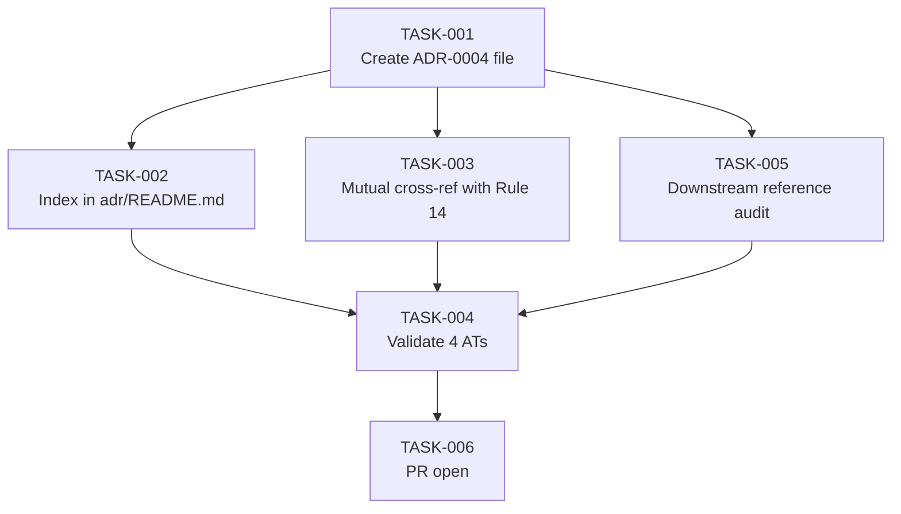

# Task Breakdown — story-0037-0009

| Field | Value |
|-------|-------|
| Story ID | story-0037-0009 | Epic ID | 0037 | Date | 2026-04-13 |
| Total Tasks | 6 | Mode | multi-agent | Risk Profile | LOW |

## Dependency Graph

## Tasks Table
| ID | Source | Type | TDD | Layer | Components | Depends | Effort | Key DoD |
|----|--------|------|-----|-------|-----------|---------|--------|---------|
| TASK-001 | Architect | doc | GREEN | cross-cutting | adr/ADR-0004-worktree-first-branch-policy.md (NEW) | — | M | File created in `/adr/` (NOT targets/); follows `_TEMPLATE-ADR.md` structure; 7 mandatory sections (Context / Decision / Alternatives / Consequences / Compliance / Review Triggers / References); per-skill consequence matrix has all 7 affected skills; Status=Accepted; date=ISO; transcribed from story §3.1 |
| TASK-002 | Architect | doc | GREEN | cross-cutting | adr/README.md | TASK-001 | XS | New row `\| ADR-0004 \| Worktree-First Branch Creation Policy \| Accepted \| 2026-04-XX \|` appended to ADR table; ordered correctly (after ADR-0003) |
| TASK-003 | merged(Architect,TechLead) | doc | GREEN | cross-cutting | adr/ADR-0004-*.md + targets/.../rules/14-worktree-lifecycle.md | TASK-001, story-0037-0001 merged | XS | ADR-0004 References section links to Rule 14 (relative path correct); Rule 14 Section 1 (or appropriate spot) includes "See ADR-0004" link; both links resolve; mutual cross-reference verified |
| TASK-004 | QA | test | VERIFY | cross-cutting | verification only | TASK-002, TASK-003, TASK-005 | XS | 4 ATs pass: file exists with all 7 sections; index lists ADR-0004; bidirectional Rule 14 ↔ ADR-0004 links resolve; single ADR (no fragmentation per-skill) |
| TASK-005 | PO | validation | VERIFY | cross-cutting | grep epic-0037 stories | TASK-001 | XS | Audit downstream stories (0001..0007 + 0010) for ADR-0004 references; per epic §6 success metric "ADR-0004 referenced by all modified skills"; file follow-up issue if any missing reference (do NOT block this story on missing refs in stories not yet implemented) |
| TASK-006 | TechLead | quality-gate | VERIFY | cross-cutting | git, PR | TASK-004 | XS | Single PR against `develop`; atomic commits (file / index / cross-ref); label `epic-0037`; PR body declares forward-reference resolution status (Rule 14 must be merged); no golden regen needed (ADRs not in golden suite); Conventional Commits with `(story-0037-0009)` scope |

## Notes
- Story is INDEPENDENT (no Blocked By in epic). Can run in parallel with all other stories.
- TASK-003 is the only synchronization point (depends on story-0037-0001 merge).
- ADRs live in `/adr/` root, NOT in `targets/` — confirmed per project convention.
