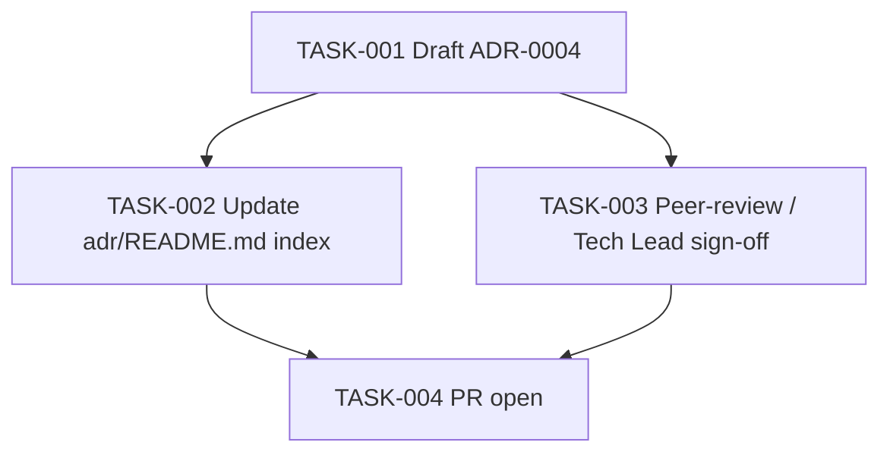

# Task Breakdown — story-0037-0009

| Field | Value |
|-------|-------|
| Story ID | story-0037-0009 |
| Epic ID | 0037 |
| Title | ADR-0004 — Worktree-First Branch Creation Policy |
| Date | 2026-04-13 |

## Summary

4 tasks. Architectural decision record; fully independent of other stories (can run in parallel). Lives at `/adr/ADR-0004-worktree-first-branch-policy.md` (repo root, NOT `targets/`).

## Dependency Graph

## Tasks Table

| Task ID | Source | Type | TDD Phase | Components | Depends On | Effort | DoD |
|---------|--------|------|-----------|-----------|-----------|--------|-----|
| TASK-001 | ARCH | doc | GREEN | `/adr/ADR-0004-worktree-first-branch-policy.md` | — | M | Sections: Context, Decision (3 components), Consequences per-skill, Alternatives Rejected, Revisit Criteria; references Rule 14 + ADR-0003 |
| TASK-002 | ARCH | doc | GREEN | `/adr/README.md` | TASK-001 | XS | Index entry added with status Accepted |
| TASK-003 | TL | validation | VERIFY | peer review | TASK-001 | XS | Tech Lead sign-off on decision + alternatives |
| TASK-004 | TL | quality-gate | VERIFY | git | TASK-002, TASK-003 | XS | Conventional Commits; PR opened; label `epic-0037` |

## Escalation Notes

ADR is independent — can be PR-merged in parallel with stories 1-7.
