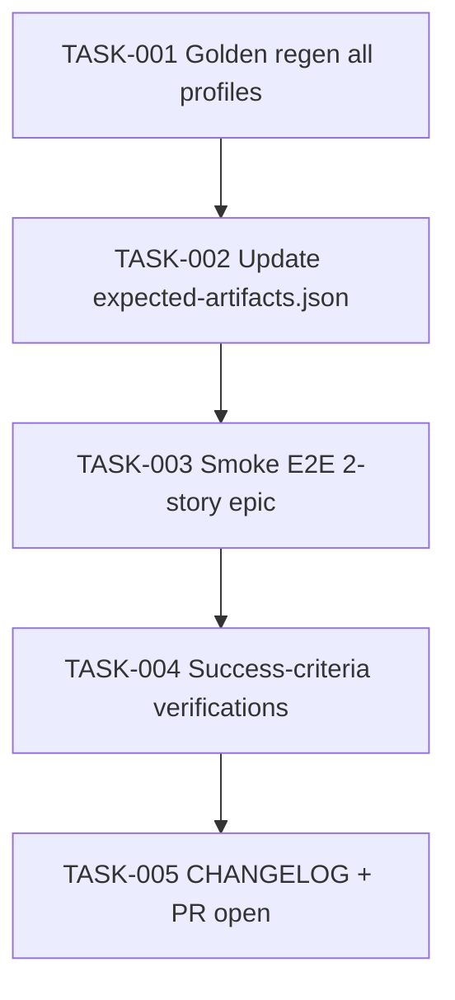

# Task Breakdown — story-0037-0010

| Field | Value |
|-------|-------|
| Story ID | story-0037-0010 |
| Epic ID | 0037 |
| Title | Regenerar Golden Files e Validar End-to-End |
| Date | 2026-04-13 |

## Summary

5 tasks. Sync-barrier / closeout story. No new code; executes regeneration + validation + CHANGELOG. Blocks on stories 1-7, 9.

## Dependency Graph

## Tasks Table

| Task ID | Source | Type | TDD Phase | Components | Depends On | Effort | DoD |
|---------|--------|------|-----------|-----------|-----------|--------|-----|
| TASK-001 | QA | verification | VERIFY | `src/test/resources/golden/**` | — | S | Canonical regen sequence executed (`mvn compile test-compile` → `java -cp ... GoldenFileRegenerator` → `mvn test`); rule 14 present in all profiles; 6 skill SKILL.md files updated |
| TASK-002 | QA | verification | VERIFY | `expected-artifacts.json` | TASK-001 | XS | New entry for `.claude/rules/14-worktree-lifecycle.md`; no entries removed |
| TASK-003 | QA | smoke | VERIFY | ephemeral 2-story test epic | TASK-002 | M | `/x-epic-implement <test-id>` runs; logs show `create` 2× + `remove` 2×; `.claude/worktrees/` empty at end; `mvn verify` green post-smoke |
| TASK-004 | TL | validation | VERIFY | grep verifications | TASK-003 | XS | `grep -rn "isolation.*worktree" targets/` zero; `grep -rn "RULE-018" targets/` only rule-file refs; `PlatformDirectorySmokeTest` green |
| TASK-005 | TL | quality-gate | VERIFY | `CHANGELOG.md` + git | TASK-004 | XS | CHANGELOG entry for EPIC-0037; Conventional Commits; PR opened |

## Escalation Notes

- `mvn process-resources` must precede `GoldenFileRegenerator` (memory `feedback_mvn_process_resources_before_regen`).
- Canonical regen command documented in `README.md` (memory `reference_golden_regen_command`).
- STORY 8 (blocked by EPIC-0035) will have its own mini-regen `story-0037-0010b` when unblocked.
