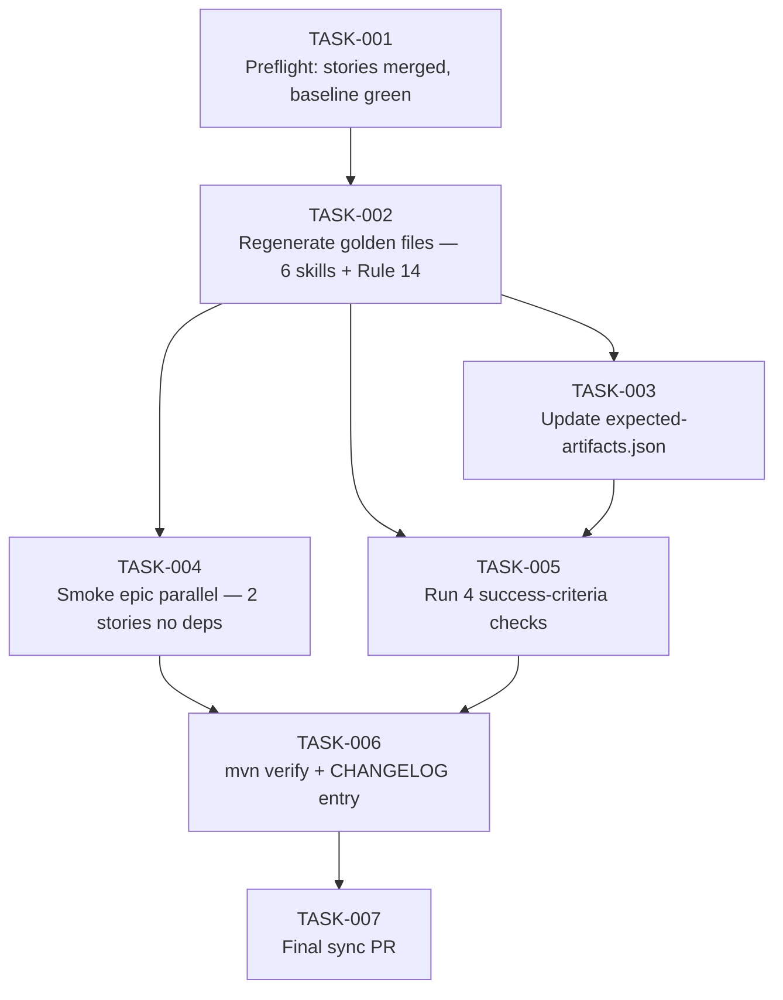

# Task Breakdown — story-0037-0010

| Field | Value |
|-------|-------|
| Story ID | story-0037-0010 | Epic ID | 0037 | Date | 2026-04-13 |
| Total Tasks | 7 | Mode | multi-agent | Risk Profile | MEDIUM (epic-closing gate) |

## Dependency Graph

## Tasks Table
| ID | Source | Type | TDD | Layer | Components | Depends | Effort | Key DoD |
|----|--------|------|-----|-------|-----------|---------|--------|---------|
| TASK-001 | merged(QA,TechLead,PO) | validation | VERIFY | cross-cutting | execution-state.json | — | XS | Stories 0001-0007 + 0009 confirmed merged in develop; STORY 0008 still BLOCKED (not accidentally merged); baseline `mvn clean verify` green; canonical regen command from README confirmed; rollback procedure documented in PR draft |
| TASK-002 | merged(Architect,QA) | verification | VERIFY | cross-cutting | java/src/test/resources/golden/** (~17 profiles), .claude/ | TASK-001 | S | `mvn process-resources` first (memory feedback); then `cd java && mvn compile test-compile && java -cp target/test-classes:target/classes dev.iadev.golden.GoldenFileRegenerator && mvn test`; new Rule 14 present in EVERY profile under `.claude/rules/`; updated SKILL.md for 6 skills (x-git-worktree, x-dev-epic-implement, x-dev-story-implement, x-dev-implement, x-git-push, x-pr-fix-epic-comments) in EVERY profile; diffs reviewed manually for spurious changes; rollback path in PR body if diffs unexpected |
| TASK-003 | Architect | verification | GREEN | cross-cutting | java/src/test/resources/smoke/expected-artifacts.json | TASK-002 | XS | Rule 14 (.claude/rules/14-worktree-lifecycle.md) added in all profiles enumerating rule files; no entries removed (only additions); PlatformDirectorySmokeTest passes |
| TASK-004 | merged(QA,TechLead,Security) | smoke | VERIFY | smoke | smoke evidence file + ephemeral test epic | TASK-002 | M | Ephemeral test epic created with 2 stories no deps; `/x-dev-epic-implement <test-id>` runs end-to-end; logs show `/x-git-worktree create` 2x + `/x-git-worktree remove` 2x; PRs merge without conflict; `.claude/worktrees/` empty post-test; cleanup verified (no leak per Security); evidence captured in PR body |
| TASK-005 | merged(QA,Security) | verification | VERIFY | cross-cutting | grep/ls validation | TASK-002, TASK-003 | XS | Run 4 deterministic checks: (a) `grep -rn "Agent.*isolation.*worktree" java/src/main/resources/targets/` empty (zero false negatives); (b) `grep -rn "git checkout -b" java/src/main/resources/targets/claude/skills/core/{git,dev,pr,ops}/` returns only matches in x-git-worktree itself; (c) `ls .claude/rules/14-worktree-lifecycle.md` present; (d) `ls adr/ADR-0004-*` + `grep "ADR-0004" adr/README.md` both present; output attached to PR body |
| TASK-006 | merged(TechLead,PO) | quality-gate | VERIFY | cross-cutting | CHANGELOG.md | TASK-004, TASK-005 | XS | `mvn clean verify` exit 0; CHANGELOG.md [Unreleased] section adds EPIC-0037 entry per story §3.5: 6 modified skills + Rule 14 + ADR-0004 + Operation 5 + deprecation of `Agent(isolation:"worktree")`; entry covers Added/Changed/Deprecated subsections |
| TASK-007 | TechLead | quality-gate | VERIFY | cross-cutting | git, GitHub PR | TASK-006 | XS | Final sync PR against `develop`; label `epic-0037`; PR body contains: complete success-criteria checklist (6 items), smoke evidence link, STORY 8 BLOCKED note, rollback procedure (if needed), references to all 9 prior story PRs; atomic Conventional Commits with `(story-0037-0010)` scope |

## Escalation Notes
| Task ID | Reason | Action |
|---------|--------|--------|
| TASK-001 | This story IS the epic closing gate — all upstream stories must be merged | If any story not merged, abort and resume after merge |
| TASK-002 | 17+ profile regen can produce noisy diffs | `git diff --stat` review; rollback path documented |
| TASK-004 | Smoke fixture must clean up worktrees post-test | Security requirement: no `.claude/worktrees/` leakage; verify with `ls` post-test |
| TASK-005 | Grep commands must be deterministic in CI | Run twice; verify same output; no flaky regex |
