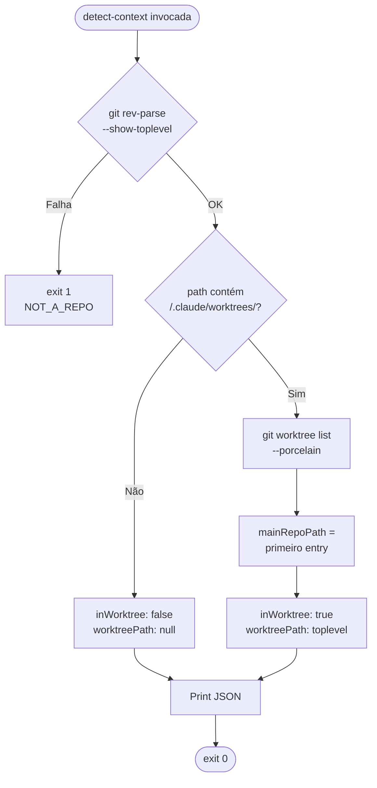

# História: Adicionar Operação `detect-context` a `x-git-worktree`

**ID:** story-0037-0002
**Chave Jira:** —
**Status:** Concluída

## 1. Dependências

| Blocked By | Blocks |
| :--- | :--- |
| story-0037-0001 | story-0037-0003, 0037-0004, 0037-0005, 0037-0006, 0037-0007, 0037-0008 |

## 2. Regras Transversais Aplicáveis

| ID | Título |
| :--- | :--- |
| RULE-001 | Source of Truth Exclusiva (`targets/`) |
| RULE-002 | Invariante de Não-Aninhamento de Worktree |
| RULE-007 | Conventional Commits + Rule 08 |

## 3. Descrição

Como **skill consumidor** que precisa saber se está rodando dentro de um worktree antes de criar um novo (RULE-002), eu quero uma operação canônica `detect-context` na skill `x-git-worktree` que retorne deterministicamente `{ inWorktree, worktreePath, mainRepoPath }`, evitando que cada skill consumidora reimplemente a mesma lógica de detecção e diverja com o tempo.

Esta é a **história de mecanismo**: STORY 1 estabeleceu a *política* (RULE-018 como rule file) e esta story estabelece o *mecanismo* canônico de detecção que será reusado pelas STORIES 3–8. O escopo cobre **apenas** a documentação da nova operação na `x-git-worktree/SKILL.md` (a operação é implementada como um snippet bash inline executável, não um novo binário) e exemplos de uso.

### 3.1 Nova Seção "Operation 5: detect-context"

Adicionar à `java/src/main/resources/targets/claude/skills/core/x-git-worktree/SKILL.md`, após "Operation 4: cleanup":

```markdown
### Operation 5: detect-context

Read-only operation that returns the current worktree context. Used by skills that need to decide whether to create a new worktree or reuse the existing one (RULE-018 / Rule 14 — Worktree Lifecycle).

#### Parameters

(none)

#### Output

JSON to stdout:

```json
{
  "inWorktree": true,
  "worktreePath": "/abs/path/to/.claude/worktrees/story-0037-0003",
  "mainRepoPath": "/abs/path/to/repo"
}
```

#### Workflow

1. RESOLVE   → `git rev-parse --show-toplevel` (current cwd top)
2. CLASSIFY  → If toplevel path contains `/.claude/worktrees/`, set `inWorktree=true` and `worktreePath=toplevel`; otherwise `inWorktree=false` and `worktreePath=null`.
3. RESOLVE MAIN → If `inWorktree=true`, use `git worktree list --porcelain` to resolve the main repo path (first `worktree` entry). Otherwise, `mainRepoPath=toplevel`.
4. EMIT      → Print JSON to stdout, exit 0.

> **Design note:** The classification is intentionally simple (substring check on `/.claude/worktrees/`) because the project convention (RULE-018) anchors all managed worktrees under that path. We do NOT cross-check `git worktree list` for the classification itself — `list` is used only to resolve `mainRepoPath` when inside a worktree.

#### Bash Snippet (canonical, copy-pasteable)

```bash
detect_worktree_context() {
  local toplevel main_repo wt_path in_wt="false"
  toplevel=$(git rev-parse --show-toplevel 2>/dev/null) || {
    echo '{"error":"NOT_A_REPO"}' >&2
    return 1
  }
  main_repo=$(git rev-parse --show-superproject-working-tree 2>/dev/null)
  [ -z "$main_repo" ] && main_repo="$toplevel"

  if echo "$toplevel" | grep -q "/\.claude/worktrees/"; then
    in_wt="true"
    wt_path="$toplevel"
    main_repo=$(git worktree list --porcelain | awk '/^worktree/{print $2; exit}')
  else
    wt_path="null"
  fi

  printf '{"inWorktree":%s,"worktreePath":%s,"mainRepoPath":"%s"}\n' \
    "$in_wt" \
    "$( [ "$wt_path" = "null" ] && echo "null" || echo "\"$wt_path\"" )" \
    "$main_repo"
}
```

#### Sample Outputs

**Case 1 — Main repo:**
```json
{"inWorktree":false,"worktreePath":null,"mainRepoPath":"/Users/dev/repo"}
```

**Case 2 — Inside a worktree:**
```json
{"inWorktree":true,"worktreePath":"/Users/dev/repo/.claude/worktrees/story-0037-0003","mainRepoPath":"/Users/dev/repo"}
```

**Case 3 — Detached HEAD inside main repo:**
```json
{"inWorktree":false,"worktreePath":null,"mainRepoPath":"/Users/dev/repo"}
```

#### Error Handling

| Scenario | Behavior |
| :--- | :--- |
| Not a git repo | exit 1, JSON `{"error":"NOT_A_REPO"}` to stderr |
| `git worktree list` fails | fallback: trust `git rev-parse --show-toplevel` only |
```

### 3.2 Inline-Use Pattern (para skills consumidoras)

Documentar o padrão de uso inline em uma seção "Inline Use Pattern" abaixo do snippet:

```markdown
#### Inline Use Pattern

Skills consumidoras (ex: `x-git-push`, `x-story-implement`) DEVEM inline o snippet `detect_worktree_context()` no início do seu workflow quando precisam decidir entre criar um novo worktree ou reusar o atual. Justificativa: evita um shell-out adicional para `/x-git-worktree detect-context` (custo desnecessário em skills que rodam frequentemente). O snippet é a fonte de verdade canônica — qualquer divergência é tratada como bug.

Exemplo de uso em `x-git-push`:

```bash
# Step 1.3 — Detect worktree context
source <(cat <<'BASH'
detect_worktree_context() {
  # ...snippet completo...
}
BASH
)
CONTEXT_JSON=$(detect_worktree_context)
IN_WT=$(echo "$CONTEXT_JSON" | jq -r '.inWorktree')

if [ "$IN_WT" = "true" ]; then
  echo "Already in worktree, reusing"
else
  # Cria worktree via /x-git-worktree create
fi
```
```

### 3.3 Referência Cruzada de RULE-018

Adicionar uma linha na seção "Operation 5" referenciando RULE-018:

```markdown
> **Veja:** [RULE-018 — Worktree Lifecycle](../../../../rules/14-worktree-lifecycle.md), Seção 3 (Invariante de Não-Aninhamento), para a regra normativa que esta operação implementa.
```

## 3.4 Entrega de Valor

- **Valor Principal:** Mecanismo canônico de detecção fica encapsulado em uma única operação (`Operation 5`) e em um único snippet bash (`detect_worktree_context()`), eliminando o risco de cada skill consumidora reimplementar a lógica e divergir.
- **Métrica de Sucesso:** STORIES 3–8 referenciam o snippet diretamente; zero ocorrências de implementação alternativa de detecção em outras skills.
- **Impacto no Negócio:** Elimina classe inteira de bugs por divergência de detecção entre skills (ex: uma skill detecta worktree, outra não, levando a comportamento inconsistente).

## 4. Definições de Qualidade Locais

### DoR Local

- [ ] STORY 1 mergeada (rule file existe)
- [ ] `x-git-worktree/SKILL.md` atual lido integralmente
- [ ] Snippet bash testado manualmente nos 3 cenários (main repo, inside worktree, detached)
- [ ] Branch `feature/story-0037-0002-detect-context` criada

### DoD Local

- [ ] Seção "Operation 5: detect-context" adicionada após "Operation 4: cleanup" em `x-git-worktree/SKILL.md`
- [ ] Snippet `detect_worktree_context()` documentado e testado nos 3 cenários
- [ ] Padrão inline-use documentado
- [ ] Cross-reference a RULE-018 adicionada
- [ ] Golden files regenerados
- [ ] `mvn clean verify` verde
- [ ] PR aberto contra `develop` com label `epic-0037`

### Global Definition of Done (DoD)

- **Cobertura:** N/A (mudança de markdown apenas)
- **Testes Automatizados:** Golden file tests; verification test que confirma a presença da seção "Operation 5"
- **Documentação:** SKILL.md atualizado
- **Source of Truth:** zero edições em `.claude/`

## 5. Contratos de Dados

### 5.1 Output Schema

```json
{
  "$schema": "http://json-schema.org/draft-07/schema#",
  "type": "object",
  "required": ["inWorktree", "worktreePath", "mainRepoPath"],
  "properties": {
    "inWorktree": { "type": "boolean" },
    "worktreePath": { "type": ["string", "null"] },
    "mainRepoPath": { "type": "string" }
  }
}
```

### 5.2 Exit Codes

| Code | Meaning |
| :--- | :--- |
| 0 | Success — JSON emitted |
| 1 | Not a git repository |
| 2 | Reserved for future error categories |

## 6. Diagramas

### 6.1 Fluxo de Detecção



## 7. Critérios de Aceite (Gherkin)

```gherkin
Cenario: Degenerate — chamada em main repo (não em worktree)
  DADO que estou no diretório raiz do repositório principal
  E não há subdir .claude/worktrees no path atual
  QUANDO executo detect_worktree_context
  ENTÃO a saída JSON é {"inWorktree":false,"worktreePath":null,"mainRepoPath":"<path>"}
  E o exit code é 0

Cenario: Happy path — chamada de dentro de um worktree
  DADO que estou em /repo/.claude/worktrees/story-0037-0003/
  E o diretório é um worktree git válido
  QUANDO executo detect_worktree_context
  ENTÃO a saída JSON tem "inWorktree":true
  E "worktreePath":"/repo/.claude/worktrees/story-0037-0003"
  E "mainRepoPath":"/repo"

Cenario: Edge — chamada fora de qualquer git repo
  DADO que estou em /tmp/random/ que não é git repo
  QUANDO executo detect_worktree_context
  ENTÃO o exit code é 1
  E stderr contém "NOT_A_REPO"
  E stdout está vazio

Cenario: Edge — worktree em subdir profundo
  DADO que estou em /repo/.claude/worktrees/story-0037-0003/java/src/main/
  QUANDO executo detect_worktree_context
  ENTÃO a saída tem "inWorktree":true
  E "worktreePath":"/repo/.claude/worktrees/story-0037-0003"
  (resolve até o toplevel do worktree, não o cwd profundo)

Cenario: Boundary — diretório `.claude/worktrees/` vazio (sem worktrees ativos)
  DADO que /repo/.claude/worktrees/ existe mas está vazio
  E estou no /repo/ raiz
  QUANDO executo detect_worktree_context
  ENTÃO a saída tem "inWorktree":false
  E "mainRepoPath":"/repo"
```

### 7.1 Scenario Ordering (TPP)
Degenerate → happy → error → edge → boundary.

### 7.2 Mandatory Scenario Categories
- [x] Degenerate (main repo)
- [x] Happy path (dentro de worktree)
- [x] Error path (não é git repo)
- [x] Edge cases (subdir profundo)
- [x] Boundary (worktrees vazio)

## 8. Tasks

### TASK-0037-0002-001: Adicionar Seção "Operation 5: detect-context"

- **Layer:** Doc
- **Test Type:** Verification
- **Size:** S
- **Dependencies:** —
- **Branch:** `feature/task-0037-0002-001-detect-section`
- **Files:**
  - `java/src/main/resources/targets/claude/skills/core/x-git-worktree/SKILL.md`
- **Acceptance Criteria:**
  - [ ] Seção adicionada após "Operation 4: cleanup"
  - [ ] Snippet bash completo presente
  - [ ] 3 sample outputs documentados
  - [ ] Cross-reference a RULE-018

### TASK-0037-0002-002: Documentar Inline-Use Pattern

- **Layer:** Doc
- **Test Type:** Verification
- **Size:** XS
- **Dependencies:** TASK-0037-0002-001
- **Branch:** `feature/task-0037-0002-002-inline-pattern`
- **Files:**
  - `java/src/main/resources/targets/claude/skills/core/x-git-worktree/SKILL.md`
- **Acceptance Criteria:**
  - [ ] Subseção "Inline Use Pattern" documentada
  - [ ] Exemplo de uso em `x-git-push` mostrado

### TASK-0037-0002-003: Validar Snippet Manualmente nos 3 Cenários

- **Layer:** Test
- **Test Type:** Smoke (manual)
- **Size:** XS
- **Dependencies:** TASK-0037-0002-001
- **Branch:** `feature/task-0037-0002-003-snippet-smoke`
- **Files:**
  - (smoke test manual, sem arquivos)
- **Acceptance Criteria:**
  - [ ] Cenário 1 (main repo) retorna `inWorktree:false`
  - [ ] Cenário 2 (dentro de worktree) retorna `inWorktree:true`
  - [ ] Cenário 3 (não git) retorna exit 1 + NOT_A_REPO
  - [ ] Resultados anexados ao PR como evidência

### TASK-0037-0002-004: Regenerar Golden Files

- **Layer:** Test
- **Test Type:** Smoke
- **Size:** XS
- **Dependencies:** TASK-0037-0002-001..003
- **Branch:** `feature/task-0037-0002-004-golden-regen`
- **Files:**
  - `java/src/test/resources/golden/*/.claude/skills/x-git-worktree/SKILL.md`
- **Acceptance Criteria:**
  - [ ] `mvn process-resources` + `GoldenFileRegenerator` executados
  - [ ] `mvn verify` verde

## 9. Sub-Tasks (Multi-Agent Consolidation)

### 9.1 Detailed Tasks (generated by x-story-plan)

| # | Task ID | Description | Type | TDD Phase | Layer | Depends On | Effort |
|---|---------|-------------|------|-----------|-------|-----------|--------|
| 1 | TASK-000 | DoR — story-0001 merged, branch cut, baseline green | validation | VERIFY | cross-cutting | — | XS |
| 2 | TASK-001 | Add Operation 5 detect-context section + snippet + Mermaid + RULE-018 xref | documentation | GREEN | cross-cutting | TASK-000 | S |
| 3 | TASK-002 | Inline Use Pattern subsection + jq prereq + heredoc safety | documentation | GREEN | cross-cutting | TASK-001 | XS |
| 4 | TASK-003 | Security Considerations subsection (CWE-209 path leak + redaction) | security | VERIFY | cross-cutting | TASK-001 | XS |
| 5 | TASK-004 | Harden JSON escaping in snippet (CWE-116 / OWASP A03) | security | GREEN | cross-cutting | TASK-001 | XS |
| 6 | TASK-005 | Manual smoke 5+3 scenarios + fixture script + evidence | verification | VERIFY | cross-cutting | TASK-002, TASK-004, TASK-006 | XS |
| 7 | TASK-006 | PO amendments — gherkin (detached HEAD, symlink) + path standardize | validation | GREEN | cross-cutting | TASK-001 | XS |
| 8 | TASK-007 | Golden regen + smoke + verify | verification | VERIFY | cross-cutting | TASK-005 | XS |
| 9 | TASK-008 | Commit hygiene + PR open | quality-gate | VERIFY | cross-cutting | TASK-007 | XS |

> Generated by `/x-story-plan` on 2026-04-13. See `plans/epic-0037/plans/tasks-story-0037-0002.md` for full breakdown including DoD criteria, risk matrix, and escalation notes. Section 8 above retains the original story-author task list.
