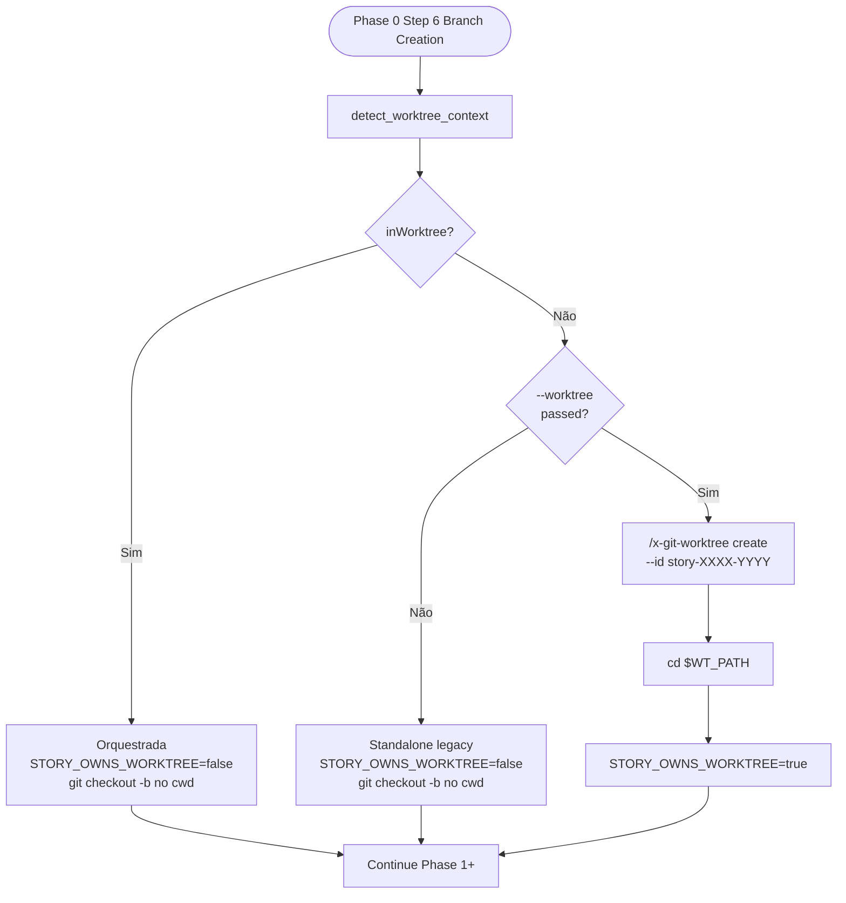

# História: `x-story-implement` Phase 0 Worktree-Aware

**ID:** story-0037-0005
**Chave Jira:** —
**Status:** Pendente

## 1. Dependências

| Blocked By | Blocks |
| :--- | :--- |
| story-0037-0002, story-0037-0003 | story-0037-0006, story-0037-0010 |

## 2. Regras Transversais Aplicáveis

| ID | Título |
| :--- | :--- |
| RULE-001 | Source of Truth Exclusiva (`targets/`) |
| RULE-002 | Invariante de Não-Aninhamento de Worktree |
| RULE-003 | Creator Owns Removal |
| RULE-004 | Backward Compatibility por Default |
| RULE-007 | Conventional Commits + Rule 08 |

## 3. Descrição

Como **usuário ou orquestrador** invocando `x-story-implement` standalone (fora de `x-epic-implement`), eu quero a opção de criar um worktree isolado para a story via flag `--worktree`, permitindo rodar múltiplas stories em paralelo no mesmo repo sem conflito de branch. Quando invocada **dentro** de `x-epic-implement` (que já criou um worktree na STORY 3), a detecção deve garantir que `x-story-implement` **reusa** o worktree existente em vez de criar nested.

Esta story consolida o padrão dual: **standalone com `--worktree` cria; orquestrada detecta e reusa**. O cleanup respeita estritamente a matriz "creator owns removal" da RULE-018: standalone é o creator e remove no Phase 3 success; orquestrada nunca remove.

### 3.1 Atualização do Frontmatter

Editar `java/src/main/resources/targets/claude/skills/core/x-story-implement/SKILL.md`:

- **`argument-hint`**: adicionar `[--worktree]`.
- **`allowed-tools`**: garantir `Skill` presente.

### 3.2 Nova Linha na Parameters Table

| Parameter | Required | Description |
|---|---|---|
| `--worktree` | No | Run the story implementation inside an isolated git worktree at `.claude/worktrees/story-XXXX-YYYY/`. Detected automatically when invoked from `x-epic-implement` (no flag needed in that case — the worktree is already created by the orchestrator). When standalone with `--worktree`, the story creates its own worktree in Phase 0 and removes it in Phase 3 on success. Default: false. |

### 3.3 Modificar Phase 0 Step 6 (Branch Creation)

Editar `x-story-implement/SKILL.md` Phase 0 step 6 (linhas 124–126 atual). Substituir o bloco de criação de branch direto por:

```markdown
6. **Branch Creation (worktree-aware):**

   **Step 6.1 — Detect worktree context** (RULE-018):
   ```bash
   # Inline snippet from x-git-worktree Operation 5
   detect_worktree_context() { ... }
   CONTEXT_JSON=$(detect_worktree_context)
   IN_WT=$(echo "$CONTEXT_JSON" | jq -r '.inWorktree')
   ```

   **Step 6.2 — Decide branch creation strategy:**

   | Context | `--worktree` flag | Action |
   | :--- | :--- | :--- |
   | Standalone, in main repo | NOT passed | Legacy: `git checkout -b feature/story-XXXX-YYYY-desc` from `develop`. No worktree. (Backward compat) |
   | Standalone, in main repo | passed | Call `/x-git-worktree create --branch feature/story-XXXX-YYYY-desc --base develop --id story-XXXX-YYYY`. `cd` to returned path. Set `STORY_OWNS_WORKTREE=true` for cleanup tracking. |
   | Orchestrated (already in worktree) | (any) | Detected `IN_WT=true`. Reuse current cwd. Run `git checkout -b feature/story-XXXX-YYYY-desc` inside the existing worktree. Set `STORY_OWNS_WORKTREE=false`. **Do NOT** create nested. |

   **Step 6.3 — Persist creator flag**: store `STORY_OWNS_WORKTREE` in story execution metadata for use by Phase 3 cleanup.

   > **Veja:** [RULE-018 — Worktree Lifecycle](../../../../rules/14-worktree-lifecycle.md), Seção 5 (Creator Owns Removal), para a matriz normativa.
```

### 3.4 Modificar Phase 3 (Verification & Cleanup)

Editar a Phase 3 do `x-story-implement/SKILL.md` para adicionar cleanup condicional:

```markdown
### Phase 3 — Verification & Cleanup

After Phase 2 completes successfully:

1. ... (existing verification steps)

2. **Worktree Cleanup (conditional)**:
   ```bash
   if [ "$STORY_OWNS_WORKTREE" = "true" ]; then
     # Standalone with --worktree: story is the creator, story removes
     /x-git-worktree remove --id "story-${STORY_ID}"
     echo "[CLEANUP] Removed worktree story-${STORY_ID}"
   else
     # Orchestrated OR standalone without --worktree: NOT the creator
     echo "[CLEANUP] Skipping worktree removal (not the creator — see RULE-018 Section 5)"
   fi
   ```

3. **Failure handling**: if Phase 3 verification FAILS but `STORY_OWNS_WORKTREE=true`, **preserve** the worktree for diagnostics. Log: `[PRESERVED] Worktree story-${STORY_ID} kept due to verification failure`. Manual cleanup via `/x-git-worktree remove --force --id story-${STORY_ID}`.
```

### 3.5 Atualização da Seção "When to Use"

Adicionar bullets:
- Standalone story implementation with `--worktree` for parallelization safety.
- Detection ensures zero nesting when invoked by `x-epic-implement`.

## 3.6 Entrega de Valor

- **Valor Principal:** Stories implementadas standalone ganham isolamento opt-in. Quando o usuário roda 2 stories standalone em paralelo, cada uma fica em seu worktree, eliminando conflito de branch. Quando rodada via `x-epic-implement`, a detecção garante zero nesting.
- **Métrica de Sucesso:** Smoke manual: 2 invocações concorrentes de `/x-story-implement story-XXXX-YYYY --worktree` em terminais diferentes completam sem erro. Quando chamada como subagent de epic-implement, `STORY_OWNS_WORKTREE=false` e cleanup é skipped.
- **Impacto no Negócio:** Permite execução paralela manual de stories sem orquestrador completo. Reduz fricção em workflows de exploração.

## 4. Definições de Qualidade Locais

### DoR Local

- [ ] STORIES 2 e 3 mergeadas
- [ ] `x-story-implement/SKILL.md` Phase 0 e Phase 3 lidas integralmente
- [ ] Comportamento atual de cleanup (se houver) catalogado
- [ ] Branch `feature/story-0037-0005-story-impl-worktree` criada

### DoD Local

- [ ] Frontmatter atualizado
- [ ] Parameters table tem `--worktree`
- [ ] Phase 0 Step 6 reescrita com 3 substeps (detect, decide, persist flag)
- [ ] Phase 3 tem cleanup condicional baseado em `STORY_OWNS_WORKTREE`
- [ ] Smoke standalone (2 instâncias paralelas) passa
- [ ] Smoke orquestrada (via epic-implement) passa sem nesting
- [ ] Golden files regenerados
- [ ] `mvn clean verify` verde
- [ ] PR aberto contra `develop` com label `epic-0037`

### Global Definition of Done (DoD)

- **Cobertura:** N/A (markdown)
- **Testes Automatizados:** Golden file tests; verification dos novos substeps
- **Documentação:** SKILL.md atualizado
- **Source of Truth:** zero edições em `.claude/`
- **Backward Compat:** standalone sem `--worktree` mantém comportamento atual

## 5. Contratos de Dados

### 5.1 `STORY_OWNS_WORKTREE` State

Variável de execução (não persistente em arquivo, escopo de single invocation):

| Value | Set by | Read by |
| :--- | :--- | :--- |
| `true` | Phase 0 Step 6.2 quando `--worktree` é passada e IN_WT=false | Phase 3 cleanup |
| `false` | Phase 0 Step 6.2 quando IN_WT=true (orquestrada) ou quando `--worktree` não é passada | Phase 3 cleanup |

### 5.2 Worktree Naming

| Story ID | Worktree ID | Path |
| :--- | :--- | :--- |
| `story-0037-0005` | `story-0037-0005` | `.claude/worktrees/story-0037-0005/` |

Naming: idêntico ao story ID, sem prefixo.

### 5.3 Error Codes

| Code | Significado |
| :--- | :--- |
| `WT_DETECT_FAILED` | `detect_worktree_context` exit != 0 |
| `WT_CREATE_FAILED` | `/x-git-worktree create` falhou |
| `WT_REMOVE_FAILED` | `/x-git-worktree remove` falhou no Phase 3 cleanup |

## 6. Diagramas

### 6.1 Decision Tree Phase 0 Step 6



### 6.2 Phase 3 Cleanup Flow

```mermaid
flowchart TD
    Start([Phase 3 Verification]) --> Verify{Verification<br/>passed?}
    Verify -- Sim --> CheckOwn{STORY_OWNS<br/>_WORKTREE?}
    Verify -- Não --> CheckOwnFail{STORY_OWNS<br/>_WORKTREE?}

    CheckOwn -- true --> Remove["/x-git-worktree remove<br/>--id story-XXXX-YYYY"]
    CheckOwn -- false --> Skip[log "skipping cleanup<br/>not creator"]

    CheckOwnFail -- true --> Preserve[log "PRESERVED<br/>verification failed"]
    CheckOwnFail -- false --> SkipFail[log "skipping cleanup<br/>not creator"]

    Remove --> End([Phase 3 done])
    Skip --> End
    Preserve --> End
    SkipFail --> End
```

## 7. Critérios de Aceite (Gherkin)

```gherkin
Cenario: Backward compat — standalone sem --worktree
  DADO que estou no main checkout
  E NÃO passo --worktree
  QUANDO executo /x-story-implement story-0037-0005
  ENTÃO Phase 0 Step 6 executa git checkout -b feature/story-0037-0005-... no cwd atual
  E nenhum worktree é criado
  E STORY_OWNS_WORKTREE=false
  E Phase 3 NÃO chama /x-git-worktree remove

Cenario: Standalone com --worktree em main repo
  DADO que estou no main checkout
  E passo --worktree
  QUANDO executo /x-story-implement story-0037-0005 --worktree
  ENTÃO detect_worktree_context retorna inWorktree:false
  E /x-git-worktree create --id story-0037-0005 é chamado
  E cwd muda para .claude/worktrees/story-0037-0005/
  E STORY_OWNS_WORKTREE=true
  E Phase 1+ executa dentro do worktree
  E Phase 3 (success) chama /x-git-worktree remove --id story-0037-0005

Cenario: Orquestrada por epic-implement (já em worktree)
  DADO que estou em .claude/worktrees/story-0037-0005/ (criado por epic-implement)
  E (--worktree pode ou não estar presente, irrelevante)
  QUANDO /x-story-implement story-0037-0005 é invocado como subagent
  ENTÃO detect_worktree_context retorna inWorktree:true
  E /x-git-worktree create NÃO é chamado (RULE-002)
  E git checkout -b feature/story-0037-0005-... é executado no cwd atual
  E STORY_OWNS_WORKTREE=false
  E Phase 3 cleanup loga "skipping (not creator)" e NÃO chama remove

Cenario: Standalone --worktree, Phase 3 verification falha
  DADO que estou em main checkout, --worktree passada
  E Phase 0..2 completam, mas Phase 3 verification falha (ex: testes vermelhos)
  QUANDO Phase 3 verifica e falha
  ENTÃO o worktree é PRESERVADO (não removido)
  E o log mostra "[PRESERVED] Worktree story-0037-0005 kept due to verification failure"
  E o exit code é != 0

Cenario: Boundary — duas invocações standalone paralelas com --worktree
  DADO que executo /x-story-implement story-0037-0005 --worktree em terminal A
  E executo /x-story-implement story-0037-0005-bis --worktree em terminal B
  QUANDO ambos rodam concorrentemente
  ENTÃO 2 worktrees distintos existem em .claude/worktrees/
  E nenhum entra em conflito de branch
  E ambos completam Phase 3 com cleanup apropriado
```

### 7.1 Scenario Ordering (TPP)
Backward → standalone wt → orquestrada → failure → boundary parallel.

### 7.2 Mandatory Scenario Categories
- [x] Backward compat (sem flag)
- [x] Happy path standalone
- [x] Happy path orquestrada (nesting prevention)
- [x] Failure preservation
- [x] Boundary (parallel)

## 8. Tasks

### TASK-0037-0005-001: Atualizar Frontmatter e Parameters Table

- **Layer:** Doc
- **Test Type:** Verification
- **Size:** XS
- **Dependencies:** —
- **Branch:** `feature/task-0037-0005-001-frontmatter`
- **Files:**
  - `java/src/main/resources/targets/claude/skills/core/x-story-implement/SKILL.md`
- **Acceptance Criteria:**
  - [ ] `argument-hint` inclui `[--worktree]`
  - [ ] Parameters table tem nova linha

### TASK-0037-0005-002: Reescrever Phase 0 Step 6

- **Layer:** Doc
- **Test Type:** Verification
- **Size:** M
- **Dependencies:** TASK-0037-0005-001
- **Branch:** `feature/task-0037-0005-002-phase-0-step-6`
- **Files:**
  - `java/src/main/resources/targets/claude/skills/core/x-story-implement/SKILL.md`
- **Acceptance Criteria:**
  - [ ] Step 6 dividido em 6.1, 6.2, 6.3
  - [ ] Tabela de decisão presente
  - [ ] `STORY_OWNS_WORKTREE` documentado
  - [ ] Cross-reference a RULE-018

### TASK-0037-0005-003: Adicionar Cleanup Condicional em Phase 3

- **Layer:** Doc
- **Test Type:** Verification
- **Size:** S
- **Dependencies:** TASK-0037-0005-002
- **Branch:** `feature/task-0037-0005-003-phase-3-cleanup`
- **Files:**
  - `java/src/main/resources/targets/claude/skills/core/x-story-implement/SKILL.md`
- **Acceptance Criteria:**
  - [ ] Bloco de cleanup condicional adicionado
  - [ ] Failure preservation documentada
  - [ ] Diferenciação success/failure

### TASK-0037-0005-004: Smoke Tests (3 cenários)

- **Layer:** Test
- **Test Type:** Smoke
- **Size:** M
- **Dependencies:** TASK-0037-0005-001..003
- **Branch:** `feature/task-0037-0005-004-smoke`
- **Files:**
  - (smoke manual)
- **Acceptance Criteria:**
  - [ ] Cenário standalone sem flag: comportamento idêntico ao baseline
  - [ ] Cenário standalone com flag: worktree criado e removido
  - [ ] Cenário orquestrada: nenhum nesting, cleanup skipped

### TASK-0037-0005-005: Regenerar Golden Files

- **Layer:** Test
- **Test Type:** Smoke
- **Size:** XS
- **Dependencies:** TASK-0037-0005-001..004
- **Branch:** `feature/task-0037-0005-005-golden-regen`
- **Files:**
  - `java/src/test/resources/golden/*/.claude/skills/x-story-implement/SKILL.md`
- **Acceptance Criteria:**
  - [ ] `mvn process-resources` + `GoldenFileRegenerator` executados
  - [ ] `mvn verify` verde

## 9. Sub-Tasks (Multi-Agent Consolidation)

### 9.1 Detailed Tasks (generated by x-story-plan)

| # | Task ID | Description | Type | TDD Phase | Layer | Depends On | Effort |
|---|---------|-------------|------|-----------|-------|-----------|--------|
| 1 | TASK-001 | Frontmatter + parameters table | doc | GREEN | cross-cutting | — | XS |
| 2 | TASK-002 | Phase 0 Step 6 — 3 substeps (detect/decide/persist) | doc | GREEN | cross-cutting | TASK-001 | M |
| 3 | TASK-003 | Phase 3 conditional cleanup | doc | GREEN | cross-cutting | TASK-002 | S |
| 4 | TASK-004 | STORY_OWNS_WORKTREE state doc + STORY_ID regex | doc | GREEN | cross-cutting | TASK-002 | XS |
| 5 | TASK-005 | Smoke 5 scenarios + parallel (critical blocker) | smoke | VERIFY | smoke | TASK-003, TASK-004 | M |
| 6 | TASK-006 | Golden regen + mvn verify | verification | VERIFY | cross-cutting | TASK-005 | XS |
| 7 | TASK-007 | Atomic commits + PR open | quality-gate | VERIFY | cross-cutting | TASK-006 | XS |

> Generated by `/x-story-plan` on 2026-04-13. See `plans/epic-0037/plans/tasks-story-0037-0005.md` for full breakdown.
