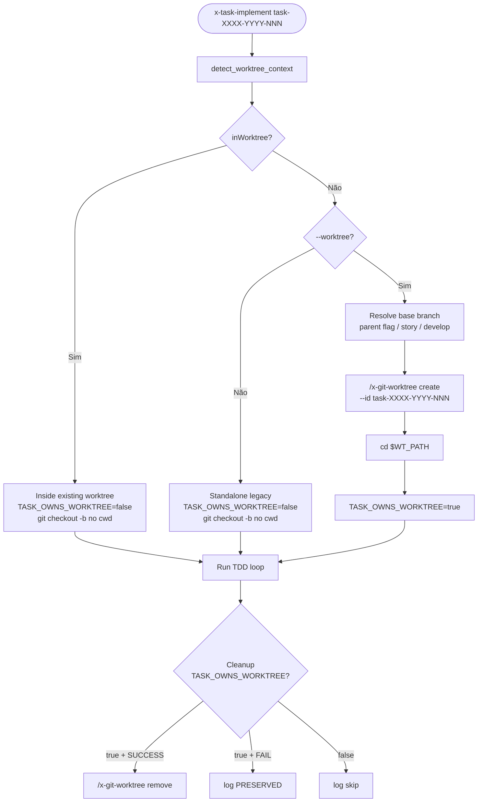

# História: `x-task-implement` Worktree-Aware

**ID:** story-0037-0006
**Chave Jira:** —
**Status:** Concluída

## 1. Dependências

| Blocked By | Blocks |
| :--- | :--- |
| story-0037-0002, story-0037-0005 | story-0037-0010 |

## 2. Regras Transversais Aplicáveis

| ID | Título |
| :--- | :--- |
| RULE-001 | Source of Truth Exclusiva (`targets/`) |
| RULE-002 | Invariante de Não-Aninhamento de Worktree |
| RULE-003 | Creator Owns Removal |
| RULE-004 | Backward Compatibility por Default |
| RULE-007 | Conventional Commits + Rule 08 |

## 3. Descrição

Como **usuário** invocando `x-task-implement` standalone para implementar uma única task fora de uma story completa, eu quero a opção de criar um worktree isolado via flag `--worktree`. Quando `x-task-implement` é invocada **dentro** de uma story (cenário comum: chamada por `x-story-implement` ou pelo loop TDD), a detecção deve garantir que ela **reusa** o worktree da story (ou o cwd atual) em vez de criar um worktree de task aninhado.

Esta é a story que **fecha o último ponto de criação direta de branch** nas skills core de implementação. Após esta story + STORIES 3, 4, 5, todas as 4 skills do "fluxo de implementação" (`x-epic-implement` → `x-story-implement` → `x-task-implement` + `x-git-push`) são worktree-aware.

### 3.1 Atualização do Frontmatter

Editar `java/src/main/resources/targets/claude/skills/core/x-task-implement/SKILL.md`:

- **`argument-hint`**: adicionar `[--worktree]`.
- **`allowed-tools`**: garantir `Skill` presente.

### 3.2 Nova Linha na Parameters Table

| Parameter | Required | Description |
|---|---|---|
| `--worktree` | No | Run the task implementation inside an isolated git worktree at `.claude/worktrees/task-XXXX-YYYY-NNN/`. Detected automatically when invoked inside an existing worktree (story or epic context) — in that case, the task reuses the existing worktree without creating a nested one. Default: false. |

### 3.3 Modificar Bloco de Branch Creation (linha ~150)

Localizar o bloco de instruções do subagent que executa `git checkout -b feature/STORY-ID-short-description` no `x-task-implement/SKILL.md` (atualmente em torno da linha 150). Substituir por:

```markdown
### Branch Creation (worktree-aware)

**Step 0 — Detect worktree context** (RULE-018):
```bash
# Inline snippet from x-git-worktree Operation 5
detect_worktree_context() { ... }
CONTEXT_JSON=$(detect_worktree_context)
IN_WT=$(echo "$CONTEXT_JSON" | jq -r '.inWorktree')
```

**Step 1 — Decide branch creation strategy:**

| Context | `--worktree` flag | Action |
| :--- | :--- | :--- |
| Standalone, in main repo | NOT passed | Legacy: `git checkout -b feature/task-XXXX-YYYY-NNN-desc` from parent branch (story branch or `develop`). No worktree. |
| Standalone, in main repo | passed | Call `/x-git-worktree create --branch feature/task-XXXX-YYYY-NNN-desc --base <parent> --id task-XXXX-YYYY-NNN`. `cd` to returned path. Set `TASK_OWNS_WORKTREE=true`. |
| Inside story worktree (orchestrated) | (any) | Detected `IN_WT=true`. Reuse current cwd. Run `git checkout -b feature/task-XXXX-YYYY-NNN-desc` inside the existing worktree. Set `TASK_OWNS_WORKTREE=false`. **Do NOT** create nested. |

**Step 2 — Persist creator flag**: store `TASK_OWNS_WORKTREE` for use by the task cleanup phase.

> **Veja:** [RULE-018 — Worktree Lifecycle](../../../../rules/14-worktree-lifecycle.md), Seção 5.
```

### 3.4 Cleanup Condicional Pós-Implementação

Adicionar bloco de cleanup ao fim do workflow do subagent:

```markdown
### Task Cleanup (conditional)

After task TDD loop completes:

```bash
if [ "$TASK_OWNS_WORKTREE" = "true" ]; then
  # Standalone with --worktree: task is the creator
  if [ "$TASK_STATUS" = "SUCCESS" ]; then
    /x-git-worktree remove --id "task-${TASK_ID}"
    echo "[CLEANUP] Removed worktree task-${TASK_ID}"
  else
    echo "[PRESERVED] Worktree task-${TASK_ID} kept due to task failure"
  fi
else
  echo "[CLEANUP] Skipping worktree removal (not the creator)"
fi
```
```

### 3.5 Atualização da Seção "When to Use"

Adicionar bullet:
- Standalone task implementation with `--worktree` for isolation when running multiple tasks of different stories concurrently.

## 3.6 Entrega de Valor

- **Valor Principal:** Todas as 4 skills do fluxo de implementação (`epic`, `story`, `task` + `git-push`) ficam alinhadas ao padrão worktree-first. O cenário "task chamada de dentro de uma story worktree" — que era o maior risco de aninhamento — fica explicitamente protegido.
- **Métrica de Sucesso:** Smoke: `/x-task-implement task-0037-0006-001 --worktree` standalone cria worktree de task. Mesmo task chamada de dentro de uma story worktree NÃO cria nested, reusa o cwd.
- **Impacto no Negócio:** Elimina o último cenário de criação não-isolada de branch nas skills de implementação. Habilita workflows de exploração granular (uma task por vez, isoladas).

## 4. Definições de Qualidade Locais

### DoR Local

- [ ] STORIES 2 e 5 mergeadas
- [ ] `x-task-implement/SKILL.md` lido integralmente, especialmente o bloco de subagent que cria branch
- [ ] Branch `feature/story-0037-0006-task-impl-worktree` criada

### DoD Local

- [ ] Frontmatter atualizado
- [ ] Parameters table tem `--worktree`
- [ ] Bloco de branch creation reescrito com 2 substeps (detect, decide+persist)
- [ ] Cleanup condicional adicionado
- [ ] Smoke standalone passa
- [ ] Smoke nested (dentro de story worktree) passa sem nesting
- [ ] Golden files regenerados
- [ ] `mvn clean verify` verde
- [ ] PR aberto contra `develop` com label `epic-0037`

### Global Definition of Done (DoD)

- **Cobertura:** N/A (markdown)
- **Testes Automatizados:** Golden files; verification
- **Documentação:** SKILL.md atualizado
- **Source of Truth:** zero edições em `.claude/`

## 5. Contratos de Dados

### 5.1 `TASK_OWNS_WORKTREE` State

| Value | Set when |
| :--- | :--- |
| `true` | Standalone + `--worktree` + IN_WT=false |
| `false` | Inside any worktree OR standalone without `--worktree` |

### 5.2 Worktree Naming

| Task ID | Worktree ID | Path |
| :--- | :--- | :--- |
| `task-0037-0006-001` | `task-0037-0006-001` | `.claude/worktrees/task-0037-0006-001/` |

### 5.3 Parent Branch Resolution

Quando `--worktree` é passada e `IN_WT=false`, o `--base` para `/x-git-worktree create` é resolvido como:

| Scenario | `--base` value |
| :--- | :--- |
| `--parent <branch>` flag explícita | `<branch>` |
| Sem flag, mas a story tem branch parent existente (`feature/story-XXXX-YYYY-...`) | `feature/story-XXXX-YYYY-...` |
| Sem flag, sem story parent | `develop` |

## 6. Diagramas

### 6.1 Decision Tree



## 7. Critérios de Aceite (Gherkin)

```gherkin
Cenario: Backward compat — standalone sem --worktree
  DADO que estou no main checkout
  E NÃO passo --worktree
  QUANDO executo /x-task-implement task-0037-0006-001
  ENTÃO git checkout -b feature/task-0037-0006-001-... é executado no cwd atual
  E nenhum worktree é criado
  E TASK_OWNS_WORKTREE=false

Cenario: Standalone com --worktree, sem story parent
  DADO que estou no main checkout
  E não há branch feature/story-0037-0006-* ativa
  QUANDO executo /x-task-implement task-0037-0006-001 --worktree
  ENTÃO base resolution retorna "develop"
  E /x-git-worktree create --base develop --id task-0037-0006-001 é chamado
  E cwd muda para .claude/worktrees/task-0037-0006-001/
  E TASK_OWNS_WORKTREE=true

Cenario: Standalone com --worktree, com story parent
  DADO que estou na branch feature/story-0037-0006-foundation
  QUANDO executo /x-task-implement task-0037-0006-001 --worktree
  ENTÃO base resolution retorna "feature/story-0037-0006-foundation"
  E o worktree é criado a partir dessa branch

Cenario: Nested prevention — task dentro de story worktree
  DADO que estou em .claude/worktrees/story-0037-0006/
  QUANDO /x-task-implement task-0037-0006-001 é invocada
  ENTÃO detect_worktree_context retorna inWorktree:true
  E /x-git-worktree create NÃO é chamado (RULE-002)
  E git checkout -b feature/task-... executa no cwd atual (dentro da story worktree)
  E TASK_OWNS_WORKTREE=false
  E nenhum worktree de task é criado em .claude/worktrees/

Cenario: Cleanup respeita ownership
  DADO que TASK_OWNS_WORKTREE=true e task SUCCESS
  QUANDO o cleanup roda
  ENTÃO /x-git-worktree remove --id task-0037-0006-001 é chamado

Cenario: Cleanup preserva em failure
  DADO que TASK_OWNS_WORKTREE=true e task FAILED
  QUANDO o cleanup roda
  ENTÃO o worktree é preservado
  E o log mostra "[PRESERVED] Worktree task-0037-0006-001 kept due to task failure"
```

### 7.1 Scenario Ordering (TPP)
Backward → standalone develop → standalone story → nested prevention → cleanup paths.

### 7.2 Mandatory Scenario Categories
- [x] Backward compat
- [x] Happy path standalone
- [x] Edge: parent resolution
- [x] Critical: nested prevention
- [x] Cleanup paths (success + failure)

## 8. Tasks

### TASK-0037-0006-001: Atualizar Frontmatter e Parameters Table

- **Layer:** Doc
- **Test Type:** Verification
- **Size:** XS
- **Dependencies:** —
- **Branch:** `feature/task-0037-0006-001-frontmatter`
- **Files:**
  - `java/src/main/resources/targets/claude/skills/core/x-task-implement/SKILL.md`
- **Acceptance Criteria:**
  - [ ] `argument-hint` inclui `[--worktree]`
  - [ ] Parameters table tem nova linha

### TASK-0037-0006-002: Reescrever Bloco de Branch Creation

- **Layer:** Doc
- **Test Type:** Verification
- **Size:** M
- **Dependencies:** TASK-0037-0006-001
- **Branch:** `feature/task-0037-0006-002-branch-creation`
- **Files:**
  - `java/src/main/resources/targets/claude/skills/core/x-task-implement/SKILL.md`
- **Acceptance Criteria:**
  - [ ] Bloco substituído por 2 substeps (detect + decide+persist)
  - [ ] Tabela de decisão presente
  - [ ] Resolução de parent branch documentada
  - [ ] `TASK_OWNS_WORKTREE` documentado

### TASK-0037-0006-003: Adicionar Cleanup Condicional

- **Layer:** Doc
- **Test Type:** Verification
- **Size:** S
- **Dependencies:** TASK-0037-0006-002
- **Branch:** `feature/task-0037-0006-003-cleanup`
- **Files:**
  - `java/src/main/resources/targets/claude/skills/core/x-task-implement/SKILL.md`
- **Acceptance Criteria:**
  - [ ] Cleanup condicional adicionado
  - [ ] Failure preservation documentada

### TASK-0037-0006-004: Smoke Tests (4 cenários)

- **Layer:** Test
- **Test Type:** Smoke
- **Size:** M
- **Dependencies:** TASK-0037-0006-001..003
- **Branch:** `feature/task-0037-0006-004-smoke`
- **Files:**
  - (smoke manual)
- **Acceptance Criteria:**
  - [ ] Standalone sem flag: backward compat
  - [ ] Standalone com flag, sem story: base=develop
  - [ ] Standalone com flag, com story: base=story branch
  - [ ] Nested prevention: dentro de story worktree, não cria nested

### TASK-0037-0006-005: Regenerar Golden Files

- **Layer:** Test
- **Test Type:** Smoke
- **Size:** XS
- **Dependencies:** TASK-0037-0006-001..004
- **Branch:** `feature/task-0037-0006-005-golden-regen`
- **Files:**
  - `java/src/test/resources/golden/*/.claude/skills/x-task-implement/SKILL.md`
- **Acceptance Criteria:**
  - [ ] `mvn process-resources` + `GoldenFileRegenerator` executados
  - [ ] `mvn verify` verde

## 9. Sub-Tasks (Multi-Agent Consolidation)

### 9.1 Detailed Tasks (generated by x-story-plan)

| # | Task ID | Description | Type | TDD Phase | Layer | Depends On | Effort |
|---|---------|-------------|------|-----------|-------|-----------|--------|
| 1 | TASK-001 | Frontmatter + parameters table | doc | GREEN | cross-cutting | — | XS |
| 2 | TASK-002 | Branch creation block — 2 substeps + 3-case parent resolution | doc | GREEN | cross-cutting | TASK-001 | M |
| 3 | TASK-003 | Conditional cleanup block | doc | GREEN | cross-cutting | TASK-002 | S |
| 4 | TASK-004 | Hardening — TASK_ID regex + parent-missing error path | security+doc | GREEN | cross-cutting | TASK-002 | S |
| 5 | TASK-005 | When to Use bullet + standalone example | doc | GREEN | cross-cutting | TASK-001 | XS |
| 6 | TASK-006 | Smoke 5 scenarios — nested prevention critical blocker | smoke | VERIFY | smoke | TASK-003, TASK-004, TASK-005 | M |
| 7 | TASK-007 | Golden regen + atomic commits + PR | quality-gate | VERIFY | cross-cutting | TASK-006 | XS |

> Generated by `/x-story-plan` on 2026-04-13. See `plans/epic-0037/plans/tasks-story-0037-0006.md` for full breakdown.
