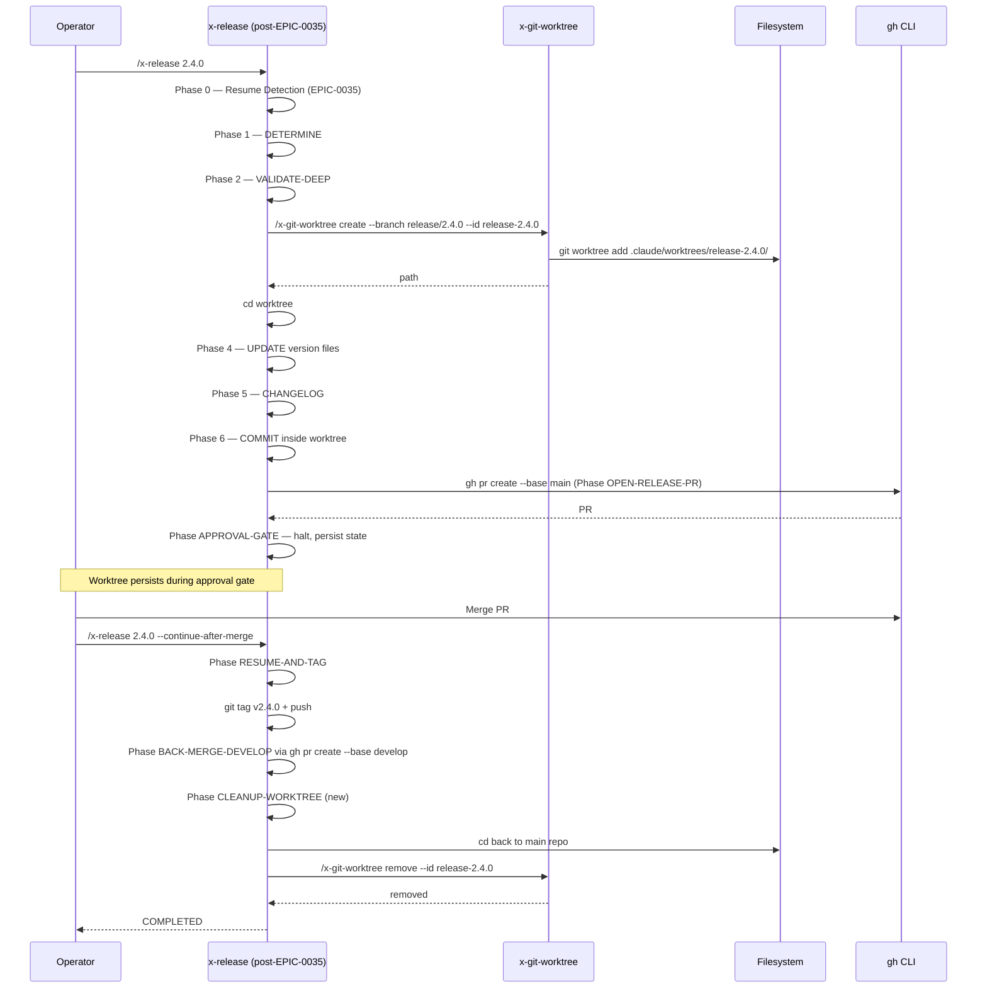

# História: `x-release` Worktree para Release/Hotfix Branches

**ID:** story-0037-0008
**Chave Jira:** —
**Status:** Concluída

## 1. Dependências

| Blocked By | Blocks |
| :--- | :--- |
| story-0037-0002, **EPIC-0035 completo (todas 8 stories merged)** | story-0037-0010b (mini-regen post-EPIC-0035) |

## 2. Regras Transversais Aplicáveis

| ID | Título |
| :--- | :--- |
| RULE-001 | Source of Truth Exclusiva (`targets/`) |
| RULE-002 | Invariante de Não-Aninhamento de Worktree |
| RULE-003 | Creator Owns Removal |
| RULE-008 | Coordenação com EPIC-0035 |
| RULE-007 | Conventional Commits + Rule 08 |

## 3. Descrição

Como **operador de release** rodando `x-release` para criar `release/X.Y.Z` ou `hotfix/{slug}`, eu quero que o branch seja criado dentro de um worktree isolado, evitando conflito com trabalho concorrente no main checkout. Esta é a única story do épico que **depende de EPIC-0035 estar completo**, porque EPIC-0035 reescreve `x-release/SKILL.md` extensivamente — substitui `git checkout -b` direto + `git merge` local por PR-flow via `gh` CLI, adiciona phases `VALIDATE-DEEP`, `OPEN-RELEASE-PR`, `APPROVAL-GATE`, `RESUME-AND-TAG`, `BACK-MERGE-DEVELOP`, e introduz state file `plans/release-state-<X.Y.Z>.json`.

**Status inicial:** `Bloqueada (waiting EPIC-0035)`. Será desbloqueada (status → `Pendente`) e refinada quando EPIC-0035 mergear todas as suas 8 stories. Esta história é incluída no épico para **declarar a intenção** e o **escopo conhecido**, mas a implementação fica para uma fase posterior.

### 3.1 Pré-condição: EPIC-0035 Completo

Antes de iniciar esta story, verificar:

```bash
# Check EPIC-0035 status
ls plans/epic-0035/story-0035-000{1..8}.md
grep -l "Status:.*Concluída" plans/epic-0035/story-0035-000{1..8}.md
# Expect: 8 stories all "Concluída"
```

Se qualquer story de EPIC-0035 não estiver `Concluída`, esta story permanece `Bloqueada`. STORY 10 (golden regen) do EPIC-0037 **não inclui** esta story em seu sync barrier — ela tem seu próprio mini-regen `story-0037-0010b` quando desbloqueada.

### 3.2 Escopo (a refinar pós-EPIC-0035)

Após EPIC-0035 mergear, o escopo provável é:

#### 3.2.1 Modificar Phase BRANCH (post-EPIC-0035)

EPIC-0035 reorganiza `x-release/SKILL.md` em phases. A phase `BRANCH` (ou nome equivalente após reorganização — provavelmente Step 3 atual mantido) é onde `git checkout -b release/X.Y.Z` ou `git checkout -b hotfix/{slug}` é executado.

Substituir por:

```markdown
### Phase BRANCH — Worktree-Aware Release/Hotfix Branch Creation

**Step 1 — Detect worktree context** (RULE-018):
```bash
detect_worktree_context() { ... }
CONTEXT_JSON=$(detect_worktree_context)
IN_WT=$(echo "$CONTEXT_JSON" | jq -r '.inWorktree')
```

**Step 2 — Create worktree** (idempotent if state file shows phase >= BRANCHED):
```bash
if [ "$IN_WT" = "true" ]; then
  echo "[WARNING] x-release invoked from inside a worktree (unusual). Reusing cwd."
else
  if [ "$HOTFIX_MODE" = "true" ]; then
    WT_ID="hotfix-${HOTFIX_SLUG}"
    BRANCH_NAME="hotfix/${HOTFIX_SLUG}"
    BASE_BRANCH="main"
  else
    WT_ID="release-${VERSION}"
    BRANCH_NAME="release/${VERSION}"
    BASE_BRANCH="develop"
  fi

  if [ -d ".claude/worktrees/${WT_ID}" ]; then
    echo "[IDEMPOTENT] Reusing existing release worktree ${WT_ID}"
    cd ".claude/worktrees/${WT_ID}"
  else
    WT_PATH=$(/x-git-worktree create \
      --branch "$BRANCH_NAME" \
      --base "$BASE_BRANCH" \
      --id "$WT_ID")
    cd "$WT_PATH"
  fi
fi
```

**Step 3 — Persist worktree path in state file** (state file introduced by EPIC-0035):
```bash
jq --arg wt "$WT_PATH" '.worktreePath = $wt' "$STATE_FILE" > "$STATE_FILE.tmp" && mv "$STATE_FILE.tmp" "$STATE_FILE"
```
```

#### 3.2.2 Cleanup pós-`RESUME-AND-TAG`

EPIC-0035 introduz a phase `RESUME-AND-TAG` que confirma o tag aplicado. Após esta phase:

```markdown
### Phase CLEANUP-WORKTREE (new, after RESUME-AND-TAG)

After tag is applied and verified:

```bash
# Return to main repo
cd "$(git worktree list --porcelain | awk '/^worktree/{print $2; exit}')"

# Remove the release worktree
WT_ID=$(jq -r '.worktreePath | split("/") | last' "$STATE_FILE")
/x-git-worktree remove --id "$WT_ID"
echo "[CLEANUP] Removed release worktree $WT_ID"

# Update state file
jq '.phase = "WORKTREE_CLEANED"' "$STATE_FILE" > "$STATE_FILE.tmp" && mv "$STATE_FILE.tmp" "$STATE_FILE"
```
```

### 3.3 Vantagem do Pós-EPIC-0035: Sem Conflito de Checkout

Antes de EPIC-0035, o cleanup do worktree teria que acontecer **antes** dos merges (porque `git merge release/X.Y.Z` no main repo precisa do branch live, e o worktree o "trava"). Após EPIC-0035, os merges acontecem via `gh pr merge` (não `git merge` local), então o worktree pode persistir até `RESUME-AND-TAG` confirmar a tag — simplificando o sequenciamento.

### 3.4 Coordenação com State File de EPIC-0035

EPIC-0035 introduz `plans/release-state-<X.Y.Z>.json`. Esta story estende o schema com campo `worktreePath`:

```json
{
  "schemaVersion": 1,
  "version": "2.4.0",
  "phase": "BRANCHED",
  "branch": "release/2.4.0",
  "worktreePath": "/abs/path/.claude/worktrees/release-2.4.0",
  "...": "..."
}
```

A coordenação requer:
- Bump de `schemaVersion` para 2 (se EPIC-0035 já está em produção quando esta story rodar) OU adição backward-compatible (campo opcional).
- Atualização do schema doc `references/state-file-schema.md` (criado pela story-0035-0001).

## 3.5 Entrega de Valor

- **Valor Principal:** Releases ficam isoladas do main checkout. Operador pode rodar `x-release` enquanto continua trabalhando em outras features sem conflito. Após EPIC-0035, o worktree persiste durante todo o approval gate (que pode levar horas), sem bloquear o operador.
- **Métrica de Sucesso:** Smoke: rodar `/x-release 2.4.0` em um repo de teste, observar criação do worktree, simular approval gate, simular merge via `gh`, verificar cleanup pós-tag.
- **Impacto no Negócio:** Releases não bloqueiam o desenvolvimento paralelo. Hotfixes urgentes podem ser preparados em paralelo com outras releases sem conflito.

## 4. Definições de Qualidade Locais

### DoR Local

- [ ] **EPIC-0035 completo** (todas 8 stories `Concluída`) — verificado via `grep`
- [ ] STORY 2 mergeada
- [ ] `x-release/SKILL.md` pós-EPIC-0035 lido integralmente
- [ ] Schema `references/state-file-schema.md` (criado por story-0035-0001) revisado para identificar onde adicionar `worktreePath`
- [ ] Branch `feature/story-0037-0008-release-worktree` criada

### DoD Local

- [ ] Phase BRANCH reescrita com 3 substeps (detect, create, persist)
- [ ] Phase CLEANUP-WORKTREE adicionada após RESUME-AND-TAG
- [ ] `state-file-schema.md` atualizado com campo `worktreePath`
- [ ] Smoke release dry-run passa
- [ ] Smoke release real (em repo de teste) passa end-to-end
- [ ] Smoke hotfix passa
- [ ] Golden files regenerados
- [ ] `mvn clean verify` verde
- [ ] PR aberto contra `develop` com label `epic-0037` e explicit dependency note

### Global Definition of Done (DoD)

- **Cobertura:** ≥ 95% line, ≥ 90% branch nas classes Java tocadas (esperamos zero — só markdown)
- **Testes Automatizados:** Golden files; verification; `ReleaseStateFileSchemaTest` (criado em story-0035-0008) atualizado se schema mudou
- **Documentação:** SKILL.md + state-file-schema.md atualizados
- **Source of Truth:** zero edições em `.claude/`

## 5. Contratos de Dados

### 5.1 Worktree Naming

| Mode | Worktree ID | Path |
| :--- | :--- | :--- |
| Release | `release-X.Y.Z` (ex: `release-2.4.0`) | `.claude/worktrees/release-2.4.0/` |
| Hotfix | `hotfix-{slug}` (ex: `hotfix-auth-leak`) | `.claude/worktrees/hotfix-auth-leak/` |

### 5.2 State File Update (extends EPIC-0035 schema)

```json
{
  "schemaVersion": 1,
  "version": "2.4.0",
  "phase": "BRANCHED",
  "branch": "release/2.4.0",
  "baseBranch": "develop",
  "hotfix": false,
  "worktreePath": "/abs/path/.claude/worktrees/release-2.4.0",
  "...": "..."
}
```

Campo `worktreePath`:
- Tipo: `string` (path absoluto)
- Obrigatório: Não (opcional para backward-compat com state files pré-EPIC-0037)
- Quando setado: durante Phase BRANCH
- Quando limpo: durante Phase CLEANUP-WORKTREE (set to null ou deletado)

### 5.3 Error Codes Novos

| Code | Significado |
| :--- | :--- |
| `WT_RELEASE_CREATE_FAILED` | `/x-git-worktree create` falhou para release branch |
| `WT_RELEASE_REMOVE_FAILED` | `/x-git-worktree remove` falhou pós-tag |

## 6. Diagramas

### 6.1 Fluxo Pós-EPIC-0035 com Worktree



## 7. Critérios de Aceite (Gherkin)

```gherkin
Cenario: Pre-condition — EPIC-0035 ainda não está completo
  DADO que EPIC-0035 ainda tem stories Pendente
  QUANDO esta story é tentada
  ENTÃO a story permanece Bloqueada
  E nenhum trabalho de implementação inicia

Cenario: Happy path — release completo com worktree
  DADO que EPIC-0035 está completo (todas 8 stories Concluída)
  E estou no main checkout
  QUANDO executo /x-release 2.4.0
  ENTÃO Phase BRANCH cria .claude/worktrees/release-2.4.0/
  E todas as phases subsequentes operam dentro do worktree
  E após tag aplicado, Phase CLEANUP-WORKTREE remove o worktree

Cenario: Idempotência pós-resume
  DADO que .claude/worktrees/release-2.4.0/ já existe (run anterior)
  E state file phase = APPROVAL_PENDING
  QUANDO executo /x-release 2.4.0 --continue-after-merge
  ENTÃO o log mostra "[IDEMPOTENT] Reusing existing release worktree"
  E /x-git-worktree create NÃO é chamado

Cenario: Hotfix flow com worktree
  DADO que EPIC-0035 está completo
  QUANDO executo /x-release --hotfix auth-leak
  ENTÃO worktree é criado em .claude/worktrees/hotfix-auth-leak/
  E base branch é "main" (não "develop")

Cenario: State file contém worktreePath
  DADO que executo /x-release 2.4.0
  QUANDO Phase BRANCH completa
  ENTÃO plans/release-state-2.4.0.json tem worktreePath populado
  E o path existe no filesystem

Cenario: Cleanup falha — worktree preservado
  DADO que tag foi aplicado mas /x-git-worktree remove falha
  QUANDO Phase CLEANUP-WORKTREE roda
  ENTÃO o erro é logado
  E o state file phase = COMPLETED (release succeeded)
  E o worktree é deixado para inspeção manual
```

### 7.1 Scenario Ordering (TPP)
Pre-condition → happy → idempotência → hotfix → state → cleanup error.

### 7.2 Mandatory Scenario Categories
- [x] Pre-condition (dependency check)
- [x] Happy path
- [x] Idempotência
- [x] Variant (hotfix)
- [x] State file integration
- [x] Error path (cleanup fails)

## 8. Tasks (a refinar pós-EPIC-0035)

### TASK-0037-0008-001: Verificar Pré-condição EPIC-0035

- **Layer:** Verification
- **Test Type:** Pre-flight
- **Size:** XS
- **Dependencies:** —
- **Branch:** `feature/task-0037-0008-001-precondition`
- **Files:**
  - (none — verification only)
- **Acceptance Criteria:**
  - [ ] Confirmado que todas as 8 stories de EPIC-0035 estão `Concluída`
  - [ ] `x-release/SKILL.md` pós-0035 lido integralmente
  - [ ] Schema `state-file-schema.md` revisado

### TASK-0037-0008-002: Reescrever Phase BRANCH

- **Layer:** Doc
- **Test Type:** Verification
- **Size:** M
- **Dependencies:** TASK-0037-0008-001
- **Branch:** `feature/task-0037-0008-002-phase-branch`
- **Files:**
  - `java/src/main/resources/targets/claude/skills/core/x-release/SKILL.md`
- **Acceptance Criteria:**
  - [ ] Phase BRANCH tem 3 substeps (detect, create, persist)
  - [ ] Idempotency check presente
  - [ ] Hotfix variant suportada

### TASK-0037-0008-003: Adicionar Phase CLEANUP-WORKTREE

- **Layer:** Doc
- **Test Type:** Verification
- **Size:** S
- **Dependencies:** TASK-0037-0008-002
- **Branch:** `feature/task-0037-0008-003-cleanup-phase`
- **Files:**
  - `java/src/main/resources/targets/claude/skills/core/x-release/SKILL.md`
- **Acceptance Criteria:**
  - [ ] Nova phase adicionada após RESUME-AND-TAG
  - [ ] cd back to main repo antes de remove
  - [ ] State file atualizado para `WORKTREE_CLEANED`

### TASK-0037-0008-004: Atualizar `state-file-schema.md`

- **Layer:** Doc
- **Test Type:** Verification
- **Size:** XS
- **Dependencies:** TASK-0037-0008-002
- **Branch:** `feature/task-0037-0008-004-state-schema`
- **Files:**
  - `java/src/main/resources/targets/claude/skills/core/x-release/references/state-file-schema.md`
- **Acceptance Criteria:**
  - [ ] Campo `worktreePath` documentado como opcional
  - [ ] Phase `WORKTREE_CLEANED` adicionada ao enum

### TASK-0037-0008-005: Smoke Test Release Real

- **Layer:** Test
- **Test Type:** Smoke (manual em repo de teste)
- **Size:** M
- **Dependencies:** TASK-0037-0008-001..004
- **Branch:** `feature/task-0037-0008-005-smoke`
- **Files:**
  - (smoke manual)
- **Acceptance Criteria:**
  - [ ] Release dry-run cria nada
  - [ ] Release real cria worktree, aplica fixes, abre PR, simula merge, aplica tag, remove worktree
  - [ ] Hotfix similar mas com base=main

### TASK-0037-0008-006: Regenerar Golden Files

- **Layer:** Test
- **Test Type:** Smoke
- **Size:** XS
- **Dependencies:** TASK-0037-0008-001..005
- **Branch:** `feature/task-0037-0008-006-golden-regen`
- **Files:**
  - `java/src/test/resources/golden/*/.claude/skills/x-release/SKILL.md`
  - `java/src/test/resources/golden/*/.claude/skills/x-release/references/state-file-schema.md`
- **Acceptance Criteria:**
  - [ ] `mvn process-resources` + `GoldenFileRegenerator` executados
  - [ ] `mvn verify` verde

### 8.1 Detailed Tasks (generated by x-story-plan)

| # | Task ID | Description | Type | TDD Phase | Layer | Depends On | Effort |
|---|---------|-------------|------|-----------|-------|-----------|--------|
| 1 | TASK-001 | Pre-flight & SoT gate (EPIC-0035 complete + branch off develop + `.claude/` audit) | validation | VERIFY | cross-cutting | — | XS |
| 2 | TASK-002 | Documentar regex validation para HOTFIX_SLUG antes de interpolação shell | security | VERIFY | documentation | TASK-001 | XS |
| 3 | TASK-003 | Rewrite Phase BRANCH (detect / idempotent create / persist worktreePath) com security augmentations | implementation | GREEN | documentation | TASK-002 | M |
| 4 | TASK-004 | Adicionar Phase CLEANUP-WORKTREE após RESUME-AND-TAG | implementation | GREEN | documentation | TASK-003 | S |
| 5 | TASK-005 | Atualizar `state-file-schema.md` com `worktreePath`, `WORKTREE_CLEANED`, error codes | implementation | GREEN | documentation | TASK-003 | XS |
| 6 | TASK-006 | Cross-file consistency audit (phase names, RULE-013, rule 14 refs, bash -n) | quality-gate | VERIFY | cross-cutting | TASK-004, TASK-005 | XS |
| 7 | TASK-007 | Amendar §7 com 4 novos Gherkin scenarios (stale WT, dry-run, IN_WT, cleared) | validation | N/A | cross-cutting | TASK-001 | XS |
| 8 | TASK-008 | `ReleaseStateFileSchemaTest` backward-compat cases (RED) | test | RED | test | TASK-005 | S |
| 9 | TASK-009 | Schema test GREEN after doc update | test | GREEN | test | TASK-008 | XS |
| 10 | TASK-010 | Golden file regression RED (mvn verify falha em x-release fixtures) | test | RED | test | TASK-006 | XS |
| 11 | TASK-011 | Golden file regen GREEN (`mvn process-resources` + GoldenFileRegenerator) | test | GREEN | test | TASK-010 | S |
| 12 | TASK-012 | `mvn clean verify` green gate | quality-gate | VERIFY | cross-cutting | TASK-009, TASK-011 | S |
| 13 | TASK-013 | Smoke release happy path (test repo) | test | VERIFY | test | TASK-012 | M |
| 14 | TASK-014 | Smoke hotfix variant (base=main) | test | VERIFY | test | TASK-012 | M |
| 15 | TASK-015 | Smoke idempotency (worktree reuse on resume) | test | VERIFY | test | TASK-013 | M |
| 16 | TASK-016 | Smoke cleanup-fails preservation (error path) | test | VERIFY | test | TASK-013 | M |
| 17 | TASK-017 | Smoke state file contains worktreePath (schema+behavior crosscheck) | test | VERIFY | test | TASK-013 | S |
| 18 | TASK-018 | PR labeling (`epic-0037`) + dependency note + Conventional Commits | quality-gate | VERIFY | cross-cutting | TASK-014, TASK-015, TASK-016, TASK-017 | XS |

> Generated by `/x-story-plan` on 2026-04-13. See `plans/epic-0037/plans/tasks-story-0037-0008.md` for full breakdown with DoD columns, dependency graph, consolidation decisions, and risk matrix.
