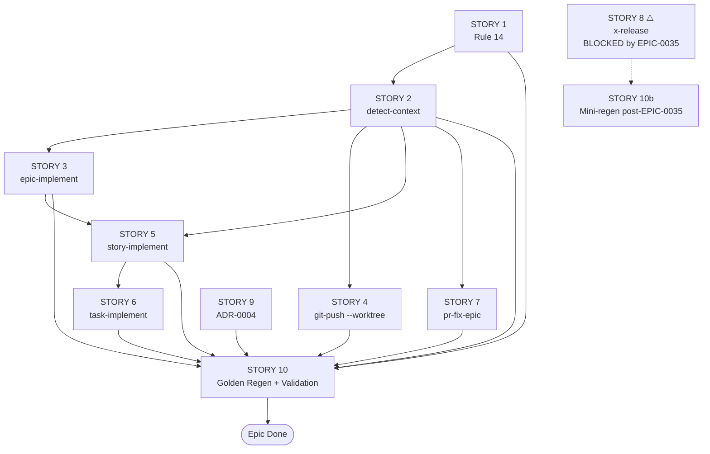

# História: Regenerar Golden Files e Validar End-to-End

**ID:** story-0037-0010
**Chave Jira:** —
**Status:** Pendente

## 1. Dependências

| Blocked By | Blocks |
| :--- | :--- |
| story-0037-0001, 0037-0002, 0037-0003, 0037-0004, 0037-0005, 0037-0006, 0037-0007, 0037-0009 | — |

> **Nota:** STORY 8 NÃO está nas dependências — ela está bloqueada por EPIC-0035 e terá seu próprio mini-regen (`story-0037-0010b`) quando desbloqueada.

## 2. Regras Transversais Aplicáveis

| ID | Título |
| :--- | :--- |
| RULE-001 | Source of Truth Exclusiva (`targets/`) |
| RULE-005 | Documentação Reflete Realidade |
| RULE-007 | Conventional Commits + Rule 08 |

## 3. Descrição

Como **mantenedor do épico**, eu quero um sync barrier final que regenera todos os golden files das skills modificadas, atualiza o `expected-artifacts.json` para incluir o novo rule file `14-worktree-lifecycle.md`, executa o smoke manual end-to-end (`/x-dev-epic-implement` com 2 stories paralelas), e valida que todo o épico forma um sistema coeso sem conflitos. Esta é a story de **fechamento** do épico — sem ela, golden files ficariam stale e CI não passaria.

A story **não introduz código novo**: apenas executa comandos de regeneração e validação, captura evidências, e atualiza o CHANGELOG do projeto com entrada referenciando EPIC-0037.

### 3.1 Regenerar Golden Files

Executar a sequência canônica de regeneração (ver memória `reference_golden_regen_command`):

Sequência canônica conforme `README.md` (seção "Regenerating Golden Files"):

```bash
cd java
mvn compile test-compile
java -cp target/test-classes:target/classes dev.iadev.golden.GoldenFileRegenerator
mvn test
```

Golden files afetados (todos os profiles):

| Skill | Path |
| :--- | :--- |
| `x-git-worktree` | `java/src/test/resources/golden/*/.claude/skills/x-git-worktree/SKILL.md` |
| `x-dev-epic-implement` | `java/src/test/resources/golden/*/.claude/skills/x-dev-epic-implement/SKILL.md` |
| `x-dev-story-implement` | `java/src/test/resources/golden/*/.claude/skills/x-dev-story-implement/SKILL.md` |
| `x-dev-implement` | `java/src/test/resources/golden/*/.claude/skills/x-dev-implement/SKILL.md` |
| `x-git-push` | `java/src/test/resources/golden/*/.claude/skills/x-git-push/SKILL.md` |
| `x-pr-fix-epic-comments` | `java/src/test/resources/golden/*/.claude/skills/x-pr-fix-epic-comments/SKILL.md` |
| Rule 14 (novo) | `java/src/test/resources/golden/*/.claude/rules/14-worktree-lifecycle.md` |

### 3.2 Atualizar `expected-artifacts.json`

Editar `java/src/test/resources/smoke/expected-artifacts.json` (ou equivalente) para incluir:
- Nova entrada para `.claude/rules/14-worktree-lifecycle.md` em todos os profiles que enumeram rule files.
- Nenhuma entrada removida (skills mantêm os mesmos paths, só conteúdo mudou).

### 3.3 Smoke End-to-End: Epic Paralelo

Criar (ou usar existente) um épico de teste com 2 stories sem dependências entre si. Executar:

```bash
/x-dev-epic-implement <test-epic-id>
```

Validar (manual ou automatizado):
- [ ] 2 worktrees criados em `.claude/worktrees/story-{id}/`
- [ ] Logs mostram `/x-git-worktree create` 2x
- [ ] Logs mostram `/x-git-worktree remove` 2x após PR merges
- [ ] `.claude/worktrees/` está vazio ao fim
- [ ] PRs mergeados com sucesso
- [ ] Nenhum erro de branch conflict
- [ ] `mvn verify` no main repo continua verde após o smoke

### 3.4 Validações de Critério de Sucesso do Épico

```bash
# 1. Zero ocorrências de Agent(isolation:"worktree")
grep -rn "Agent.*isolation.*worktree" java/src/main/resources/targets/
# Esperado: vazio (após STORY 3)

# 2. Zero git checkout -b direto fora de fixtures e x-git-worktree
grep -rn "git checkout -b" java/src/main/resources/targets/claude/skills/core/{git,dev,pr,ops}/
# Esperado: apenas matches em x-git-worktree/SKILL.md (na operação create) ou em comentários

# 3. Rule 14 existe
ls .claude/rules/14-worktree-lifecycle.md
# Esperado: arquivo existe (após regen)

# 4. ADR-0004 existe e indexado
ls adr/ADR-0004-worktree-first-branch-policy.md
grep "ADR-0004" adr/README.md
# Esperado: ambos presentes
```

### 3.5 Atualizar CHANGELOG.md

Adicionar entrada ao `CHANGELOG.md`:

```markdown
## [Unreleased]

### Added
- EPIC-0037: Worktree-First Branch Creation Policy. Migrate `x-dev-epic-implement` from harness-native `Agent(isolation:"worktree")` to explicit `/x-git-worktree create|remove` calls; add `--worktree` opt-in flag to `x-dev-story-implement`, `x-dev-implement`, `x-git-push`; auto-create worktrees in `x-pr-fix-epic-comments`; promote RULE-018 to first-class rule file `14-worktree-lifecycle.md`; document policy in ADR-0004.
- New rule file `.claude/rules/14-worktree-lifecycle.md` (Rule 14 — Worktree Lifecycle).
- New ADR-0004 — Worktree-First Branch Creation Policy.
- New `x-git-worktree` Operation 5: `detect-context`.

### Changed
- `x-dev-epic-implement` parallel dispatch now uses explicit `/x-git-worktree create|remove` instead of `Agent(isolation:"worktree")`.
- `x-git-worktree/SKILL.md` "Integration with Epic Execution" section rewritten to reflect actual flow.

### Deprecated
- `Agent(isolation:"worktree")` in skills code (zero occurrences in source of truth after this epic).
```

## 3.6 Entrega de Valor

- **Valor Principal:** Sync barrier final que valida o épico inteiro como coeso. Garante que CI passa e que o smoke manual (epic paralelo) funciona end-to-end. Sem esta story, o épico ficaria com golden drift.
- **Métrica de Sucesso:** `mvn clean verify` verde em todos os profiles; smoke manual executa sem erro; CHANGELOG atualizado.
- **Impacto no Negócio:** Garante que o épico inteiro está pronto para release. Operadores podem usar as novas capabilities com confiança.

## 4. Definições de Qualidade Locais

### DoR Local

- [ ] STORIES 1-7 e 9 mergeadas (excluindo STORY 8 bloqueada)
- [ ] Comando exato de `GoldenFileRegenerator` confirmado em README.md
- [ ] Épico de teste preparado para smoke (2 stories sem dependências)
- [ ] Branch `feature/story-0037-0010-golden-regen-validation` criada
- [ ] Baseline `mvn verify` verde antes do regen

### DoD Local

- [ ] Golden files de TODAS as 6 skills modificadas regenerados (excluindo `x-release` que está em STORY 8)
- [ ] Golden files do novo rule file regenerados
- [ ] `expected-artifacts.json` atualizado com Rule 14
- [ ] `mvn clean verify` verde
- [ ] Smoke manual epic paralelo executado e documentado no PR body
- [ ] 4 validações de critério de sucesso (grep + ls) passam
- [ ] CHANGELOG.md atualizado
- [ ] PR aberto contra `develop` com label `epic-0037`
- [ ] PR body contém checklist de critérios de sucesso do épico

### Global Definition of Done (DoD)

- **Cobertura:** ≥ 95% line, ≥ 90% branch (mantém baseline)
- **Testes Automatizados:** Todos os golden file tests + smoke tests passam
- **Documentação:** CHANGELOG atualizado
- **Source of Truth:** zero edições em `.claude/`, exceto golden files que são regenerados

## 5. Contratos de Dados

### 5.1 Lista de Profiles para Regen

Os golden files vivem sob `java/src/test/resources/golden/{profile}/`. Profiles afetados (todos os 17+ que incluem `.claude/skills/`):

(Lista exata a confirmar via `ls java/src/test/resources/golden/`)

### 5.2 Critérios de Sucesso Verificáveis

| Critério | Comando | Esperado |
| :--- | :--- | :--- |
| Zero `isolation:"worktree"` | `grep -rn "isolation.*worktree" targets/` | vazio |
| Zero `git checkout -b` em skills | `grep -rn "git checkout -b" targets/.../skills/core/{git,dev,pr,ops}/` | apenas em x-git-worktree |
| Rule 14 existe | `ls .claude/rules/14-worktree-lifecycle.md` | arquivo presente |
| ADR-0004 existe | `ls adr/ADR-0004-*` | arquivo presente |
| ADR-0004 indexado | `grep "ADR-0004" adr/README.md` | linha presente |
| `mvn verify` | `mvn clean verify` | exit 0 |

## 6. Diagramas

### 6.1 Sync Barrier



## 7. Critérios de Aceite (Gherkin)

```gherkin
Cenario: Happy path — golden regen verde
  DADO que stories 1-7 e 9 estão mergeadas
  E o baseline mvn verify estava verde
  QUANDO mvn process-resources e GoldenFileRegenerator são executados
  ENTÃO golden files de todas as 6 skills + Rule 14 são regenerados
  E mvn clean verify continua verde

Cenario: expected-artifacts.json atualizado
  DADO que Rule 14 existe em targets/claude/rules/
  QUANDO expected-artifacts.json é atualizado
  ENTÃO contém entrada para .claude/rules/14-worktree-lifecycle.md em todos os profiles relevantes

Cenario: Smoke epic paralelo passa
  DADO que existe um épico de teste com 2 stories paralelas
  QUANDO /x-dev-epic-implement <test-id> é executado
  ENTÃO 2 worktrees são criados
  E ambas stories completam com SUCCESS
  E worktrees são removidos após PR merges
  E .claude/worktrees/ está vazio ao fim

Cenario: Critérios de sucesso do épico passam
  DADO que todas as stories executáveis estão mergeadas
  QUANDO os 4 grep/ls de validação são executados
  ENTÃO todos retornam o resultado esperado
  E o épico pode ser declarado Concluído

Cenario: CHANGELOG atualizado
  DADO que o épico está completo
  QUANDO CHANGELOG.md é editado
  ENTÃO seção [Unreleased] tem entrada para EPIC-0037
  E menciona Rule 14, ADR-0004, e as 6 skills modificadas
```

### 7.1 Scenario Ordering (TPP)
Regen → expected-artifacts → smoke → success criteria → changelog.

### 7.2 Mandatory Scenario Categories
- [x] Golden regen
- [x] Smoke artifacts
- [x] End-to-end smoke (epic paralelo)
- [x] Success criteria validation
- [x] CHANGELOG

## 8. Tasks

### TASK-0037-0010-001: Verificar Pré-condições e Baseline

- **Layer:** Verification
- **Test Type:** Pre-flight
- **Size:** XS
- **Dependencies:** —
- **Branch:** `feature/task-0037-0010-001-preflight`
- **Files:**
  - (none — verification only)
- **Acceptance Criteria:**
  - [ ] Stories 1-7 e 9 confirmadas como Concluídas
  - [ ] `mvn clean verify` baseline verde antes do regen
  - [ ] Comando exato de GoldenFileRegenerator confirmado

### TASK-0037-0010-002: Regenerar Golden Files

- **Layer:** Test
- **Test Type:** Regen
- **Size:** S
- **Dependencies:** TASK-0037-0010-001
- **Branch:** `feature/task-0037-0010-002-regen`
- **Files:**
  - `java/src/test/resources/golden/*/.claude/skills/{x-dev-epic-implement,x-git-push,x-git-worktree,x-dev-story-implement,x-dev-implement,x-pr-fix-epic-comments}/SKILL.md`
  - `java/src/test/resources/golden/*/.claude/rules/14-worktree-lifecycle.md` (novo)
- **Acceptance Criteria:**
  - [ ] `mvn process-resources` executado
  - [ ] `GoldenFileRegenerator` executado
  - [ ] Diff dos golden files revisado manualmente para garantir correção

### TASK-0037-0010-003: Atualizar `expected-artifacts.json`

- **Layer:** Test
- **Test Type:** Smoke
- **Size:** XS
- **Dependencies:** TASK-0037-0010-002
- **Branch:** `feature/task-0037-0010-003-expected-artifacts`
- **Files:**
  - `java/src/test/resources/smoke/expected-artifacts.json`
- **Acceptance Criteria:**
  - [ ] Rule 14 incluído em profiles relevantes
  - [ ] `PlatformDirectorySmokeTest` verde

### TASK-0037-0010-004: Smoke Manual Epic Paralelo

- **Layer:** Test
- **Test Type:** Smoke (manual)
- **Size:** M
- **Dependencies:** TASK-0037-0010-002
- **Branch:** `feature/task-0037-0010-004-smoke-epic`
- **Files:**
  - (smoke manual; evidências anexadas ao PR)
- **Acceptance Criteria:**
  - [ ] 2 worktrees criados
  - [ ] Logs capturados mostrando create/remove
  - [ ] PRs mergeados sem conflito
  - [ ] `.claude/worktrees/` vazio ao fim

### TASK-0037-0010-005: Validar Critérios de Sucesso do Épico

- **Layer:** Verification
- **Test Type:** Verification
- **Size:** XS
- **Dependencies:** TASK-0037-0010-002, 003
- **Branch:** `feature/task-0037-0010-005-success-criteria`
- **Files:**
  - (verification only)
- **Acceptance Criteria:**
  - [ ] 4 grep/ls retornam resultado esperado
  - [ ] Resultados anexados ao PR

### TASK-0037-0010-006: Atualizar CHANGELOG.md

- **Layer:** Doc
- **Test Type:** Verification
- **Size:** XS
- **Dependencies:** TASK-0037-0010-002..005
- **Branch:** `feature/task-0037-0010-006-changelog`
- **Files:**
  - `CHANGELOG.md`
- **Acceptance Criteria:**
  - [ ] Entrada [Unreleased] tem seção para EPIC-0037
  - [ ] Menciona Rule 14, ADR-0004, e skills modificadas

### TASK-0037-0010-007: PR de Sync Final

- **Layer:** Doc
- **Test Type:** Verification
- **Size:** XS
- **Dependencies:** TASK-0037-0010-001..006
- **Branch:** `feature/task-0037-0010-007-final-pr`
- **Files:**
  - (PR body apenas)
- **Acceptance Criteria:**
  - [ ] PR body contém checklist completo de critérios de sucesso
  - [ ] PR body referencia smoke evidence
  - [ ] Label `epic-0037` aplicado
  - [ ] PR aprovado e mergeado

## 9. Sub-Tasks (Multi-Agent Consolidation)

### 9.1 Detailed Tasks (generated by x-story-plan)

| # | Task ID | Description | Type | TDD Phase | Layer | Depends On | Effort |
|---|---------|-------------|------|-----------|-------|-----------|--------|
| 1 | TASK-001 | Preflight — stories merged, baseline green, regen cmd confirmed, STORY 8 BLOCKED | validation | VERIFY | cross-cutting | — | XS |
| 2 | TASK-002 | Regenerate golden files — 6 skills + Rule 14 across 17+ profiles | verification | VERIFY | cross-cutting | TASK-001 | S |
| 3 | TASK-003 | Update expected-artifacts.json with Rule 14 entry | verification | GREEN | cross-cutting | TASK-002 | XS |
| 4 | TASK-004 | Smoke epic parallel — ephemeral 2-story test epic + cleanup verify | smoke | VERIFY | smoke | TASK-002 | M |
| 5 | TASK-005 | Run 4 success-criteria checks (deterministic grep/ls) | verification | VERIFY | cross-cutting | TASK-002, TASK-003 | XS |
| 6 | TASK-006 | mvn verify + CHANGELOG entry for EPIC-0037 | quality-gate | VERIFY | cross-cutting | TASK-004, TASK-005 | XS |
| 7 | TASK-007 | Final sync PR with complete checklist + smoke evidence | quality-gate | VERIFY | cross-cutting | TASK-006 | XS |

> Generated by `/x-story-plan` on 2026-04-13. See `plans/epic-0037/plans/tasks-story-0037-0010.md` for full breakdown.
