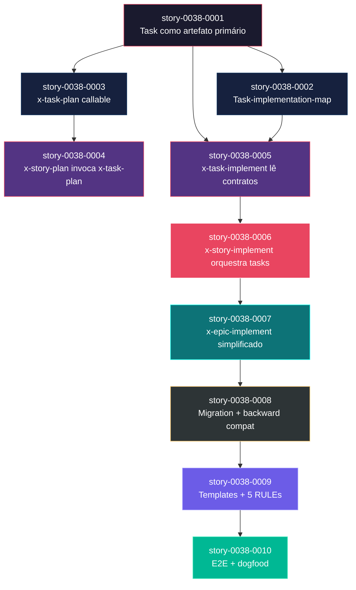
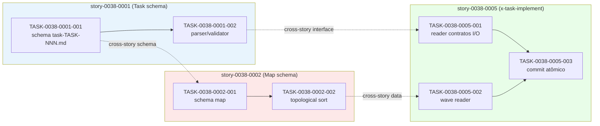

# Mapa de Implementação — EPIC-0038 Task-First Planning & Execution Architecture

**Gerado a partir das dependências BlockedBy/Blocks de cada história do epic-0038.**

---

## 1. Matriz de Dependências

| Story | Título | Chave Jira | Blocked By | Blocks | Status |
| :--- | :--- | :--- | :--- | :--- | :--- |
| story-0038-0001 | Task como artefato primário | — | — | story-0038-0002, story-0038-0003, story-0038-0005 | Concluída |
| story-0038-0002 | Task-implementation-map per story | — | story-0038-0001 | story-0038-0005 | Concluída |
| story-0038-0003 | `x-task-plan` refatorada como skill callable | — | story-0038-0001 | story-0038-0004 | Pendente |
| story-0038-0004 | `x-story-plan` invoca `x-task-plan` | — | story-0038-0003 | — | Pendente |
| story-0038-0005 | `x-task-implement` refatorada (lê task contracts) | — | story-0038-0001, story-0038-0002 | story-0038-0006 | Concluída |
| story-0038-0006 | `x-story-implement` orquestra tasks via map | — | story-0038-0005 | story-0038-0007 | Concluída |
| story-0038-0007 | `x-epic-implement` simplificado | — | story-0038-0006 | story-0038-0008 | Concluída |
| story-0038-0008 | Migration path + backward compat | — | story-0038-0007 | story-0038-0009 | Pendente |
| story-0038-0009 | Documentação, templates e 5 RULEs | — | story-0038-0008 | story-0038-0010 | Pendente |
| story-0038-0010 | E2E integration tests + dogfood verification | — | story-0038-0009 | — | Pendente |

> **Valores de Status:** `Pendente` (padrão) · `Em Andamento` · `Concluída` · `Falha` · `Bloqueada` · `Parcial`

> **Nota:** Dependência transversal externa hard: **EPIC-0036 stories 0036-0001..0006 mergeadas em develop** (per global DoR §3 do épico). Sem o rename de `x-dev-implement` → `x-task-implement`, a story-0038-0005 não pode iniciar. Esta dependência não está representada como linha da matriz porque é cross-epic.

---

## 2. Fases de Implementação

> As histórias são agrupadas em fases. Dentro de cada fase, podem ser implementadas **em paralelo**. Uma fase só pode iniciar quando todas as dependências das fases anteriores estiverem concluídas.

```
╔══════════════════════════════════════════════════════════════════════════╗
║           FASE 0 — Foundation: Schema da Task                          ║
║                                                                        ║
║   ┌──────────────────────────────────────────────────────────┐         ║
║   │  story-0038-0001  Task como artefato primário            │         ║
║   │  (schema task-TASK-NNN.md, contratos I/O, DoD per-task)  │         ║
║   └──────────────────────────┬───────────────────────────────┘         ║
╚══════════════════════════════╪═════════════════════════════════════════╝
                               │
                ┌──────────────┼──────────────┐
                ▼              ▼              ▼
╔══════════════════════════════════════════════════════════════════════════╗
║           FASE 1 — Schema do Map + Planning Refactor (paralelo)         ║
║                                                                        ║
║   ┌──────────────────────────┐    ┌──────────────────────────┐         ║
║   │  story-0038-0002         │    │  story-0038-0003         │         ║
║   │  Task-implementation-map │    │  x-task-plan callable    │         ║
║   └────────────┬─────────────┘    └────────────┬─────────────┘         ║
╚════════════════╪═════════════════════════════╪═════════════════════════╝
                 │                             │
                 ▼                             ▼
╔══════════════════════════════════════════════════════════════════════════╗
║           FASE 2 — Planning Wiring + Execution Read (paralelo)          ║
║                                                                        ║
║   ┌──────────────────────────┐    ┌──────────────────────────┐         ║
║   │  story-0038-0004         │    │  story-0038-0005         │         ║
║   │  x-story-plan invoca     │    │  x-task-implement lê     │         ║
║   │  x-task-plan (FOLHA)     │    │  contratos I/O           │         ║
║   └──────────────────────────┘    └────────────┬─────────────┘         ║
╚════════════════════════════════════════════════╪═════════════════════════╝
                                                 │
                                                 ▼
╔══════════════════════════════════════════════════════════════════════════╗
║           FASE 3 — Story Orchestrator                                   ║
║                                                                        ║
║   ┌──────────────────────────────────────────────────────────┐         ║
║   │  story-0038-0006  x-story-implement orquestra tasks      │         ║
║   │  (lê map, dispatch wave-based com paralelismo)           │         ║
║   └──────────────────────────┬───────────────────────────────┘         ║
╚══════════════════════════════╪═════════════════════════════════════════╝
                               │
                               ▼
╔══════════════════════════════════════════════════════════════════════════╗
║           FASE 4 — Epic Orchestrator Simplification                     ║
║                                                                        ║
║   ┌──────────────────────────────────────────────────────────┐         ║
║   │  story-0038-0007  x-epic-implement simplificado          │         ║
║   │  (apenas phase order; tasks somem do contexto)           │         ║
║   └──────────────────────────┬───────────────────────────────┘         ║
╚══════════════════════════════╪═════════════════════════════════════════╝
                               │
                               ▼
╔══════════════════════════════════════════════════════════════════════════╗
║           FASE 5 — Migration & Backward Compatibility                   ║
║                                                                        ║
║   ┌──────────────────────────────────────────────────────────┐         ║
║   │  story-0038-0008  planningSchemaVersion + legacy load  │         ║
║   │  (smoke test em épico v1; matriz de compat)              │         ║
║   └──────────────────────────┬───────────────────────────────┘         ║
╚══════════════════════════════╪═════════════════════════════════════════╝
                               │
                               ▼
╔══════════════════════════════════════════════════════════════════════════╗
║           FASE 6 — Documentation, Templates & Rules                     ║
║                                                                        ║
║   ┌──────────────────────────────────────────────────────────┐         ║
║   │  story-0038-0009  templates + 5 RULEs + CLAUDE.md update │         ║
║   │  (golden files regenerados)                              │         ║
║   └──────────────────────────┬───────────────────────────────┘         ║
╚══════════════════════════════╪═════════════════════════════════════════╝
                               │
                               ▼
╔══════════════════════════════════════════════════════════════════════════╗
║           FASE 7 — E2E Integration & Dogfood Verification (FOLHA)       ║
║                                                                        ║
║   ┌──────────────────────────────────────────────────────────┐         ║
║   │  story-0038-0010  E2E test + dogfood do próximo épico    │         ║
║   │  (validação holística das 5 RULEs e métricas §8 do épico)│         ║
║   └──────────────────────────────────────────────────────────┘         ║
╚══════════════════════════════════════════════════════════════════════════╝
```

---

## 3. Caminho Crítico

> O caminho crítico é a sequência mais longa de dependências e determina o tempo mínimo de implementação.

```
story-0038-0001 → story-0038-0002 → story-0038-0005 → story-0038-0006
   Fase 0           Fase 1            Fase 2            Fase 3
                                                          │
                                                          ▼
                story-0038-0007 → story-0038-0008 → story-0038-0009 → story-0038-0010
                   Fase 4            Fase 5            Fase 6            Fase 7
```

**8 fases no caminho crítico, 8 histórias na cadeia mais longa (0001 → 0002 → 0005 → 0006 → 0007 → 0008 → 0009 → 0010).**

A história 0001 é o ponto único de partida e ramifica para 3 streams (0002, 0003, 0005). O caminho crítico passa por 0002 (não 0003) porque 0005 depende de AMBAS 0001 e 0002 — esperar por 0002 é obrigatório. Atrasos em qualquer story do caminho crítico empurram todo o épico. As stories 0003 → 0004 formam um ramo de planning paralelo que NÃO está no caminho crítico (0004 é folha sem dependentes diretos no épico).

---

## 4. Grafo de Dependências (Mermaid)



---

## 5. Resumo por Fase

| Fase | Histórias | Camada | Paralelismo | Pré-requisito |
| :--- | :--- | :--- | :--- | :--- |
| 0 | story-0038-0001 | Foundation (schema) | 1 | — |
| 1 | story-0038-0002, story-0038-0003 | Foundation + Planning skill | 2 paralelas | Fase 0 concluída |
| 2 | story-0038-0004, story-0038-0005 | Planning wiring + Execution read | 2 paralelas | Fase 1 concluída (0004←0003; 0005←0001+0002) |
| 3 | story-0038-0006 | Story orchestrator | 1 | story-0038-0005 concluída |
| 4 | story-0038-0007 | Epic orchestrator | 1 | story-0038-0006 concluída |
| 5 | story-0038-0008 | Migration & backward compat | 1 | story-0038-0007 concluída |
| 6 | story-0038-0009 | Documentation & rules | 1 | story-0038-0008 concluída |
| 7 | story-0038-0010 | E2E & dogfood | 1 | story-0038-0009 concluída |

**Total: 10 histórias em 8 fases.**

> **Nota:** Apenas as Fases 1 e 2 admitem paralelismo real (2 stories cada). As demais (0, 3-7) são sequenciais por construção — o épico é majoritariamente em série porque cada refactor de skill deve preceder a skill que a invoca (planning bottom-up, execução top-down).

---

## 6. Detalhamento por Fase

### Fase 0 — Foundation: Schema da Task

| Story | Escopo Principal | Artefatos Chave |
| :--- | :--- | :--- |
| story-0038-0001 | Define schema `task-TASK-NNN-story-XXXX-YYYY.md`: Status, Objetivo, Contratos I/O (inputs/outputs/testabilidade), DoD per-task, Dependências, Plano | Schema markdown + parser + exemplo migrado de epic v1 |

**Entregas da Fase 0:**

- Schema canônico para tasks como cidadãs de primeira classe
- Parser/validator para `task-TASK-NNN.md`
- Exemplo migrado e documentado (sem mudar comportamento de skills)
- RULE-TF-01, TF-02, TF-04 referenciadas no schema

### Fase 1 — Schema do Map + Planning Skill Callable

| Story | Escopo Principal | Artefatos Chave |
| :--- | :--- | :--- |
| story-0038-0002 | Schema `task-implementation-map-STORY-XXXX-YYYY.md` com Mermaid + topological sort + coalesced groups + parallelism analysis | Schema + topological sort engine + cycle detector |
| story-0038-0003 | Refactor de `x-task-plan` (skill órfã hoje) para ser invocável; produz `plan-task-TASK-NNN.md` com TDD cycle | SKILL.md atualizado + parser de input + gerador de output |

**Entregas da Fase 1:**

- Map de dependências entre tasks com paralelismo declarado
- Skill `x-task-plan` deixa de ser código morto arquitetural
- Cada task ganha plano TDD detalhado quando invocada

### Fase 2 — Planning Wiring + Execution Read

| Story | Escopo Principal | Artefatos Chave |
| :--- | :--- | :--- |
| story-0038-0004 | `x-story-plan` adiciona Phases 2-4: task breakdown + invoke `x-task-plan` per task (parallel subagents) + gera task-implementation-map | SKILL.md refatorado + dispatcher de subagents |
| story-0038-0005 | `x-task-implement` (pós-rename de `x-dev-implement`) lê `task-TASK-NNN.md` + honra contratos I/O + TDD isolado | SKILL.md refatorado + reader de contratos + commit atômico |

**Entregas da Fase 2:**

- Planning bottom-up funcional end-to-end
- Execução de task individual respeitando contratos declarados
- Pré-requisito hard: EPIC-0036 stories 0036-0001..0006 mergeadas (rename já aplicado)

### Fase 3 — Story Orchestrator

| Story | Escopo Principal | Artefatos Chave |
| :--- | :--- | :--- |
| story-0038-0006 | `x-story-implement` lê task-implementation-map e dispatcha por waves (paralelismo declarado); story PR agrega commits atômicos | SKILL.md refatorado + wave dispatcher + integration verification |

**Entregas da Fase 3:**

- Fim do "coalesce ad-hoc" (sintoma EPIC-0034 §1.1)
- Paralelismo dentro da story baseado em deps reais
- Story PR com commits per-task identificáveis para review

### Fase 4 — Epic Orchestrator Simplification

| Story | Escopo Principal | Artefatos Chave |
| :--- | :--- | :--- |
| story-0038-0007 | `x-epic-implement` reduzido a "dispatch stories in phase order"; tasks invisíveis | SKILL.md simplificado + remoção de lógica de task management |

**Entregas da Fase 4:**

- Epic orchestrator volta ao escopo natural (apenas stories)
- Redução de superfície de manutenção
- Encapsulamento limpo: tasks vivem dentro das stories

### Fase 5 — Migration & Backward Compatibility

| Story | Escopo Principal | Artefatos Chave |
| :--- | :--- | :--- |
| story-0038-0008 | Flag `planningSchemaVersion` em execution-state.json; legacy loader para "1.0"; matriz de compatibilidade | Schema versioning + branching nas 3 skills exec + smoke test em épico legacy |

**Entregas da Fase 5:**

- Épicos 0025-0037 continuam executando sem regressão
- Decisão v1 vs v2 explícita por épico
- Smoke test bloqueia regressão futura

### Fase 6 — Documentation, Templates & Rules

| Story | Escopo Principal | Artefatos Chave |
| :--- | :--- | :--- |
| story-0038-0009 | Templates `_TEMPLATE-TASK.md` e `_TEMPLATE-TASK-IMPLEMENTATION-MAP.md`; 5 rule files (slots 15-19); CLAUDE.md atualizada; golden regenerados | Templates + 5 rule files + CLAUDE.md + golden files |

**Entregas da Fase 6:**

- RULE-TF-01..05 formalizadas como rule files (carregadas em toda sessão)
- Templates oficiais para autores de spec/épico
- Documentação reflete realidade (sem drift)

### Fase 7 — E2E Integration & Dogfood Verification

| Story | Escopo Principal | Artefatos Chave |
| :--- | :--- | :--- |
| story-0038-0010 | Teste E2E do fluxo completo (plan → implement); dogfood: próximo épico planejado em v2; validação das métricas §8 do épico | Integration test + dogfood report + métricas medidas |

**Entregas da Fase 7:**

- Validação holística do paradigma task-first
- Evidência empírica de scope drift = 0, TDD honesto = 100%, paralelismo ≥ 30%
- Grep sanity zero hits para "task embedded in story"

---

## 7. Observações Estratégicas

### Gargalo Principal

**story-0038-0001 (Task como artefato primário)** é o gargalo absoluto. Bloqueia 3 stories diretamente (0002, 0003, 0005) e transitivamente todas as outras 9. Qualquer atraso, instabilidade de schema ou retrabalho aqui empurra o épico inteiro. Justifica investimento extra em revisão multi-agente (architect + QA + tech-lead) ANTES de iniciar a implementação. Como é foundation, errar o schema obriga retrabalho em cascata em 0002, 0003, 0005, 0009 (templates derivados).

### Histórias Folha (sem dependentes)

- **story-0038-0004** (`x-story-plan` invoca `x-task-plan`): folha do ramo de planning. Pode ser priorizada/despriorizada sem afetar caminho crítico — bom candidato para absorver atrasos sem impacto.
- **story-0038-0010** (E2E + dogfood): folha terminal natural. Sua duração não afeta nada downstream — pode estender prazo se necessário para garantir dogfood real bem-sucedido.

### Otimização de Tempo

- **Paralelismo máximo: Fase 1 e Fase 2** (2 stories simultâneas cada). Restante do épico é serial — pouco a otimizar via paralelização.
- **Stories 0002 e 0003** podem começar simultaneamente assim que 0001 mergeie. Alocar dois pares de developers/agents permite ganho real de wallclock.
- **Story 0004 NÃO está no caminho crítico** — pode ser despachada em paralelo com 0005 (Fase 2), mas seu término não desbloqueia nada urgente. Útil para validar planning bottom-up antes de chegar à execução.
- **A partir da Fase 3, paralelismo zera.** Cada refactor de orchestrator depende do anterior. Foque qualidade > velocidade aqui.

### Dependências Cruzadas

- **story-0038-0005** é o ponto de **convergência** de 2 ramos: depende tanto de 0001 (schema task) quanto de 0002 (schema map). Não pode iniciar até ambos shiparem. Isso valida que `x-task-implement` consome AMBOS os artefatos.
- **Cross-epic hard dep:** EPIC-0036 stories 0036-0001..0006 (rename `x-dev-implement` → `x-task-implement`) DEVEM estar mergeadas em develop antes de iniciar story-0038-0005. Pre-flight em `x-story-implement` valida via grep no codebase.

### Marco de Validação Arquitetural

**story-0038-0006 (`x-story-implement` orquestra tasks)** é o checkpoint arquitetural. Antes desta story, todas as peças existem isoladas — schemas, planners, executor de task individual. Em 0006 elas se conectam pela primeira vez no fluxo de execução real:

- Lê `task-implementation-map-STORY-*.md` (validação do schema da Fase 1)
- Dispatcha por waves (validação do paralelismo declarado)
- Invoca `x-task-implement` per task (validação dos contratos I/O da Fase 2)
- Agrega commits em story PR (validação de RULE-TF-04 atomicidade)

Se 0006 funciona, o paradigma task-first está provado. Se 0006 falha, o problema é arquitetural, não tático — pause antes de avançar para 0007. Recomendação: smoke run de 0006 contra uma story pequena sintética antes de declarar concluída.

### Risco: Bootstrap Recursivo

O épico é meta — refatora seu próprio fluxo de planejamento e execução. Mas **EPIC-0038 permanece em planningSchemaVersion v1 durante sua própria execução** (per spec §8.2). O dogfood real acontece em 0010 contra o **próximo** épico. Isso é intencional para evitar bootstrap problem (skills v2 não existem até 0003 e 0005 shiparem). Trate qualquer tentativa de "auto-hospedar" 0038 em v2 como bug, não feature.

---

## 8. Dependências entre Tasks (Cross-Story)

> Esta seção será populada após cada story passar por `x-story-plan` (Phase 2-3 do novo fluxo, conforme story-0038-0004). Hoje, as 10 stories possuem suas próprias tasks declaradas em Section 8 dos arquivos individuais (TASK-0038-NNNN-NNN), mas as deps cross-story ainda não estão formalizadas porque o `task-implementation-map-STORY-*.md` é justamente um dos artefatos criados por este épico.

### 8.1 Dependências Cross-Story Antecipadas (informativa)

| Task (consumer) | Depends On (producer) | Story Source | Story Target | Tipo |
| :--- | :--- | :--- | :--- | :--- |
| TASK-0038-0002-001 (schema map) | TASK-0038-0001-001 (schema task) | story-0038-0001 | story-0038-0002 | schema |
| TASK-0038-0005-001 (reader contratos) | TASK-0038-0001-002 (parser task) | story-0038-0001 | story-0038-0005 | interface |
| TASK-0038-0005-002 (wave reader) | TASK-0038-0002-002 (topological sort) | story-0038-0002 | story-0038-0005 | data |
| TASK-0038-0006-001 (dispatcher) | TASK-0038-0005-003 (commit atômico) | story-0038-0005 | story-0038-0006 | interface |

> **Validação RULE-TF-03:** dependências cross-story serão re-validadas pelo gerador de `task-implementation-map-STORY-*.md` quando aplicado em modo dogfood (story-0038-0010). Mismatches geram erro hard.

### 8.2 Ordem de Merge (Topological Sort)

Conforme caminho crítico (§3): 0001 → {0002 ‖ 0003} → {0004 ‖ 0005} → 0006 → 0007 → 0008 → 0009 → 0010.

**Total: 10 stories em 8 fases de execução.**

### 8.3 Grafo de Dependências entre Tasks (Mermaid)


