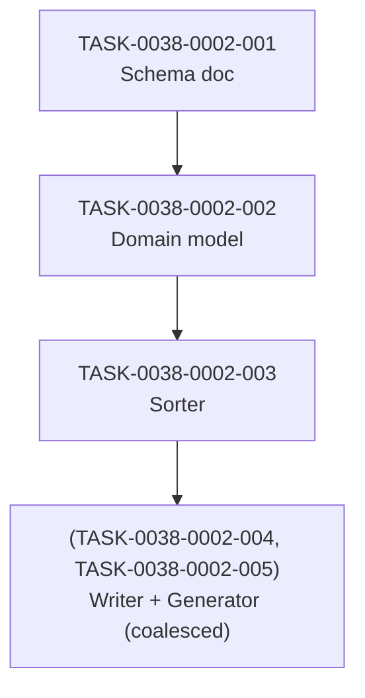

# Schema: `task-implementation-map-STORY-XXXX-YYYY.md`

> **Status:** Normativo (EPIC-0038 story-0038-0002)
> **Scope:** Define the canonical schema for a story's task-implementation map — the
> dependency graph + topologically-sorted execution waves + coalesced groups +
> parallelism analysis derived from the per-task contracts in
> `task-TASK-XXXX-YYYY-NNN.md` (story-0038-0001).
> **Produced by:** `TaskImplementationMapGenerator` (TASK-0038-0002-005)
> **Consumed by:** `x-story-implement` orchestrator (story-0038-0006), reviewers, humans

---

## 1. Filename Convention

| Artifact | Pattern | Regex | Example |
| :--- | :--- | :--- | :--- |
| Map | `task-implementation-map-STORY-XXXX-YYYY.md` | `^task-implementation-map-STORY-\d{4}-\d{4}\.md$` | `task-implementation-map-STORY-0038-0002.md` |

- `XXXX-YYYY` = `epicId-storyOrdinal`, mirroring the parent story file `story-XXXX-YYYY.md`.
- One map per story; lives alongside the per-task files in `plans/epic-XXXX/plans/`.

## 2. Required Sections (Order Significant)

| # | Section | Required | Format | Validation |
| :--- | :--- | :--- | :--- | :--- |
| 1 | `# Task Implementation Map — story-XXXX-YYYY` | Yes | H1 | Story ID matches filename |
| 2 | `## Dependency Graph` | Yes | Fenced ` ```mermaid graph TD ...``` ` | Mermaid syntactically valid |
| 3 | `## Execution Order` | Yes | Markdown table `\| Wave \| Tasks (parallelisable) \| Blocks \|` | ≥ 1 wave row |
| 4 | `## Coalesced Groups` | Yes | List of groups OR literal `—` | Each group references existing TASK-IDs |
| 5 | `## Parallelism Analysis` | Yes | Bullet list of 4 metrics | All numeric and self-consistent |

## 3. Section Details

### 3.1 Dependency Graph (Mermaid)

A `graph TD` (top-down) Mermaid block with:

- One node per task (or per coalesced group — coalesced tasks collapse into a single node labelled `(TASK-A, TASK-B)`).
- Node label uses `<br/>` to put TASK-ID on line one and short title on line two:
  ```
  T001["TASK-0038-0002-001<br/>Schema doc"]
  ```
- Arrows `-->` follow the `Depends on` relation, oriented `prerequisite --> consumer`.

Example:



### 3.2 Execution Order

Markdown table where each row is **one wave** (one level of the topological sort).
Tasks within a wave are by construction free of inter-dependencies and therefore
parallelisable.

```markdown
| Wave | Tasks (parallelisable) | Blocks |
| :--- | :--- | :--- |
| 1 | TASK-0038-0002-001 | TASK-0038-0002-002 |
| 2 | TASK-0038-0002-002 | TASK-0038-0002-003 |
| 3 | TASK-0038-0002-003 | (TASK-0038-0002-004, TASK-0038-0002-005) |
| 4 | (TASK-0038-0002-004, TASK-0038-0002-005) | — |
```

The `Blocks` column lists tasks that depend on this wave, for navigation.

### 3.3 Coalesced Groups

A bulleted list. Each group lists the TASK-IDs joined by `+` and a short
justification ("why these two cannot ship in separate commits"). Use the literal
`—` when no group exists.

```markdown
- (TASK-0038-0002-004 + TASK-0038-0002-005) — writer and generator are mutually
  recursive: the generator's tests construct expected output via the writer, and
  the writer's golden test invokes the generator pipeline.
```

A coalesced group MUST appear as a single node in the Mermaid graph (§3.1) and
as a single cell in the Execution Order table (§3.2).

### 3.4 Parallelism Analysis

Four metrics, in order:

```markdown
- Total tasks: 7
- Number of waves: 4
- Largest wave size: 2 (wave 3 — coalesced group)
- Estimated speedup vs sequential: 7 / 4 = 1.75
```

Speedup is `totalTasks / numWaves` — an upper bound that assumes infinite parallel
agents and identical task duration.

## 4. Algorithm — Topological Sort with Coalesced Collapse (Kahn modificado)

```
function sort(graph):
  # 1. Detect coalesced groups
  coalesced = []
  for each pair (A, B) in graph.nodes:
    if A.testabilityKind == COALESCED && B.testabilityKind == COALESCED
       && A.references(B) && B.references(A):
      coalesced.append({A, B})

  # 2. Collapse each coalesced group into a single super-node
  collapsed_graph = collapse(graph, coalesced)

  # 3. Validate: zero remaining cycles (DFS back-edge detection)
  if has_cycle(collapsed_graph):
    throw CyclicDependencyException(cycle_path)

  # 4. Validate: zero self-loops on non-coalesced nodes
  for each node in collapsed_graph:
    if node depends on itself:
      throw SelfLoopException(node)

  # 5. Kahn's algorithm to produce waves
  in_degree = compute_in_degrees(collapsed_graph)
  waves = []
  while collapsed_graph not empty:
    wave = [n for n in collapsed_graph if in_degree[n] == 0]
    if wave is empty:
      throw CyclicDependencyException("residual cycle after collapse")
    waves.append(wave)
    for n in wave:
      remove n from collapsed_graph
      decrement in_degree of n's successors
  return waves
```

Complexity: O(V + E) for cycle detection (DFS) + O(V + E) for Kahn = O(V + E)
overall, where V = number of (collapsed) nodes and E = number of edges.

## 5. Validation Rules

| Rule | Severity | Condition | Exception |
| :--- | :--- | :--- | :--- |
| TM-001 | ERROR | Cycle that is not a declared coalescence | `CyclicDependencyException` |
| TM-002 | ERROR | A task depends on itself | `SelfLoopException` |
| TM-003 | ERROR | `Depends on TASK-Y` but `task-TASK-Y.md` does not exist | `MissingTaskReferenceException` |
| TM-004 | ERROR | Task A declares `COALESCED with TASK-B` but TASK-B does not declare the reciprocal | `InvalidCoalescenceException` |

All four are blocking — generation aborts with a non-zero exit code and writes
nothing on disk (RULE-TF-03 + RULE-TF-02).

## 6. Idempotency

Two consecutive runs against an unchanged input directory MUST produce a map file
that is byte-for-byte identical (`diff` reports no changes). Implementation
constraints that follow from this:

- Iteration over input task files MUST be in deterministic order (sort by
  filename).
- Set/Map outputs (e.g., wave members, coalesced groups) MUST be sorted by
  TASK-ID before serialisation.
- Mermaid node declaration order MUST be `topological order, then TASK-ID` for
  predictable output.

## 7. Out of Scope (Future Stories)

- CLI invocation contract (`task-map-gen` flags) — defined in TASK-0038-0002-006.
- Integration into `x-story-plan` (planning skill that auto-generates the map per
  story) — story-0038-0004.
- Integration into `x-story-implement` (executor that consumes the map for wave
  dispatch) — story-0038-0006.

## 8. Cross-Cutting Rules

| Rule | Schema enforcement |
| :--- | :--- |
| RULE-TF-02 (I/O Contracts Are Mandatory) | Map structure derived strictly from `Depends on` declarations in §4 of every task file (story-0038-0001 schema). |
| RULE-TF-03 (Topological Execution) | Waves are the canonical execution order; orchestrator MUST respect them. |
| RULE-TF-04 (Task Commits Are Atomic) | Coalesced groups are the only legitimate exception — both tasks land in one commit per RULE-TF-04. |
