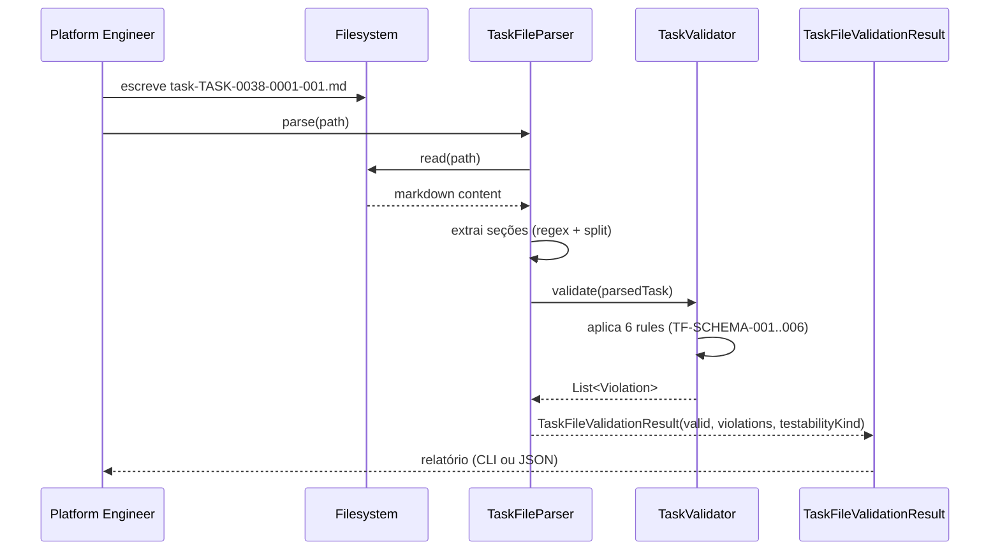

# História: Task como Artefato Primário (schema `task-TASK-NNN.md`)

**ID:** story-0038-0001
**Chave Jira:** —
**Status:** Pendente

## 1. Dependências

| Blocked By | Blocks |
| :--- | :--- |
| — | story-0038-0002, story-0038-0003, story-0038-0005 |

## 2. Regras Transversais Aplicáveis

| ID | Título |
| :--- | :--- |
| RULE-TF-01 | Task Testability |
| RULE-TF-02 | I/O Contracts Are Mandatory |
| RULE-TF-04 | Task Commits Are Atomic |

## 3. Descrição

Como **platform engineer mantenedor do `ia-dev-env`**, eu quero que cada task de uma story tenha um arquivo próprio `plans/epic-XXXX/plans/task-TASK-NNN-story-XXXX-YYYY.md` com schema formal (Status, Objetivo, Contratos I/O, Testabilidade, DoD per-task, Dependências, Plano de implementação), garantindo que contribuidores e subagents tenham uma fonte de verdade atômica per-task e eliminando o drift observado no EPIC-0034 (tasks como sub-seção de `tasks-story-*.md` causaram reescritas implícitas entre stories).

Esta é a **história de fundação** do épico: ninguém consegue gerar `task-implementation-map` (story-0038-0002), refatorar `x-task-plan` como callable (story-0038-0003) ou fazer `x-task-implement` ler contratos I/O (story-0038-0005) sem o schema canônico definido aqui. O escopo cobre apenas **(a)** a definição formal do schema (documento de referência + exemplo), **(b)** um validador/parser que lê o arquivo e checa invariantes, e **(c)** a migração de UMA task existente (escolhida de um épico recente em v1) como prova de conceito. **Templates formais** (`_TEMPLATE-TASK.md`) ficam para story-0038-0009; **comportamento de skills** (x-task-plan gerando, x-task-implement consumindo) fica para stories 0003/0005.

### 3.1 Schema do arquivo `task-TASK-NNN-story-XXXX-YYYY.md`

Definir o schema oficial conforme spec §5.1:

- **Frontmatter/cabeçalho:** título "Task: {título}", `ID: TASK-XXXX-YYYY-NNN`, `Story: story-XXXX-YYYY`, `Status: Pendente | Em Andamento | Concluída | Bloqueada | Falha`.
- **Seção 1 — Objetivo:** o que a task entrega como unidade funcional (código + teste commitável atomicamente). NÃO é valor de usuário — é pedaço atômico.
- **Seção 2 — Contratos I/O:**
  - **2.1 Inputs (pré-condições):** estado esperado antes da execução, outras tasks que devem estar concluídas (lista por TASK-ID), dependências externas (classes que existem, enums já removidas).
  - **2.2 Outputs (pós-condições):** artefatos produzidos (classe X criada, método Y alterado, teste Z verde), side effects observáveis (build compila, teste específico passa). **Outputs DEVEM ser verificáveis via grep/assert/test** (RULE-TF-02).
  - **2.3 Testabilidade:** UMA das três declarações obrigatórias: (a) **Independentemente testável**, (b) **Requer mock de TASK-YYY** (explicitar mock), (c) **Coalescível com TASK-ZZZ** (justificar mútua recursão). Sem declaração → task inválida (RULE-TF-01).
- **Seção 3 — Definition of Done (per-task):** código implementado, teste automatizado cobre output declarado, `mvn compile` verde, novo teste é Red→Green→Refactor, contratos I/O respeitados (verificação via grep/assert), commit atômico Conventional Commits (RULE-TF-04).
- **Seção 4 — Dependências:** tabela `| Depends on | Relação | Pode mockar? |` referenciando outros TASK-IDs.
- **Seção 5 — Plano de implementação:** placeholder (preenchido por `x-task-plan` em story-0038-0003 via `plan-task-TASK-NNN.md`). Nesta story é apenas referência: "ver `plan-task-TASK-NNN-story-XXXX-YYYY.md`".

### 3.2 Validador/parser

Implementar `TaskFileParser` (Java, domínio) capaz de:
- Ler um `task-TASK-NNN.md` e extrair: ID, story, status, inputs, outputs, testabilidade, dependências.
- Validar invariantes:
  - ID bate com filename.
  - Status ∈ enum permitido.
  - Testabilidade declarada exatamente uma das três opções.
  - Se `Coalescível`, referencia outro TASK-ID válido.
  - Outputs não vazios.
- Retornar `TaskFileValidationResult` (valid/invalid + lista de violações).
- **NÃO** escreve arquivos; apenas lê e valida (writer fica em story-0038-0009).

### 3.3 Exemplo migrado de v1

Escolher UMA task de um épico recente (candidatos: TASK-0037-0001-001 ou TASK-0037-0004-001) e produzir o arquivo `task-TASK-XXXX-YYYY-NNN.md` equivalente na nova formatação, como fixture de teste e exemplo canônico em `plans/epic-0038/examples/`.

### 3.4 Integração inicial (comportamento inalterado)

Esta story **NÃO** muda nenhum comportamento de skill em runtime:
- `x-story-plan` continua gerando `tasks-story-*.md` como hoje (será migrado em story-0038-0004).
- `x-task-implement` continua operando em modo v1 (será migrado em story-0038-0005).
- O parser fica disponível como API mas ainda não é chamado pelo pipeline principal.

## 3.5 Entrega de Valor

- **Valor Principal:** Tasks ganham arquivo próprio com DoD, contratos I/O e declaração de testabilidade explícita. Elimina o implícito sobre o que cada task produz — reviewers, subagents e contribuidores passam a ter uma fonte única de verdade per-task.
- **Métrica de Sucesso:** `TaskFileParser` valida um arquivo conforme schema em < 50ms; zero violações no exemplo migrado; `mvn verify` verde com testes unitários do parser cobrindo ≥ 95% line / ≥ 90% branch.
- **Impacto no Negócio:** Cria a base para eliminar os 5 sintomas do EPIC-0034 (drift, naming confusion, TDD falso, coverage regression cega, review por premissa errada). Stories subsequentes do épico só fazem sentido com este schema consolidado.

## 4. Definições de Qualidade Locais

### DoR Local

- [ ] Spec §5.1 revisada e aprovada pelo platform team
- [ ] EPIC-0036 stories 0036-0001..0006 mergeadas em develop (pré-requisito global do épico)
- [ ] Branch `feature/story-0038-0001-task-primary-artifact` criada a partir de `develop`
- [ ] Decisão confirmada: schema é Markdown com seções nomeadas (não YAML front-matter puro) para consistência com demais artefatos de `plans/`
- [ ] Task exemplar de v1 escolhida (candidato documentado no PR)

### DoD Local

- [ ] Schema formal documentado em `plans/epic-0038/schemas/task-schema.md` (doc de referência, não template executável)
- [ ] `TaskFileParser.java` implementado com testes unitários (≥ 95% line, ≥ 90% branch)
- [ ] `TaskFileValidationResult` (domain VO) criado e coberto por testes
- [ ] Exemplo migrado em `plans/epic-0038/examples/task-TASK-0037-0001-001.md` válido ao passar pelo parser
- [ ] Golden file test valida exemplo contra schema
- [ ] `mvn clean verify` verde
- [ ] PR aberto contra `develop` com label `epic-0038`
- [ ] Smoke test (integration) que lê o exemplo migrado e produz `TaskFileValidationResult(valid=true)`

### Global Definition of Done (DoD)

> Copiar do Épico §3 (Global DoD). Mantido aqui para referência rápida durante code review.

- **Cobertura:** ≥ 95% line, ≥ 90% branch
- **Testes Automatizados:** Unit (parser) + Integration (parser + exemplo) + Golden (exemplo vs schema)
- **Documentação:** `plans/epic-0038/schemas/task-schema.md` + exemplo migrado
- **Backward Compatibility:** zero impacto em épicos v1 existentes (parser é lib nova, não é invocado pelo pipeline ainda)

## 5. Contratos de Dados

> Para esta meta-story, "contratos" são **esquemas de arquivos Markdown**, não REST APIs.

### 5.1 Schema do arquivo `task-TASK-XXXX-YYYY-NNN.md`

| Seção | Obrigatória | Formato | Validação |
| :--- | :--- | :--- | :--- |
| Cabeçalho `# Task: {título}` | Sim | H1 markdown | Não vazio |
| `ID: TASK-XXXX-YYYY-NNN` | Sim | Bold + regex `TASK-\d{4}-\d{4}-\d{3}` | Bate com filename |
| `Story: story-XXXX-YYYY` | Sim | Bold + regex `story-\d{4}-\d{4}` | Referencia story válida |
| `Status` | Sim | Enum: Pendente\|Em Andamento\|Concluída\|Bloqueada\|Falha | ∈ enum |
| `## 1. Objetivo` | Sim | Markdown body | Não vazio |
| `## 2. Contratos I/O` | Sim | 3 subseções (2.1 Inputs, 2.2 Outputs, 2.3 Testabilidade) | Todas presentes |
| `### 2.3 Testabilidade` | Sim | Checklist com EXATAMENTE 1 checkbox marcado | Se 0 ou >1 → inválido |
| `## 3. Definition of Done` | Sim | Checklist | ≥ 6 itens |
| `## 4. Dependências` | Sim | Tabela ou "—" | Cada TASK-ID referenciado existe |
| `## 5. Plano de implementação` | Não (placeholder) | Referência a `plan-task-TASK-NNN.md` | — |

### 5.2 TaskFileValidationResult (VO)

| Campo | Tipo | Sempre presente | Descrição |
| :--- | :--- | :--- | :--- |
| `taskId` | `String` | Sim | ID extraído do arquivo |
| `valid` | `boolean` | Sim | True se todas as invariantes passaram |
| `violations` | `List<ValidationViolation>` | Sim (pode ser vazia) | Cada violação: ruleId + severidade + mensagem |
| `testabilityKind` | `Enum(INDEPENDENT, REQUIRES_MOCK, COALESCED)` | Só se `valid` | Declaração lida da Seção 2.3 |

### 5.3 Violations catalog

| Rule ID | Severidade | Condição |
| :--- | :--- | :--- |
| `TF-SCHEMA-001` | ERROR | ID ausente ou não bate com filename |
| `TF-SCHEMA-002` | ERROR | Status fora do enum |
| `TF-SCHEMA-003` | ERROR | Testabilidade ausente, múltipla ou não reconhecida |
| `TF-SCHEMA-004` | ERROR | Outputs vazios |
| `TF-SCHEMA-005` | WARN | DoD checklist < 6 itens |
| `TF-SCHEMA-006` | ERROR | Coalescível referencia TASK-ID inexistente |

## 6. Diagramas

### 6.1 Fluxo de validação do arquivo de task



## 7. Critérios de Aceite (Gherkin)

```gherkin
Cenario: Degenerate — arquivo vazio
  DADO que o arquivo task-TASK-0038-0001-999.md está vazio
  QUANDO TaskFileParser.parse() é chamado
  ENTÃO retorna TaskFileValidationResult com valid=false
  E violations contém TF-SCHEMA-001 (ID ausente)
  E violations contém TF-SCHEMA-003 (testabilidade ausente)

Cenario: Happy path — arquivo válido com testabilidade independente
  DADO que task-TASK-0038-0001-001.md tem todas as 5 seções obrigatórias
  E Seção 2.3 marca exatamente "[x] Independentemente testável"
  QUANDO TaskFileParser.parse() é chamado
  ENTÃO retorna valid=true
  E testabilityKind=INDEPENDENT
  E violations está vazio

Cenario: Erro — testabilidade múltipla marcada
  DADO que task-TASK-0038-0001-002.md marca dois checkboxes em Seção 2.3
  QUANDO TaskFileParser.parse() é chamado
  ENTÃO retorna valid=false
  E violations contém TF-SCHEMA-003 com severidade ERROR
  E a mensagem indica "testabilidade deve ter exatamente uma declaração"

Cenario: Boundary — DoD com exatamente 6 itens
  DADO que o arquivo tem DoD checklist com 6 checkboxes
  QUANDO parser valida
  ENTÃO valid=true
  E nenhum TF-SCHEMA-005 warn é emitido

Cenario: Smoke — exemplo migrado passa validação
  DADO que plans/epic-0038/examples/task-TASK-0037-0001-001.md existe
  QUANDO mvn verify executa o integration test TaskExampleMigrationIT
  ENTÃO TaskFileParser.parse(exemplo) retorna valid=true
  E build fica verde
```

### 7.1 Scenario Ordering (TPP)
Degenerate (vazio) → happy (válido simples) → error (regra violada) → boundary (limite DoD) → smoke (exemplo real).

### 7.2 Mandatory Scenario Categories
- [x] Degenerate (arquivo vazio)
- [x] Happy path (válido independente)
- [x] Error paths (testabilidade múltipla)
- [x] Boundary (DoD 6 itens)
- [x] Smoke (exemplo migrado)

## 8. Tasks

### TASK-0038-0001-001: Documentar schema formal em `task-schema.md`

- **Layer:** Doc
- **Test Type:** Verification
- **Size:** S
- **Dependencies:** —
- **Branch:** `feat/task-0038-0001-001-schema-doc`
- **Testability:** Independentemente testável (doc-only, verificação por grep)
- **Files:**
  - `plans/epic-0038/schemas/task-schema.md` (novo)
- **Acceptance Criteria:**
  - [ ] Doc cobre todas as 5 seções do schema (cabeçalho + §1–§5)
  - [ ] Tabela de validações com 6 rule IDs (TF-SCHEMA-001..006)
  - [ ] Exemplos inline de cada declaração de testabilidade

### TASK-0038-0001-002: Criar VOs `TaskFileValidationResult` e `ValidationViolation`

- **Layer:** Domain
- **Test Type:** Unit
- **Size:** S
- **Dependencies:** TASK-0038-0001-001
- **Branch:** `feat/task-0038-0001-002-vos`
- **Testability:** Independentemente testável (VOs imutáveis)
- **Files:**
  - `java/src/main/java/.../taskfile/domain/TaskFileValidationResult.java`
  - `java/src/main/java/.../taskfile/domain/ValidationViolation.java`
  - `java/src/main/java/.../taskfile/domain/TestabilityKind.java` (enum)
  - `java/src/test/java/.../taskfile/domain/*Test.java`
- **Acceptance Criteria:**
  - [ ] Records imutáveis (sem setters)
  - [ ] `valid` derivado de `violations.isEmpty()` (ou só ERRORs)
  - [ ] Cobertura ≥ 95% line

### TASK-0038-0001-003: Implementar `TaskFileParser` (leitura + extração)

- **Layer:** Domain
- **Test Type:** Unit
- **Size:** M
- **Dependencies:** TASK-0038-0001-002
- **Branch:** `feat/task-0038-0001-003-parser`
- **Testability:** Independentemente testável (parser puro, input=String)
- **Files:**
  - `java/src/main/java/.../taskfile/domain/TaskFileParser.java`
  - `java/src/test/java/.../taskfile/domain/TaskFileParserTest.java`
- **Acceptance Criteria:**
  - [ ] Extrai ID, story, status, seções §1–§5 de markdown
  - [ ] Delega para `TaskValidator` (TASK-004) e agrega violações
  - [ ] Retorna `TaskFileValidationResult` completo

### TASK-0038-0001-004: Implementar `TaskValidator` (6 rules)

- **Layer:** Domain
- **Test Type:** Unit
- **Size:** M
- **Dependencies:** TASK-0038-0001-002
- **Branch:** `feat/task-0038-0001-004-validator`
- **Testability:** Independentemente testável (rules puras)
- **Files:**
  - `java/src/main/java/.../taskfile/domain/TaskValidator.java`
  - `java/src/main/java/.../taskfile/domain/rules/*.java` (6 classes)
  - `java/src/test/java/.../taskfile/domain/TaskValidatorTest.java`
- **Acceptance Criteria:**
  - [ ] 6 rules (TF-SCHEMA-001..006) implementadas como classes SRP
  - [ ] Cada rule tem teste unit cobrindo pass + fail
  - [ ] Composite pattern: `TaskValidator` agrega todas rules

### TASK-0038-0001-005: Migrar 1 task exemplar de v1 para novo schema

- **Layer:** Doc
- **Test Type:** Verification
- **Size:** S
- **Dependencies:** TASK-0038-0001-001
- **Branch:** `feat/task-0038-0001-005-example`
- **Testability:** Independentemente testável (arquivo isolado)
- **Files:**
  - `plans/epic-0038/examples/task-TASK-0037-0001-001.md` (novo)
- **Acceptance Criteria:**
  - [ ] Exemplo cobre os 3 kinds de testabilidade (1 INDEPENDENT, referenciando REQUIRES_MOCK e COALESCED em comentário)
  - [ ] Todas as 5 seções preenchidas com conteúdo real migrado de story-0037-0001
  - [ ] Arquivo passa parsing manual (sem rodar parser ainda)

### TASK-0038-0001-006: Integration test — exemplo migrado é válido (smoke)

- **Layer:** Test
- **Test Type:** Integration
- **Size:** S
- **Dependencies:** TASK-0038-0001-003, TASK-0038-0001-004, TASK-0038-0001-005
- **Branch:** `feat/task-0038-0001-006-smoke-it`
- **Testability:** Independentemente testável (IT lê fixture + invoca parser)
- **Files:**
  - `java/src/test/java/.../taskfile/TaskExampleMigrationIT.java`
- **Acceptance Criteria:**
  - [ ] IT lê `plans/epic-0038/examples/task-TASK-0037-0001-001.md`
  - [ ] Invoca `TaskFileParser.parse()` e asserta `valid=true`
  - [ ] Asserta `testabilityKind=INDEPENDENT`
  - [ ] `mvn clean verify` verde

### TASK-0038-0001-007: Golden file test — schema documentation stability

- **Layer:** Test
- **Test Type:** Smoke
- **Size:** S
- **Dependencies:** TASK-0038-0001-005, TASK-0038-0001-006
- **Branch:** `feat/task-0038-0001-007-golden`
- **Testability:** Independentemente testável
- **Files:**
  - `java/src/test/resources/golden/epic-0038/examples/task-TASK-0037-0001-001.md`
- **Acceptance Criteria:**
  - [ ] Golden file bate byte-a-byte com o exemplo migrado
  - [ ] `GoldenFileRegenerator` reproduz o arquivo
  - [ ] `PlatformDirectorySmokeTest` (ou equivalente) continua verde
