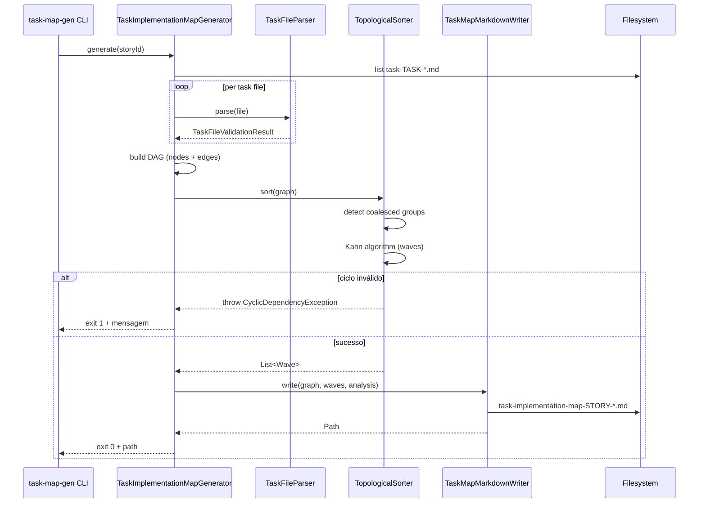

# História: Task-Implementation-Map per Story (grafo + topological sort)

**ID:** story-0038-0002
**Chave Jira:** —
**Status:** Pendente

## 1. Dependências

| Blocked By | Blocks |
| :--- | :--- |
| story-0038-0001 | story-0038-0005 |

## 2. Regras Transversais Aplicáveis

| ID | Título |
| :--- | :--- |
| RULE-TF-02 | I/O Contracts Are Mandatory |
| RULE-TF-03 | Topological Execution |
| RULE-TF-04 | Task Commits Are Atomic |

## 3. Descrição

Como **orquestrador de épico** (subagent `x-story-implement` / `x-epic-implement` pós-rename) e **subagent executor de task**, eu quero que cada story produza um `plans/epic-XXXX/plans/task-implementation-map-STORY-XXXX-YYYY.md` com grafo de dependências Mermaid, tabela de topological sort (waves paralelizáveis), grupos coalescidos e análise de paralelismo, garantindo execução determinística das tasks a partir dos contratos I/O declarados em `task-TASK-NNN.md` (story-0038-0001).

O EPIC-0034 coalesceu tasks ad-hoc (TASK-001 + TASK-002 mutualmente recursivas) sem registro formal, impedindo review e paralelização. Esta story formaliza o mecanismo: parser lê as declarações `Depends on` de cada task, valida ausência de ciclos (exceto coalescências declaradas), computa ordem topológica com waves (níveis de um DAG), e emite o arquivo markdown consumível por humanos (Mermaid) e por skills (tabela estruturada).

### 3.1 Schema do arquivo `task-implementation-map-STORY-XXXX-YYYY.md`

Definir schema conforme spec §5.2:

- **Cabeçalho:** `# Task Implementation Map — story-XXXX-YYYY`, com referência à story e ao épico.
- **Seção 1 — Dependency Graph (Mermaid):** bloco ` ```mermaid graph TD ... ``` ` com um nó por task (label multi-linha com `TASK-ID<br/>título`) e arestas representando `Depends on`.
- **Seção 2 — Execution Order (Topological Sort):** tabela `| Wave | Tasks (paralelizáveis) | Blocks |` onde cada wave é um nível do DAG (tasks sem dependências não-satisfeitas pelas waves anteriores).
- **Seção 3 — Coalesced Groups:** lista de grupos `(TASK-X, TASK-Y, ...)` com justificativa textual (ex: "enum edit + CLI edit — não compilam uma sem a outra"). Grupos coalescidos viram um único nó no grafo.
- **Seção 4 — Parallelism Analysis:** métricas computadas:
  - N tasks totais
  - N waves
  - Largest wave size (grau de paralelismo máximo)
  - Speedup estimado vs sequencial (`totalTasks / numWaves`)

### 3.2 Gerador `TaskImplementationMapGenerator`

Implementar classe Java (domínio + adapter) que:
- **Input:** diretório `plans/epic-XXXX/plans/` com N arquivos `task-TASK-*.md` de uma mesma story.
- **Pipeline:**
  1. Lê cada `task-TASK-NNN.md` via `TaskFileParser` (story-0038-0001).
  2. Extrai grafo `Map<TaskId, Set<TaskId>>` a partir da Seção 4 de cada task (`Depends on`).
  3. Detecta grupos coalescidos (pares/triplas onde `testabilityKind=COALESCED` referenciam-se mutuamente).
  4. Valida ausência de ciclos (DFS com detecção de back-edges); ciclo não-coalescido → erro.
  5. Computa topological sort em waves (algoritmo de Kahn modificado com coalesced collapse).
  6. Emite markdown via `TaskMapMarkdownWriter`.
- **Output:** arquivo `task-implementation-map-STORY-XXXX-YYYY.md` gravado no diretório `plans/epic-XXXX/plans/`.

### 3.3 Detecção de ciclos e coalescências

- **Ciclo válido (coalescência):** duas tasks A e B ambas com `testabilityKind=COALESCED` referenciando-se → colapsam em um nó `(A, B)` na wave computada como max(dependências externas de A, B) + 1.
- **Ciclo inválido:** qualquer outra forma de ciclo → `TaskMapGenerationException` com lista de tasks envolvidas e sugestão ("declarar coalescência explícita ou quebrar dependência").
- **Self-loop** (task depende de si mesma): sempre inválido.

### 3.4 Integração (ainda sem mudar comportamento de runtime)

- Gerador é invocável como CLI `task-map-gen --story story-XXXX-YYYY` para uso manual.
- **NÃO** é invocado por `x-story-plan` ou `x-story-implement` nesta story — integração fica para stories 0004 e 0006.
- Output é idempotente: rodar duas vezes produz o mesmo arquivo byte-a-byte.

## 3.5 Entrega de Valor

- **Valor Principal:** Stories ganham grafo de dependências formal entre tasks com topological sort automático e análise de paralelismo. Execução deixa de ser linear implícita e passa a ser determinística a partir dos contratos I/O. Coalescências viram declarações formais (não mais ad-hoc como no EPIC-0034).
- **Métrica de Sucesso:** Gerador produz map válido para uma story de teste com ≥ 5 tasks em < 200ms; zero ciclos inválidos falsos-negativos; `mvn verify` verde com cobertura ≥ 95% line / ≥ 90% branch.
- **Impacto no Negócio:** Desbloqueia `x-story-implement` (story-0038-0006) para dispachar tasks em waves paralelas, reduzindo wallclock de execução de stories com tasks independentes. Torna coalescências auditáveis em review.

## 4. Definições de Qualidade Locais

### DoR Local

- [ ] Story-0038-0001 mergeada em develop (schema + parser disponíveis)
- [ ] Spec §5.2 revisada, especialmente algoritmo de waves com coalesced collapse
- [ ] Branch `feature/story-0038-0002-task-impl-map` criada
- [ ] Story de teste fixture preparada: 5-7 tasks com mix de deps lineares, paralelas e 1 par coalescido
- [ ] Algoritmo de topological sort (Kahn) revisado em pair-review

### DoD Local

- [ ] Schema documentado em `plans/epic-0038/schemas/task-implementation-map-schema.md`
- [ ] `TaskImplementationMapGenerator` implementado com testes unit + integration
- [ ] `TopologicalSorter` (domínio) com detecção de ciclos e coalesced collapse
- [ ] `TaskMapMarkdownWriter` (adapter) produz markdown idempotente
- [ ] CLI `task-map-gen` funcional via picocli
- [ ] Fixture story com 7 tasks gera map válido (golden)
- [ ] Ciclo inválido detectado com mensagem acionável
- [ ] `mvn clean verify` verde, cobertura ≥ 95% line / ≥ 90% branch
- [ ] PR aberto contra `develop` com label `epic-0038`

### Global Definition of Done (DoD)

> Copiar do Épico §3.

- **Cobertura:** ≥ 95% line, ≥ 90% branch
- **Testes Automatizados:** Unit (sorter, writer) + Integration (gerador E2E) + Smoke (CLI + fixture)
- **Performance:** geração < 200ms para story com ≤ 20 tasks
- **Backward Compatibility:** gerador é lib nova, não invocado por skills v1

## 5. Contratos de Dados

### 5.1 Schema do arquivo `task-implementation-map-STORY-XXXX-YYYY.md`

| Seção | Obrigatória | Formato | Validação |
| :--- | :--- | :--- | :--- |
| `# Task Implementation Map — story-XXXX-YYYY` | Sim | H1 | Story ID bate com filename |
| `## Dependency Graph` | Sim | Bloco ```mermaid graph TD``` | Sintaxe mermaid válida |
| `## Execution Order` | Sim | Tabela `\| Wave \| Tasks \| Blocks \|` | ≥ 1 wave |
| `## Coalesced Groups` | Sim | Lista ou "—" | Cada grupo referencia TASK-IDs existentes |
| `## Parallelism Analysis` | Sim | 4 métricas | Valores numéricos coerentes |

### 5.2 Grafo interno (domain model)

| Campo | Tipo | Descrição |
| :--- | :--- | :--- |
| `nodes` | `Map<TaskId, TaskNode>` | Um nó por task (ou grupo coalescido) |
| `edges` | `Set<Edge>` | Arestas `(from → to)` representando `Depends on` |
| `coalescedGroups` | `List<Set<TaskId>>` | Grupos que colapsam em wave única |
| `waves` | `List<List<TaskId>>` | Output do topological sort (ordem de execução) |

### 5.3 Exceções

| Exception | Condição | Mensagem |
| :--- | :--- | :--- |
| `CyclicDependencyException` | Ciclo não-coalescido detectado | "Ciclo detectado: TASK-A → TASK-B → TASK-A. Declare COALESCED ou quebre dep." |
| `SelfLoopException` | Task depende de si mesma | "TASK-X depende de si mesma — inválido" |
| `MissingTaskReferenceException` | `Depends on TASK-Y` mas arquivo TASK-Y não existe | "TASK-X referencia TASK-Y inexistente" |
| `InvalidCoalescenceException` | COALESCED declarada mas contraparte não-COALESCED | "TASK-A declara coalescência com TASK-B, mas TASK-B não declara recíproca" |

## 6. Diagramas

### 6.1 Pipeline de geração do task-implementation-map



## 7. Critérios de Aceite (Gherkin)

```gherkin
Cenario: Degenerate — story com 1 task
  DADO que plans/epic-0038/plans/ tem apenas task-TASK-0038-0002-001.md sem dependências
  QUANDO task-map-gen --story story-0038-0002 executa
  ENTÃO task-implementation-map-STORY-0038-0002.md é criado
  E contém 1 wave com 1 task
  E Coalesced Groups = "—"
  E Parallelism Analysis reporta speedup = 1.0

Cenario: Happy path — 5 tasks com 2 waves e 1 coalescência
  DADO que a story tem 5 tasks: (T001 independente), (T002 independente), (T003 depende de T001+T002), (T004, T005 COALESCED)
  QUANDO task-map-gen executa
  ENTÃO mapa contém wave 1 = [T001, T002, (T004,T005)], wave 2 = [T003]
  E Coalesced Groups lista (T004, T005) com justificativa
  E Mermaid graph tem 4 nós (coalesced collapsed)
  E speedup estimado = 5/2 = 2.5

Cenario: Error — ciclo inválido detectado
  DADO que T001 depende de T002 e T002 depende de T001, ambas com testabilityKind=INDEPENDENT
  QUANDO task-map-gen executa
  ENTÃO exit code = 1
  E stderr contém "Ciclo detectado: TASK-0038-0002-001 → TASK-0038-0002-002 → TASK-0038-0002-001"
  E sugere "Declare COALESCED ou quebre dep"
  E arquivo de map NÃO é escrito

Cenario: Boundary — task referencia TASK-ID inexistente
  DADO que T001 declara "Depends on TASK-0038-0002-099" mas T099 não existe
  QUANDO task-map-gen executa
  ENTÃO exit code = 1
  E stderr contém MissingTaskReferenceException com ambos IDs

Cenario: Smoke — fixture de 7 tasks produz golden file
  DADO que plans/epic-0038/examples/story-fixture-0038-0002/ tem 7 tasks
  QUANDO mvn verify executa TaskMapGenerationIT
  ENTÃO golden file task-implementation-map-STORY-FIXTURE.md bate byte-a-byte
  E geração completa em < 200ms
```

### 7.1 Scenario Ordering (TPP)
Degenerate (1 task) → happy (5 tasks + coalesce) → error (ciclo) → boundary (ref inexistente) → smoke (fixture golden).

### 7.2 Mandatory Scenario Categories
- [x] Degenerate (1 task)
- [x] Happy path (5 tasks)
- [x] Error paths (ciclo, ref ausente)
- [x] Boundary (ref inexistente)
- [x] Smoke (golden fixture)

## 8. Tasks

### TASK-0038-0002-001: Documentar schema `task-implementation-map-schema.md`

- **Layer:** Doc
- **Test Type:** Verification
- **Size:** S
- **Dependencies:** —
- **Branch:** `feat/task-0038-0002-001-schema-doc`
- **Testability:** Independentemente testável
- **Files:**
  - `plans/epic-0038/schemas/task-implementation-map-schema.md`
- **Acceptance Criteria:**
  - [ ] Cobertura das 4 seções (Graph, Execution Order, Coalesced, Parallelism)
  - [ ] Exemplo Mermaid inline
  - [ ] Algoritmo de waves explicado em pseudocódigo

### TASK-0038-0002-002: Domain model `TaskGraph`, `TaskNode`, `Wave`

- **Layer:** Domain
- **Test Type:** Unit
- **Size:** M
- **Dependencies:** TASK-0038-0002-001
- **Branch:** `feat/task-0038-0002-002-domain-model`
- **Testability:** Independentemente testável
- **Files:**
  - `java/src/main/java/.../taskmap/domain/TaskGraph.java`
  - `java/src/main/java/.../taskmap/domain/TaskNode.java`
  - `java/src/main/java/.../taskmap/domain/Wave.java`
  - `java/src/main/java/.../taskmap/domain/Edge.java`
  - `java/src/test/java/.../taskmap/domain/*Test.java`
- **Acceptance Criteria:**
  - [ ] Records imutáveis
  - [ ] TaskNode suporta coalesced (Set<TaskId>)
  - [ ] Cobertura ≥ 95% line

### TASK-0038-0002-003: Implementar `TopologicalSorter` (Kahn + coalesced collapse)

- **Layer:** Domain
- **Test Type:** Unit
- **Size:** L
- **Dependencies:** TASK-0038-0002-002
- **Branch:** `feat/task-0038-0002-003-sorter`
- **Testability:** Independentemente testável (algoritmo puro)
- **Files:**
  - `java/src/main/java/.../taskmap/domain/TopologicalSorter.java`
  - `java/src/main/java/.../taskmap/domain/CycleDetector.java`
  - `java/src/main/java/.../taskmap/domain/exception/*.java` (4 exceptions)
  - `java/src/test/java/.../taskmap/domain/TopologicalSorterTest.java`
- **Acceptance Criteria:**
  - [ ] Kahn algorithm implementado
  - [ ] Detecta ciclos inválidos e self-loops
  - [ ] Coalesce pares/triplas COALESCED como nó único
  - [ ] Testes cobrem: linear, paralelo, coalesced, ciclo inválido, self-loop

### TASK-0038-0002-004: Implementar `TaskMapMarkdownWriter`

- **Layer:** Adapter (Outbound)
- **Test Type:** Unit
- **Size:** M
- **Dependencies:** TASK-0038-0002-002
- **Branch:** `feat/task-0038-0002-004-writer`
- **Testability:** Independentemente testável (writer puro)
- **Files:**
  - `java/src/main/java/.../taskmap/adapter/outbound/TaskMapMarkdownWriter.java`
  - `java/src/test/java/.../taskmap/adapter/outbound/TaskMapMarkdownWriterTest.java`
- **Acceptance Criteria:**
  - [ ] Emite as 4 seções na ordem correta
  - [ ] Mermaid graph syntatically válido (parseável)
  - [ ] Output idempotente (byte-a-byte reprodutível)

### TASK-0038-0002-005: Implementar `TaskImplementationMapGenerator` (use case)

- **Layer:** Application
- **Test Type:** Integration
- **Size:** M
- **Dependencies:** TASK-0038-0002-003, TASK-0038-0002-004
- **Branch:** `feat/task-0038-0002-005-generator`
- **Testability:** Requer mock de `TaskFileParser` (story-0038-0001) para isolar em unit; integration test usa fixture real
- **Files:**
  - `java/src/main/java/.../taskmap/application/TaskImplementationMapGenerator.java`
  - `java/src/test/java/.../taskmap/application/TaskImplementationMapGeneratorIT.java`
- **Acceptance Criteria:**
  - [ ] Orquestra Parser → Sorter → Writer
  - [ ] IT com fixture de 7 tasks (1 coalesced group) gera golden file
  - [ ] Propaga exceptions com contexto acionável

### TASK-0038-0002-006: CLI `task-map-gen` via picocli

- **Layer:** Adapter (Inbound)
- **Test Type:** API
- **Size:** S
- **Dependencies:** TASK-0038-0002-005
- **Branch:** `feat/task-0038-0002-006-cli`
- **Testability:** Independentemente testável (CommandLine test com StringWriter)
- **Files:**
  - `java/src/main/java/.../taskmap/adapter/inbound/TaskMapGenCommand.java`
  - `java/src/test/java/.../taskmap/adapter/inbound/TaskMapGenCommandTest.java`
- **Acceptance Criteria:**
  - [ ] Flag `--story story-XXXX-YYYY` obrigatória
  - [ ] Exit 0 em sucesso, 1 em erro com mensagem em stderr
  - [ ] Mensagens de erro contêm TASK-IDs envolvidos

### TASK-0038-0002-007: E2E smoke test + fixture golden

- **Layer:** Test
- **Test Type:** Smoke
- **Size:** M
- **Dependencies:** TASK-0038-0002-005, TASK-0038-0002-006
- **Branch:** `feat/task-0038-0002-007-smoke`
- **Testability:** Independentemente testável (invoca CLI via ProcessBuilder ou direct)
- **Files:**
  - `plans/epic-0038/examples/story-fixture-0038-0002/task-*.md` (7 tasks)
  - `java/src/test/resources/golden/epic-0038/task-implementation-map-STORY-FIXTURE.md`
  - `java/src/test/java/.../taskmap/TaskMapGenerationE2ESmokeTest.java`
- **Acceptance Criteria:**
  - [ ] Fixture de 7 tasks (mix linear + paralelo + coalesced)
  - [ ] Golden file bate byte-a-byte após geração
  - [ ] Geração < 200ms (assert em wallclock)
  - [ ] `mvn clean verify` verde
