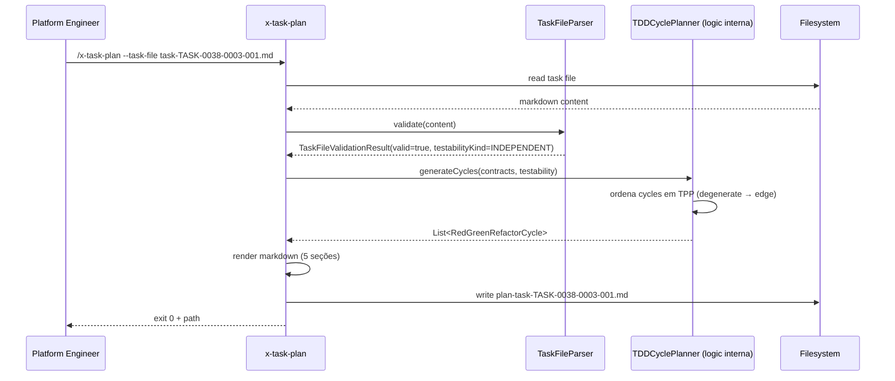
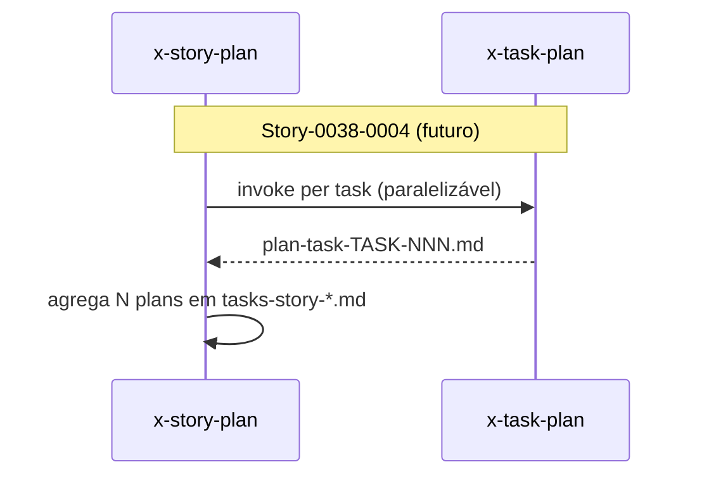

# História: `x-task-plan` Refatorada como Callable Skill

**ID:** story-0038-0003
**Chave Jira:** —
**Status:** Pendente

## 1. Dependências

| Blocked By | Blocks |
| :--- | :--- |
| story-0038-0001 | story-0038-0004 |

## 2. Regras Transversais Aplicáveis

| ID | Título |
| :--- | :--- |
| RULE-TF-01 | Task Testability |
| RULE-TF-02 | I/O Contracts Are Mandatory |

## 3. Descrição

Como **orquestrador de story planning** (`x-story-plan`, a ser atualizado em story-0038-0004) e **platform engineer mantenedor do `ia-dev-env`**, eu quero que a skill `x-task-plan` — hoje órfã (existe em `.claude/skills/x-task-plan/SKILL.md` mas nunca é invocada) — seja refatorada para ser **callable**: recebe `task-TASK-NNN.md` como input, lê os contratos I/O (story-0038-0001), e produz `plan-task-TASK-NNN-story-XXXX-YYYY.md` com o ciclo TDD detalhado (Red → Green → Refactor) em ordem TPP (Transformation Priority Premise).

A skill é o elo ausente entre "definir contrato da task" (story-0038-0001) e "executar TDD honesto per task" (story-0038-0005). Sem ela, `x-story-plan` continua sendo monolítica e o plano de TDD vive enterrado em `tasks-story-*.md` sem granularidade per-task. Esta refatora **apenas a skill** (SKILL.md + contrato de I/O da skill + integration test standalone); a invocação por `x-story-plan` fica para story-0038-0004.

**Importante — bootstrap v1:** conforme spec §8.2, o EPIC-0038 executa em `planningSchemaVersion = "1.0"` durante sua própria vida. Portanto esta skill é **refatorada mas só executa "for real" no dogfood pós-merge** (story-0038-0010 e épicos subsequentes). Nesta story, a validação é via integration test standalone invocando a skill manualmente com uma fixture `task-TASK-NNN.md`.

### 3.1 Contrato da skill `x-task-plan` (pós-refactor)

**Input (mandatory args):**
- `--task-file plans/epic-XXXX/plans/task-TASK-NNN-story-XXXX-YYYY.md` — caminho para o arquivo de task definido em story-0038-0001.
- `--output-dir plans/epic-XXXX/plans/` (default: mesmo dir do task-file).

**Pré-condições:**
- `task-file` existe e passa validação `TaskFileParser` (story-0038-0001).
- Testabilidade declarada (INDEPENDENT / REQUIRES_MOCK / COALESCED).

**Comportamento:**
1. Lê o task file via protocolo invocação `Skill tool`.
2. Extrai contratos I/O (Seção 2) e Objetivo (Seção 1).
3. Produz `plan-task-TASK-NNN-story-XXXX-YYYY.md` com:
   - Cabeçalho referenciando `task-TASK-NNN.md`.
   - Seção **Red-Green-Refactor Cycles**: lista ordenada de cenários TDD em ordem TPP (degenerate → unconditional → conditions → iterations → edge cases).
   - Cada cycle tem: **Red** (teste que falha com nome `methodUnderTest_scenario_expectedBehavior`), **Green** (mínimo código para passar), **Refactor** (critério explícito: extract method, eliminate dup, melhorar naming).
   - Seção **File Impact Analysis**: arquivos que cada cycle toca, por layer (Domain, Port, Adapter, Application, Test).
   - Seção **TPP Justification**: justificativa da ordem escolhida (por que este cycle antes daquele).

**Output:**
- Arquivo `plan-task-TASK-NNN-story-XXXX-YYYY.md` gravado no `output-dir`.
- Exit code: 0 em sucesso, 1 em validação falha (task file inválido, testabilidade ausente).

### 3.2 Refactor do SKILL.md existente

`java/src/main/resources/targets/claude/skills/x-task-plan/SKILL.md` já existe (EPIC-0036 não renomeou — nome é mantido). Escopo da refatoração:

- Atualizar front-matter `description:` para refletir novo contrato ("generates plan-task-TASK-NNN.md from task-TASK-NNN.md consumed contract").
- Reescrever body do SKILL para:
  - Indicar args `--task-file` e `--output-dir`.
  - Documentar comportamento em 4 fases: (1) Validate Input, (2) Extract Contracts, (3) Generate TDD Cycles in TPP Order, (4) Write Plan File.
  - Fornecer template inline do `plan-task-TASK-NNN.md` (seção Red-Green-Refactor, File Impact, TPP Justification).
  - Documentar integração futura: "Invocável standalone OU via `x-story-plan` (story-0038-0004)".
- Remover qualquer menção a "invocação via x-story-plan" como pré-existente (atualmente a skill é órfã).

### 3.3 Schema do arquivo `plan-task-TASK-NNN-story-XXXX-YYYY.md`

- **Cabeçalho:** `# Task Implementation Plan — TASK-XXXX-YYYY-NNN`, com referência ao `task-TASK-NNN.md`.
- **Seção 1 — Resumo:** objetivo + testabilidade copiados do task file.
- **Seção 2 — Red-Green-Refactor Cycles (TPP order):** tabela ordenada `| # | Phase | Test Name | Green Code Summary | Refactor Hint |`.
- **Seção 3 — File Impact Analysis:** tabela `| Cycle | Layer | Files (new/modified) |`.
- **Seção 4 — TPP Justification:** texto livre explicando ordem (≤ 10 linhas).
- **Seção 5 — Exit Criteria:** todos os cycles verdes + refactor aplicado + atomic commit.

### 3.4 Validação standalone (sem integração com x-story-plan)

- Integration test: invoca a skill manualmente (via Skill tool ou simulação CLI equivalente) com uma fixture `task-TASK-0038-0003-EXAMPLE.md`.
- Golden file: `plan-task-TASK-0038-0003-EXAMPLE.md` esperado após execução.
- **NÃO** toca em `x-story-plan` (story-0038-0004).

## 3.5 Entrega de Valor

- **Valor Principal:** A skill órfã `x-task-plan` deixa de ser código morto arquitetural e passa a ser callable, produzindo plano TDD detalhado per task (Red-Green-Refactor em ordem TPP). Preenche o gap entre "contrato da task" e "execução TDD honesta".
- **Métrica de Sucesso:** Skill invocada standalone com fixture gera `plan-task-*.md` em < 30s; golden file bate; SKILL.md reescrito documenta o novo contrato de I/O; zero `grep "x-task-plan is orphan"` após merge.
- **Impacto no Negócio:** Desbloqueia story-0038-0004 (x-story-plan recursivo) e indiretamente story-0038-0005 (x-task-implement consumindo plans gerados). Torna visível a granularidade TDD per-task que estava implícita no modelo v1.

## 4. Definições de Qualidade Locais

### DoR Local

- [ ] Story-0038-0001 mergeada em develop (schema + parser disponíveis)
- [ ] SKILL.md atual (`.claude/skills/x-task-plan/SKILL.md`) lido integralmente e mapeadas seções a remover/reescrever
- [ ] Fixture `task-TASK-0038-0003-EXAMPLE.md` preparada (testabilidade INDEPENDENT, 3-4 outputs claros)
- [ ] Branch `feature/story-0038-0003-x-task-plan-callable` criada
- [ ] Decisão confirmada: skill continua em Markdown (não virou Java use case) — permanece invocável via Skill tool

### DoD Local

- [ ] `java/src/main/resources/targets/claude/skills/x-task-plan/SKILL.md` reescrito conforme §3.2
- [ ] Schema `plan-task-TASK-NNN.md` documentado em `plans/epic-0038/schemas/plan-task-schema.md`
- [ ] Fixture `task-TASK-0038-0003-EXAMPLE.md` + golden `plan-task-TASK-0038-0003-EXAMPLE.md`
- [ ] Integration test standalone invoca skill e compara golden
- [ ] SKILL.md passa `AgentsAssembler` / `SkillsAssembler` sem warnings (ou equivalente validator do generator)
- [ ] Golden files regenerados (`mvn process-resources` + `GoldenFileRegenerator`)
- [ ] `mvn clean verify` verde
- [ ] PR aberto contra `develop` com label `epic-0038`

### Global Definition of Done (DoD)

> Copiar do Épico §3.

- **Cobertura:** N/A para markdown; ≥ 95% line / ≥ 90% branch para qualquer código Java tocado (assemblers)
- **Testes Automatizados:** Integration test standalone invocando skill + golden file
- **Documentação:** SKILL.md reescrito + schema `plan-task-schema.md`
- **Backward Compatibility:** skill refatorada não é invocada pelo pipeline v1; nenhum épico em curso é afetado

## 5. Contratos de Dados

### 5.1 Contrato de invocação da skill `x-task-plan`

| Arg | Tipo | M/O | Validação | Exemplo |
| :--- | :--- | :--- | :--- | :--- |
| `--task-file` | `Path` | M | Existe, passa `TaskFileParser.validate` | `plans/epic-0038/plans/task-TASK-0038-0003-001.md` |
| `--output-dir` | `Path` | O (default=dir do task-file) | Diretório existe e é gravável | `plans/epic-0038/plans/` |

### 5.2 Schema do arquivo `plan-task-TASK-XXXX-YYYY-NNN.md`

| Seção | Obrigatória | Formato |
| :--- | :--- | :--- |
| Cabeçalho H1 + referência ao `task-TASK-NNN.md` | Sim | Markdown |
| `## 1. Resumo` | Sim | Copia Objetivo + Testabilidade da task |
| `## 2. Red-Green-Refactor Cycles (TPP Order)` | Sim | Tabela ordenada ≥ 1 linha |
| `## 3. File Impact Analysis` | Sim | Tabela por cycle |
| `## 4. TPP Justification` | Sim | Texto ≤ 10 linhas |
| `## 5. Exit Criteria` | Sim | Checklist |

### 5.3 Exit Codes da skill

| Exit Code | Condição | Mensagem |
| :--- | :--- | :--- |
| 0 | Plan gerado com sucesso | `Plan written to {path}` |
| 1 | task-file ausente ou inválido | `Task file invalid: {violations}` |
| 2 | output-dir não gravável | `Output dir not writable: {path}` |
| 3 | Testabilidade ausente na task | `Testability not declared (RULE-TF-01)` |

## 6. Diagramas

### 6.1 Fluxo standalone da skill `x-task-plan` (pós-refactor)



### 6.2 Integração futura (preview story-0038-0004)



## 7. Critérios de Aceite (Gherkin)

```gherkin
Cenario: Degenerate — task file vazio rejeitado
  DADO que --task-file aponta para arquivo vazio
  QUANDO /x-task-plan é invocada
  ENTÃO exit code = 1
  E stderr contém "Task file invalid"
  E nenhum plan-task-*.md é criado

Cenario: Happy path — task INDEPENDENT gera plan com 3 cycles TPP
  DADO que task-TASK-0038-0003-EXAMPLE.md é válido com testabilityKind=INDEPENDENT
  E tem 3 outputs (método X criado, teste Y passa, build verde)
  QUANDO /x-task-plan --task-file task-TASK-0038-0003-EXAMPLE.md é invocada
  ENTÃO plan-task-TASK-0038-0003-EXAMPLE.md é criado
  E contém 5 seções obrigatórias
  E Seção 2 tem ≥ 3 cycles em ordem TPP (degenerate primeiro, edge por último)
  E exit code = 0

Cenario: Error — testabilidade ausente
  DADO que task file existe mas Seção 2.3 Testabilidade está vazia
  QUANDO /x-task-plan é invocada
  ENTÃO exit code = 3
  E mensagem cita "RULE-TF-01"
  E sugere "declare Testability: Independent OR Requires Mock OR Coalesced"

Cenario: Boundary — task COALESCED com contraparte
  DADO que task-TASK-A declara COALESCED with TASK-B
  E task-TASK-B existe e declara recíproca
  QUANDO /x-task-plan --task-file task-TASK-A.md é invocada
  ENTÃO plan-task-TASK-A.md é criado
  E Seção 4 TPP Justification menciona "shared cycle with TASK-B"
  E exit code = 0

Cenario: Smoke — SKILL.md refatorado passa assembler sem warnings
  DADO que SKILL.md de x-task-plan foi reescrito
  QUANDO mvn process-resources + GoldenFileRegenerator + mvn verify executam
  ENTÃO assembler/validator do generator não emite warnings sobre x-task-plan
  E golden files contêm SKILL.md atualizado em todos os profiles
  E build verde
```

### 7.1 Scenario Ordering (TPP)
Degenerate (vazio) → happy (INDEPENDENT) → error (testabilidade ausente) → boundary (COALESCED) → smoke (assembler).

### 7.2 Mandatory Scenario Categories
- [x] Degenerate (arquivo vazio)
- [x] Happy path (INDEPENDENT)
- [x] Error paths (testabilidade ausente)
- [x] Boundary (COALESCED)
- [x] Smoke (assembler + golden)

## 8. Tasks

### TASK-0038-0003-001: Documentar schema `plan-task-schema.md`

- **Layer:** Doc
- **Test Type:** Verification
- **Size:** S
- **Dependencies:** —
- **Branch:** `feat/task-0038-0003-001-plan-schema`
- **Testability:** Independentemente testável
- **Files:**
  - `plans/epic-0038/schemas/plan-task-schema.md`
- **Acceptance Criteria:**
  - [ ] Cobertura das 5 seções obrigatórias
  - [ ] Exemplo inline de cycle Red-Green-Refactor em TPP order
  - [ ] Exit codes documentados (0/1/2/3)

### TASK-0038-0003-002: Criar fixture `task-TASK-0038-0003-EXAMPLE.md`

- **Layer:** Doc
- **Test Type:** Verification
- **Size:** S
- **Dependencies:** TASK-0038-0003-001
- **Branch:** `feat/task-0038-0003-002-fixture`
- **Testability:** Independentemente testável
- **Files:**
  - `plans/epic-0038/examples/task-TASK-0038-0003-EXAMPLE.md`
- **Acceptance Criteria:**
  - [ ] testabilityKind=INDEPENDENT
  - [ ] 3 outputs concretos (método, teste, build)
  - [ ] Passa validação de `TaskFileParser` da story-0038-0001

### TASK-0038-0003-003: Reescrever SKILL.md de `x-task-plan`

- **Layer:** Doc (skill source of truth)
- **Test Type:** Verification
- **Size:** M
- **Dependencies:** TASK-0038-0003-001
- **Branch:** `feat/task-0038-0003-003-skill-rewrite`
- **Testability:** Independentemente testável (doc + assembler test)
- **Files:**
  - `java/src/main/resources/targets/claude/skills/x-task-plan/SKILL.md`
- **Acceptance Criteria:**
  - [ ] Front-matter `description:` reescrita
  - [ ] Body documenta 4 fases (Validate, Extract, Generate, Write)
  - [ ] Args `--task-file` e `--output-dir` documentados
  - [ ] Template inline do `plan-task-*.md` presente
  - [ ] Menção a "invocável standalone OU via x-story-plan (futuro)"
  - [ ] Zero referências a comportamento órfão antigo

### TASK-0038-0003-004: Criar golden `plan-task-TASK-0038-0003-EXAMPLE.md`

- **Layer:** Doc (fixture)
- **Test Type:** Verification
- **Size:** S
- **Dependencies:** TASK-0038-0003-002, TASK-0038-0003-003
- **Branch:** `feat/task-0038-0003-004-plan-golden`
- **Testability:** Independentemente testável
- **Files:**
  - `plans/epic-0038/examples/plan-task-TASK-0038-0003-EXAMPLE.md`
  - `java/src/test/resources/golden/epic-0038/plan-task-TASK-0038-0003-EXAMPLE.md`
- **Acceptance Criteria:**
  - [ ] 5 seções obrigatórias presentes
  - [ ] ≥ 3 cycles em ordem TPP
  - [ ] File Impact Analysis referencia layers coerentes com a fixture

### TASK-0038-0003-005: Integration test standalone invocando skill

- **Layer:** Test
- **Test Type:** Integration
- **Size:** M
- **Dependencies:** TASK-0038-0003-002, TASK-0038-0003-003, TASK-0038-0003-004
- **Branch:** `feat/task-0038-0003-005-standalone-it`
- **Testability:** Independentemente testável
- **Files:**
  - `java/src/test/java/.../skill/XTaskPlanStandaloneIT.java`
- **Acceptance Criteria:**
  - [ ] IT invoca skill com fixture via Skill tool simulation ou test harness
  - [ ] Compara output byte-a-byte com golden
  - [ ] Cobre 3 scenarios: happy, error (task inválido), boundary (COALESCED)
  - [ ] Duração total < 30s

### TASK-0038-0003-006: Regenerar golden files + smoke verify

- **Layer:** Test
- **Test Type:** Smoke
- **Size:** S
- **Dependencies:** TASK-0038-0003-003, TASK-0038-0003-005
- **Branch:** `feat/task-0038-0003-006-golden-regen`
- **Testability:** Independentemente testável
- **Files:**
  - `java/src/test/resources/golden/*/.claude/skills/x-task-plan/SKILL.md` (atualizado, todos profiles)
- **Acceptance Criteria:**
  - [ ] `mvn process-resources` + `GoldenFileRegenerator` executados
  - [ ] Golden files atualizados em todos os profiles
  - [ ] `PlatformDirectorySmokeTest` (ou equivalente) verde
  - [ ] `mvn clean verify` verde end-to-end
