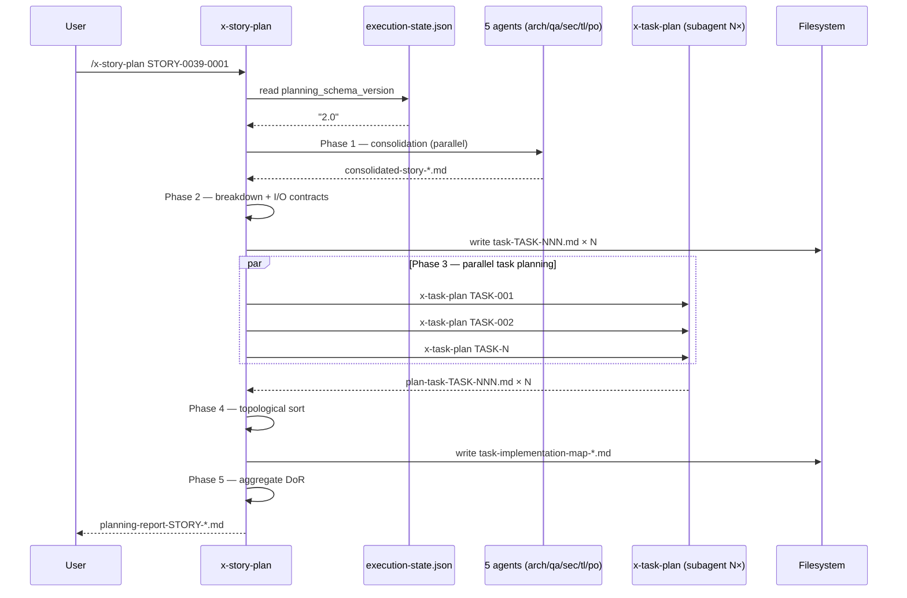
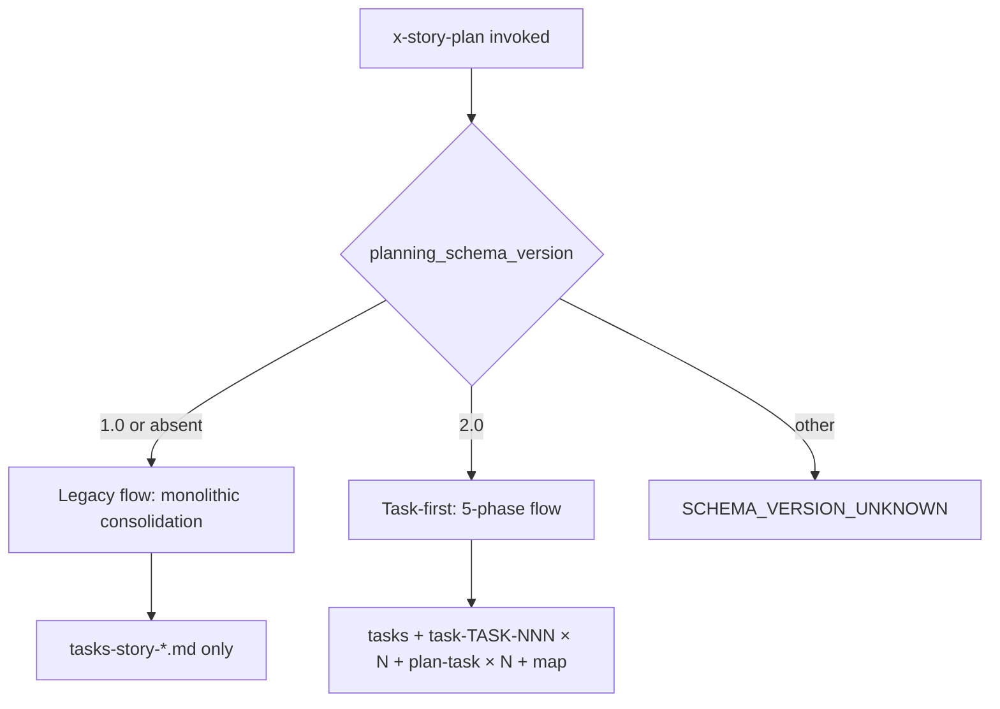

# História: `x-story-plan` invoca `x-task-plan` per task

**ID:** story-0038-0004
**Chave Jira:** —
**Status:** Pendente

## 1. Dependências

| Blocked By | Blocks |
| :--- | :--- |
| story-0038-0003 | — |

## 2. Regras Transversais Aplicáveis

| ID | Título |
| :--- | :--- |
| RULE-TF-01 | Task Testability |
| RULE-TF-02 | I/O Contracts Are Mandatory |
| RULE-TF-03 | Topological Execution |

## 3. Descrição

Como **platform engineer mantenedor do `ia-dev-env`**, eu quero que a skill `x-story-plan` invoque `x-task-plan` per task em paralelo (subagents) após a quebra em unidades atômicas, garantindo que cada task da story tenha seu próprio `plan-task-TASK-NNN.md` com TDD cycle detalhado e que o `task-implementation-map-STORY-*.md` seja gerado automaticamente a partir dos contratos I/O declarados.

Esta story fecha o ramo de **planning** do fluxo task-first. Até aqui (stories 0001-0003) temos o schema da task como artefato primário, o task-implementation-map e a skill `x-task-plan` callable. Agora `x-story-plan` deixa de ser monolítica e passa a ser um **consolidator + dispatcher**: mantém o multi-agent consolidation (architect, qa, security, tl, po) e adiciona três fases novas entre a consolidation e o DoR validation final — breakdown em tasks com I/O contracts, invocação paralela de `x-task-plan` per task, e geração do mapa topológico.

O comportamento legacy (v1) é **integralmente preservado** quando `execution-state.json` declara `planning_schema_version == "1.0"` (ou quando o flag está ausente). A skill detecta a versão no início e escolhe o flow: v1 → fluxo monolítico atual; v2 → fluxo task-first com as 5 phases descritas em §5.3 do spec. Isso é crítico porque o próprio EPIC-0038 roda em v1 durante sua execução (bootstrap).

### 3.1 Detecção de Schema Version

- Ler `plans/epic-XXXX/execution-state.json` no início de `x-story-plan`
- Se `planning_schema_version == "2.0"` → flow v2 (task-first)
- Se `planning_schema_version == "1.0"`, ausente, ou malformado → flow v1 (legacy)
- Falha com mensagem clara se valor for string não reconhecida (ex: `"3.0"`)

### 3.2 Fase 1 — Multi-Agent Consolidation (mantida)

- Comportamento idêntico ao atual: 5 subagents (architect, qa, security, tl, po) em paralelo
- Output consolidado em `consolidated-story-STORY-XXXX-YYYY.md` (como hoje)
- Mudança: seção "Tasks" do output agora é **preliminar** — será refinada em Phase 2

### 3.3 Fase 2 — Task Breakdown + I/O Contracts (NOVO)

- Partindo do consolidation output, gerar N tasks atômicas
- Para cada task, derivar inputs (pré-condições) e outputs (pós-condições) a partir dos consolidation notes
- Validar declaração de testabilidade (RULE-TF-01): `independently-testable | requires-mock | coalesced-with`
- Escrever `task-TASK-XXXX-YYYY-NNN.md` per task usando `_TEMPLATE-TASK.md` (criado em story-0038-0001)
- Rejeitar tasks sem contratos I/O completos (RULE-TF-02)

### 3.4 Fase 3 — Invoke `x-task-plan` per Task (NOVO)

- Para cada `task-TASK-NNN.md` gerado na Phase 2, invocar `x-task-plan TASK-XXXX-YYYY-NNN` como subagent
- Invocações são **paralelas** (batch size limit configurável, default 4 concurrent)
- Cada invocação produz `plan-task-TASK-XXXX-YYYY-NNN.md` (TDD cycle detalhado, test scenarios TPP-ordered)
- Falha em qualquer sub-plan aborta a story planning com relatório de falhas

### 3.5 Fase 4 — Generate `task-implementation-map-STORY-*.md` (NOVO)

- Ler todos os `task-TASK-NNN.md` gerados
- Construir grafo de dependências a partir dos campos `Depends on` (contrato I/O)
- Topological sort → computar waves paralelizáveis
- Detectar coalesced groups (tasks mutuamente recursivas)
- Escrever `task-implementation-map-STORY-XXXX-YYYY.md` usando `_TEMPLATE-TASK-IMPLEMENTATION-MAP.md`
- Falha se ciclo não-coalescível for detectado

### 3.6 Fase 5 — DoR Validation (mantida, estendida)

- Validar DoR global da story (como hoje)
- **Adicional em v2:** validar DoR per-task (todas as tasks READY)
- Resultado agregado: story só é READY se story-level DoR OK E todas as tasks READY

### 3.7 Artefatos Produzidos (v2 flow)

Além dos outputs atuais (tasks-story-*.md, planning report):
- `task-TASK-XXXX-YYYY-NNN.md` × N (um por task)
- `plan-task-TASK-XXXX-YYYY-NNN.md` × N (um por task)
- `task-implementation-map-STORY-XXXX-YYYY.md` × 1

## 3.5 Entrega de Valor

- **Valor Principal:** Planejamento de story passa a ser recursivo bottom-up — cada task tem plano próprio, contratos I/O explícitos e DoD per-task. Elimina o anti-pattern "tasks enterradas como sub-seção" do EPIC-0034 que causou 5 sintomas de drift.
- **Métrica de Sucesso:** Ao rodar `x-story-plan STORY-XXXX-YYYY` em schema v2, são gerados: 1 tasks-story-*.md + N task-TASK-NNN.md + N plan-task-TASK-NNN.md + 1 task-implementation-map. Tempo total ≤ 125% do baseline v1 (compensado por paralelização dos x-task-plan).
- **Impacto no Negócio:** Primeira story do próximo épico (dogfood pós-EPIC-0038) executa com TDD honesto per task. Scope drift entre stories cai para zero — tasks viram source-of-truth auto-contido.

## 4. Definições de Qualidade Locais

### DoR Local

- [ ] story-0038-0003 mergeada em develop (`x-task-plan` callable disponível)
- [ ] story-0038-0001 mergeada (`_TEMPLATE-TASK.md` disponível)
- [ ] story-0038-0002 mergeada (`_TEMPLATE-TASK-IMPLEMENTATION-MAP.md` disponível)
- [ ] Skill source em `java/src/main/resources/targets/claude/skills/x-story-plan/SKILL.md` lida integralmente
- [ ] Execution-state schema com `planning_schema_version` confirmado em story-0038-0008
- [ ] Branch `feature/story-0038-0004-story-plan-invokes-task-plan` criada a partir de `develop`

### DoD Local

- [ ] `x-story-plan/SKILL.md` refatorada com detecção de `planning_schema_version`
- [ ] Phase 1 (consolidation) mantida comportamentalmente idêntica
- [ ] Phases 2, 3, 4 implementadas e testadas (v2 only)
- [ ] Phase 5 (DoR) estendida para validar tasks em v2
- [ ] Legacy flow v1 coberto por teste de regressão (invoca `x-story-plan` com schema v1 e verifica output idêntico ao baseline)
- [ ] Integration test v2 verde (story de fixture → N tasks → N plans → map)
- [ ] Golden files regenerados (`mvn process-resources` + `GoldenFileRegenerator`)
- [ ] `mvn clean verify` verde
- [ ] PR aberto contra `develop` com label `epic-0038`

### Global Definition of Done (DoD)

- **Cobertura:** ≥ 95% line / ≥ 90% branch (ver Rule 05)
- **Testes Automatizados:** integration test v1 (regression) + integration test v2 (happy) + unit tests para detecção de schema version
- **Performance:** tempo total v2 ≤ 125% do baseline v1 (com paralelismo de 4 subagents)
- **Backward Compatibility:** épicos 0025-0037 continuam planejando sem erro (smoke em story-0038-0008)

## 5. Contratos de Dados

### 5.1 Parâmetros de Invocação

| Parâmetro | Tipo | M/O | Descrição |
| :--- | :--- | :--- | :--- |
| `<story-id>` | `String` | M | Identificador da story (ex: `STORY-0039-0001`) |
| `--batch-size` | `Integer` | O | Número máximo de `x-task-plan` paralelos (default: 4) |
| `--force-legacy` | `Flag` | O | Força flow v1 ignorando `planning_schema_version` (escape hatch de debug) |

### 5.2 Input: execution-state.json (trecho relevante)

```json
{
  "epic_id": "EPIC-0039",
  "planning_schema_version": "2.0",
  "stories": {
    "STORY-0039-0001": {
      "status": "PENDING",
      "dor_ready": false
    }
  }
}
```

### 5.3 Output: Arquivos gerados por story (v2 flow)

| Arquivo | Path | Formato | Origem |
| :--- | :--- | :--- | :--- |
| Story tasks (legacy) | `plans/epic-XXXX/plans/tasks-story-XXXX-YYYY.md` | Markdown | Phase 1+2 (consolidation summary) |
| Task artifact | `plans/epic-XXXX/plans/task-TASK-XXXX-YYYY-NNN.md` | Markdown | Phase 2 (N files) |
| Task plan | `plans/epic-XXXX/plans/plan-task-TASK-XXXX-YYYY-NNN.md` | Markdown | Phase 3 (N files via x-task-plan) |
| Implementation map | `plans/epic-XXXX/plans/task-implementation-map-STORY-XXXX-YYYY.md` | Markdown | Phase 4 (topological sort) |
| Planning report | `plans/epic-XXXX/reports/planning-report-STORY-XXXX-YYYY.md` | Markdown | Phase 5 (DoR agregado) |

### 5.4 Schema: planning-report-STORY-XXXX-YYYY.md (seções obrigatórias)

| Seção | Conteúdo |
| :--- | :--- |
| `## Schema Version` | `"2.0"` (task-first) ou `"1.0"` (legacy) |
| `## Story DoR` | status READY/NOT_READY + checklist |
| `## Tasks DoR Summary` | tabela N tasks × READY/NOT_READY |
| `## Topological Analysis` | wave count, max parallelism, coalesced groups |
| `## Aggregate Readiness` | story READY sse (story-DoR AND ∀tasks READY) |

### 5.5 Error Codes

| Code | Condição | Mensagem |
| :--- | :--- | :--- |
| `SCHEMA_VERSION_UNKNOWN` | `planning_schema_version` não é "1.0" ou "2.0" | "Unsupported planning_schema_version: {v}" |
| `TASK_IO_CONTRACT_MISSING` | Task sem inputs/outputs declarados (v2) | "TASK-{id} missing I/O contracts (RULE-TF-02)" |
| `TASK_TESTABILITY_MISSING` | Task sem declaração de testabilidade (v2) | "TASK-{id} missing testability declaration (RULE-TF-01)" |
| `TASK_PLAN_SUBAGENT_FAIL` | `x-task-plan` subagent retornou erro | "x-task-plan failed for TASK-{id}: {reason}" |
| `DEPENDENCY_CYCLE` | Ciclo não-coalescível no grafo | "Non-coalescible cycle detected: {tasks}" |

## 6. Diagramas

### 6.1 Fluxo v2 (task-first) — Sequência



### 6.2 Branch Legacy vs Task-First



## 7. Critérios de Aceite (Gherkin)

```gherkin
Cenario: Degenerate — execution-state sem planning_schema_version
  DADO que plans/epic-0038/execution-state.json não contém o campo planning_schema_version
  QUANDO x-story-plan STORY-0038-0004 é invocada
  ENTÃO a skill assume flow v1 (legacy)
  E nenhum task-TASK-NNN.md é gerado
  E o output é idêntico ao baseline pré-refactor
  E o planning-report declara "Schema Version: 1.0"

Cenario: Happy path — story v2 com 3 tasks paralelas
  DADO que execution-state.json declara planning_schema_version: "2.0"
  E a story tem 3 tasks atômicas derivadas da consolidation
  QUANDO x-story-plan STORY-0039-0001 é invocada
  ENTÃO 3 arquivos task-TASK-NNN.md são criados com I/O contracts completos
  E 3 arquivos plan-task-TASK-NNN.md são criados pelos subagents x-task-plan
  E task-implementation-map-STORY-0039-0001.md declara 1 wave com 3 tasks paralelas
  E o planning-report declara "Aggregate Readiness: READY"

Cenario: Error — task sem declaração de testabilidade
  DADO que execution-state.json declara planning_schema_version: "2.0"
  E uma task foi derivada sem preencher o campo Testabilidade
  QUANDO x-story-plan é invocada
  ENTÃO a skill falha com código TASK_TESTABILITY_MISSING
  E nenhum plan-task é gerado
  E a mensagem referencia RULE-TF-01
  E o planning-report declara "Aggregate Readiness: NOT_READY"

Cenario: Error — planning_schema_version não reconhecido
  DADO que execution-state.json declara planning_schema_version: "3.0"
  QUANDO x-story-plan é invocada
  ENTÃO a skill falha com código SCHEMA_VERSION_UNKNOWN
  E a mensagem lista os valores aceitos ("1.0", "2.0")

Cenario: Boundary — story com 1 task única (wave 1 singleton)
  DADO que execution-state.json declara planning_schema_version: "2.0"
  E a story decompõe em exatamente 1 task
  QUANDO x-story-plan é invocada
  ENTÃO 1 task-TASK-NNN.md e 1 plan-task-TASK-NNN.md são criados
  E task-implementation-map declara 1 wave com 1 task
  E nenhuma análise de paralelismo é reportada (singleton)

Cenario: Boundary — story com ciclo não-coalescível
  DADO que execution-state.json declara planning_schema_version: "2.0"
  E TASK-001 depende de TASK-002 e TASK-002 depende de TASK-001 sem coalesced declaration
  QUANDO x-story-plan é invocada
  ENTÃO a skill falha com código DEPENDENCY_CYCLE
  E a mensagem lista TASK-001 e TASK-002
  E sugere declaração coalesced-with como fix
```

### 7.1 Scenario Ordering (TPP)
Degenerate (sem flag) → happy (3 tasks) → error testabilidade → error schema → boundary singleton → boundary cycle.

### 7.2 Mandatory Scenario Categories
- [x] Degenerate (schema ausente)
- [x] Happy path (3 tasks paralelas)
- [x] Error paths (testabilidade, schema desconhecido)
- [x] Boundary (singleton, cycle)

## 8. Tasks

### TASK-0038-0004-001: Detecção de `planning_schema_version` + branching

- **Layer:** Config
- **Test Type:** Unit
- **Size:** S
- **Dependencies:** —
- **Branch:** `feat/task-0038-0004-001-schema-detection`
- **Testability:** Domain + UnitTest (independently-testable)
- **Files:**
  - `java/src/main/resources/targets/claude/skills/x-story-plan/SKILL.md`
  - `java/src/main/java/.../story/plan/SchemaVersionDetector.java`
  - `java/src/test/java/.../story/plan/SchemaVersionDetectorTest.java`
- **Acceptance Criteria:**
  - [ ] Detecta "1.0", ausente → v1
  - [ ] Detecta "2.0" → v2
  - [ ] Falha com SCHEMA_VERSION_UNKNOWN para outros valores
  - [ ] Unit tests cobrem 4 casos (1.0, ausente, 2.0, inválido)

### TASK-0038-0004-002: Phase 2 — Task breakdown + I/O contracts validator

- **Layer:** Application
- **Test Type:** Unit
- **Size:** M
- **Dependencies:** TASK-0038-0004-001
- **Branch:** `feat/task-0038-0004-002-task-breakdown`
- **Testability:** Domain + UnitTest (requires-mock: SchemaVersionDetector)
- **Files:**
  - `java/src/main/java/.../story/plan/TaskBreakdownPhase.java`
  - `java/src/main/java/.../story/plan/IoContractValidator.java`
  - `java/src/test/java/.../story/plan/TaskBreakdownPhaseTest.java`
- **Acceptance Criteria:**
  - [ ] Produz N task-TASK-NNN.md usando template
  - [ ] Rejeita task sem inputs/outputs (RULE-TF-02)
  - [ ] Rejeita task sem testabilidade (RULE-TF-01)

### TASK-0038-0004-003: Phase 3 — Invoke `x-task-plan` em paralelo

- **Layer:** Application
- **Test Type:** Integration
- **Size:** M
- **Dependencies:** TASK-0038-0004-002
- **Branch:** `feat/task-0038-0004-003-parallel-task-plan`
- **Testability:** Port + Adapter + IT (requires-mock: x-task-plan subagent stub)
- **Files:**
  - `java/src/main/java/.../story/plan/ParallelTaskPlanDispatcher.java`
  - `java/src/main/resources/targets/claude/skills/x-story-plan/SKILL.md`
  - `java/src/test/java/.../story/plan/ParallelTaskPlanDispatcherIT.java`
- **Acceptance Criteria:**
  - [ ] Invoca x-task-plan em batches de `--batch-size` (default 4)
  - [ ] Agrega resultados N plan-task-TASK-NNN.md
  - [ ] Aborta story planning em falha de subagent com TASK_PLAN_SUBAGENT_FAIL

### TASK-0038-0004-004: Phase 4 — Generate task-implementation-map

- **Layer:** Application
- **Test Type:** Unit
- **Size:** M
- **Dependencies:** TASK-0038-0004-002
- **Branch:** `feat/task-0038-0004-004-generate-map`
- **Testability:** Domain + UnitTest (independently-testable — reuso do TopologicalSort de story-0038-0002)
- **Files:**
  - `java/src/main/java/.../story/plan/ImplementationMapGenerator.java`
  - `java/src/test/java/.../story/plan/ImplementationMapGeneratorTest.java`
- **Acceptance Criteria:**
  - [ ] Produz task-implementation-map-STORY-*.md conforme template
  - [ ] Detecta coalesced groups
  - [ ] Falha com DEPENDENCY_CYCLE em ciclo não-coalescível

### TASK-0038-0004-005: Phase 5 — DoR aggregate (story + tasks)

- **Layer:** Application
- **Test Type:** Unit
- **Size:** S
- **Dependencies:** TASK-0038-0004-004
- **Branch:** `feat/task-0038-0004-005-dor-aggregate`
- **Testability:** Domain + UnitTest (independently-testable)
- **Files:**
  - `java/src/main/java/.../story/plan/AggregateDorValidator.java`
  - `java/src/test/java/.../story/plan/AggregateDorValidatorTest.java`
- **Acceptance Criteria:**
  - [ ] Story READY sse (story-DoR OK) AND (∀ tasks READY)
  - [ ] Planning report contém seção "Aggregate Readiness"

### TASK-0038-0004-006: Integration test E2E do flow v2

- **Layer:** Test
- **Test Type:** E2E
- **Size:** M
- **Dependencies:** TASK-0038-0004-001, 002, 003, 004, 005
- **Branch:** `feat/task-0038-0004-006-e2e-v2`
- **Testability:** UseCase + AT (acceptance test)
- **Files:**
  - `java/src/test/java/.../story/plan/StoryPlanV2E2ETest.java`
  - `java/src/test/resources/fixtures/story-v2-3-tasks/`
- **Acceptance Criteria:**
  - [ ] Fixture story com 3 tasks → 3 task-TASK-NNN.md + 3 plan-task-NNN.md + 1 map
  - [ ] Planning-report declara Aggregate Readiness: READY
  - [ ] Tempo total ≤ 125% do baseline v1

### TASK-0038-0004-007: Regression test flow v1 (legacy)

- **Layer:** Test
- **Test Type:** Integration
- **Size:** S
- **Dependencies:** TASK-0038-0004-001
- **Branch:** `feat/task-0038-0004-007-legacy-regression`
- **Testability:** UseCase + AT
- **Files:**
  - `java/src/test/java/.../story/plan/StoryPlanV1RegressionTest.java`
- **Acceptance Criteria:**
  - [ ] Story com `planning_schema_version: "1.0"` produz output idêntico ao baseline
  - [ ] Zero task-TASK-NNN.md gerados
  - [ ] Zero plan-task-NNN.md gerados
