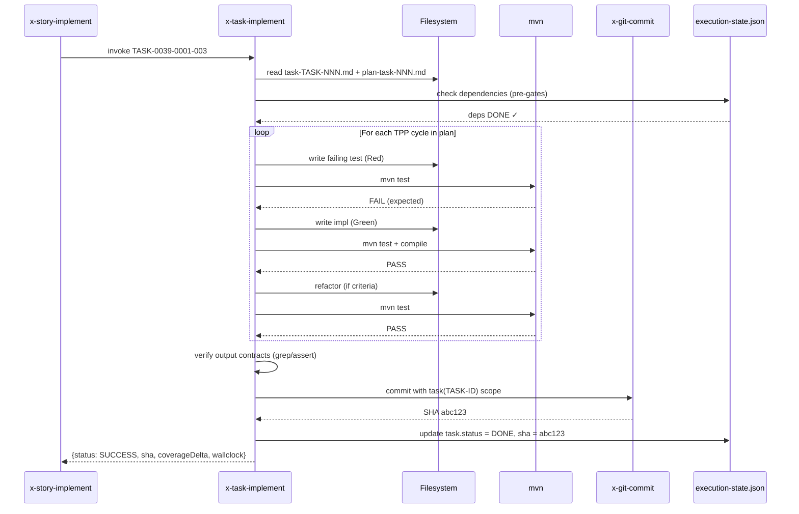
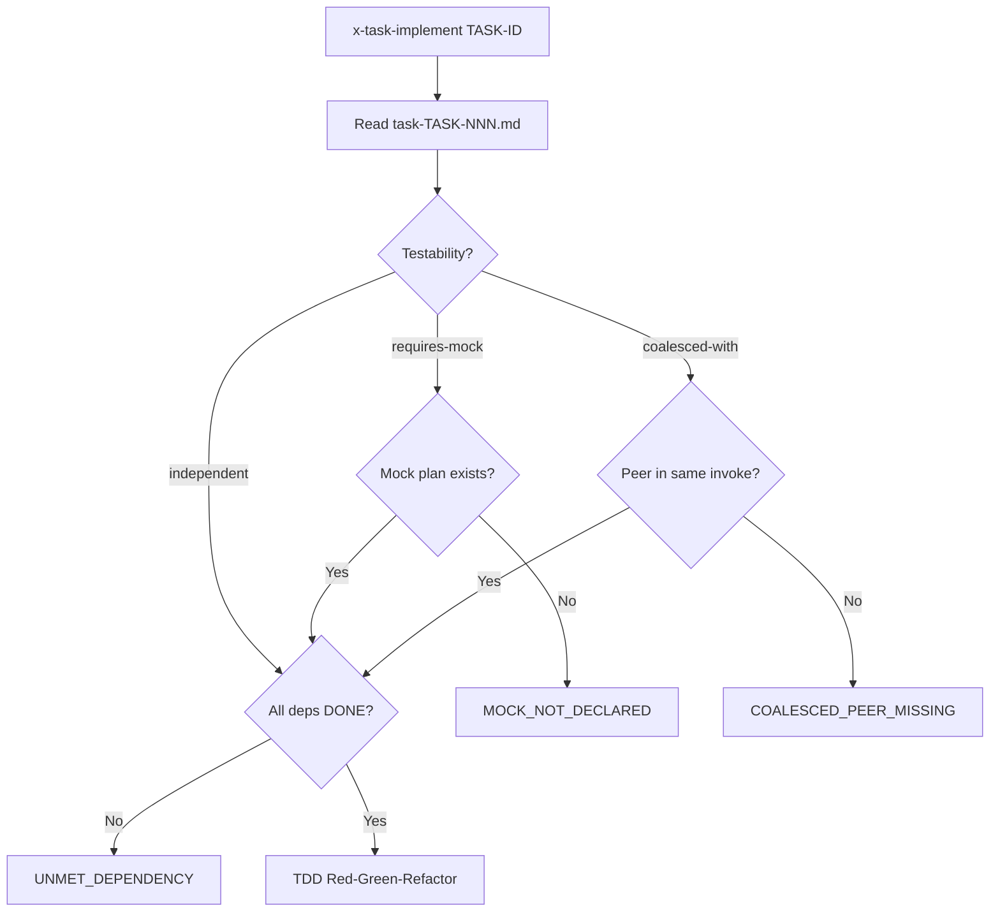

# História: `x-task-implement` refatorada (lê task contracts)

**ID:** story-0038-0005
**Chave Jira:** —
**Status:** Concluída

## 1. Dependências

| Blocked By | Blocks |
| :--- | :--- |
| story-0038-0001, story-0038-0002 | story-0038-0006 |

## 2. Regras Transversais Aplicáveis

| ID | Título |
| :--- | :--- |
| RULE-TF-01 | Task Testability |
| RULE-TF-02 | I/O Contracts Are Mandatory |
| RULE-TF-04 | Task Commits Are Atomic |

## 3. Descrição

Como **subagent executor** invocado por `x-story-implement`, eu quero que a skill `x-task-implement` leia `task-TASK-XXXX-YYYY-NNN.md` (contratos I/O + testabilidade + DoD), respeite o `task-implementation-map-STORY-*.md` para honrar dependências declaradas, e execute TDD honesto per task (Red → Green → Refactor → commit atômico), garantindo que cada task do schema v2 seja uma unidade de trabalho auto-contida, independentemente verificável e bisect-friendly.

**Esta é uma story de refactor comportamental**, não de criação de skill. A skill já existe no codebase (atualmente `x-dev-implement`, renomeada para `x-task-implement` pelo EPIC-0036 per ADR-0003 §"Primary cluster"). A ADR-0003 já confirma que a skill executa "one task (TDD loop)"; este épico FORMALIZA o contrato I/O que a task deve declarar e que a skill deve honrar. Por isso a dependência dura de EPIC-0036 estar mergeado em develop antes do start (DoR Local bloqueante).

Em schema v1 (legacy), a skill continua executando como hoje — lê a task da `tasks-story-*.md` seção de tasks e roda TDD. Em schema v2 (task-first), a skill lê `task-TASK-NNN.md` (arquivo próprio), valida pré-condições (outras tasks já DONE conforme map), roda Red-Green-Refactor, valida pós-condições via grep/assert dos outputs declarados, e produz um único commit atômico usando `x-git-commit` com escopo `task(TASK-XXXX-YYYY-NNN)`.

### 3.1 Detecção de Schema Version (reusa de story-0038-0004)

- Lê `execution-state.json` → `planningSchemaVersion`
- v1 → comportamento legacy (flow atual de `x-dev-implement` pós-rename)
- v2 → novo flow task-first descrito abaixo

### 3.2 Input Resolution (v2)

- Parâmetro: `<task-id>` (ex: `TASK-0039-0001-003`)
- Resolve paths:
  - `plans/epic-XXXX/plans/task-TASK-XXXX-YYYY-NNN.md` (task artifact)
  - `plans/epic-XXXX/plans/plan-task-TASK-XXXX-YYYY-NNN.md` (TDD plan)
  - `plans/epic-XXXX/plans/task-implementation-map-STORY-XXXX-YYYY.md` (dep map)
- Valida existência de todos — falha com TASK_ARTIFACT_NOT_FOUND se ausente

### 3.3 Pre-Execution Gates (v2)

- Ler `task-TASK-NNN.md` → parsear campos `Depends on` e `Testability`
- Para cada dependência declarada: consultar `execution-state.json` → verificar status DONE
- Se dependência não-DONE e não-mockável → falhar com UNMET_DEPENDENCY
- Se testabilidade = `requires-mock` → verificar que mock file existe no plan
- Se testabilidade = `coalesced-with` → verificar que o outro task está sendo executado no mesmo invoke

### 3.4 TDD Loop (v2) — Red, Green, Refactor

- Ler `plan-task-TASK-NNN.md` (produzido por `x-task-plan`)
- Para cada cycle do plan, em ordem TPP:
  - **Red:** escrever teste falhando; `mvn test` deve falhar com a assertion esperada
  - **Green:** implementar minimum código; `mvn test` passa; `mvn compile` verde
  - **Refactor:** aplicar refactor se critério do plan acionar (método > 25 LOC, duplicação, etc.); testes permanecem verdes
- Log de cada fase em `plans/epic-XXXX/reports/tdd-log-TASK-XXXX-YYYY-NNN.md`

### 3.5 Post-Execution Verification (v2)

- Para cada output declarado em `task-TASK-NNN.md` §"Outputs":
  - Se output é "classe X criada" → grep por X no código
  - Se output é "teste Y passa" → rodar `mvn test -Dtest=Y`
  - Se output é "método Z alterado" → git diff mostra alteração
- Se qualquer verificação falhar → abortar antes do commit com código OUTPUT_CONTRACT_VIOLATION

### 3.6 Atomic Commit (RULE-TF-04)

- Invocar `x-git-commit` com:
  - Escopo: `task(TASK-XXXX-YYYY-NNN)`
  - Tipo: derivado do plan (feat, fix, refactor, test, etc.)
  - Body: referencia task artifact + summary do TDD cycle
- Para coalesced groups: commit único com footer `Coalesces-with: TASK-AAA, TASK-BBB`
- Pre-commit chain: format → lint → compile (RULE-007)

### 3.7 Status Report

- Atualizar `execution-state.json` → `tasks[TASK-ID].status = "DONE"` + SHA do commit
- Retornar estrutura `{status, sha, coverageDelta, wallclockMs}` ao caller (x-story-implement)

## 3.5 Entrega de Valor

- **Valor Principal:** TDD honesto per task vira realidade. Sintoma 3 do EPIC-0034 ("TDD falso — TASK-001 + TASK-002 coalescidas porque TASK-001 sozinha não compila") é impossível em v2: contratos I/O declarados + testabilidade explícita força a declaração up-front de "esta task é independent" vs "precisa ser coalesced-with outra".
- **Métrica de Sucesso:** Em uma story v2 com N tasks não-coalescíveis, cada task produz 1 commit atômico com (a) teste Red→Green→Refactor no histórico git, (b) build verde no SHA, (c) outputs declarados verificados via grep/assert. Tempo de execução ≤ 110% do baseline v1 per task.
- **Impacto no Negócio:** Bisect-ability perfeita (cada commit de task é checkpoint estável). Review per-task fica viável (diff escopado). Coverage regression detectável per-task (não mais no nível da story como causou o revert em story-0034-0004).

## 4. Definições de Qualidade Locais

### DoR Local

- [ ] **EPIC-0036 stories 0036-0001..0006 mergeadas em develop** (pré-requisito duro — skill `x-dev-implement` renomeada para `x-task-implement`)
- [ ] story-0038-0001 mergeada (schema `task-TASK-NNN.md` disponível)
- [ ] story-0038-0002 mergeada (`task-implementation-map-STORY-*.md` disponível)
- [ ] `planningSchemaVersion` detectable em `execution-state.json` (story-0038-0008 não precisa estar mergeada, mas a feature flag deve existir)
- [ ] Skill source em `java/src/main/resources/targets/claude/skills/x-task-implement/SKILL.md` lida integralmente (pós-rename)
- [ ] Branch `feature/story-0038-0005-task-implement-contracts` criada a partir de `develop`

### DoD Local

- [ ] `x-task-implement/SKILL.md` refatorada com detecção de schema version
- [ ] Legacy flow v1 preservado e coberto por regression test
- [ ] v2 flow implementa: input resolution, pre-gates, TDD loop, post-verification, atomic commit, status report
- [ ] Output contract verification via grep/assert implementada
- [ ] Coalesced groups commit com `Coalesces-with:` footer
- [ ] Integration test v2 verde (task fixture → Red-Green-Refactor → commit + status update)
- [ ] `mvn clean verify` verde + coverage ≥ 95%/90%
- [ ] PR aberto contra `develop` com label `epic-0038`

### Global Definition of Done (DoD)

- **Cobertura:** ≥ 95% line / ≥ 90% branch
- **Testes Automatizados:** unit tests (pre-gates, output verification, commit formatter) + integration test (TDD loop end-to-end) + regression test (v1 legacy)
- **Performance:** ≤ 110% do baseline v1 per task
- **Backward Compatibility:** épicos 0025-0037 continuam executando via legacy loader

## 5. Contratos de Dados

### 5.1 Parâmetros de Invocação

| Parâmetro | Tipo | M/O | Descrição |
| :--- | :--- | :--- | :--- |
| `<task-id>` | `String` | M | Ex: `TASK-0039-0001-003` |
| `--dry-run` | `Flag` | O | Roda pre-gates e TDD mas não commita |
| `--force-legacy` | `Flag` | O | Força flow v1 ignorando schema version |

### 5.2 Input: task-TASK-NNN.md (campos lidos)

| Seção | Campo | Uso |
| :--- | :--- | :--- |
| §1 Objetivo | — | Log no TDD report |
| §2 Contratos I/O → Inputs | Lista pre-condições | Validadas pelos pre-gates |
| §2 Contratos I/O → Outputs | Lista pos-condições | Verificadas post-execution |
| §2 Testabilidade | `independent \| requires-mock \| coalesced-with` | Decide gate de execução |
| §3 Definition of Done | Checklist | Verificado no post-execution |
| §4 Dependências | Tabela TASK-ID × relação | Consultada contra execution-state |

### 5.3 Input: execution-state.json (trecho consumido)

```json
{
  "planningSchemaVersion": "2.0",
  "tasks": {
    "TASK-0039-0001-001": { "status": "DONE", "sha": "abc123" },
    "TASK-0039-0001-002": { "status": "IN_PROGRESS" },
    "TASK-0039-0001-003": { "status": "PENDING" }
  }
}
```

### 5.4 Output: Status report (retorno estruturado)

| Campo | Tipo | Sempre presente | Descrição |
| :--- | :--- | :--- | :--- |
| `task_id` | `String` | Sim | TASK ID processada |
| `status` | `Enum(DONE\|FAILED\|SKIPPED)` | Sim | Resultado final |
| `commit_sha` | `String` | Não (ausente em FAILED/SKIPPED) | SHA do commit atômico |
| `coverageDelta` | `{line: float, branch: float}` | Sim | Δ de cobertura vs pré-execution |
| `wallclockMs` | `Integer` | Sim | Tempo total de execução |
| `tdd_cycles` | `List[{phase, test, duration_ms}]` | Sim | Log do Red-Green-Refactor |

### 5.5 Output: Commit message (formato)

```
<type>(task(TASK-XXXX-YYYY-NNN)): <subject>

<body — referencia task artifact + TDD cycle summary>

Refs: plans/epic-XXXX/plans/task-TASK-XXXX-YYYY-NNN.md
[Coalesces-with: TASK-AAA, TASK-BBB]  ← só em coalesced groups
```

### 5.6 Error Codes

| Code | Condição | Mensagem |
| :--- | :--- | :--- |
| `TASK_ARTIFACT_NOT_FOUND` | `task-TASK-NNN.md` ausente (v2) | "Task artifact not found: {path}" |
| `UNMET_DEPENDENCY` | Dependência não-DONE e não-mockável | "TASK-{id} depends on TASK-{dep} (status: {s})" |
| `MOCK_NOT_DECLARED` | `requires-mock` sem plan de mock | "TASK-{id} testability=requires-mock but no mock plan" |
| `OUTPUT_CONTRACT_VIOLATION` | Output declarado não verificado | "Output '{out}' not observable after execution" |
| `TDD_CYCLE_FAILED` | Red/Green/Refactor falhou | "TDD {phase} failed: {reason}" |

## 6. Diagramas

### 6.1 TDD Loop v2 — Sequência



### 6.2 Pre-Gates Decision Tree



## 7. Critérios de Aceite (Gherkin)

```gherkin
Cenario: Degenerate — task artifact ausente em v2
  DADO que execution-state.json declara planningSchemaVersion: "2.0"
  E o arquivo task-TASK-0039-0001-003.md não existe
  QUANDO x-task-implement TASK-0039-0001-003 é invocada
  ENTÃO a skill falha com código TASK_ARTIFACT_NOT_FOUND
  E nenhum commit é criado

Cenario: Happy path — task independente com Red-Green-Refactor completo
  DADO que task-TASK-0039-0001-001.md declara testability: independent
  E não há dependências não-mockáveis
  E plan-task-0039-0001-001.md declara 2 TDD cycles
  QUANDO x-task-implement TASK-0039-0001-001 é invocada
  ENTÃO 2 ciclos Red-Green-Refactor são executados
  E todos os outputs declarados passam na verificação grep/assert
  E um commit atômico é criado com escopo task(TASK-0039-0001-001)
  E execution-state.json é atualizado com status DONE e SHA

Cenario: Error — dependência não satisfeita
  DADO que task-TASK-0039-0001-003.md declara Depends on: TASK-0039-0001-001
  E execution-state.json mostra TASK-0039-0001-001.status = PENDING
  QUANDO x-task-implement TASK-0039-0001-003 é invocada
  ENTÃO a skill falha com código UNMET_DEPENDENCY
  E a mensagem cita TASK-0039-0001-001 e seu status

Cenario: Error — output contract violation
  DADO que task-TASK-0039-0001-002.md declara output "classe FooAssembler criada"
  E o TDD cycle completa sem criar FooAssembler
  QUANDO x-task-implement TASK-0039-0001-002 é invocada
  ENTÃO grep por FooAssembler retorna vazio no post-verification
  E a skill falha com código OUTPUT_CONTRACT_VIOLATION antes do commit
  E execution-state.json mostra status FAILED

Cenario: Boundary — coalesced group commit único
  DADO que TASK-0039-0001-004 declara coalesced-with: TASK-0039-0001-005
  E ambas tasks são invocadas juntas
  QUANDO x-task-implement processa o grupo coalescido
  ENTÃO um único commit é criado
  E o footer do commit contém "Coalesces-with: TASK-0039-0001-005"
  E execution-state.json atualiza ambas tasks para DONE com o mesmo SHA

Cenario: Boundary — schema v1 legacy path preservado
  DADO que execution-state.json não declara planningSchemaVersion
  QUANDO x-task-implement é invocada no modo legacy
  ENTÃO o flow antigo (lê tasks-story-*.md seção de tasks) executa
  E nenhum post-verification via contracts é rodado
  E o output é idêntico ao baseline pré-refactor
```

### 7.1 Scenario Ordering (TPP)
Degenerate (artifact ausente) → happy (independente) → error (deps) → error (output) → boundary (coalesced) → boundary (legacy).

### 7.2 Mandatory Scenario Categories
- [x] Degenerate (artifact ausente)
- [x] Happy path (TDD completo)
- [x] Error paths (UNMET_DEPENDENCY, OUTPUT_CONTRACT_VIOLATION)
- [x] Boundary (coalesced group, legacy v1)

## 8. Tasks

### TASK-0038-0005-001: Schema version detection na skill `x-task-implement`

- **Layer:** Config
- **Test Type:** Unit
- **Size:** S
- **Dependencies:** —
- **Branch:** `feat/task-0038-0005-001-schema-detect`
- **Testability:** Domain + UnitTest (independently-testable)
- **Files:**
  - `java/src/main/resources/targets/claude/skills/x-task-implement/SKILL.md`
  - `java/src/main/java/.../task/impl/TaskSchemaRouter.java`
  - `java/src/test/java/.../task/impl/TaskSchemaRouterTest.java`
- **Acceptance Criteria:**
  - [ ] Roteia para v1 ou v2 baseado em planningSchemaVersion
  - [ ] `--force-legacy` override funciona

### TASK-0038-0005-002: Input resolution + pre-gates (dependencies, testability)

- **Layer:** Application
- **Test Type:** Unit
- **Size:** M
- **Dependencies:** TASK-0038-0005-001
- **Branch:** `feat/task-0038-0005-002-pre-gates`
- **Testability:** Domain + UnitTest (independently-testable)
- **Files:**
  - `java/src/main/java/.../task/impl/TaskPreGateValidator.java`
  - `java/src/test/java/.../task/impl/TaskPreGateValidatorTest.java`
- **Acceptance Criteria:**
  - [ ] UNMET_DEPENDENCY para dep não-DONE
  - [ ] MOCK_NOT_DECLARED para requires-mock sem mock plan
  - [ ] TASK_ARTIFACT_NOT_FOUND quando arquivo ausente
  - [ ] 6 unit tests cobrindo cada branch

### TASK-0038-0005-003: TDD loop runner + TPP cycle orchestration

- **Layer:** Application
- **Test Type:** Integration
- **Size:** L
- **Dependencies:** TASK-0038-0005-002
- **Branch:** `feat/task-0038-0005-003-tdd-loop`
- **Testability:** Port + Adapter + IT (requires-mock: mvn runner port)
- **Files:**
  - `java/src/main/java/.../task/impl/TddLoopRunner.java`
  - `java/src/main/java/.../task/impl/port/MvnRunnerPort.java`
  - `java/src/test/java/.../task/impl/TddLoopRunnerIT.java`
- **Acceptance Criteria:**
  - [ ] Red → Green → Refactor em ordem per cycle
  - [ ] Refactor só roda se plan criteria acionar
  - [ ] Log em tdd-log-TASK-NNN.md

### TASK-0038-0005-004: Output contract verification

- **Layer:** Application
- **Test Type:** Unit
- **Size:** M
- **Dependencies:** TASK-0038-0005-003
- **Branch:** `feat/task-0038-0005-004-output-verify`
- **Testability:** Domain + UnitTest (independently-testable)
- **Files:**
  - `java/src/main/java/.../task/impl/OutputContractVerifier.java`
  - `java/src/test/java/.../task/impl/OutputContractVerifierTest.java`
- **Acceptance Criteria:**
  - [ ] grep/assert/test execution per output type
  - [ ] OUTPUT_CONTRACT_VIOLATION com referência ao output não verificado

### TASK-0038-0005-005: Atomic commit integration (invoca x-git-commit)

- **Layer:** Adapter
- **Test Type:** Integration
- **Size:** M
- **Dependencies:** TASK-0038-0005-004
- **Branch:** `feat/task-0038-0005-005-atomic-commit`
- **Testability:** Port + Adapter + IT (requires-mock: x-git-commit subagent)
- **Files:**
  - `java/src/main/java/.../task/impl/TaskCommitAdapter.java`
  - `java/src/test/java/.../task/impl/TaskCommitAdapterIT.java`
- **Acceptance Criteria:**
  - [ ] Escopo `task(TASK-ID)` no commit subject
  - [ ] Coalesced-with footer em coalesced groups
  - [ ] execution-state.json atualizado com SHA

### TASK-0038-0005-006: E2E integration test (fixture task → commit + state update)

- **Layer:** Test
- **Test Type:** E2E
- **Size:** M
- **Dependencies:** TASK-0038-0005-001, 002, 003, 004, 005
- **Branch:** `feat/task-0038-0005-006-e2e`
- **Testability:** UseCase + AT
- **Files:**
  - `java/src/test/java/.../task/impl/TaskImplementV2E2ETest.java`
  - `java/src/test/resources/fixtures/task-v2-independent/`
- **Acceptance Criteria:**
  - [ ] Fixture task independent → commit + status DONE
  - [ ] Fixture task coalesced → único commit + Coalesces-with
  - [ ] Coverage ≥ 95%/90%

### TASK-0038-0005-007: Regression test flow v1 legacy

- **Layer:** Test
- **Test Type:** Integration
- **Size:** S
- **Dependencies:** TASK-0038-0005-001
- **Branch:** `feat/task-0038-0005-007-legacy-regression`
- **Testability:** UseCase + AT
- **Files:**
  - `java/src/test/java/.../task/impl/TaskImplementV1RegressionTest.java`
- **Acceptance Criteria:**
  - [ ] v1 flow produz output idêntico ao baseline
  - [ ] Zero leitura de task-TASK-NNN.md em v1
