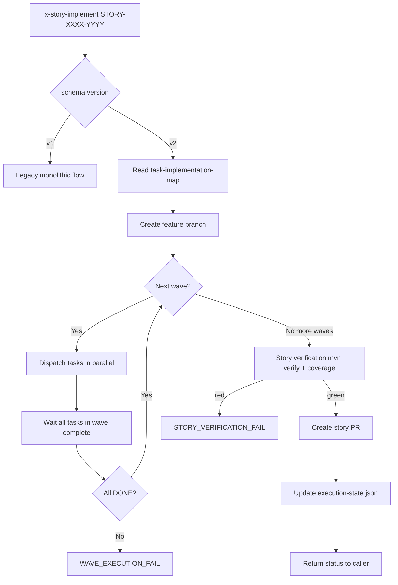

# História: `x-story-implement` orquestra tasks via map

**ID:** story-0038-0006
**Chave Jira:** —
**Status:** Concluída

## 1. Dependências

| Blocked By | Blocks |
| :--- | :--- |
| story-0038-0005 | story-0038-0007 |

## 2. Regras Transversais Aplicáveis

| ID | Título |
| :--- | :--- |
| RULE-TF-03 | Topological Execution |
| RULE-TF-04 | Task Commits Are Atomic |

## 3. Descrição

Como **orquestrador de story**, eu quero que `x-story-implement` leia `task-implementation-map-STORY-XXXX-YYYY.md` e dispache tasks em ordem topológica respeitando paralelismo declarado em waves, invocando `x-task-implement` per task em cada wave, executando story verification (all tasks DONE + integration green) ao final, e abrindo UM PR por story que agrega os commits atômicos de todas as tasks, garantindo que o anti-pattern "coalesce ad-hoc" observado no EPIC-0034 desapareça e que a execução vire determinística a partir do map.

Esta é uma story de **refactor comportamental** de `x-story-implement` (pós-rename de `x-dev-story-implement` pelo EPIC-0036). Em schema v1 (legacy), a skill continua com seu comportamento atual — despacha a story como uma unidade monolítica e o TDD acontece dentro de um único ciclo. Em schema v2, a skill deixa de orquestrar diretamente o TDD e passa a ser um **wave dispatcher**: para cada wave do map, invoca `x-task-implement` per task (paralelizando dentro da wave quando possível), agrega resultados, procede para próxima wave.

A eliminação do coalesce ad-hoc é o ganho principal. No EPIC-0034, TASK-001 e TASK-002 foram coalesced durante a execução porque TASK-001 sozinha quebrava o build — decisão tomada mid-flight sem visibilidade up-front. Em v2, isso é impossível: ou a task declara `coalesced-with` no seu `task-TASK-NNN.md` (gerado por `x-story-plan` em story-0038-0004), ou a execução respeita a granularidade original. Coalesce mid-flight passa a ser erro de planejamento detectável.

### 3.1 Detecção de Schema Version

- Lê `execution-state.json` → `planningSchemaVersion`
- v1 → flow legacy (monolítico, igual ao atual)
- v2 → novo flow wave-based descrito abaixo

### 3.2 Map Resolution (v2)

- Parâmetro: `<story-id>` (ex: `STORY-0039-0001`)
- Lê `plans/epic-XXXX/plans/task-implementation-map-STORY-XXXX-YYYY.md`
- Parseia seções: Execution Order (waves), Coalesced Groups, Parallelism Analysis
- Falha com MAP_NOT_FOUND se ausente em v2 (RULE-TF-03)

### 3.3 Branch Creation + Worktree (reusa x-git-worktree)

- Cria branch `feature/story-XXXX-YYYY` a partir de `develop`
- Opcionalmente cria worktree via `/x-git-worktree create --identifier story-XXXX-YYYY` (RULE-018)
- Todas as tasks da story commitam nesta branch

### 3.4 Wave-Based Dispatch Loop

- Para cada wave do map, em ordem:
  - Identificar tasks da wave (podem ser paralelas)
  - Separar tasks standalone de coalesced groups
  - Dispachar em paralelo (subagent per task) respeitando `--wave-parallelism` (default 4)
  - Para coalesced groups: invocar `x-task-implement` uma vez listando todo o grupo
  - Aguardar conclusão de toda a wave antes de prosseguir
  - Se qualquer task na wave falha → abort com WAVE_EXECUTION_FAIL (tasks DONE anteriores são preservadas)

### 3.5 Story Verification Gate

- Após todas as waves completarem:
  - Verificar `execution-state.json`: todas as tasks da story têm status SUCCESS
  - Rodar `mvn clean verify` no estado final da branch → espera verde
  - Checar coverage agregado da story: ≥ 95% line / ≥ 90% branch
  - Rodar integration tests relevantes (smoke se projeto tem `testing.smoke_tests == true`)
- Se qualquer gate falha → atualizar story status para FAILED, não abrir PR

### 3.6 Story PR Creation

- Invocar `x-pr-create` (ou handler equivalente) para abrir PR
- Título: `feat(story-XXXX-YYYY): {story title}`
- Body: lista commits atômicos agrupados por wave + link aos artifacts (tasks-story, task-implementation-map, planning-report)
- Labels: `epic-XXXX`, `story`
- Target branch: `develop`

### 3.7 Status Report

- Atualizar `execution-state.json` → `stories["story-XXXX-YYYY"].status = "SUCCESS"` + `prNumber`/`prUrl`/`prMergeStatus`
- Retornar estrutura `{status, prUrl, tasksDone, coverageDelta, wallclockMs}` ao caller (x-epic-implement)

## 3.5 Entrega de Valor

- **Valor Principal:** Execução de story vira determinística e escalável. Waves paralelas realizam o potencial de paralelismo identificado pelo topological sort (story-0038-0002). Coalesce ad-hoc do EPIC-0034 fica impossível — decisões de coalesce viram parte do planning, não da execution.
- **Métrica de Sucesso:** Ao rodar `x-story-implement STORY-XXXX-YYYY` em v2 contra fixture com 3 tasks (2 paralelas na wave 1, 1 na wave 2): execução completa em ≤ 65% do tempo sequencial equivalente + 1 PR aberto com 3 commits atômicos + coverage agregado ≥ 95%/90%. Meta do épico: ≥ 30% das stories pós-dogfood têm ≥ 2 tasks paralelas.
- **Impacto no Negócio:** Tempo de ciclo por story cai. Revisores recebem 1 PR com commits bisect-friendly (um por task). Debugging de regressão fica mais fácil — cada commit é checkpoint estável com output contract verificado.

## 4. Definições de Qualidade Locais

### DoR Local

- [ ] story-0038-0005 mergeada em develop (`x-task-implement` v2 disponível)
- [ ] **EPIC-0036 stories 0036-0001..0006 mergeadas em develop** (pré-requisito duro — skill renomeada para `x-story-implement`)
- [ ] story-0038-0002 mergeada (`task-implementation-map-STORY-*.md` schema)
- [ ] Skill source em `java/src/main/resources/targets/claude/skills/x-story-implement/SKILL.md` lida integralmente (pós-rename)
- [ ] Decisão sobre worktree per story confirmada (reusa `x-git-worktree`)
- [ ] Branch `feature/story-0038-0006-story-implement-waves` criada a partir de `develop`

### DoD Local

- [ ] `x-story-implement/SKILL.md` refatorada com wave dispatcher
- [ ] Legacy flow v1 preservado e coberto por regression test
- [ ] v2 flow: map resolution, wave dispatch, story verification, PR creation
- [ ] Coalesced groups dispachados como unidade única (1 invoke de x-task-implement para o grupo)
- [ ] `WAVE_EXECUTION_FAIL` aborta execução preservando tasks DONE
- [ ] Integration test v2 verde (story fixture com 2 waves → 3 commits + 1 PR)
- [ ] `mvn clean verify` verde
- [ ] PR aberto contra `develop` com label `epic-0038`

### Global Definition of Done (DoD)

- **Cobertura:** ≥ 95% line / ≥ 90% branch
- **Testes Automatizados:** unit (map parser, wave scheduler) + integration (wave dispatch) + E2E (story → PR) + regression (v1 legacy)
- **Performance:** story com 2 tasks paralelizáveis executa em ≤ 65% do tempo sequencial
- **Backward Compatibility:** épicos 0025-0037 continuam via legacy loader

## 5. Contratos de Dados

### 5.1 Parâmetros de Invocação

| Parâmetro | Tipo | M/O | Descrição |
| :--- | :--- | :--- | :--- |
| `<story-id>` | `String` | M | Ex: `STORY-0039-0001` |
| `--wave-parallelism` | `Integer` | O | Máx tasks paralelas por wave (default: 4) |
| `--no-pr` | `Flag` | O | Executa mas não abre PR (debug) |
| `--worktree` | `Flag` | O | Opt-in: cria worktree (RULE-018) |
| `--force-legacy` | `Flag` | O | Força flow v1 |

### 5.2 Input: task-implementation-map-STORY-XXXX-YYYY.md (seções consumidas)

| Seção | Formato | Uso |
| :--- | :--- | :--- |
| `## Execution Order` | Tabela Wave × Tasks × Blocks | Define ordem de dispatch |
| `## Coalesced Groups` | Lista de `(TASK-A, TASK-B): justificativa` | Agrupa invokes |
| `## Parallelism Analysis` | Texto livre com estimativa | Informativo (log) |

### 5.3 Output: execution-state.json (atualização)

```json
{
  "version": "2.0",
  "planningSchemaVersion": "2.0",
  "stories": {
    "story-0039-0001": {
      "id": "story-0039-0001",
      "status": "SUCCESS",
      "prUrl": "https://github.com/.../pull/345",
      "prMergeStatus": "MERGED",
      "startedAt": "2026-04-13T10:00:00Z",
      "finishedAt": "2026-04-13T10:25:00Z",
      "wavesExecuted": 2,
      "tasksDone": ["TASK-0039-0001-001", "TASK-0039-0001-002", "TASK-0039-0001-003"]
    }
  }
}
```

> **Schema alinhado:** chaves em camelCase, enum `status` ∈ `PENDING | IN_PROGRESS | SUCCESS | DEFERRED | FAILED`, `prMergeStatus` ∈ `MERGED | OPEN | CLOSED`. Compatível com o formato real já em uso por épicos 0025–0037.

### 5.4 Output: PR body template

```markdown
## Story: {story_title}

**Story ID:** STORY-XXXX-YYYY
**Epic:** EPIC-XXXX
**Schema:** v2 (task-first)

## Tasks Executed (by wave)

### Wave 1 (parallel)
- `TASK-XXXX-YYYY-001`: {subject} — {sha}
- `TASK-XXXX-YYYY-002`: {subject} — {sha}

### Wave 2
- `TASK-XXXX-YYYY-003`: {subject} — {sha}

## Artifacts
- [task-implementation-map](../plans/epic-XXXX/plans/task-implementation-map-STORY-XXXX-YYYY.md)
- [planning-report](../plans/epic-XXXX/reports/planning-report-STORY-XXXX-YYYY.md)

## Coverage Delta
- Line: +{delta}% (final: {final}%)
- Branch: +{delta}% (final: {final}%)
```

### 5.5 Error Codes

| Code | Condição | Mensagem |
| :--- | :--- | :--- |
| `MAP_NOT_FOUND` | `task-implementation-map-*.md` ausente em v2 | "Map required for schema v2: {path}" |
| `MAP_PARSE_ERROR` | Seções obrigatórias ausentes/malformadas | "Failed to parse map section: {section}" |
| `WAVE_EXECUTION_FAIL` | 1+ task da wave falhou | "Wave {n} failed: {failed_tasks}" |
| `STORY_VERIFICATION_FAIL` | mvn verify red ou coverage baixo | "Story verification failed: {reason}" |
| `PR_CREATION_FAIL` | `x-pr-create` retornou erro | "PR creation failed: {reason}" |

## 6. Diagramas

### 6.1 Wave-Based Dispatch — Flowchart



### 6.2 Sequence: 2-wave dispatch

```mermaid
sequenceDiagram
    participant EI as x-epic-implement
    participant SI as x-story-implement
    participant TI1 as x-task-implement (T001)
    participant TI2 as x-task-implement (T002)
    participant TI3 as x-task-implement (T003)
    participant PR as x-pr-create
    participant ES as execution-state.json

    EI->>SI: invoke STORY-0039-0001
    SI->>SI: read map (wave1: T001, T002; wave2: T003)
    par Wave 1 (parallel)
        SI->>TI1: invoke TASK-001
        SI->>TI2: invoke TASK-002
    end
    TI1-->>SI: {DONE, sha1}
    TI2-->>SI: {DONE, sha2}
    SI->>SI: wave 1 complete
    SI->>TI3: invoke TASK-003 (wave 2)
    TI3-->>SI: {DONE, sha3}
    SI->>SI: story verification (mvn verify)
    SI->>PR: create PR with 3 commits
    PR-->>SI: prUrl
    SI->>ES: update story SUCCESS + prUrl
    SI-->>EI: {SUCCESS, prUrl, tasksDone, coverage}
```

## 7. Critérios de Aceite (Gherkin)

```gherkin
Cenario: Degenerate — map ausente em v2
  DADO que execution-state.json declara planningSchemaVersion: "2.0"
  E o arquivo task-implementation-map-STORY-0039-0001.md não existe
  QUANDO x-story-implement STORY-0039-0001 é invocada
  ENTÃO a skill falha com código MAP_NOT_FOUND
  E nenhuma branch é criada

Cenario: Happy path — story com 2 waves executa e abre PR
  DADO que o map declara wave 1 com TASK-001 + TASK-002 paralelas e wave 2 com TASK-003
  E todas as tasks têm task-TASK-NNN.md e plan-task-NNN.md válidos
  QUANDO x-story-implement STORY-0039-0001 é invocada
  ENTÃO TASK-001 e TASK-002 são dispatched em paralelo na wave 1
  E TASK-003 é dispatched apenas após wave 1 concluir
  E um PR é aberto contra develop com 3 commits atômicos
  E execution-state.json mostra story status SUCCESS com prUrl

Cenario: Error — task falha no meio da wave aborta execução
  DADO que wave 1 tem TASK-001 e TASK-002 paralelas
  E TASK-002 falha com OUTPUT_CONTRACT_VIOLATION
  QUANDO x-story-implement é invocada
  ENTÃO a skill falha com código WAVE_EXECUTION_FAIL referenciando TASK-002
  E TASK-001 permanece com status SUCCESS (preservada)
  E nenhum PR é aberto
  E wave 2 nunca é iniciada

Cenario: Error — story verification falha (coverage abaixo do limite)
  DADO que todas as waves concluem com status SUCCESS
  E mvn verify passa mas coverage agregado é 94% line
  QUANDO x-story-implement roda o verification gate
  ENTÃO a skill falha com código STORY_VERIFICATION_FAIL
  E nenhum PR é aberto
  E execution-state.json mostra story status FAILED com reason "coverage 94% < 95%"

Cenario: Boundary — coalesced group dispachado como unidade
  DADO que o map declara coalesced group (TASK-004, TASK-005)
  QUANDO x-story-implement processa a wave contendo o grupo
  ENTÃO x-task-implement é invocada UMA vez para o grupo
  E o commit resultante tem footer Coalesces-with
  E ambas tasks são marcadas DONE com mesmo SHA

Cenario: Boundary — schema v1 legacy (regression)
  DADO que execution-state.json não declara planningSchemaVersion
  QUANDO x-story-implement é invocada
  ENTÃO o flow antigo (monolítico, sem map) é executado
  E o output é idêntico ao baseline pré-refactor
```

### 7.1 Scenario Ordering (TPP)
Degenerate (map ausente) → happy (2 waves) → error (wave fail) → error (verification) → boundary (coalesced) → boundary (legacy).

### 7.2 Mandatory Scenario Categories
- [x] Degenerate (map ausente)
- [x] Happy path (2 waves + PR)
- [x] Error paths (WAVE_EXECUTION_FAIL, STORY_VERIFICATION_FAIL)
- [x] Boundary (coalesced group, legacy v1)

## 8. Tasks

### TASK-0038-0006-001: Schema version detection + router

- **Layer:** Config
- **Test Type:** Unit
- **Size:** S
- **Dependencies:** —
- **Branch:** `feat/task-0038-0006-001-schema-router`
- **Testability:** Domain + UnitTest (independently-testable)
- **Files:**
  - `java/src/main/resources/targets/claude/skills/x-story-implement/SKILL.md`
  - `java/src/main/java/.../story/impl/StorySchemaRouter.java`
  - `java/src/test/java/.../story/impl/StorySchemaRouterTest.java`
- **Acceptance Criteria:**
  - [ ] v1 vs v2 routing correto
  - [ ] `--force-legacy` override

### TASK-0038-0006-002: Map parser (Execution Order + Coalesced Groups)

- **Layer:** Domain
- **Test Type:** Unit
- **Size:** M
- **Dependencies:** TASK-0038-0006-001
- **Branch:** `feat/task-0038-0006-002-map-parser`
- **Testability:** Domain + UnitTest (independently-testable)
- **Files:**
  - `java/src/main/java/.../story/impl/TaskImplementationMapParser.java`
  - `java/src/main/java/.../story/impl/model/Wave.java`
  - `java/src/main/java/.../story/impl/model/CoalescedGroup.java`
  - `java/src/test/java/.../story/impl/TaskImplementationMapParserTest.java`
- **Acceptance Criteria:**
  - [ ] Parseia tabela Execution Order → List<Wave>
  - [ ] Parseia Coalesced Groups
  - [ ] MAP_NOT_FOUND / MAP_PARSE_ERROR cobertos

### TASK-0038-0006-003: Wave dispatcher (parallel task invocation)

- **Layer:** Application
- **Test Type:** Integration
- **Size:** L
- **Dependencies:** TASK-0038-0006-002
- **Branch:** `feat/task-0038-0006-003-wave-dispatcher`
- **Testability:** Port + Adapter + IT (requires-mock: x-task-implement subagent)
- **Files:**
  - `java/src/main/java/.../story/impl/WaveDispatcher.java`
  - `java/src/main/java/.../story/impl/port/TaskImplementSubagentPort.java`
  - `java/src/test/java/.../story/impl/WaveDispatcherIT.java`
- **Acceptance Criteria:**
  - [ ] Paralelismo dentro da wave respeita `--wave-parallelism`
  - [ ] Coalesced groups invocados como unidade
  - [ ] WAVE_EXECUTION_FAIL preserva tasks DONE

### TASK-0038-0006-004: Story verification gate (mvn verify + coverage)

- **Layer:** Application
- **Test Type:** Integration
- **Size:** M
- **Dependencies:** TASK-0038-0006-003
- **Branch:** `feat/task-0038-0006-004-verify-gate`
- **Testability:** Port + Adapter + IT (requires-mock: MvnRunnerPort)
- **Files:**
  - `java/src/main/java/.../story/impl/StoryVerificationGate.java`
  - `java/src/test/java/.../story/impl/StoryVerificationGateIT.java`
- **Acceptance Criteria:**
  - [ ] mvn verify red → STORY_VERIFICATION_FAIL
  - [ ] Coverage < threshold → STORY_VERIFICATION_FAIL com reason
  - [ ] Verde → prossegue para PR creation

### TASK-0038-0006-005: PR creation adapter (invoca x-pr-create)

- **Layer:** Adapter
- **Test Type:** Integration
- **Size:** M
- **Dependencies:** TASK-0038-0006-004
- **Branch:** `feat/task-0038-0006-005-pr-create`
- **Testability:** Port + Adapter + IT (requires-mock: x-pr-create subagent)
- **Files:**
  - `java/src/main/java/.../story/impl/StoryPrAdapter.java`
  - `java/src/test/java/.../story/impl/StoryPrAdapterIT.java`
- **Acceptance Criteria:**
  - [ ] PR body gerado conforme template (§5.4)
  - [ ] Labels `epic-XXXX` e `story` aplicadas
  - [ ] Target branch `develop`

### TASK-0038-0006-006: E2E integration test (2 waves → PR)

- **Layer:** Test
- **Test Type:** E2E
- **Size:** M
- **Dependencies:** TASK-0038-0006-001..005
- **Branch:** `feat/task-0038-0006-006-e2e`
- **Testability:** UseCase + AT
- **Files:**
  - `java/src/test/java/.../story/impl/StoryImplementV2E2ETest.java`
  - `java/src/test/resources/fixtures/story-v2-2-waves/`
- **Acceptance Criteria:**
  - [ ] Fixture story com 2 waves (2+1 tasks) → 3 commits + 1 PR
  - [ ] Tempo total ≤ 65% do sequencial equivalente
  - [ ] execution-state.json atualizado com prUrl

### TASK-0038-0006-007: Regression test flow v1 legacy

- **Layer:** Test
- **Test Type:** Integration
- **Size:** S
- **Dependencies:** TASK-0038-0006-001
- **Branch:** `feat/task-0038-0006-007-legacy-regression`
- **Testability:** UseCase + AT
- **Files:**
  - `java/src/test/java/.../story/impl/StoryImplementV1RegressionTest.java`
- **Acceptance Criteria:**
  - [ ] v1 flow idêntico ao baseline
  - [ ] Zero leitura de task-implementation-map em v1
