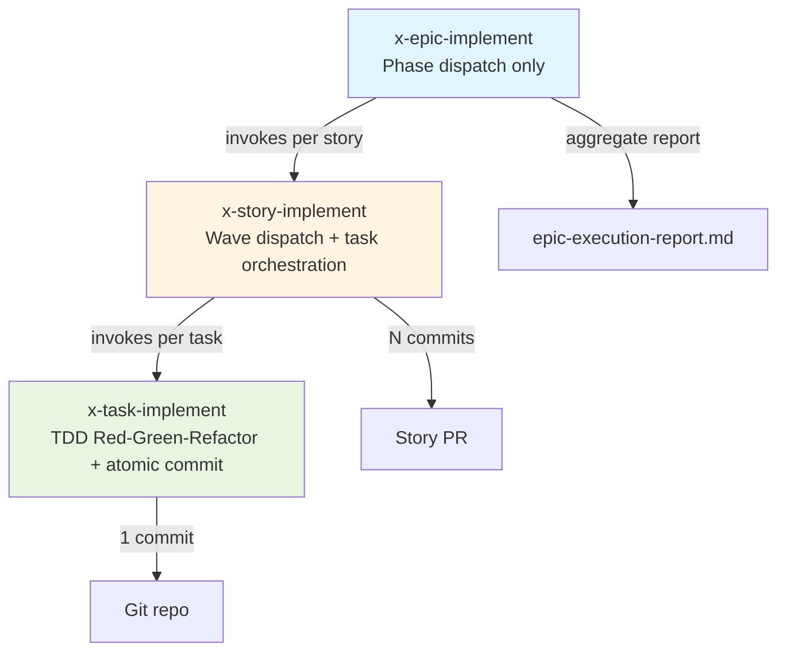
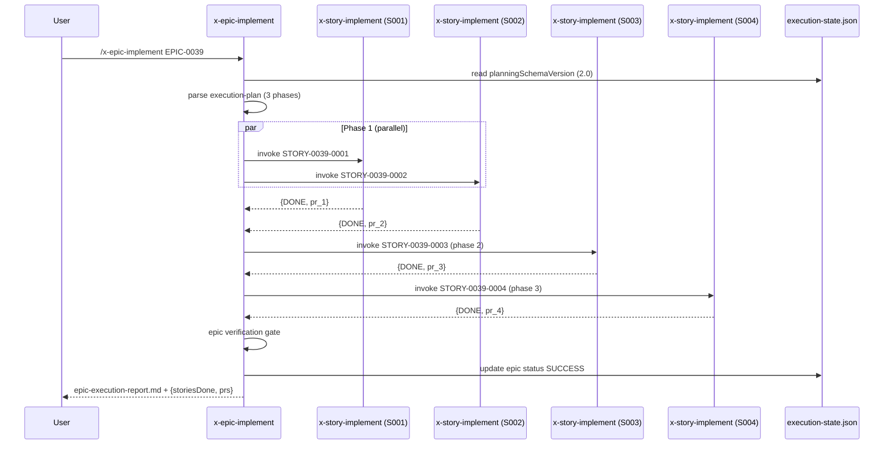

# História: `x-epic-implement` simplificado

**ID:** story-0038-0007
**Chave Jira:** —
**Status:** Pendente

## 1. Dependências

| Blocked By | Blocks |
| :--- | :--- |
| story-0038-0006 | story-0038-0008 |

## 2. Regras Transversais Aplicáveis

| ID | Título |
| :--- | :--- |
| RULE-TF-03 | Topological Execution |
| RULE-TF-05 | Backward Compatibility |

## 3. Descrição

Como **orquestrador de épico**, eu quero que `x-epic-implement` apenas orqueste stories em phase order conforme `implementation-map-epic-XXXX.md`, delegando a execução de tasks inteiramente a `x-story-implement` (que por sua vez delega a `x-task-implement`), garantindo que o epic orchestrator volte a ter uma responsabilidade única (dispatch de stories) e que a simplificação de código seja significativa — tasks somem do contexto de `x-epic-implement` porque estão encapsuladas dentro das stories no schema v2.

Esta é uma story de **refactor simplificador** de `x-epic-implement` (pós-rename de `x-dev-epic-implement` pelo EPIC-0036). Em schema v1 (legacy), a skill mantém o comportamento atual — que hoje já é um phase dispatcher, mas tem leakage de conceitos de tasks nos logs e em alguns prompts internos. Em schema v2, a skill fica ainda mais enxuta: lê o implementation-map do épico (stories em phases), dispacha stories em ordem de phase respeitando dependências entre stories, e NUNCA referencia tasks diretamente. Tasks são internals da story.

O ganho secundário é manutenibilidade: a matriz de responsabilidades fica limpa (epic → stories, story → tasks, task → TDD cycle), cada nível tem sua própria skill, e bugs em um nível não precisam ser debugados nos outros. A backward compatibility (RULE-TF-05) é reforçada aqui porque o epic orchestrator é o entry point mais usado — épicos 0025-0037 precisam continuar executando sem mudança observável.

### 3.1 Detecção de Schema Version

- Lê `execution-state.json` → `planningSchemaVersion`
- v1 → flow legacy (atual, com leakage de tasks nos logs)
- v2 → flow simplificado (apenas stories, zero referências a tasks)
- Se estiver rodando épico pós-EPIC-0038 sem flag v2 explícita → mensagem informativa sugerindo upgrade (não-bloqueante)

### 3.2 Implementation-Map Resolution

- Parâmetro: `<epic-id>` (ex: `EPIC-0039`)
- Lê `plans/epic-XXXX/plans/execution-plan-epic-XXXX.md` (produzido por `x-epic-orchestrate`)
- Parseia seções: Phases, Story Dependencies, Critical Path
- Falha com IMPL_MAP_NOT_FOUND se ausente

### 3.3 Phase-Based Story Dispatch (v2)

- Para cada phase do implementation-map, em ordem:
  - Identificar stories da phase (podem ser paralelas se o map declarar)
  - Dispachar em paralelo (subagent per story) respeitando `--phase-parallelism` (default 2)
  - Aguardar conclusão de toda a phase antes de prosseguir
  - Se qualquer story na phase falha → abort com PHASE_EXECUTION_FAIL (stories DONE anteriores preservadas)
- **Zero referências a tasks** nos logs, prompts ou error messages de `x-epic-implement` em v2

### 3.4 Epic Verification Gate

- Após todas as phases completarem:
  - Verificar `execution-state.json`: todas as stories têm status SUCCESS
  - Rodar `mvn clean verify` no estado final (integração cross-story)
  - Checar coverage agregado do épico: ≥ 95% line / ≥ 90% branch
  - Gerar phase completion report via `_TEMPLATE-PHASE-COMPLETION-REPORT.md`
- Se gate falha → epic status FAILED, report detalhado

### 3.5 Epic Completion

- Atualizar `execution-state.json` → `epic.status = "SUCCESS"` + `finishedAt`
- Gerar `plans/epic-XXXX/reports/epic-execution-report.md` (summary)
- Retornar estrutura `{status, storiesDone, phasesExecuted, coverageDelta, prsOpened}`

### 3.6 Simplificação de Código

- Remover lógica de task dispatch do `x-epic-implement` (em v2, é exclusiva de `x-story-implement`)
- Remover parsers de task-related sections do epic code path em v2
- Manter classes de task parsing no bundle mas não chamadas em v2 (compartilhadas com legacy v1)
- Meta: redução de ≥ 30% em LOC do SKILL.md em v2 vs v1

## 3.5 Entrega de Valor

- **Valor Principal:** Epic orchestrator volta a ter responsabilidade única (dispatch de stories em phase order). Tasks viram invisíveis para este nível — corretamente encapsuladas dentro de stories. Reduz drift entre layers de orquestração e simplifica debugging: falha de épico aponta para falha de story, não de task.
- **Métrica de Sucesso:** (a) Redução ≥ 30% em LOC do flow v2 de `x-epic-implement/SKILL.md` vs flow atual; (b) zero referências à palavra "task" nos logs de execução em v2 (`grep -ic task epic-execution-report.md` == 0); (c) épico fixture com 3 phases (2 stories paralelas na phase 1, 1 na phase 2, 1 na phase 3) executa em v2 com coverage agregado ≥ 95%/90%.
- **Impacto no Negócio:** Manutenção do gerador `ia-dev-env` fica mais barata — cada skill tem escopo claro. Futuras mudanças em TDD cycle mexem em `x-task-implement`; mudanças em wave scheduling mexem em `x-story-implement`; mudanças em phase order mexem em `x-epic-implement`. Zero tripla edição.

## 4. Definições de Qualidade Locais

### DoR Local

- [ ] story-0038-0006 mergeada em develop (`x-story-implement` v2 disponível)
- [ ] **EPIC-0036 stories 0036-0001..0006 mergeadas em develop** (pré-requisito duro — skill renomeada para `x-epic-implement`)
- [ ] Skill source em `java/src/main/resources/targets/claude/skills/x-epic-implement/SKILL.md` lida integralmente (pós-rename)
- [ ] Baseline de LOC do SKILL.md atual medido (para verificar redução ≥ 30%)
- [ ] Branch `feature/story-0038-0007-epic-implement-simplified` criada a partir de `develop`

### DoD Local

- [ ] `x-epic-implement/SKILL.md` refatorada: schema routing + phase dispatcher simplificado em v2
- [ ] Legacy flow v1 preservado integralmente e coberto por regression test
- [ ] v2 flow: zero referências a tasks, apenas stories
- [ ] Redução de LOC ≥ 30% no code path v2
- [ ] Epic verification gate (mvn verify + coverage agregado)
- [ ] Epic execution report gerado a partir de template
- [ ] Integration test v2 verde (épico fixture com 3 phases → 4 stories → 4 PRs)
- [ ] `mvn clean verify` verde
- [ ] PR aberto contra `develop` com label `epic-0038`

### Global Definition of Done (DoD)

- **Cobertura:** ≥ 95% line / ≥ 90% branch
- **Testes Automatizados:** unit (schema router, phase parser) + integration (phase dispatcher) + E2E (épico → 4 PRs) + regression (v1 legacy)
- **Backward Compatibility:** RULE-TF-05 — épicos 0025-0037 executam sem mudança observável (smoke em story-0038-0008 valida)
- **Performance:** épico com phases paralelas respeita `--phase-parallelism` sem degradação vs execução serial

## 5. Contratos de Dados

### 5.1 Parâmetros de Invocação

| Parâmetro | Tipo | M/O | Descrição |
| :--- | :--- | :--- | :--- |
| `<epic-id>` | `String` | M | Ex: `EPIC-0039` |
| `--phase-parallelism` | `Integer` | O | Máx stories paralelas por phase (default: 2) |
| `--resume` | `Flag` | O | Retoma execução de checkpoint (execution-state) |
| `--force-legacy` | `Flag` | O | Força flow v1 |

### 5.2 Input: execution-plan-epic-XXXX.md (seções consumidas em v2)

| Seção | Uso |
| :--- | :--- |
| `## Phases` | Define ordem de execução e stories em cada phase |
| `## Story Dependencies` | Garante que dispatch respeita deps cross-phase |
| `## Critical Path` | Informativo (log) |

**Nota:** em v2, `x-epic-implement` NÃO lê seções relacionadas a tasks — essas ficam para `x-story-implement`.

### 5.3 Input: execution-state.json (trecho consumido)

```json
{
  "version": "2.0",
  "planningSchemaVersion": "2.0",
  "epicId": "0039",
  "status": "IN_PROGRESS",
  "stories": {
    "story-0039-0001": { "id": "story-0039-0001", "status": "SUCCESS", "prUrl": "...", "prMergeStatus": "MERGED" },
    "story-0039-0002": { "id": "story-0039-0002", "status": "PENDING" }
  }
}
```

> **Schema alinhado:** chaves em camelCase (`epicId`, `prUrl`, `prMergeStatus`), enum `status` ∈ `PENDING | IN_PROGRESS | SUCCESS | DEFERRED | FAILED`. Idêntico ao formato real já em uso por épicos 0025–0037.

### 5.4 Output: epic-execution-report.md (seções obrigatórias)

| Seção | Conteúdo |
| :--- | :--- |
| `## Epic Summary` | epicId, status, schema_version, started/finished |
| `## Phases Executed` | Tabela phase × stories × PR URLs |
| `## Coverage Delta` | Line/branch before vs after |
| `## Stories DONE` | Lista com PR links |
| `## Time to Ship` | Wallclock total vs estimado |

**Nota:** em v2, este report NÃO contém seção "Tasks" — tasks são internals da story.

### 5.5 Output: Retorno estruturado ao caller

| Campo | Tipo | Descrição |
| :--- | :--- | :--- |
| `epicId` | `String` | ID do épico |
| `status` | `Enum(DONE\|FAILED\|PARTIAL)` | Resultado final |
| `storiesDone` | `List[String]` | IDs das stories concluídas |
| `phasesExecuted` | `Integer` | Número de phases completas |
| `coverageDelta` | `{line, branch}` | Δ agregado |
| `prsOpened` | `List[String]` | URLs dos PRs |
| `wallclockMs` | `Integer` | Tempo total |

### 5.6 Error Codes

| Code | Condição | Mensagem |
| :--- | :--- | :--- |
| `IMPL_MAP_NOT_FOUND` | `execution-plan-epic-XXXX.md` ausente | "Implementation map required: {path}" |
| `PHASE_EXECUTION_FAIL` | 1+ story da phase falhou | "Phase {n} failed: {failed_stories}" |
| `EPIC_VERIFICATION_FAIL` | mvn verify red ou coverage baixo | "Epic verification failed: {reason}" |
| `SCHEMA_VERSION_UNKNOWN` | Valor não reconhecido em execution-state | "Unsupported schema version: {v}" |

## 6. Diagramas

### 6.1 Responsibility Matrix (v2)



### 6.2 Phase Dispatch — Sequence



## 7. Critérios de Aceite (Gherkin)

```gherkin
Cenario: Degenerate — implementation-map ausente
  DADO que execution-state.json declara planningSchemaVersion: "2.0"
  E o arquivo execution-plan-epic-0039.md não existe
  QUANDO x-epic-implement EPIC-0039 é invocada
  ENTÃO a skill falha com código IMPL_MAP_NOT_FOUND
  E nenhuma story é dispachada

Cenario: Happy path — épico com 3 phases executa até o fim
  DADO que o map declara phase 1 com S001+S002 paralelas, phase 2 com S003, phase 3 com S004
  E schema_version é "2.0"
  QUANDO x-epic-implement EPIC-0039 é invocada
  ENTÃO S001 e S002 são dispatched em paralelo na phase 1
  E S003 roda apenas após phase 1 concluir
  E S004 roda apenas após phase 2 concluir
  E epic-execution-report.md é gerado com 4 PRs listados
  E nenhum log contém a palavra "task"

Cenario: Error — story falha aborta phase
  DADO que phase 1 tem S001 e S002 paralelas
  E S002 falha durante wave 2 com STORY_VERIFICATION_FAIL
  QUANDO x-epic-implement é invocada
  ENTÃO a skill falha com código PHASE_EXECUTION_FAIL referenciando S002
  E S001 permanece com status SUCCESS (preservada)
  E phase 2 nunca é iniciada

Cenario: Error — epic verification falha após todas stories SUCCESS
  DADO que todas as 4 stories concluem com status SUCCESS
  E mvn verify falha no estado agregado (cross-story regression)
  QUANDO x-epic-implement roda o verification gate
  ENTÃO a skill falha com código EPIC_VERIFICATION_FAIL
  E o epic-execution-report.md indica status FAILED com reason

Cenario: Boundary — schema v1 legacy (backward compat)
  DADO que execution-state.json não declara planningSchemaVersion (épico 0034 legacy)
  QUANDO x-epic-implement é invocada
  ENTÃO o flow antigo é executado
  E o output é idêntico ao baseline pré-refactor
  E RULE-TF-05 é respeitada

Cenario: Boundary — simplificação de LOC verificada
  DADO que o SKILL.md de x-epic-implement é regenerado pelo generator Java
  QUANDO mede-se o code path v2 vs v1 do SKILL.md
  ENTÃO o v2 tem pelo menos 30% menos LOC que o v1
  E grep "task" no code path v2 retorna zero hits
```

### 7.1 Scenario Ordering (TPP)
Degenerate (map ausente) → happy (3 phases) → error (phase fail) → error (epic verify) → boundary (legacy) → boundary (LOC reduction).

### 7.2 Mandatory Scenario Categories
- [x] Degenerate (map ausente)
- [x] Happy path (3 phases + 4 PRs)
- [x] Error paths (PHASE_EXECUTION_FAIL, EPIC_VERIFICATION_FAIL)
- [x] Boundary (legacy v1, LOC reduction)

## 8. Tasks

### TASK-0038-0007-001: Schema version detection + simplification router

- **Layer:** Config
- **Test Type:** Unit
- **Size:** S
- **Dependencies:** —
- **Branch:** `feat/task-0038-0007-001-schema-router`
- **Testability:** Domain + UnitTest (independently-testable)
- **Files:**
  - `java/src/main/resources/targets/claude/skills/x-epic-implement/SKILL.md`
  - `java/src/main/java/.../epic/impl/EpicSchemaRouter.java`
  - `java/src/test/java/.../epic/impl/EpicSchemaRouterTest.java`
- **Acceptance Criteria:**
  - [ ] v1 routing preserva comportamento legacy
  - [ ] v2 routing entra no simplified flow
  - [ ] `--force-legacy` override funciona

### TASK-0038-0007-002: Implementation-map parser (phases + story deps)

- **Layer:** Domain
- **Test Type:** Unit
- **Size:** M
- **Dependencies:** TASK-0038-0007-001
- **Branch:** `feat/task-0038-0007-002-impl-map-parser`
- **Testability:** Domain + UnitTest (independently-testable)
- **Files:**
  - `java/src/main/java/.../epic/impl/ImplementationMapParser.java`
  - `java/src/main/java/.../epic/impl/model/Phase.java`
  - `java/src/test/java/.../epic/impl/ImplementationMapParserTest.java`
- **Acceptance Criteria:**
  - [ ] Parseia seção "## Phases" em lista de Phase
  - [ ] Parseia cross-phase dependencies
  - [ ] IMPL_MAP_NOT_FOUND coberto

### TASK-0038-0007-003: Phase dispatcher (parallel story invocation)

- **Layer:** Application
- **Test Type:** Integration
- **Size:** L
- **Dependencies:** TASK-0038-0007-002
- **Branch:** `feat/task-0038-0007-003-phase-dispatcher`
- **Testability:** Port + Adapter + IT (requires-mock: x-story-implement subagent)
- **Files:**
  - `java/src/main/java/.../epic/impl/PhaseDispatcher.java`
  - `java/src/main/java/.../epic/impl/port/StoryImplementSubagentPort.java`
  - `java/src/test/java/.../epic/impl/PhaseDispatcherIT.java`
- **Acceptance Criteria:**
  - [ ] Paralelismo intra-phase respeita `--phase-parallelism`
  - [ ] PHASE_EXECUTION_FAIL preserva stories DONE
  - [ ] Zero referências a "task" em logs/errors (grep assert no test)

### TASK-0038-0007-004: Epic verification gate + execution report

- **Layer:** Application
- **Test Type:** Integration
- **Size:** M
- **Dependencies:** TASK-0038-0007-003
- **Branch:** `feat/task-0038-0007-004-verify-report`
- **Testability:** Port + Adapter + IT (requires-mock: MvnRunnerPort)
- **Files:**
  - `java/src/main/java/.../epic/impl/EpicVerificationGate.java`
  - `java/src/main/java/.../epic/impl/EpicExecutionReportGenerator.java`
  - `java/src/test/java/.../epic/impl/EpicVerificationGateIT.java`
- **Acceptance Criteria:**
  - [ ] mvn verify red → EPIC_VERIFICATION_FAIL
  - [ ] Report gerado a partir de `_TEMPLATE-PHASE-COMPLETION-REPORT.md`
  - [ ] Report v2 não contém seção "Tasks"

### TASK-0038-0007-005: LOC reduction verification (generator test)

- **Layer:** Test
- **Test Type:** Verification
- **Size:** S
- **Dependencies:** TASK-0038-0007-001, 002, 003, 004
- **Branch:** `feat/task-0038-0007-005-loc-reduction`
- **Testability:** Config + VerificationTest
- **Files:**
  - `java/src/test/java/.../epic/impl/EpicImplementLocReductionTest.java`
- **Acceptance Criteria:**
  - [ ] LOC do code path v2 no SKILL.md gerado ≥ 30% menor que v1
  - [ ] grep "task" no code path v2 retorna zero hits

### TASK-0038-0007-006: E2E integration test (épico 3 phases → 4 PRs)

- **Layer:** Test
- **Test Type:** E2E
- **Size:** M
- **Dependencies:** TASK-0038-0007-001..005
- **Branch:** `feat/task-0038-0007-006-e2e`
- **Testability:** UseCase + AT
- **Files:**
  - `java/src/test/java/.../epic/impl/EpicImplementV2E2ETest.java`
  - `java/src/test/resources/fixtures/epic-v2-3-phases/`
- **Acceptance Criteria:**
  - [ ] Fixture épico (phase1: S001+S002 paralelas; phase2: S003; phase3: S004) → 4 PRs
  - [ ] Report final zero palavra "task"
  - [ ] Coverage agregado ≥ 95%/90%

### TASK-0038-0007-007: Regression test + smoke v1 legacy

- **Layer:** Test
- **Test Type:** Smoke
- **Size:** S
- **Dependencies:** TASK-0038-0007-001
- **Branch:** `feat/task-0038-0007-007-legacy-smoke`
- **Testability:** Migration + Smoke
- **Files:**
  - `java/src/test/java/.../epic/impl/EpicImplementV1RegressionTest.java`
- **Acceptance Criteria:**
  - [ ] Épico legacy (schema v1) executa sem mudança observável
  - [ ] RULE-TF-05 (backward compat) respeitada
  - [ ] Baseline comparado byte-a-byte em campos não-timestamps
