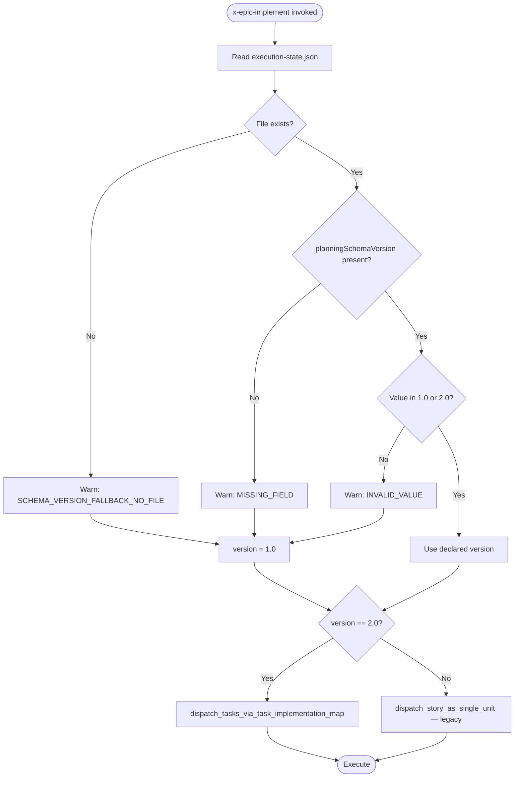
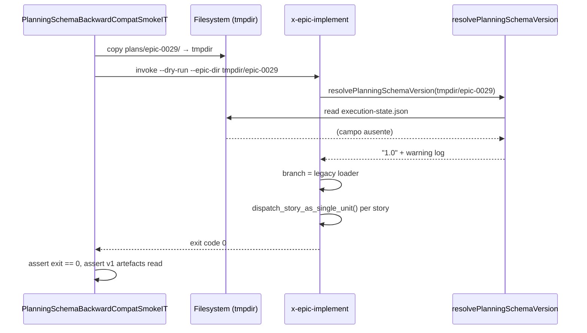

# História: Migration Path e Backward Compatibility via `planningSchemaVersion`

**ID:** story-0038-0008
**Chave Jira:** —
**Status:** Concluída

## 1. Dependências

| Blocked By | Blocks |
| :--- | :--- |
| story-0038-0007 | story-0038-0009 |

## 2. Regras Transversais Aplicáveis

| ID | Título |
| :--- | :--- |
| RULE-TF-05 | Backward Compatibility |
| RULE-TF-03 | Topological Execution (só aplica quando `schema == "2.0"`) |
| RULE-TF-04 | Task Commits Are Atomic (só aplica quando `schema == "2.0"`) |

## 3. Descrição

Como **platform engineer mantenedor do `ia-dev-env`**, eu quero que os épicos legados (0025–0037) continuem executando sem erro após o merge do EPIC-0038, garantindo que a adoção do schema task-first seja incremental e que **zero regressão** ocorra no parque instalado de planos já escritos no formato v1.

Esta história formaliza a **porta de migração**: introduz a flag `planningSchemaVersion` em `execution-state.json` e faz com que as três skills de execução (`x-task-implement`, `x-story-implement`, `x-epic-implement`) detectem a versão e ramifiquem o fluxo em runtime — v1 (legacy top-down, story como unidade) ou v2 (task-first, `task-implementation-map` dirigindo a execução). É a **última história antes da documentação** — fecha o ciclo comportamental antes de formalizar RULEs e templates em 0038-0009.

O risco é alto: uma regressão aqui derruba épicos em curso no develop. Por isso a validação é feita via **smoke test** que executa um épico legacy real (candidato: epic-0029 ou outro de pequeno porte) do início ao fim via `x-epic-implement` pós-refactor e valida exit success idêntico ao baseline pré-épico.

### 3.1 Flag `planningSchemaVersion` em `execution-state.json`

- Adicionar campo `planningSchemaVersion` no schema do arquivo `plans/epic-XXXX/execution-state.json` em nível raiz.
- Valores permitidos: `"1.0"` (legacy), `"2.0"` (task-first).
- **Default quando ausente:** tratado como `"1.0"` (backward compat total — épicos já commitados não têm o campo).
- Validação: `x-epic-implement` lê o campo no início da execução e persiste a versão no contexto de subagents.

### 3.2 Detecção de Versão nas Skills de Execução

Implementar em `x-task-implement`, `x-story-implement` e `x-epic-implement` (nomes pós-EPIC-0036) um helper compartilhado `resolvePlanningSchemaVersion(epicDir)`:

- Lê `execution-state.json` na raiz do épico.
- Retorna `"1.0"` se campo ausente ou inválido (com warning log).
- Retorna `"2.0"` apenas se campo presente e igual a `"2.0"`.

Ramificação em cada skill (pseudo-código conforme spec §8.1):

```
version = resolvePlanningSchemaVersion(epicDir)
if version == "2.0":
    dispatch_tasks_via_task_implementation_map()   # fluxo novo
else:
    dispatch_story_as_single_unit()                # fluxo legacy
```

### 3.3 Smoke Test de Épico Legacy

Escolher um épico pequeno já mergeado e não-dogfood (candidato preferencial: **epic-0029**; alternativas: épico de menor story-count entre 0025–0032) e criar um smoke test integration (`PlanningSchemaBackwardCompatSmokeIT`) que:

- Copia o diretório `plans/epic-0029/` para um tmpdir isolado.
- Invoca `x-epic-implement` em modo dry-run (sem commits reais) apontando para o tmpdir.
- Valida que a skill detecta `schema == "1.0"` (ou ausente), ramifica para legacy loader e completa o dispatch de stories sem exceção.
- Valida `exit code == 0` e que os artefatos esperados do fluxo v1 (`tasks-story-*.md` como fonte monolítica) foram lidos corretamente.

### 3.4 Matriz de Compatibilidade (spec §8.3)

Documentar explicitamente em `execution-state.json` schema reference e replicar na SKILL.md de `x-epic-implement`:

| Épico | `planningSchemaVersion` | Flow | Skills usadas |
| :--- | :--- | :--- | :--- |
| epic-0025..0037 | `"1.0"` ou ausente | Legacy top-down | `x-story-plan` monolítica |
| epic-0036 (rename) | `"1.0"` | Legacy top-down | — |
| epic-0038 (este) | `"1.0"` | Legacy top-down | `x-story-plan` monolítica |
| próximo épico (pós-0038) | `"2.0"` | Task-first bottom-up | `x-task-plan` + `x-task-implement` |

### 3.5 Zero-Regressão em Épicos em Curso

- `mvn clean verify` deve permanecer verde após o merge desta story.
- Nenhum `execution-state.json` existente pode ser reescrito durante esta story (apenas lido).
- Branch `feature/story-0038-0008-migration-path` criada a partir de develop atualizado pós-merge de 0038-0007.

## 3.5 Entrega de Valor

- **Valor Principal:** Transição incremental garantida — todo o parque de épicos já planejados (0025–0037) continua executando sem alteração, enquanto novos épicos nascem em v2. Elimina o risco de "big bang migration" que historicamente trava refactors de CI/CD.
- **Métrica de Sucesso:** (a) Smoke test `PlanningSchemaBackwardCompatSmokeIT` verde executando epic-0029 legacy; (b) `mvn clean verify` verde no merge; (c) zero stories dos épicos 0025–0037 quebradas por falta de campo `planningSchemaVersion`.
- **Impacto no Negócio:** Release manager pode mergear EPIC-0038 em develop sem paralisar épicos em curso. O custo de adoção do schema v2 é pago apenas pelo próximo épico planejado após este shipar.

## 4. Definições de Qualidade Locais

### DoR Local

- [ ] story-0038-0007 mergeada em develop (x-epic-implement simplificado)
- [ ] Épico-alvo do smoke test confirmado (default: epic-0029; alternativa documentada se indisponível)
- [ ] `execution-state.json` schema reference atual localizado (provável em `java/src/main/resources/shared/schemas/` ou inline em SKILL.md de `x-epic-plan`/`x-epic-orchestrate`)
- [ ] Decisão confirmada: default de campo ausente é `"1.0"` (não erro)
- [ ] Branch `feature/story-0038-0008-migration-path` criada

### DoD Local

- [ ] `planningSchemaVersion` adicionado ao schema do `execution-state.json` com validação JSON
- [ ] Helper `resolvePlanningSchemaVersion()` implementado e referenciado por `x-task-implement`, `x-story-implement`, `x-epic-implement`
- [ ] Matriz de compatibilidade documentada em SKILL.md de `x-epic-implement`
- [ ] Smoke test `PlanningSchemaBackwardCompatSmokeIT` verde com epic-0029
- [ ] Zero modificações em `execution-state.json` de épicos existentes
- [ ] Golden files regenerados (`mvn process-resources` + `GoldenFileRegenerator`)
- [ ] `mvn clean verify` verde
- [ ] PR aberto contra `develop` com label `epic-0038`

### Global Definition of Done (DoD)

- **Cobertura:** ≥ 95% line, ≥ 90% branch no helper de detecção (Rule 05)
- **Testes Automatizados:** Unit test para `resolvePlanningSchemaVersion()` (casos: ausente, "1.0", "2.0", inválido) + smoke test de épico legacy
- **Documentação:** SKILL.md de `x-epic-implement` atualizada com matriz §8.3
- **Backward Compatibility:** épicos 0025–0037 executando sem erro (validado pelo smoke)

## 5. Contratos de Dados

### 5.1 Schema — `execution-state.json` (campo novo)

| Campo | Tipo | M/O | Validações | Exemplo |
| :--- | :--- | :--- | :--- | :--- |
| `planningSchemaVersion` | `String` (SemVer-like) | O | Enum: `"1.0"`, `"2.0"`. Ausente ou inválido → tratado como `"1.0"` com warning log | `"2.0"` |
| `epicId` | `String` | M | Regex `\d{4}` (existente, inalterado, camelCase) | `"0038"` |
| `stories` | `Object<storyId, StoryState>` | M | (existente, inalterado, camelCase) | `{ "story-0038-0001": {...} }` |

### 5.2 Contrato — Helper `resolvePlanningSchemaVersion()`

| Input | Output | Comportamento |
| :--- | :--- | :--- |
| `execution-state.json` ausente | `"1.0"` | Warning log `SCHEMA_VERSION_FALLBACK_NO_FILE` |
| Campo `planningSchemaVersion` ausente | `"1.0"` | Warning log `SCHEMA_VERSION_FALLBACK_MISSING_FIELD` |
| Campo `"1.0"` | `"1.0"` | Sem log |
| Campo `"2.0"` | `"2.0"` | Sem log |
| Campo com valor inválido (ex.: `"3.0"`, `"legacy"`) | `"1.0"` | Warning log `SCHEMA_VERSION_INVALID_VALUE`, erro soft (não falha execução) |

> **Convenção de nomes:** o `execution-state.json` real do projeto usa **camelCase** para todas as chaves (ex.: `epicId`, `baseBranch`, `prMergeStatus`) e `status` enum `PENDING | IN_PROGRESS | SUCCESS | DEFERRED | FAILED`. O novo campo opcional introduzido por esta story é `planningSchemaVersion` (camelCase, NÃO `planningSchemaVersion`). Os exemplos abaixo replicam fielmente o formato canônico já em uso — esta story NÃO introduz schema paralelo, apenas adiciona um campo opcional.

### 5.3 Sample — Épico v1 (legacy, sem campo)

```json
{
  "version": "2.0",
  "epicId": "0029",
  "baseBranch": "develop",
  "metrics": { "storiesCompleted": 4, "storiesTotal": 4 },
  "stories": {
    "story-0029-0001": {
      "id": "story-0029-0001",
      "phase": 0,
      "status": "SUCCESS",
      "prMergeStatus": "MERGED"
    }
  }
}
```

### 5.4 Sample — Épico v2 (task-first)

```json
{
  "version": "2.0",
  "planningSchemaVersion": "2.0",
  "epicId": "0039",
  "baseBranch": "develop",
  "metrics": { "storiesCompleted": 0, "storiesTotal": 1 },
  "stories": {
    "story-0039-0001": {
      "id": "story-0039-0001",
      "phase": 0,
      "status": "PENDING",
      "taskImplementationMap": "plans/epic-0039/plans/task-implementation-map-STORY-0039-0001.md"
    }
  }
}
```

> **Nota sobre `version` vs `planningSchemaVersion`:** o campo top-level `version` (já existente) refere-se ao schema do **próprio `execution-state.json`**. O novo `planningSchemaVersion` refere-se ao schema **do planejamento da story** (v1 monolítico vs v2 task-first). São independentes — toda a lógica do resolver §5.2 opera apenas sobre `planningSchemaVersion`.

## 6. Diagramas

### 6.1 Fluxo de Detecção de Versão



### 6.2 Smoke Test — Épico Legacy



## 7. Critérios de Aceite (Gherkin)

```gherkin
Cenario: Degenerate — execution-state.json ausente
  DADO que o diretório do épico não contém execution-state.json
  QUANDO x-epic-implement é invocado
  ENTÃO resolvePlanningSchemaVersion retorna "1.0"
  E um warning log "SCHEMA_VERSION_FALLBACK_NO_FILE" é emitido
  E o fluxo legacy é ativado

Cenario: Happy path legacy — épico v1 executa sem regressão
  DADO o épico epic-0029 copiado para um tmpdir
  E execution-state.json sem o campo planningSchemaVersion
  QUANDO x-epic-implement --dry-run é invocado no tmpdir
  ENTÃO a skill detecta "1.0" via fallback
  E executa o legacy loader (dispatch_story_as_single_unit)
  E sai com exit code 0
  E zero stories são marcadas como falhas

Cenario: Happy path task-first — novo épico v2
  DADO um épico hipotético com execution-state.json contendo "planningSchemaVersion": "2.0"
  E um task-implementation-map válido por story
  QUANDO x-epic-implement é invocado
  ENTÃO a skill detecta "2.0"
  E executa dispatch_tasks_via_task_implementation_map
  E cada task produz commit atômico

Cenario: Error — valor inválido degrada para legacy com warning
  DADO um execution-state.json com "planningSchemaVersion": "3.0"
  QUANDO x-epic-implement é invocado
  ENTÃO resolvePlanningSchemaVersion retorna "1.0"
  E um warning log "SCHEMA_VERSION_INVALID_VALUE" é emitido
  E o fluxo legacy é ativado
  MAS a execução NÃO falha (soft degrade)

Cenario: Boundary — campo presente mas vazio
  DADO um execution-state.json com "planningSchemaVersion": ""
  QUANDO resolvePlanningSchemaVersion é invocado
  ENTÃO retorna "1.0"
  E emite warning "SCHEMA_VERSION_INVALID_VALUE"
```

### 7.1 Scenario Ordering (TPP)
Degenerate (arquivo ausente) → happy legacy → happy task-first → error (valor inválido) → boundary (string vazia).

### 7.2 Mandatory Scenario Categories
- [x] Degenerate (file missing)
- [x] Happy path (legacy + task-first)
- [x] Error (invalid value)
- [x] Boundary (empty string)

## 8. Tasks

### TASK-0038-0008-001: Adicionar Campo `planningSchemaVersion` ao Schema

- **Layer:** Config
- **Test Type:** Verification
- **Size:** S
- **Dependencies:** —
- **Branch:** `feature/task-0038-0008-001-schema-field`
- **Testability:** Config + VerificationTest
- **Files:**
  - `java/src/main/resources/shared/schemas/execution-state-schema.json` (ou equivalente)
  - `java/src/main/resources/targets/claude/skills/**/x-epic-implement/SKILL.md`
- **Acceptance Criteria:**
  - [ ] Campo opcional com enum `["1.0", "2.0"]`
  - [ ] Schema validation test cobre os 4 casos (ausente, "1.0", "2.0", inválido)

### TASK-0038-0008-002: Implementar Helper `resolvePlanningSchemaVersion`

- **Layer:** Application
- **Test Type:** Unit
- **Size:** M
- **Dependencies:** TASK-0038-0008-001
- **Branch:** `feature/task-0038-0008-002-version-helper`
- **Testability:** Domain + UnitTest
- **Files:**
  - `java/src/main/java/.../planning/PlanningSchemaVersionResolver.java` (novo)
  - `java/src/test/java/.../planning/PlanningSchemaVersionResolverTest.java` (novo)
- **Acceptance Criteria:**
  - [ ] 4 unit tests cobrindo todos os retornos do contrato §5.2
  - [ ] Warning logs estruturados (códigos documentados)
  - [ ] Zero exceções propagadas (soft degrade)

### TASK-0038-0008-003: Ramificação em `x-task-implement`

- **Layer:** Adapter (skill)
- **Test Type:** Integration
- **Size:** S
- **Dependencies:** TASK-0038-0008-002
- **Branch:** `feature/task-0038-0008-003-task-impl-branch`
- **Testability:** Port + Adapter + IT
- **Files:**
  - `java/src/main/resources/targets/claude/skills/**/x-task-implement/SKILL.md`
- **Acceptance Criteria:**
  - [ ] Skill invoca resolver e ramifica antes de ler `task-TASK-NNN.md`
  - [ ] Em v1, cai em no-op (task-first não aplicável a épicos legacy)
  - [ ] Integration test valida as duas ramificações

### TASK-0038-0008-004: Ramificação em `x-story-implement`

- **Layer:** Adapter (skill)
- **Test Type:** Integration
- **Size:** M
- **Dependencies:** TASK-0038-0008-002
- **Branch:** `feature/task-0038-0008-004-story-impl-branch`
- **Testability:** Port + Adapter + IT
- **Files:**
  - `java/src/main/resources/targets/claude/skills/**/x-story-implement/SKILL.md`
- **Acceptance Criteria:**
  - [ ] v2 invoca dispatch via task-implementation-map (hookup 0038-0006)
  - [ ] v1 mantém dispatch_story_as_single_unit
  - [ ] Integration test cobre ambos os paths

### TASK-0038-0008-005: Ramificação em `x-epic-implement`

- **Layer:** Adapter (skill)
- **Test Type:** Integration
- **Size:** S
- **Dependencies:** TASK-0038-0008-002
- **Branch:** `feature/task-0038-0008-005-epic-impl-branch`
- **Testability:** Port + Adapter + IT
- **Files:**
  - `java/src/main/resources/targets/claude/skills/**/x-epic-implement/SKILL.md`
- **Acceptance Criteria:**
  - [ ] Skill lê versão no primeiro gate e propaga para subagents via contexto
  - [ ] Matriz §8.3 documentada inline na SKILL.md

### TASK-0038-0008-006: Smoke Test de Épico Legacy

- **Layer:** Test
- **Test Type:** Smoke
- **Size:** M
- **Dependencies:** TASK-0038-0008-003, TASK-0038-0008-004, TASK-0038-0008-005
- **Branch:** `feature/task-0038-0008-006-legacy-smoke`
- **Testability:** Migration + Smoke
- **Files:**
  - `java/src/test/java/.../smoke/PlanningSchemaBackwardCompatSmokeIT.java` (novo)
  - `java/src/test/resources/fixtures/legacy-epic-0029/` (cópia parcial do épico real)
- **Acceptance Criteria:**
  - [ ] Smoke executa epic-0029 (ou alternativa) em tmpdir
  - [ ] `exit code == 0`
  - [ ] Warning `SCHEMA_VERSION_FALLBACK_MISSING_FIELD` emitido
  - [ ] Fluxo legacy ativado (assert via log capture)

### TASK-0038-0008-007: Regenerar Golden Files + Verify

- **Layer:** Test
- **Test Type:** Smoke
- **Size:** S
- **Dependencies:** TASK-0038-0008-001..006
- **Branch:** `feature/task-0038-0008-007-golden-regen`
- **Testability:** Migration + Smoke
- **Files:**
  - `java/src/test/resources/golden/**/execution-state-schema.json` (se presente)
  - `java/src/test/resources/golden/**/x-epic-implement/SKILL.md`
- **Acceptance Criteria:**
  - [ ] `mvn process-resources` executado
  - [ ] `GoldenFileRegenerator` executado (ver memory `reference_golden_regen_command`)
  - [ ] `mvn clean verify` verde
  - [ ] Zero diff em execution-state.json de épicos existentes
