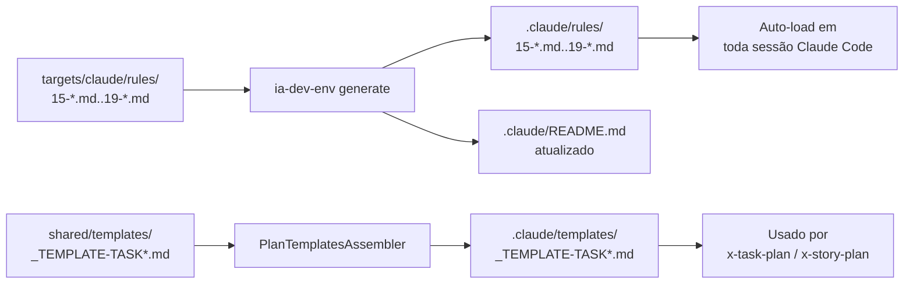
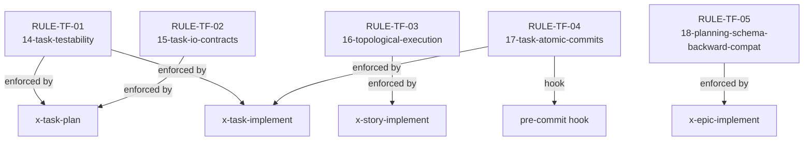

# História: Documentação, Templates e 5 RULEs TF-01..TF-05

**ID:** story-0038-0009
**Chave Jira:** —
**Status:** Pendente

## 1. Dependências

| Blocked By | Blocks |
| :--- | :--- |
| story-0038-0008 | story-0038-0010 |

## 2. Regras Transversais Aplicáveis

| ID | Título |
| :--- | :--- |
| RULE-TF-01 | Task Testability (formalizada aqui) |
| RULE-TF-02 | I/O Contracts Are Mandatory (formalizada aqui) |
| RULE-TF-03 | Topological Execution (formalizada aqui) |
| RULE-TF-04 | Task Commits Are Atomic (formalizada aqui) |
| RULE-TF-05 | Backward Compatibility (formalizada aqui) |

## 3. Descrição

Como **platform engineer mantenedor do `ia-dev-env`**, eu quero que as cinco novas regras transversais (TF-01 a TF-05) do task-first schema virem **rule files de primeira classe** em `.claude/rules/`, que os templates `_TEMPLATE-TASK.md` e `_TEMPLATE-TASK-IMPLEMENTATION-MAP.md` sejam distribuídos para todas as gerações, e que `CLAUDE.md` raiz e `.claude/README.md` reflitam o novo fluxo task-first, garantindo que todo desenvolvedor (humano ou subagent) consulte um único ponto canônico para a política do schema v2.

Esta é a história de **consolidação documental**: nenhuma comportamento novo é introduzido — apenas formalização. As cinco regras já foram implementadas em runtime pelas stories 0001–0008 do épico; 0009 as transforma em autoridade global (rules são carregadas automaticamente em toda sessão Claude Code) e publica os templates em `java/src/main/resources/shared/templates/` para serem copiados pelo gerador para `.claude/templates/`.

Slots disponíveis em `.claude/rules/`: conforme memory `project_rule_numbering_reserved_slots`, slots 10/11/12 são reservados para conditional rules e slot 13 está ocupado por `13-skill-invocation-protocol.md`. Slot 14 foi alocado pela EPIC-0037 (`14-worktree-lifecycle.md`). Portanto **slots 15–19** são os alvos desta story.

### 3.1 Criação dos 5 Rule Files

Criar em `java/src/main/resources/targets/claude/rules/` (SoT per RULE-001):

| Slot | Arquivo | Conteúdo núcleo |
| :--- | :--- | :--- |
| 14 | `14-task-testability.md` | RULE-TF-01 — toda task declara: `independently testable` OU `requires mock of TASK-XXX` OU `coalescible with TASK-ZZZ`. Sem declaração → commit bloqueado por `x-task-implement`. |
| 15 | `15-task-io-contracts.md` | RULE-TF-02 — inputs (pré-condições) e outputs (pós-condições) obrigatórios por task. Outputs verificáveis via grep/assert/teste. Template `_TEMPLATE-TASK.md` exige as seções. |
| 16 | `16-topological-execution.md` | RULE-TF-03 — ordem de execução respeita `task-implementation-map-STORY-*.md`. Paralelismo opt-in via análise automática. `x-story-implement` falha se map ausente (schema v2). |
| 17 | `17-task-atomic-commits.md` | RULE-TF-04 — 1 task = 1 commit (Conventional Commits com escopo `task(TASK-XXXX-YYYY-NNN)`). Coalesced groups: 1 commit + footer `Coalesces-with: TASK-..., TASK-...`. |
| 18 | `18-planning-schema-backward-compat.md` | RULE-TF-05 — épicos com `planningSchemaVersion == "1.0"` (ou ausente) executam via legacy loader. Novos épicos usam `"2.0"`. Smoke test em 0038-0008 é a evidência. |

Cada rule file segue a estrutura canônica das rules existentes em `java/src/main/resources/targets/claude/rules/` (referência: `13-skill-invocation-protocol.md` — última rule estática merged). Slots reservados (10/11/12) ficam intocados conforme `project_rule_numbering_reserved_slots`; portanto novas rules entram a partir do slot 14. Nesta story, ocupamos 14–18 (não 15–19): TF-01 → `14-task-testability.md`, TF-02 → `15-task-io-contracts.md`, TF-03 → `16-topological-execution.md`, TF-04 → `17-task-atomic-commits.md`, TF-05 → `18-planning-schema-backward-compat.md`. Cada rule file traz: frontmatter com escopo/ownership, seção Enforcement, seção Anti-Patterns, cross-refs para skills afetadas.

### 3.2 Templates em `shared/templates/`

Criar dois templates para distribuição multi-target (sob SoT `shared/templates/` pois são consumidos pelo gerador para popular `.claude/templates/`):

- `java/src/main/resources/shared/templates/_TEMPLATE-TASK.md` — schema do `task-TASK-NNN.md` conforme spec §5.1 (Objetivo, Contratos I/O, Testabilidade, DoD per-task, Dependências, Plano de implementação). Contém placeholders `{{TASK_ID}}`, `{{STORY_ID}}`, `{{TASK_TITLE}}`, `{{DEPENDS_ON}}` resolvidos em runtime.
- `java/src/main/resources/shared/templates/_TEMPLATE-TASK-IMPLEMENTATION-MAP.md` — schema do `task-implementation-map-STORY-*.md` conforme spec §5.2 (Dependency Graph Mermaid, Execution Order waves, Coalesced Groups, Parallelism Analysis). Placeholders `{{STORY_ID}}`, `{{MERMAID_GRAPH}}`, `{{WAVES_TABLE}}`.

Atualizar `PlanTemplatesAssembler` (classe Java) para copiar os dois templates novos para `.claude/templates/` com pre-check (conforme tabela em CLAUDE.md §"Plan & Review Templates").

### 3.3 Atualização de CLAUDE.md Raiz

Editar `CLAUDE.md` (raiz do projeto):
- Remover o aviso "Em progresso — EPIC-0036" quando aplicável (ou manter e adicionar bloco análogo para EPIC-0038 referenciando a spec task-first).
- Adicionar seção (ou subseção dentro do bloco de rules) listando TF-01..TF-05 com link curto para cada rule file.
- Atualizar contagem total de rules (atualmente 10 ativas: slots 01, 03–09, 13; sobe para 15 ativas após esta story acrescentar 14–18 — slots 10/11/12 permanecem reservados para rules condicionais).
- Atualizar tabela "Plan & Review Templates" adicionando as 2 novas linhas (`_TEMPLATE-TASK.md` → `plans/epic-XXXX/plans/task-TASK-NNN-story-XXXX-YYYY.md` via `x-task-plan`; `_TEMPLATE-TASK-IMPLEMENTATION-MAP.md` → `plans/epic-XXXX/plans/task-implementation-map-STORY-XXXX-YYYY.md` via `x-story-plan` Phase 4).

### 3.4 Atualização de `.claude/README.md`

Regenerar via `ia-dev-env generate` de modo que `.claude/README.md` (output gerado) passe a listar os 5 novos rule files. Não editar manualmente — apenas regenerar.

### 3.5 Indexação em Rules System Prompt

Confirmar que os 5 rule files são carregados automaticamente na system prompt de toda sessão (behavior default de `.claude/rules/*.md`). Nenhum código adicional necessário — apenas presença do arquivo no output gerado garante loading.

### 3.6 Regeneração de Golden Files

Após todas as criações e edições de SoT, rodar `mvn process-resources` + `GoldenFileRegenerator` (comando canônico per memory `reference_golden_regen_command`) para sincronizar `src/test/resources/golden/**`. Validar `mvn clean verify` verde.

## 3.5 Entrega de Valor

- **Valor Principal:** Política task-first ganha autoridade global como 5 rule files carregados em toda sessão + 2 templates distribuídos em todo projeto gerado. Elimina a dependência de conhecimento tácito sobre o schema v2 — qualquer subagent ou contribuidor descobre as regras por inspeção de `.claude/rules/`.
- **Métrica de Sucesso:** (a) `ls .claude/rules/15-*.md .claude/rules/16-*.md .claude/rules/17-*.md .claude/rules/18-*.md .claude/rules/19-*.md` retorna 5 arquivos; (b) `ls .claude/templates/_TEMPLATE-TASK*.md` retorna 2 arquivos; (c) `grep -c "RULE-TF-0" CLAUDE.md` retorna ≥ 5; (d) `mvn clean verify` verde.
- **Impacto no Negócio:** Platform engineers mantenedores do gerador passam a ter uma fonte única de verdade documental para o schema task-first. O próximo épico dogfood (0038-0010) pode apontar diretamente para os rule files em vez de duplicar texto.

## 4. Definições de Qualidade Locais

### DoR Local

- [ ] story-0038-0008 mergeada em develop (migration path funcional)
- [ ] Slots 15–19 confirmados vazios em `java/src/main/resources/targets/claude/rules/`
- [ ] Memory `project_rule_numbering_reserved_slots` revisada
- [ ] Memory `reference_golden_regen_command` revisada
- [ ] `PlanTemplatesAssembler.java` localizado e lido
- [ ] Branch `feature/story-0038-0009-docs-templates-rules` criada

### DoD Local

- [ ] 5 rule files criados nos slots 15–19 em `targets/claude/rules/`
- [ ] 2 templates criados em `shared/templates/`
- [ ] `PlanTemplatesAssembler` copia os 2 novos templates (+ pre-check)
- [ ] `CLAUDE.md` raiz atualizado: count de rules, seção TF-01..05, tabela de templates (+2 linhas)
- [ ] `.claude/README.md` regenerado (não editado manualmente)
- [ ] Golden files regenerados
- [ ] `mvn clean verify` verde
- [ ] `grep -rn "RULE-TF-" .claude/rules/` retorna referências nos 5 rule files
- [ ] PR aberto contra `develop` com label `epic-0038`

### Global Definition of Done (DoD)

- **Cobertura:** N/A para rule files/templates (markdown); cobertura mantida no código Java (`PlanTemplatesAssembler` +2 cópias)
- **Testes Automatizados:** Golden file tests validam presença dos rule files e templates em todos os profiles; unit test adicional em `PlanTemplatesAssembler` validando as 2 cópias novas
- **Documentação:** CLAUDE.md + 5 rule files + 2 templates
- **Source of Truth:** zero edições em `.claude/rules/` ou `.claude/templates/` (apenas `targets/` e `shared/`)

## 5. Contratos de Dados

### 5.1 Frontmatter Comum dos Rule Files (15–19)

Nenhum frontmatter YAML — rule files são markdown puro conforme padrão `13-skill-invocation-protocol.md`. Estrutura mínima:

```markdown
# Rule NN — <Título da Regra>

> **Escopo:** <quando aplica>.
> **Ownership:** Platform Team.
> **Related:** See Rule XX for <...>.

## 1. <Secção de política>

<texto normativo>

## 2. Enforcement

<mecanismo de enforcement: skill X rejeita Y>

## 3. Anti-Patterns

- <lista>
```

### 5.2 Frontmatter do `_TEMPLATE-TASK.md`

Templates usam placeholders `{{...}}` resolvidos em runtime pelo LLM (ver CLAUDE.md §"Plan & Review Templates"):

| Placeholder | Tipo | Obrigatório | Exemplo resolvido |
| :--- | :--- | :--- | :--- |
| `{{TASK_ID}}` | String | Sim | `TASK-0039-0001-003` |
| `{{STORY_ID}}` | String | Sim | `story-0039-0001` |
| `{{TASK_TITLE}}` | String | Sim | `Criar classe FoobarAssembler` |
| `{{DEPENDS_ON}}` | Array<String> | Opcional | `[TASK-0039-0001-001, TASK-0039-0001-002]` |
| `{{TESTABILITY_MODE}}` | Enum | Sim | `independent` \| `mock` \| `coalesced` |
| `{{INPUTS}}` | String (markdown bullet list) | Sim | `- estado X; - classe Y exists` |
| `{{OUTPUTS}}` | String (markdown bullet list) | Sim | `- classe Z criada; - teste W verde` |

### 5.3 Tabela de Templates Atualizada em CLAUDE.md

Adicionar duas linhas à tabela existente:

| Template | Produced By | Saved To | Pre-Check |
|----------|-------------|----------|-----------|
| `_TEMPLATE-TASK.md` | x-task-plan | `plans/epic-XXXX/plans/task-TASK-NNN-story-XXXX-YYYY.md` | Yes |
| `_TEMPLATE-TASK-IMPLEMENTATION-MAP.md` | x-story-plan (Phase 4) | `plans/epic-XXXX/plans/task-implementation-map-STORY-XXXX-YYYY.md` | Yes |

Total sobe de **12 → 14** plan & review templates.

### 5.4 Sample — Rule File 15 (extrato)

```markdown
# Rule 15 — Task Testability

> **Escopo:** Todo `task-TASK-NNN.md` em épicos com `planningSchemaVersion == "2.0"`.
> **Ownership:** Platform Team.
> **Related:** See Rule 16 (I/O Contracts), Rule 17 (Topological Execution).

## 1. Testability Declaration

Toda task DEVE declarar um dos três modos:

| Modo | Significado |
| :--- | :--- |
| `independently testable` | Pode passar Red→Green→Refactor sem outras tasks concluídas |
| `requires mock of TASK-YYY` | Precisa mock de output de TASK-YYY (declarar classe mockada) |
| `coalescible with TASK-ZZZ` | Mutuamente recursiva — commitar junto |

## 2. Enforcement

- `x-task-plan`: validation gate rejeita `task-TASK-NNN.md` sem seção `## 3. Testabilidade`
- `x-task-implement`: bloqueia commit se modo não declarado

## 3. Anti-Patterns

- Declarar "independently testable" e depois precisar de stub ad-hoc de outra task
- Usar "coalescible" como desculpa para evitar TDD (coalesce só vale para recursão mútua real)
```

## 6. Diagramas

### 6.1 Fluxo de Geração pós-merge



### 6.2 Cross-Reference Graph entre RULEs e Skills



## 7. Critérios de Aceite (Gherkin)

```gherkin
Cenario: Degenerate — slots 15-19 vazios antes da story
  DADO que targets/claude/rules/ contém 01, 03-09, 13, 14
  E não contém arquivos 15-*.md, 16-*.md, 17-*.md, 18-*.md, 19-*.md
  QUANDO a story é implementada
  ENTÃO os 5 arquivos são criados nos slots corretos
  E cada um tem as 3 seções mínimas: Política, Enforcement, Anti-Patterns

Cenario: Happy path — templates e CLAUDE.md sincronizados
  DADO os 5 rule files e 2 templates criados
  QUANDO mvn process-resources + GoldenFileRegenerator rodam
  ENTÃO .claude/rules/ contém os 5 novos arquivos
  E .claude/templates/ contém _TEMPLATE-TASK.md e _TEMPLATE-TASK-IMPLEMENTATION-MAP.md
  E CLAUDE.md raiz menciona RULE-TF-01..05
  E a tabela de plan & review templates tem 14 linhas
  E mvn clean verify está verde

Cenario: Error — `PlanTemplatesAssembler` sem as 2 cópias novas
  DADO que PlanTemplatesAssembler é modificado para copiar só os 12 templates originais
  QUANDO o teste unitário do assembler roda
  ENTÃO falha com assertion "expected 14 templates copied, got 12"
  E .claude/templates/ não contém os 2 novos templates

Cenario: Boundary — slot 14 já ocupado (EPIC-0037)
  DADO que targets/claude/rules/14-worktree-lifecycle.md existe
  QUANDO a story cria os rule files em 15-19
  ENTÃO nenhum arquivo é criado em slot 14
  E slot 14 permanece com o rule file da EPIC-0037

Cenario: Indexação — rules carregadas em sessão
  DADO os 5 rule files em .claude/rules/
  QUANDO uma nova sessão Claude Code é iniciada
  ENTÃO o system prompt inclui o conteúdo dos 5 rule files
  E TF-01..05 são autoridade global sem invocação explícita
```

### 7.1 Scenario Ordering (TPP)
Degenerate (slots vazios) → happy (sincronia) → error (assembler incompleto) → boundary (slot 14 protegido) → indexação (runtime loading).

### 7.2 Mandatory Scenario Categories
- [x] Degenerate (slots vazios)
- [x] Happy path (5 rules + 2 templates + CLAUDE.md)
- [x] Error (assembler com count errado)
- [x] Boundary (slot 14 não tocado)
- [x] Runtime (indexação automática)

## 8. Tasks

### TASK-0038-0009-001: Criar Rule File `14-task-testability.md`

- **Layer:** Doc
- **Test Type:** Verification
- **Size:** S
- **Dependencies:** —
- **Branch:** `feature/task-0038-0009-001-rule-15`
- **Testability:** Config + VerificationTest
- **Files:**
  - `java/src/main/resources/targets/claude/rules/14-task-testability.md` (novo)
- **Acceptance Criteria:**
  - [ ] 3 seções: Testability Declaration, Enforcement, Anti-Patterns
  - [ ] Tabela dos 3 modos de testabilidade

### TASK-0038-0009-002: Criar Rule Files 16–19

- **Layer:** Doc
- **Test Type:** Verification
- **Size:** M
- **Dependencies:** TASK-0038-0009-001
- **Branch:** `feature/task-0038-0009-002-rules-16-19`
- **Testability:** Config + VerificationTest
- **Files:**
  - `targets/claude/rules/15-task-io-contracts.md` (novo)
  - `targets/claude/rules/16-topological-execution.md` (novo)
  - `targets/claude/rules/17-task-atomic-commits.md` (novo)
  - `targets/claude/rules/18-planning-schema-backward-compat.md` (novo)
- **Acceptance Criteria:**
  - [ ] 4 arquivos com estrutura canônica
  - [ ] Cross-refs entre rules (16 → 15, 17 → 16, etc.)

### TASK-0038-0009-003: Criar Templates Task e Task-Implementation-Map

- **Layer:** Doc
- **Test Type:** Verification
- **Size:** M
- **Dependencies:** —
- **Branch:** `feature/task-0038-0009-003-templates`
- **Testability:** Config + VerificationTest
- **Files:**
  - `java/src/main/resources/shared/templates/_TEMPLATE-TASK.md` (novo)
  - `java/src/main/resources/shared/templates/_TEMPLATE-TASK-IMPLEMENTATION-MAP.md` (novo)
- **Acceptance Criteria:**
  - [ ] Schema `task-TASK-NNN.md` conforme spec §5.1
  - [ ] Schema `task-implementation-map-STORY-*.md` conforme spec §5.2
  - [ ] Placeholders `{{TASK_ID}}`, `{{STORY_ID}}`, etc.

### TASK-0038-0009-004: Atualizar `PlanTemplatesAssembler`

- **Layer:** Application
- **Test Type:** Unit
- **Size:** S
- **Dependencies:** TASK-0038-0009-003
- **Branch:** `feature/task-0038-0009-004-assembler`
- **Testability:** Domain + UnitTest
- **Files:**
  - `java/src/main/java/.../assembler/PlanTemplatesAssembler.java`
  - `java/src/test/java/.../assembler/PlanTemplatesAssemblerTest.java`
- **Acceptance Criteria:**
  - [ ] Copia 14 templates (12 atuais + 2 novos)
  - [ ] Pre-check ativo para os 2 novos (fail-fast se ausentes em `shared/templates/`)
  - [ ] Unit test atualizado para `expected 14`

### TASK-0038-0009-005: Atualizar CLAUDE.md Raiz

- **Layer:** Doc
- **Test Type:** Verification
- **Size:** S
- **Dependencies:** TASK-0038-0009-001, TASK-0038-0009-002, TASK-0038-0009-003
- **Branch:** `feature/task-0038-0009-005-claudemd`
- **Testability:** Config + VerificationTest
- **Files:**
  - `CLAUDE.md` (raiz)
- **Acceptance Criteria:**
  - [ ] Seção de rules lista 15/16/17/18/19 com links
  - [ ] Tabela de plan & review templates tem 14 linhas
  - [ ] Count "Total: N rules" atualizado (10 → 15)

### TASK-0038-0009-006: Regenerar Golden Files + Verify

- **Layer:** Test
- **Test Type:** Smoke
- **Size:** S
- **Dependencies:** TASK-0038-0009-001..005
- **Branch:** `feature/task-0038-0009-006-golden-regen`
- **Testability:** Migration + Smoke
- **Files:**
  - `java/src/test/resources/golden/**/.claude/rules/15-*.md..19-*.md`
  - `java/src/test/resources/golden/**/.claude/templates/_TEMPLATE-TASK*.md`
  - `java/src/test/resources/golden/**/.claude/README.md`
- **Acceptance Criteria:**
  - [ ] `mvn process-resources` executado
  - [ ] `GoldenFileRegenerator` executado (memory `reference_golden_regen_command`)
  - [ ] `mvn clean verify` verde
  - [ ] 5 rule files + 2 templates aparecem em todos os profiles
