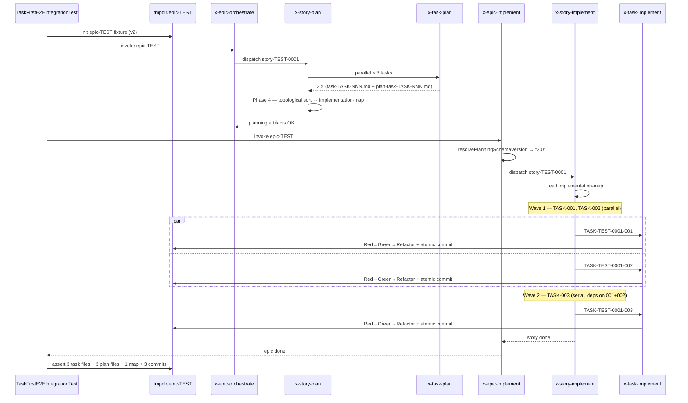
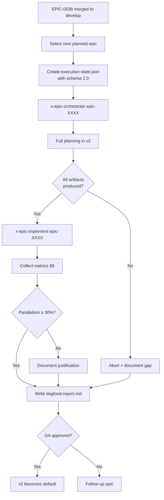

# História: E2E Integration Tests e Dogfood Verification do Schema Task-First

**ID:** story-0038-0010
**Chave Jira:** —
**Status:** Pendente

## 1. Dependências

| Blocked By | Blocks |
| :--- | :--- |
| story-0038-0009 | — |

## 2. Regras Transversais Aplicáveis

| ID | Título |
| :--- | :--- |
| RULE-TF-01 | Task Testability (validação holística) |
| RULE-TF-02 | I/O Contracts Are Mandatory (validação holística) |
| RULE-TF-03 | Topological Execution (validação holística) |
| RULE-TF-04 | Task Commits Are Atomic (validação holística) |
| RULE-TF-05 | Backward Compatibility (validação holística) |

## 3. Descrição

Como **QA engineer** do `ia-dev-env`, eu quero um teste de integração **end-to-end** do fluxo task-first completo (planejamento → execução, épico → story → task, com paralelismo em waves), e um **dogfood** do primeiro épico pós-merge rodado em schema v2, garantindo que todas as 5 RULEs TF-01..05 sejam validadas holisticamente e que as métricas do épico (scope drift = 0, TDD honesto = 100%, paralelização ≥ 30%) sejam atingidas em uso real.

Esta é a história de **fechamento do épico** (folha do DAG — não bloqueia ninguém). Ela é a única que exercita o schema v2 completo em um caminho real. O teste E2E é a **outer loop do Double-Loop TDD** em nível de épico: ele passou a ser possível apenas após as stories 0001–0009 terem entregado cada peça isolada. O dogfood é a **validação de campo**: o próximo épico já planejado será executado em v2 e documentado aqui como evidência.

O escopo inclui três frentes: (a) suite de integration test `TaskFirstE2EIntegrationTest` cobrindo todo o pipeline de skills; (b) execução dogfood do próximo épico com snapshot dos artefatos produzidos; (c) grep sanity final garantindo zero referência a "task embedded in story" em `targets/`.

### 3.1 Integration Test E2E do Fluxo Completo

Criar `java/src/test/java/.../integration/TaskFirstE2EIntegrationTest.java` que exerça, em tmpdir isolado com git repo inicializado:

1. **Planning phase:**
   - `x-epic-orchestrate epic-TEST` dispatcha `x-story-plan` por story
   - `x-story-plan story-TEST-0001` invoca `x-task-plan` × N tasks em paralelo (subagents)
   - `x-task-plan` produz `task-TASK-NNN.md` e `plan-task-TASK-NNN.md` por task
   - `x-story-plan` Phase 4 produz `task-implementation-map-STORY-TEST-0001.md` via topological sort
2. **Execution phase:**
   - `x-epic-implement epic-TEST` detecta `planning_schema_version == "2.0"` e ramifica para task-first flow
   - `x-story-implement story-TEST-0001` lê o implementation-map e dispacha tasks em waves
   - Cada `x-task-implement TASK-TEST-0001-NNN` lê `task-TASK-NNN.md` + `plan-task-TASK-NNN.md`, executa TDD Red→Green→Refactor e produz commit atômico com escopo `task(TASK-TEST-0001-NNN)`
3. **Assertions:**
   - Todos os `task-TASK-NNN.md` × N existem com as seções obrigatórias (§1–§5 da spec)
   - Todos os `plan-task-TASK-NNN.md` × N existem
   - `task-implementation-map-STORY-TEST-0001.md` existe com tabela de waves
   - Commits atômicos: `git log --oneline` mostra N linhas (ou N - coalesced + 1 por grupo)
   - Cada commit body contém `TASK-TEST-0001-NNN` no escopo (Conventional Commits)
   - Coverage no tmpdir: line ≥ 95%, branch ≥ 90%

Fixture: épico sintético minimalista `epic-TEST` com 1 story e 3 tasks (2 paralelizáveis em wave 1 + 1 em wave 2) para garantir paralelismo observável.

### 3.2 Dogfood Verification — Próximo Épico em v2

Identificar o **próximo épico planejado após EPIC-0038 mergear** (candidato a confirmar no kickoff da story; persona `release manager` confirma a escolha). Executar:

1. Criar `plans/epic-XXXX/execution-state.json` com `"planning_schema_version": "2.0"` desde o início.
2. Invocar `x-epic-orchestrate epic-XXXX` e acompanhar o fluxo task-first real.
3. Verificar produção de todos os artefatos:
   - `task-TASK-XXXX-YYYY-NNN.md` × N
   - `plan-task-TASK-XXXX-YYYY-NNN.md` × N
   - `task-implementation-map-STORY-XXXX-YYYY.md` × por story
4. Coletar métricas (§3.3) e registrar em `plans/epic-0038/reports/dogfood-report.md`.

### 3.3 Métricas de Sucesso (Epic §8)

Coletar e reportar as 5 métricas do épico:

| Métrica | Baseline (EPIC-0034) | Alvo | Validação |
| :--- | :--- | :--- | :--- |
| Scope drift entre stories | 5 locais observados | 0 | Grep em `plans/epic-XXXX/plans/` por contradições inter-story |
| TDD honesto por task | 0% | 100% das não-coalesced | Cada commit tem test precedendo implementation (log line ordering) |
| Tempo de planejamento por story | ~20 min | ≤ 25 min | Wall-clock do dispatch x-story-plan → conclusão |
| Paralelização real | 0% | ≥ 30% das stories têm ≥ 2 tasks paralelas | Contagem de waves com > 1 task |
| Grep sanity "task embedded in story" | N/A | 0 | `grep -rn "task embedded in story" java/src/main/resources/targets/` |

### 3.4 Grep Sanity Final

Executar ao final da story (hard-fail se > 0):

```bash
grep -rn "task embedded in story" java/src/main/resources/targets/ && exit 1 || echo "OK"
grep -rn "tasks as sub-section" java/src/main/resources/targets/ && exit 1 || echo "OK"
```

### 3.5 Relatório de Dogfood

Criar `plans/epic-0038/reports/dogfood-report.md` documentando:
- Épico dogfood escolhido (ID + título)
- Tabela de artefatos produzidos vs. esperados
- Métricas coletadas vs. alvos
- Issues encontradas (se houver) + workarounds
- Recomendação: "GA do schema v2 aprovada" ou "rollback para v1 com justificativa"

## 3.5 Entrega de Valor

- **Valor Principal:** Fecha o épico com evidência executável — o schema v2 funciona em laboratório (E2E test) e em produção (dogfood real). Todas as 5 RULEs TF-01..05 têm teste holístico passando. Risco de "big bang" eliminado pela execução controlada do próximo épico.
- **Métrica de Sucesso:** (a) `TaskFirstE2EIntegrationTest` verde em `mvn verify`; (b) dogfood report documentando próximo épico executado em v2 com ≥ 30% de stories paralelas; (c) grep sanity "task embedded in story" retorna 0 hits; (d) todas as métricas do épico §8 atingidas ou justificadas.
- **Impacto no Negócio:** Release manager confirma GA do schema v2. Platform team ganha confiança para desligar o legacy loader em um épico futuro (v3). Os próximos N épicos nascem em v2 sem overhead de decisão arquitetural — o caminho é o único oficial.

## 4. Definições de Qualidade Locais

### DoR Local

- [ ] story-0038-0009 mergeada em develop (rules + templates + CLAUDE.md)
- [ ] Próximo épico dogfood identificado e spec pronta
- [ ] Fixture `epic-TEST` minimalista desenhada (1 story, 3 tasks, waves 2+1)
- [ ] Memory `reference_golden_regen_command` revisada
- [ ] Equipe (release manager + platform team) confirmou go para dogfood
- [ ] Branch `feature/story-0038-0010-e2e-dogfood` criada

### DoD Local

- [ ] `TaskFirstE2EIntegrationTest` implementado e verde
- [ ] Fixture `epic-TEST` presente em `java/src/test/resources/fixtures/`
- [ ] Dogfood executado em épico real em v2 com snapshot de artefatos
- [ ] `plans/epic-0038/reports/dogfood-report.md` criado com tabelas de métricas
- [ ] Grep sanity "task embedded in story" = 0 hits
- [ ] Grep sanity "tasks as sub-section" = 0 hits
- [ ] `mvn clean verify` verde
- [ ] PR aberto contra `develop` com label `epic-0038`

### Global Definition of Done (DoD)

- **Cobertura:** ≥ 95% line, ≥ 90% branch mantida; E2E test NÃO conta para coverage (mede fluxo, não lógica)
- **Testes Automatizados:** 1 E2E integration test + 1 smoke de dogfood (verifica artefatos do épico real)
- **E2E Integration:** obrigatório verde — é a outer loop do épico
- **Dogfood:** obrigatório documentado com ≥ 30% paralelização ou justificativa formal
- **Grep Sanity:** obrigatório 0 hits para os dois patterns

## 5. Contratos de Dados

### 5.1 Fixture — `epic-TEST` (Minimal Synthetic Epic)

Estrutura em `java/src/test/resources/fixtures/epic-TEST/`:

```
epic-TEST/
├── execution-state.json              # planning_schema_version: "2.0"
├── epic-TEST.md                      # 1 story mínima
├── story-TEST-0001.md                # 3 tasks declaradas
└── plans/                            # populado pelo E2E test durante run
    ├── task-TASK-TEST-0001-001.md    # criado em runtime
    ├── task-TASK-TEST-0001-002.md    # criado em runtime
    ├── task-TASK-TEST-0001-003.md    # criado em runtime
    ├── plan-task-TASK-TEST-0001-00N.md  # × 3
    └── task-implementation-map-STORY-TEST-0001.md  # wave 1: 001,002 / wave 2: 003
```

### 5.2 Sample — `execution-state.json` do dogfood

```json
{
  "planning_schema_version": "2.0",
  "epic_id": "epic-XXXX",
  "current_phase": "planning",
  "stories": []
}
```

### 5.3 Dogfood Report — Estrutura

| Seção | Conteúdo |
| :--- | :--- |
| 1. Identificação | Épico dogfood (ID + título + link spec) |
| 2. Artefatos Produzidos | Tabela `esperado × produzido` por tipo |
| 3. Métricas | Tabela das 5 métricas com valor medido vs. alvo |
| 4. Issues | Lista de issues encontradas + workarounds |
| 5. Recomendação | GA approved \| rollback \| extend with follow-up |

### 5.4 E2E Test — Assertions Estruturais

| Categoria | Assertion |
| :--- | :--- |
| Planning artifacts | `task-TASK-*.md` count == 3 |
| Planning artifacts | `plan-task-TASK-*.md` count == 3 |
| Planning artifacts | `task-implementation-map-*.md` count == 1 |
| Execution artifacts | `git log --oneline` count >= 3 (ou N - coalesced) |
| Commit format | Cada commit matches regex `^(feat\|fix\|refactor\|test)\(task\(TASK-TEST-0001-\d{3}\)\):` |
| Parallelism | Map declara ≥ 1 wave com 2+ tasks |

## 6. Diagramas

### 6.1 Sequência E2E — Planning + Execution



### 6.2 Fluxograma de Dogfood



## 7. Critérios de Aceite (Gherkin)

```gherkin
Cenario: Degenerate — fixture epic-TEST vazia
  DADO que o tmpdir contém epic-TEST sem artefatos em plans/
  QUANDO TaskFirstE2EIntegrationTest inicia o planning
  ENTÃO x-epic-orchestrate é invocada
  E zero artefatos existem antes do dispatch
  E o test assert "plans/ vazio" passa como estado inicial

Cenario: Happy path — E2E completo do planning ao último commit
  DADO fixture epic-TEST com 1 story e 3 tasks declaradas
  E execution-state.json com planning_schema_version "2.0"
  QUANDO o E2E test executa planning + execution end-to-end
  ENTÃO 3 task-TASK-TEST-0001-NNN.md são criados
  E 3 plan-task-TASK-TEST-0001-NNN.md são criados
  E 1 task-implementation-map-STORY-TEST-0001.md é criado
  E git log mostra 3 commits com escopo task(TASK-TEST-0001-NNN)
  E coverage no tmpdir >= 95% line e >= 90% branch
  E o test verde em mvn verify

Cenario: Error — grep sanity encontra "task embedded in story"
  DADO que um rule file ou SKILL.md tem a frase "task embedded in story"
  QUANDO o grep sanity check roda
  ENTÃO retorna > 0 hits
  E o test falha com "GREP_SANITY_VIOLATION"
  E a story NÃO pode ser mergeada

Cenario: Boundary — dogfood com 30% exato de paralelização
  DADO um épico dogfood com 10 stories
  E 3 delas têm ≥ 2 tasks paralelas
  QUANDO a métrica de paralelização é calculada
  ENTÃO retorna 30%
  E o threshold "≥ 30%" é atingido (não estritamente maior)
  E a recomendação é "GA approved"

Cenario: Dogfood — próximo épico produz todos os artefatos esperados
  DADO EPIC-0038 mergeado em develop
  E o próximo épico planejado tem execution-state.json com "2.0"
  QUANDO x-epic-orchestrate é invocado nesse épico
  ENTÃO task-TASK-*.md são produzidos para todas as tasks de todas as stories
  E task-implementation-map-*.md existem para cada story
  E commits atômicos seguem Conventional Commits com escopo task(...)
  E plans/epic-0038/reports/dogfood-report.md documenta as métricas
```

### 7.1 Scenario Ordering (TPP)
Degenerate (fixture vazia) → happy (E2E completo) → error (grep sanity) → boundary (30% exato) → dogfood real.

### 7.2 Mandatory Scenario Categories
- [x] Degenerate (fixture empty)
- [x] Happy path (E2E completo)
- [x] Error (grep sanity)
- [x] Boundary (30% exato)
- [x] Real dogfood (next epic)

## 8. Tasks

### TASK-0038-0010-001: Fixture `epic-TEST` Minimalista

- **Layer:** Test
- **Test Type:** Verification
- **Size:** S
- **Dependencies:** —
- **Branch:** `feature/task-0038-0010-001-fixture`
- **Testability:** Config + VerificationTest
- **Files:**
  - `java/src/test/resources/fixtures/epic-TEST/execution-state.json` (novo)
  - `java/src/test/resources/fixtures/epic-TEST/epic-TEST.md` (novo)
  - `java/src/test/resources/fixtures/epic-TEST/story-TEST-0001.md` (novo)
- **Acceptance Criteria:**
  - [ ] `execution-state.json` com `planning_schema_version: "2.0"`
  - [ ] 1 story com 3 tasks declaradas (2 paralelas + 1 dep)
  - [ ] Tasks são syntheticamente simples (não exigem código real)

### TASK-0038-0010-002: Implementar `TaskFirstE2EIntegrationTest`

- **Layer:** Test
- **Test Type:** E2E
- **Size:** L
- **Dependencies:** TASK-0038-0010-001
- **Branch:** `feature/task-0038-0010-002-e2e-test`
- **Testability:** UseCase + AT
- **Files:**
  - `java/src/test/java/.../integration/TaskFirstE2EIntegrationTest.java` (novo)
- **Acceptance Criteria:**
  - [ ] Planning phase testada (epic-orchestrate → story-plan → task-plan × 3)
  - [ ] Execution phase testada (epic-implement → story-implement → task-implement × 3)
  - [ ] Asserções §5.4 implementadas
  - [ ] Paralelismo observável (wave 1 tem 2 tasks)
  - [ ] Verde em `mvn verify`

### TASK-0038-0010-003: Grep Sanity Script

- **Layer:** Test
- **Test Type:** Smoke
- **Size:** S
- **Dependencies:** —
- **Branch:** `feature/task-0038-0010-003-grep-sanity`
- **Testability:** Config + VerificationTest
- **Files:**
  - `java/src/test/java/.../smoke/GrepSanityIT.java` (novo)
- **Acceptance Criteria:**
  - [ ] Test falha se `grep -rn "task embedded in story" targets/` > 0
  - [ ] Test falha se `grep -rn "tasks as sub-section" targets/` > 0
  - [ ] Verde no estado pós-épico

### TASK-0038-0010-004: Executar Dogfood no Próximo Épico

- **Layer:** Doc
- **Test Type:** Smoke
- **Size:** M
- **Dependencies:** TASK-0038-0010-002, TASK-0038-0010-003
- **Branch:** `feature/task-0038-0010-004-dogfood-exec`
- **Testability:** Migration + Smoke
- **Files:**
  - `plans/epic-XXXX/execution-state.json` (criado em outro épico, referenciado)
  - `plans/epic-0038/reports/dogfood-report.md` (novo)
- **Acceptance Criteria:**
  - [ ] Épico dogfood executado ponta a ponta em v2
  - [ ] Snapshot de artefatos coletado
  - [ ] Todas as 5 métricas medidas e reportadas

### TASK-0038-0010-005: Gerar `dogfood-report.md`

- **Layer:** Doc
- **Test Type:** Verification
- **Size:** S
- **Dependencies:** TASK-0038-0010-004
- **Branch:** `feature/task-0038-0010-005-dogfood-report`
- **Testability:** Config + VerificationTest
- **Files:**
  - `plans/epic-0038/reports/dogfood-report.md`
- **Acceptance Criteria:**
  - [ ] Todas as 5 seções §5.3 preenchidas
  - [ ] Recomendação explícita (GA approved / rollback / extend)
  - [ ] Issues documentadas se houver

### TASK-0038-0010-006: Regen Final + Verify + PR

- **Layer:** Test
- **Test Type:** Smoke
- **Size:** S
- **Dependencies:** TASK-0038-0010-001..005
- **Branch:** `feature/task-0038-0010-006-final-verify`
- **Testability:** Migration + Smoke
- **Files:**
  - `java/src/test/resources/golden/**` (se aplicável)
- **Acceptance Criteria:**
  - [ ] `mvn process-resources` executado
  - [ ] `GoldenFileRegenerator` executado (memory `reference_golden_regen_command`)
  - [ ] `mvn clean verify` verde
  - [ ] Grep sanity = 0 hits
  - [ ] PR final do épico aberto contra develop com label `epic-0038` + referência ao dogfood-report
