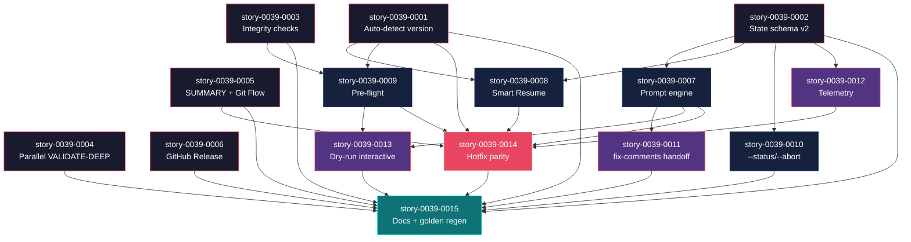
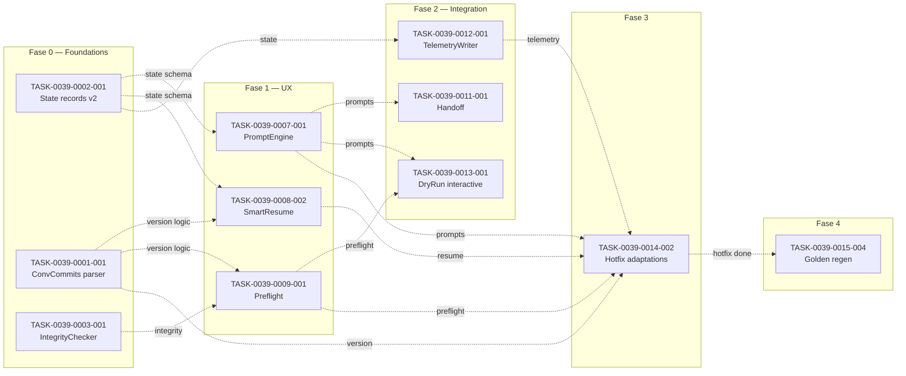

# Mapa de Implementação — EPIC-0039: x-release Interactive Flow

**Gerado a partir das dependências BlockedBy/Blocks de cada história do epic-0039.**

---

## 1. Matriz de Dependências

| Story | Título | Chave Jira | Blocked By | Blocks | Status |
| :--- | :--- | :--- | :--- | :--- | :--- |
| story-0039-0001 | Auto-detecção de versão (Conventional Commits) | — | — | 0008, 0009, 0014 | Pendente |
| story-0039-0002 | State file schema v2 (breaking) | — | — | 0007, 0008, 0010, 0012 | Pendente |
| story-0039-0003 | Pre-commit integrity checks | — | — | 0009 | Pendente |
| story-0039-0004 | Paralelização de VALIDATE-DEEP | — | — | — | Pendente |
| story-0039-0005 | Phase SUMMARY com diagrama Git Flow | — | — | 0014 | Pendente |
| story-0039-0006 | GitHub Release auto com confirmação | — | — | — | Concluída |
| story-0039-0007 | Engine de prompts interativos | — | 0002 | 0011, 0013, 0014 | Pendente |
| story-0039-0008 | Smart Resume | — | 0001, 0002 | 0014 | Pendente |
| story-0039-0009 | Pre-flight dashboard | — | 0001, 0003 | 0013, 0014 | Pendente |
| story-0039-0010 | --status / --abort | — | 0002 | — | Pendente |
| story-0039-0011 | Handoff /x-pr-fix-comments | — | 0007 | — | Pendente |
| story-0039-0012 | Telemetria por fase | — | 0002 | 0014 | Pendente |
| story-0039-0013 | Interactive dry-run | — | 0007, 0009 | — | Pendente |
| story-0039-0014 | Paridade hotfix | — | 0001, 0005, 0007, 0008, 0009, 0012 | 0015 | Pendente |
| story-0039-0015 | Doc + golden regen final | — | 0001..0014 | — | Pendente |

> **Valores de Status:** `Pendente` (padrão) · `Em Andamento` · `Concluída` · `Falha` · `Bloqueada` · `Parcial`

> **Nota:** S04 (paralelização de VALIDATE-DEEP) e S06 (GitHub Release) são totalmente independentes e podem ser implementadas em qualquer fase. Foram alocadas na Fase 0 por simetria de risco.

---

## 2. Fases de Implementação

> Histórias dentro de uma mesma fase podem ser implementadas **em paralelo**. Uma fase só pode iniciar quando todas as dependências das fases anteriores estiverem concluídas.

```
╔══════════════════════════════════════════════════════════════════════════╗
║              FASE 0 — Foundations (6 paralelas)                          ║
║                                                                          ║
║   ┌───────────┐ ┌───────────┐ ┌───────────┐ ┌───────────┐ ┌───────────┐ ┌───────────┐ ║
║   │ S01 auto  │ │ S02 state │ │ S03 integ │ │ S04 paral │ │ S05 sum   │ │ S06 ghrel │ ║
║   │ -version  │ │ schema v2 │ │ -rity     │ │ validate  │ │ Git Flow  │ │ auto      │ ║
║   └─────┬─────┘ └─────┬─────┘ └─────┬─────┘ └───────────┘ └─────┬─────┘ └───────────┘ ║
╚═════════╪═════════════╪═════════════╪═════════════════════════════╪═══════════════════╝
          │             │             │                             │
          │             ▼             │                             │
          │    ╔════════════════════════════════════════════════════════════╗
          │    ║         FASE 1 — Interactive UX (4 paralelas após S07)     ║
          │    ║                                                            ║
          │    ║  ┌───────────┐  ┌───────────┐  ┌───────────┐  ┌───────────┐
          │    ║  │ S07 prompt│  │ S08 smart │  │ S09 pre-  │  │ S10 stat/ │
          │    ║  │ engine    │  │ resume    │  │ flight    │  │ abort     │
          ├────┼─►└─────┬─────┘  └─────┬─────┘  └─────┬─────┘  └─────┬─────┘
          │    ║        │              │              │              │
          ├────┼────────┘              │              │              │
          ├────┼───────────────────────┘              │              │
          ├────┼──────────────────────────────────────┘              │
          │    ╚═══════════════╪══════════════╪═══════════╪═══════════╪══════╝
          │                    │              │           │           │
          │                    ▼              ▼           ▼           ▼
          │   ╔═════════════════════════════════════════════════════════════╗
          │   ║       FASE 2 — Integration & Observability (3 paralelas)    ║
          │   ║                                                             ║
          │   ║   ┌───────────┐    ┌───────────┐    ┌───────────┐          ║
          │   ║   │ S11 hand- │    │ S12 tele- │    │ S13 dry-  │          ║
          │   ║   │ off       │    │ metria    │    │ run inter │          ║
          │   ║   └─────┬─────┘    └─────┬─────┘    └─────┬─────┘          ║
          │   ╚═════════╪══════════════════╪══════════════════╪═════════════╝
          │             │                  │                  │
          ├─────────────┼──────────────────┼──────────────────┘
          │             │                  │
          ▼             ▼                  ▼
╔══════════════════════════════════════════════════════════════════════════╗
║                FASE 3 — Parity (1 story)                                 ║
║                                                                          ║
║   ┌────────────────────────────────────────────────────────────┐         ║
║   │  S14 hotfix parity                                         │         ║
║   │  (depende de S01, S05, S07, S08, S09, S12)                 │         ║
║   └──────────────────────────┬─────────────────────────────────┘         ║
╚══════════════════════════════╪═══════════════════════════════════════════╝
                               │
                               ▼
╔══════════════════════════════════════════════════════════════════════════╗
║                FASE 4 — Closure (1 story)                                ║
║                                                                          ║
║   ┌────────────────────────────────────────────────────────────┐         ║
║   │  S15 Doc + golden regen + PlanTemplateDefinitions          │         ║
║   │  (depende de TODAS as anteriores)                          │         ║
║   └────────────────────────────────────────────────────────────┘         ║
╚══════════════════════════════════════════════════════════════════════════╝
```

---

## 3. Caminho Crítico

> O caminho crítico (sequência mais longa de dependências) determina o tempo mínimo de implementação.

```
S02 ──► S07 ──► S11 ──┐
                      ├──► S14 ──► S15
S01 ──► S08 ──────────┤
S03 ──► S09 ──────────┘

Fase 0    Fase 1    Fase 2    Fase 3    Fase 4
```

**5 fases no caminho crítico, 5 histórias na cadeia mais longa: S02 → S07 → (qualquer 4 stories paralelas Fase 1/2 que S14 dependa) → S14 → S15.**

Atrasos em S02 (state schema v2) propagam para 4 stories Fase 1 → bloqueia tudo. Investir em revisão antecipada do schema é alto valor. S15 é puramente sequencial e curto (1-2 dias) — não é gargalo.

---

## 4. Grafo de Dependências (Mermaid)



---

## 5. Resumo por Fase

| Fase | Histórias | Camada | Paralelismo | Pré-requisito |
| :--- | :--- | :--- | :--- | :--- |
| 0 | S01, S02, S03, S04, S05, S06 | Foundations | 6 paralelas | — |
| 1 | S07, S08, S09, S10 | Interactive UX | 4 paralelas (S07 não tem dep, mas viabiliza S11/S13) | Fase 0 (S01, S02, S03) |
| 2 | S11, S12, S13 | Integration & Observability | 3 paralelas | Fase 1 (S07, S09) + Fase 0 (S02) |
| 3 | S14 | Parity hotfix | 1 (sequencial) | Fases 0-2 (6 deps cumulativas) |
| 4 | S15 | Docs + golden regen | 1 (sequencial) | Todas (15 deps) |

**Total: 15 histórias em 5 fases.**

> **Nota:** Fase 1 tem máximo paralelismo (4 stories simultâneas). Fase 0 também tem 6 stories paralelas mas algumas (S04, S06) são totalmente independentes e podem começar antes do refinamento das demais.

---

## 6. Detalhamento por Fase

### Fase 0 — Foundations

| Story | Escopo Principal | Artefatos Chave |
| :--- | :--- | :--- |
| S01 | Auto-detect versão de Conventional Commits | `ConventionalCommitsParser`, `VersionBumper`, `GitTagReader`, `auto-version-detection.md` |
| S02 | Schema v2 do state file (breaking) | `ReleaseState`, `NextAction`, `WaitingFor`, `StateFileValidator`, `state-file-schema.md` (atualizado) |
| S03 | Integrity checks em VALIDATE-DEEP | `IntegrityChecker`, `IntegrityReport`, `RepoFileReader`, sub-check 9 em SKILL.md |
| S04 | Paralelização VALIDATE-DEEP | `ParallelCheckExecutor`, benchmark assertion |
| S05 | Phase SUMMARY + diagrama Git Flow | `SummaryRenderer`, `git-flow-cycle-explainer.md` |
| S06 | GitHub Release auto + confirmação | `ChangelogBodyExtractor`, bloco PUBLISH atualizado |

**Entregas da Fase 0:**

- Auto-versão e estado v2 prontos para serem consumidos por Fase 1
- VALIDATE-DEEP mais rápida e mais inteligente (integrity)
- SUMMARY e GitHub Release são "extras" entregáveis isoladamente

### Fase 1 — Interactive UX

| Story | Escopo Principal | Artefatos Chave |
| :--- | :--- | :--- |
| S07 | Engine de prompts interativos | `PromptEngine`, `prompt-flow.md`, AskUserQuestion em Phase 8/10 |
| S08 | Smart Resume | `StateFileDetector`, `SmartResumeOrchestrator`, Step 0.5 em SKILL.md |
| S09 | Pre-flight dashboard | `PreflightDashboardRenderer`, Step 1.5 em SKILL.md |
| S10 | --status / --abort | `StatusReporter`, `AbortOrchestrator`, sub-comandos em Triggers |

**Entregas da Fase 1:**

- UX completa: prompts em pausas, retomada inteligente, dashboard, comandos operacionais
- Habilita Fase 2 (handoff e dry-run interativo dependem de prompts)

### Fase 2 — Integration & Observability

| Story | Escopo Principal | Artefatos Chave |
| :--- | :--- | :--- |
| S11 | Handoff `/x-pr-fix-comments` | `HandoffOrchestrator`, prompt-flow.md atualizado |
| S12 | Telemetria por fase | `TelemetryWriter`, `BenchmarkAnalyzer`, `release-metrics.jsonl` |
| S13 | Dry-run interativo (onboarding) | `DryRunInteractiveExecutor`, modo documentado em SKILL.md |

**Entregas da Fase 2:**

- Loop fluido fix-comments ↔ continue release
- Dados históricos para benchmarks
- Onboarding seguro de novos operadores

### Fase 3 — Parity hotfix

| Story | Escopo Principal | Artefatos Chave |
| :--- | :--- | :--- |
| S14 | Hotfix com mesma UX do release | `HotfixContext`, adaptações em VersionDetector/Smart Resume/Preflight/Summary/Telemetry, "Hotfix Flow" em SKILL.md |

**Entregas da Fase 3:**

- Hotfix ganha auto-detect (PATCH only), prompts, smart resume, dashboard, summary, telemetria
- 95% de reuso de código via injeção de `ReleaseContext`

### Fase 4 — Closure

| Story | Escopo Principal | Artefatos Chave |
| :--- | :--- | :--- |
| S15 | Reescrita SKILL.md + walkthrough + PlanTemplateDefinitions + golden regen + CHANGELOG | `SKILL.md` final, `interactive-flow-walkthrough.md`, `PlanTemplateDefinitions.java` (TEMPLATE_COUNT=18), 17 goldens regenerados, `CHANGELOG.md [Unreleased]` |

**Entregas da Fase 4:**

- Documentação consolidada e consistente
- Goldens dos 17 profiles atualizados em commit único
- CHANGELOG narra mudança breaking de schema
- 3 templates (epic/story/map) finalmente registrados no pipeline

---

## 7. Observações Estratégicas

### Gargalo Principal

**S02 (State file schema v2)** é o gargalo crítico. Bloqueia 4 stories da Fase 1 (S07, S08, S10, S12). Erro de design no schema custa retrabalho em todas. **Recomendação**: alocar Tech Lead para revisar S02 antes do início, com checklist de campos vs uso futuro em todas as 4 stories downstream. Considerar tech-debt prévio: extrair a lógica de leitura/escrita de state em módulo com testes contract antes de S02 ser implementada.

### Histórias Folha (sem dependentes)

- **S04** (paralelização VALIDATE-DEEP): independente; pode rodar como fast-track
- **S06** (GitHub Release): independente; entregável isolado
- **S10** (--status / --abort): só bloqueia S15; pode ser consumida por Tech Leads imediatamente após Fase 1
- **S11**, **S13**: bloqueiam apenas S15 (consolidação); podem ser priorizadas/despriorizadas livremente

### Otimização de Tempo

- **Fase 0** suporta 6 paralelas — alocar 2-3 devs para entregar em ~1 semana
- **Fase 1** suporta 4 paralelas — após S02 mergeada, 4 devs trabalham simultaneamente
- **Fase 2** 3 paralelas — equipe pode reduzir para 2 devs
- **Fase 3 + 4** sequenciais — 1 dev por vez; total ~3-4 dias

Estimativa total com 3 devs: **3 semanas**. Com 2 devs: **5 semanas**.

### Dependências Cruzadas

- **S14 (hotfix)** converge dependências de Fase 0 (S01, S05) com Fase 1 (S07, S08, S09) e Fase 2 (S12). É o ponto de máxima convergência. Garante que adaptações de hotfix não quebrem nada já feito.
- **S09 (pre-flight)** combina S01 (versão) + S03 (integrity). É o "rosto" visível do pre-release.
- **S15** é convergência total (15 deps). Único risco real: ordem de regen de goldens vs ordem de mudanças em SKILL.md.

### Marco de Validação Arquitetural

**S07 (PromptEngine)** é o marco arquitetural do épico. Estabelece o pattern de:
- AskUserQuestion + persistência de resposta em state
- Fallback `--no-prompt` para CI
- Re-render baseado em estado pós-handoff

Stories S08, S11, S13, S14 reusam este pattern. Se S07 estabelece pattern errado, propaga retrabalho. **Recomendação**: PR de S07 deve passar por code review extra (Tech Lead + Senior).

---

## 8. Dependências entre Tasks (Cross-Story)

> Esta seção lista apenas dependências cross-story relevantes. Tasks intra-story estão no campo `Dependencies` de cada task no story file.

### 8.1 Dependências Cross-Story entre Tasks

| Task | Depends On | Story Source | Story Target | Tipo |
| :--- | :--- | :--- | :--- | :--- |
| TASK-0039-0007-001 (PromptEngine) | TASK-0039-0002-001 (State records) | story-0039-0007 | story-0039-0002 | data |
| TASK-0039-0008-002 (SmartResumeOrchestrator) | TASK-0039-0001-002 (VersionBumper) | story-0039-0008 | story-0039-0001 | interface |
| TASK-0039-0008-002 | TASK-0039-0002-002 (StateFileValidator) | story-0039-0008 | story-0039-0002 | interface |
| TASK-0039-0009-001 (PreflightDashboardRenderer) | TASK-0039-0001-001 (ConventionalCommitsParser) | story-0039-0009 | story-0039-0001 | data |
| TASK-0039-0009-001 | TASK-0039-0003-001 (IntegrityChecker) | story-0039-0009 | story-0039-0003 | interface |
| TASK-0039-0010-002 (AbortOrchestrator) | TASK-0039-0002-001 | story-0039-0010 | story-0039-0002 | data |
| TASK-0039-0011-001 (HandoffOrchestrator) | TASK-0039-0007-001 | story-0039-0011 | story-0039-0007 | interface |
| TASK-0039-0012-001 (TelemetryWriter) | TASK-0039-0002-001 | story-0039-0012 | story-0039-0002 | data |
| TASK-0039-0013-001 (DryRunInteractiveExecutor) | TASK-0039-0007-001 | story-0039-0013 | story-0039-0007 | interface |
| TASK-0039-0013-001 | TASK-0039-0009-001 | story-0039-0013 | story-0039-0009 | interface |
| TASK-0039-0014-002 (Hotfix adaptations) | múltiplas tasks Fase 0/1/2 | story-0039-0014 | múltiplas | interface |
| TASK-0039-0015-004 (Golden regen) | TODAS as TASKs `*-skill-*` | story-0039-0015 | todas | config |

> **Validação:** todas as dependências cross-story são consistentes com as dependências de stories declaradas em Section 1. Sem violações detectadas.

### 8.2 Ordem de Merge (Topological Sort — resumida)

| Ordem | Story | Tasks paralelizáveis dentro da story | Fase |
| :--- | :--- | :--- | :--- |
| 1-6 | S01, S02, S03, S04, S05, S06 | 4-5 tasks por story (paralelizáveis) | 0 |
| 7-10 | S07, S08, S09, S10 | 3-4 tasks por story | 1 |
| 11-13 | S11, S12, S13 | 3 tasks por story | 2 |
| 14 | S14 | 4 tasks (sequencial) | 3 |
| 15 | S15 | 6 tasks (sequencial até regen) | 4 |

**Total: ~63 tasks em 5 fases de execução.**

### 8.3 Grafo de Dependências entre Tasks (Mermaid — resumido)


