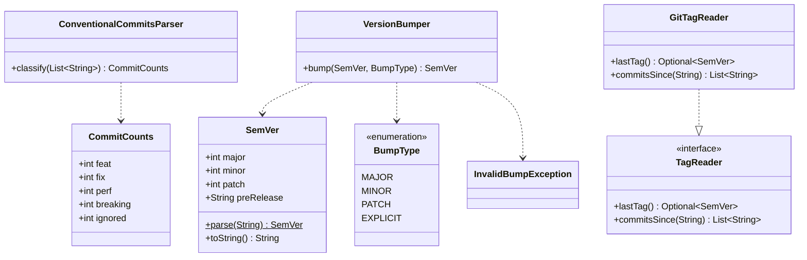

# Story Planning Report -- story-0039-0001

## Header

| Field | Value |
|-------|-------|
| Story ID | story-0039-0001 |
| Epic ID | 0039 |
| Date | 2026-04-15 |
| Agents Participating | Architect, QA Engineer, Security Engineer, Tech Lead, Product Owner |
| Planning Schema Version | v1 (legacy) |

## Planning Summary

Story-0039-0001 introduces auto-detection of the next SemVer bump from Conventional Commits since the last `v*` tag. Implementation splits cleanly along hexagonal boundaries: a pure domain parser (`ConventionalCommitsParser`), a pure domain bumper (`VersionBumper` + `SemVer` value object), an outbound adapter (`GitTagReader`) that shells to git, and source-of-truth documentation edits to `SKILL.md` + a new reference `auto-version-detection.md`. A smoke test closes the outer TDD loop by exercising `/x-release` against fixture repos. The 18 consolidated tasks follow a strict Double-Loop TDD sequence: outer loop driven by the 6 Gherkin scenarios; inner loop driven by TPP progression (nil → constant → scalar → conditional → collection → iteration). Two root-parallel branches exist — the domain parser/bumper chain (T001–T011) and the adapter chain (T012–T013) — converging at the SKILL.md edits and the smoke test.

## Architecture Assessment

| Dimension | Outcome |
|-----------|---------|
| Affected layers | domain (parser, bumper, value object, port), adapter.outbound (GitTagReader), config (SKILL.md + reference) |
| New classes | `ConventionalCommitsParser`, `CommitCounts` (record), `VersionBumper`, `SemVer` (value object), `BumpType` (enum), `TagReader` (port interface), `GitTagReader` (adapter), `InvalidBumpException` |
| Existing classes to modify | `java/src/main/resources/targets/claude/skills/core/x-release/SKILL.md` (source-of-truth), error catalog docs |
| Dependency direction | domain has ZERO external imports (Rule 04 golden); `GitTagReader` in `adapter.outbound` depends on `domain.port.TagReader`; no inbound→outbound; adapter.outbound depends only on `domain.*`. |
| Integration points | Will be consumed by story-0039-0008 (Smart Resume), story-0039-0009 (Pre-flight dashboard), story-0039-0014 (Hotfix parity). API surface: `TagReader.lastTag()→Optional<SemVer>`, `ConventionalCommitsParser.classify(List<String>)→CommitCounts`, `VersionBumper.bump(SemVer,BumpType)→SemVer`. |
| Implementation order | domain first (T001–T011), outbound adapter in parallel (T012–T013), config/doc last (T014–T015), acceptance/security/validation close (T016–T018). |

### Class Diagram

## Test Strategy Summary

| Metric | Value |
|--------|-------|
| Acceptance tests (outer loop) | 6 (one per Gherkin scenario) |
| Unit tests (inner loop, TPP-ordered) | 12 across parser (8) + bumper (4) |
| Integration tests | 3 (GitTagReader IT covering first-release, populated repo, commit-range list) |
| Smoke tests | 1 (AutoVersionDetectionSmokeTest with 5 sub-scenarios) |
| Verification tests | 1 (ReleaseAutoVersionTest on SKILL.md generation) |
| Target line coverage | ≥95% (domain targets 100%) |
| Target branch coverage | ≥90% |
| TPP progression | nil → constant → scalar → conditional → collection → iteration (explicitly sequenced in TASK-001..TASK-016) |

All tests follow `[methodUnderTest]_[scenario]_[expectedBehavior]` (Rule 05). Every assertion targets specific values/sizes (no bare `isNotNull`). Test files stay ≤250 lines; test fixtures for `GitTagReader` extracted to `GitFixtureBuilder` helper.

## Security Assessment Summary

| Dimension | Outcome |
|-----------|---------|
| OWASP A03 (Injection) | `GitTagReader` MUST pass argv as fixed array to `ProcessBuilder` (no shell, no string concat). `--last-tag` and `--version` values validated against SemVer regex BEFORE reaching git. |
| OWASP A05 (Misconfiguration) | Error messages use generic `VERSION_*` codes — no internal paths, stack traces, or class names surfaced to stdout/stderr for the operator. |
| OWASP A04 (Insecure Design — ReDoS) | Conventional-Commit regex and SemVer regex pinned; no nested quantifiers; no catastrophic-backtracking patterns. |
| OWASP A01 (Broken Access Control) | N/A — local CLI, no auth surface. |
| Input validation | `--version`, `--last-tag`, commit bodies: every external input sanitized/validated before use. |
| Secrets / PII | None introduced; no new credentials, no data logged. |
| Dependency security | No new libraries introduced (JGit already in classpath per EPIC-0035); no new transitive dependencies. |
| Risk level | **LOW** — pure domain logic + bounded outbound adapter shelling to local git. |

TASK-017 is a dedicated VERIFY task enforcing the above controls post-implementation.

## Implementation Approach (Tech Lead)

| Decision | Rationale |
|----------|-----------|
| Port/adapter separation for `TagReader` | Enables unit-testing of auto-detect logic without real git process; aligns with Rule 04 domain purity. |
| `SemVer` as record value object | Immutable; single source of truth for parse/validate; prevents string-typing drift across bumper/parser/CLI. |
| Explicit REFACTOR task (TASK-009) | Parser grows through 4 TDD cycles; method length will breach Rule 03 (≤25 lines) without explicit extraction. Forcing a visible REFACTOR commit makes TDD compliance auditable in git log. |
| Defer golden regeneration to S15 | RULE-008 mandates single consolidated regen; TASK-015 runs only `mvn process-resources`. |
| Parametrized tests for `VersionBumper` | Bump rules are a pure truth table; parametrization keeps test file small (Rule 05 ≤250 lines) and readable. |
| Structured logging, not `System.out` | Rule 03 forbids `System.out` in production; `GitTagReader` uses SLF4J at INFO/WARN. |
| Tech-Lead-wins conflicts | ARCH initially proposed embedding tag-reading into `VersionDetector` service; TL split into port + adapter. Recorded in TASK-013 as "considered alternative: monolithic VersionDetector — rejected for testability." |

### Quality Gates (from TL checklist)

- [x] Dependency direction validated (domain → port; adapter → port; no inbound on outbound)
- [x] Method length ≤25 lines enforced (TASK-009 refactor)
- [x] Class length ≤250 lines (parser+bumper trivially within limit)
- [x] Coverage ≥95%/≥90% (domain targets 100%)
- [x] Cross-file consistency: exception-handling uniform (domain exceptions extend `RuntimeException`; adapter wraps IOException in domain exception)
- [x] TDD compliance: every RED commit precedes its GREEN commit (Conventional Commits tags embed `test:` before `feat:`)
- [x] Explicit REFACTOR after green (TASK-009)
- [x] Documentation: SKILL.md + auto-version-detection.md + error catalog entries (TASK-015)
- [x] Smoke test validates E2E (TASK-016) — PipelineSmokeTest stays green

## Task Breakdown Summary

| Metric | Value |
|--------|-------|
| Total tasks | 18 |
| Architecture/implementation tasks | 6 (TASK-002, 004, 006, 008, 011, 013) |
| Test tasks (RED) | 7 (TASK-001, 003, 005, 007, 010, 012, 014) |
| Refactor tasks | 1 (TASK-009) |
| Security verification tasks | 1 (TASK-017) |
| Quality/config tasks | 1 (TASK-015) |
| Smoke/acceptance tasks | 1 (TASK-016) |
| Validation tasks (PO) | 1 (TASK-018) |
| Merged tasks | 7 (ARCH+QA merges across GREEN pairs; ARCH+SEC+TL merge on TASK-013; ARCH+TL+PO on TASK-015; QA+PO on TASK-016) |
| Augmented tasks | 2 (TASK-011 + TASK-013 carry SEC criteria) |

## Consolidated Risk Matrix

| Risk | Source | Severity | Likelihood | Mitigation |
|------|--------|----------|------------|------------|
| Conventional-Commit regex misses a real-world variant (e.g. `feat(scope)!:` with extra space) | QA | MEDIUM | MEDIUM | Parametrize against curated corpus from last 100 repo commits; add explicit scenarios for `!` placement and optional scope. |
| `git describe` behavior differs across git versions | ARCH | LOW | LOW | GitTagReaderIT pins explicit fixture repos with known tags; no reliance on host git config. |
| Shell injection via `--last-tag` | SEC | HIGH | LOW | TASK-017 enforces regex pre-validation and `ProcessBuilder` argv-array form (no shell). |
| ReDoS on pathological commit bodies | SEC | LOW | LOW | Pinned regex without nested quantifiers; body length capped by git itself. |
| Editing SKILL.md source triggers accidental golden regen | TL | MEDIUM | MEDIUM | TASK-015 uses only `mvn process-resources`; PR description must reference RULE-008; S15 performs consolidated regen. |
| Operator confusion: `<version>` positional AND `--version` flag | PO | LOW | MEDIUM | Banner distinguishes explicit vs auto-detected; SKILL.md documents mutual exclusivity + precedence. |
| First-release fixture (no tags) fragile on CI | QA | LOW | LOW | Use `@TempDir` + programmatic git init; avoid host git state dependency. |

## DoR Status

**Verdict: READY** (all 10 mandatory checks pass; 2 conditional checks N/A per project config — compliance=none, contract_tests=false). See `dor-story-0039-0001.md` for the itemized checklist.
