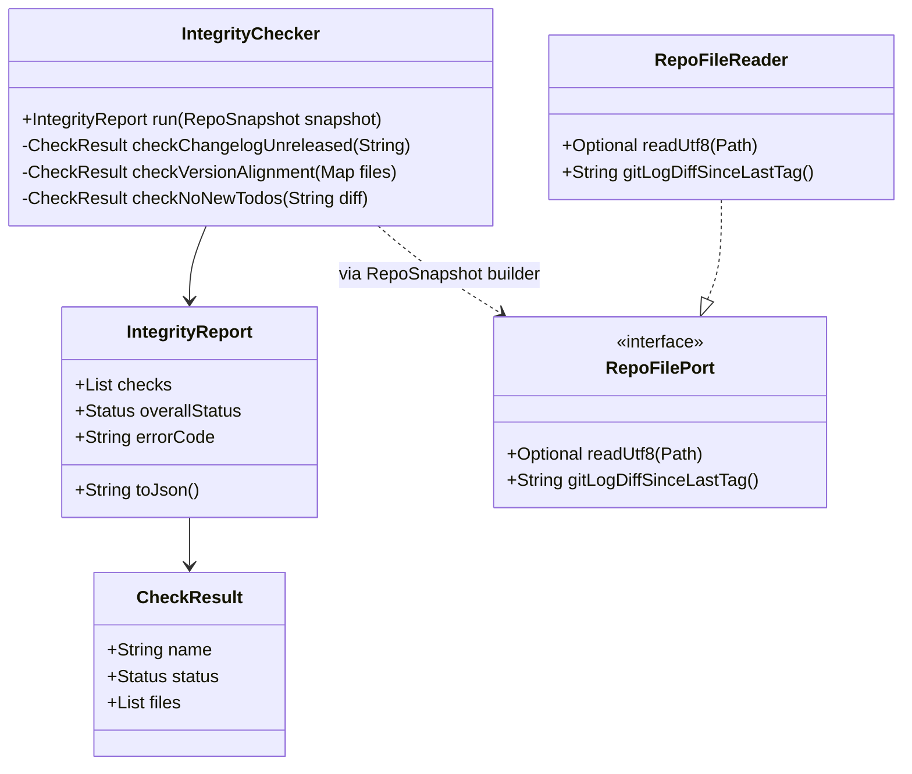

# Story Planning Report -- story-0039-0003

## Header

| Field | Value |
|-------|-------|
| Story ID | story-0039-0003 |
| Epic ID | 0039 |
| Date | 2026-04-15 |
| Agents Participating | Architect, QA Engineer, Security Engineer, Tech Lead, Product Owner |
| Schema | v1 (legacy) |

## Planning Summary

Story adds a sub-check 9 "integrity" to VALIDATE-DEEP phase of `/x-release`. Three new checks (changelog non-empty, version alignment, no new TODOs) detect cross-file drift before mutating branches/PRs. The design follows hexagonal architecture: pure domain `IntegrityChecker` over data maps, adapter `RepoFileReader` performs file I/O, and SKILL.md integration wires the check into the existing sub-check pipeline. Consolidated plan produced 12 sequenced tasks (6 TDD cycles for 3 checks + aggregator + adapter + SKILL + security/QG/smoke verifications).

## Architecture Assessment

**Layers affected:**
- `domain`: `dev.iadev.release.integrity.IntegrityChecker`, `IntegrityReport`, `CheckResult`, port `RepoFilePort`
- `adapter.outbound`: `RepoFileReader` (implements `RepoFilePort`)
- `config/documentation`: `java/src/main/resources/targets/claude/skills/core/x-release/SKILL.md` (sub-check 9 section + error catalog)

**Dependency direction validated:** Domain has zero external deps; adapter depends inward on port; SKILL.md consumes the compiled module. No violations.

**Class Diagram:**

**Implementation order:** domain (TASK-001..007) → adapter (TASK-008) → documentation/config (TASK-009) → verifications (TASK-010..012).

## Test Strategy Summary

- **Acceptance Tests (AT):** 5 Gherkin scenarios mapped to AT-1..AT-5 (degenerate, happy, error, boundary-WARN, boundary-skip). AT remains RED until inner loop closes; AT-5 validated by smoke TASK-012.
- **Unit Tests (UT) in TPP order:** 3 checks × {RED, GREEN, REFACTOR} + aggregator refactor.
  - TPP-nil: empty `[Unreleased]` (TASK-001/002)
  - TPP-constant: single-file version match (TASK-003/004)
  - TPP-scalar: single TODO in diff (TASK-005/006)
  - TPP-collection: aggregator across N checks (TASK-007)
  - TPP-conditional: file present vs missing (TASK-008 adapter IT)
  - TPP-iteration: smoke fixtures (TASK-012)
- **Integration Tests (IT):** `RepoFileReaderIT` (TASK-008) exercises real filesystem with UTF-8 fixtures.
- **Estimated coverage:** ≥95% line / ≥90% branch on `dev.iadev.release.integrity.*`.

## Security Assessment Summary

**OWASP mapping:**
- **A03 Injection (XXE):** pom.xml is XML — SEC requires regex-based version extraction (no XML parser) to avoid XXE. Enforced in TASK-004.
- **A01 Broken Access Control / Path Traversal (CWE-22):** `RepoFileReader` receives Path inputs — must normalize and reject `..` traversal (TASK-008 DoD, TASK-010 VERIFY).
- **A09 Logging:** error messages list file paths only, never file contents (prevents accidental secret leakage from `.env`-adjacent files).

**Controls required:**
1. Path canonicalization + prefix check in `RepoFileReader.readUtf8`
2. Regex-only version extraction from pom.xml (no DOM parser)
3. TODO scanner restricted to text diff (never full file contents in logs)

**Risk level:** LOW (read-only integrity checks; no user input accepted; operates on repo files only). No secrets handled.

## Implementation Approach

**Chosen approach (TL decision):** Hexagonal pure-domain `IntegrityChecker` + adapter `RepoFileReader`. Rationale: (a) enables unit testing of check logic without filesystem; (b) aligns with existing `x-release` codebase pattern where domain is pure; (c) isolates XXE/path-traversal risk into single auditable adapter.

**Alternatives considered:**
- Monolithic `IntegrityChecker` that reads files directly → rejected (violates dependency direction; harder to test).
- Three separate check classes → rejected (premature abstraction; 3 methods in one class stays under 250 LOC).

**Quality gates:**
- Method length ≤ 25 lines (TASK-011)
- Class length ≤ 250 lines (TASK-011)
- Coverage ≥ 95% line / ≥ 90% branch (TASK-011)
- Uniform error handling: `Optional<T>` for missing files; never `null` (TASK-011)
- RULE-001 compliance: only `java/src/main/resources/targets/claude/.../SKILL.md` edited (TASK-009); `.claude/` not touched directly.
- RULE-005 compliance: existing VALIDATE codes 1-8 untouched; new code `VALIDATE_INTEGRITY_DRIFT` added as sub-check 9.
- RULE-008 compliance: golden regeneration deferred to story-0039-0015 (TASK-009 edits source only).

## Task Breakdown Summary

| Metric | Value |
|--------|-------|
| Total tasks | 12 |
| Architecture tasks | 3 (TASK-002, 007, 008) |
| Test tasks | 6 (TASK-001, 003, 005 RED; TASK-002, 004, 006 GREEN paired) |
| Security tasks | 1 (TASK-010) + augmentations on TASK-004/008 |
| Quality gate tasks | 1 (TASK-011) |
| Validation tasks | 1 (TASK-012 smoke) |
| Merged tasks | 6 (ARCH+QA merges on 002/004/006/008; ARCH+TL+PO on 009; QA+PO on 012) |
| Augmented tasks | 2 (TASK-004 +XXE guard; TASK-008 +path traversal guard) |

## Consolidated Risk Matrix

| Risk | Source Agent | Severity | Likelihood | Mitigation |
|------|------------|----------|------------|------------|
| XXE via pom.xml parsing | Security | HIGH | MEDIUM | Regex-only version extraction (TASK-004); no XML parser |
| Path traversal in RepoFileReader | Security | HIGH | LOW | Normalize + prefix-check against repo root (TASK-008, verified TASK-010) |
| TODO regex false positive on `TODO(future)` | QA | MEDIUM | MEDIUM | Negative lookahead `(?!\()` + DoR acceptance test (TASK-005) |
| SKILL.md edit without golden regen drift | Tech Lead | MEDIUM | HIGH if run individually | RULE-008 defers regen to story-0039-0015; TASK-009 edits source only; escalation noted |
| `--skip-integrity` abused in CI silently | PO | LOW | MEDIUM | "not recommended" WARN log on every skip (TASK-009 DoD) |
| New VALIDATE code breaks existing error catalog parsers | Tech Lead | LOW | LOW | RULE-005 preserves codes 1-8; only appended (TASK-009) |

## DoR Status

**Verdict:** READY (all 10 mandatory checks pass; 2 conditional N/A).

See [`dor-story-0039-0003.md`](./dor-story-0039-0003.md) for full checklist.
