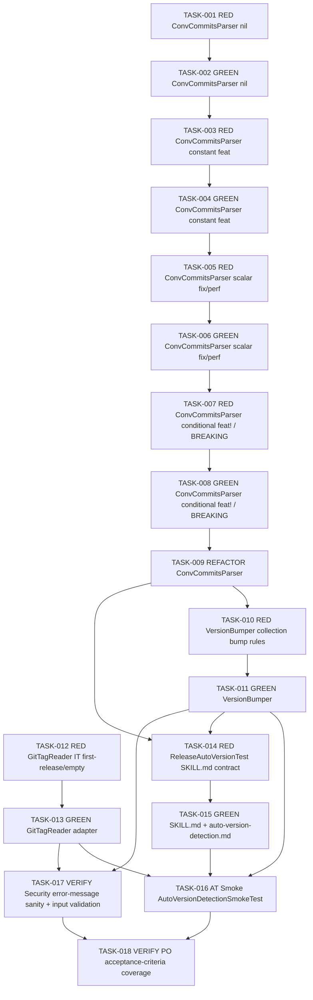

# Task Breakdown -- story-0039-0001

## Header

| Field | Value |
|-------|-------|
| Story ID | story-0039-0001 |
| Epic ID | 0039 |
| Date | 2026-04-15 |
| Author | x-story-plan (multi-agent v1) |
| Template Version | 1.0.0 |

## Summary

| Metric | Value |
|--------|-------|
| Total Tasks | 18 |
| Parallelizable Tasks | 6 |
| Estimated Effort | L (5 work-units) |
| Mode | multi-agent |
| Agents Participating | Architect, QA Engineer, Security Engineer, Tech Lead, Product Owner |
| Planning Schema Version | v1 (legacy; no `planningSchemaVersion` field in execution-state.json) |

## Dependency Graph

## Tasks Table

| Task ID | Source Agent | Type | TDD Phase | TPP Level | Layer | Components | Parallel | Depends On | Estimated Effort | DoD |
|---------|--------------|------|-----------|-----------|-------|-----------|----------|-----------|------------------|-----|
| TASK-001 | QA | test | RED | nil | domain | ConventionalCommitsParserTest | no | — | XS | Failing test: `classify_emptyCommitList_returnsZeroCounts`; asserts `{feat:0,fix:0,perf:0,breaking:0,ignored:0}`; test-first commit. |
| TASK-002 | merged(ARCH,QA) | implementation | GREEN | nil | domain | ConventionalCommitsParser | no | TASK-001 | XS | Minimal class making TASK-001 pass; package `dev.iadev.release`; immutable result record `CommitCounts`; method `classify(List<String> commits)`; no external deps (RULE-domain purity). |
| TASK-003 | QA | test | RED | constant | domain | ConventionalCommitsParserTest | no | TASK-002 | XS | Failing tests: `classify_singleFeatCommit_incrementsFeat`, `classify_singleDocsCommit_incrementsIgnored`; covers happy path constant inputs. |
| TASK-004 | merged(ARCH,QA) | implementation | GREEN | constant | domain | ConventionalCommitsParser | no | TASK-003 | S | Parse Conventional Commit first line regex `^(feat|fix|perf|docs|chore|test|refactor|style|build|ci)(\([^)]+\))?(!?):`; increment appropriate counter; ignored types counted in `ignored`. |
| TASK-005 | QA | test | RED | scalar | domain | ConventionalCommitsParserTest | no | TASK-004 | XS | Failing tests: `classify_mixedFeatFix_countsBothCorrectly`, `classify_perfCommit_incrementsPerf`; scalar combinations. |
| TASK-006 | merged(ARCH,QA) | implementation | GREEN | scalar | domain | ConventionalCommitsParser | no | TASK-005 | S | Handle mixed input lists; ensure immutable counts returned; no state leaks between calls. |
| TASK-007 | QA | test | RED | conditional | domain | ConventionalCommitsParserTest | no | TASK-006 | S | Failing tests: `classify_featBangNotation_incrementsBreaking`, `classify_bodyBreakingChange_incrementsBreaking`, `classify_fixBang_incrementsBreaking`; body multi-line parsing. |
| TASK-008 | merged(ARCH,QA) | implementation | GREEN | conditional | domain | ConventionalCommitsParser | no | TASK-007 | M | Detect `!` in type; scan body lines (separated by `%n`) for regex `^BREAKING CHANGE: `; increment `breaking`. Method signature MUST accept full `%s%n%b` payload. |
| TASK-009 | merged(TL,ARCH) | refactor | REFACTOR | N/A | domain | ConventionalCommitsParser | no | TASK-008 | S | Extract commit-line regex to named constant; extract body-scan to private method; ensure method ≤25 lines (Rule 03); re-run tests — all green, no behavior change. |
| TASK-010 | QA | test | RED | collection | domain | VersionBumperTest | no | TASK-009 | S | Parametrized failing tests: (3.1.0,MINOR)→3.2.0; (3.1.0,PATCH)→3.1.1; (3.1.0,MAJOR)→4.0.0; (0.0.0,MINOR)→0.1.0; (0.0.0,MAJOR)→1.0.0; invalid-combo rejection (pre-release downgrade). |
| TASK-011 | merged(ARCH,QA) | implementation | GREEN | collection | domain | VersionBumper, SemVer, BumpType | no | TASK-010 | S | `SemVer` value object (record) with parse+validate; `BumpType` enum {MAJOR,MINOR,PATCH,EXPLICIT}; `VersionBumper.bump(SemVer,BumpType)→SemVer`; reject invalid combos with domain exception `InvalidBumpException`. Method ≤25 lines. |
| TASK-012 | QA | test | RED | iteration | adapter.outbound | GitTagReaderIT | no | — (parallel w/ T001) | M | Failing IT using temp git repo fixture: (1) repo with tag v1.0.0 → `lastTag()==Optional.of("v1.0.0")`; (2) empty repo → `Optional.empty()`; (3) commit range list size matches known fixture. Uses JGit or Process API (no sleep). |
| TASK-013 | merged(ARCH,SEC,TL) | implementation | GREEN | iteration | adapter.outbound | GitTagReader | no | TASK-012 | M | Port interface `TagReader` in domain; adapter `GitTagReader implements TagReader`; shells to `git describe --tags --abbrev=0 --match 'v*'` and `git log <tag>..HEAD --format=%s%n%b`. Path inputs validated (Rule 06 — canonicalize repo path; reject `..`). Catches `fatal: No names found` → Optional.empty. No `System.out` (Rule 03); log via structured logger. |
| TASK-014 | QA | test | RED | iteration | config | ReleaseAutoVersionTest | no | TASK-009, TASK-011 | S | Failing verification test: asserts generated SKILL.md for `x-release` profile contains: `"--version"` flag documentation, `"auto-version-detection.md"` reference entry, section `"Auto-Version Detection"`; uses `GoldenFileRegenerator` test helper. |
| TASK-015 | merged(ARCH,TL,PO) | implementation | GREEN | iteration | config | SKILL.md source + auto-version-detection.md | no | TASK-014 | M | Edit `java/src/main/resources/targets/claude/skills/core/x-release/SKILL.md`: make `<version>` optional, add `--version X.Y.Z` flag, add algorithm summary. Create `references/auto-version-detection.md` with full algorithm, bump table, edge cases, error codes. Run `mvn process-resources` to propagate to goldens (but do NOT regen per Rule RULE-008 — S15 consolidates). |
| TASK-016 | merged(QA,PO) | acceptance | GREEN | iteration | test | AutoVersionDetectionSmokeTest | no | TASK-011, TASK-013, TASK-015 | M | E2E smoke: (a) fixture repo with tag v1.0.0 + 3 feat → detect v1.1.0, banner matches regex; (b) fixture repo no tags + 2 fix → detect v0.0.1; (c) only-docs commits → exit 1 with `VERSION_NO_BUMP_SIGNAL` in stderr; (d) `--version 4.0.0` wins over auto; (e) `--version 3.2` → `VERSION_INVALID_FORMAT`. All 6 Gherkin scenarios validated. `PipelineSmokeTest` still green. |
| TASK-017 | SEC | security | VERIFY | N/A | adapter.outbound + domain | GitTagReader, ConventionalCommitsParser | no | TASK-011, TASK-013 | S | Verify: (1) `--version` input goes through SemVer regex BEFORE any file I/O (fail-fast); (2) `git` invocation uses fixed argv (no shell expansion, no user-controlled concat — OWASP A03 Injection); (3) commit body parsing has no ReDoS vector (regex pinned, no backtracking); (4) error messages expose no internal paths or stack traces (Rule 06); (5) `--last-tag <tag>` value validated against `^v?\d+\.\d+\.\d+` before passing to git. Produce security-story-0039-0001.md appendix or note in planning-report. |
| TASK-018 | PO | validation | VERIFY | N/A | cross-cutting | all 6 Gherkin scenarios | no | TASK-016, TASK-017 | XS | Walk through each Gherkin scenario (degenerate, MINOR happy, explicit override, MAJOR via BREAKING, invalid format, first-release) and verify: (1) scenario produces documented output; (2) exit codes match 5.3 error table; (3) banner text matches spec 3.2; (4) all 4 `commitCounts` fields present; (5) error catalog (docs) lists new codes. |

## Consolidation Notes

| Rule | Tasks | Note |
|------|-------|------|
| MERGE | TASK-002, 004, 006, 008 | ARCH "create ConventionalCommitsParser" + QA "GREEN for tests" merged into single GREEN task per TPP layer. |
| MERGE | TASK-011 | ARCH "VersionBumper + SemVer VO" + QA "GREEN for bump tests" merged. |
| MERGE | TASK-013 | ARCH (port+adapter separation) + SEC (input validation, no shell injection) + TL (no System.out, method length) augmented. |
| AUGMENT | TASK-013, TASK-011 | Security DoD injected (path canonicalization, fixed argv, SemVer regex pre-validation). |
| PAIR | All UT tasks | Every GREEN has preceding RED (TPP order: nil → constant → scalar → conditional → collection → iteration). |
| TL-wins | TASK-009 (refactor) | TL mandated explicit REFACTOR step after ConventionalCommitsParser reaches green (Rule 03 method ≤25 lines). |
| PO-amend | TASK-018 | PO validates all 6 Gherkin scenarios; no new scenarios needed (coverage complete per story §7.2). |

## Escalation Notes

| Task ID | Reason | Recommended Action |
|---------|--------|--------------------|
| TASK-015 | Edits source-of-truth SKILL.md; must NOT trigger golden regen (RULE-008 consolidates in S15). | During implementation run only `mvn process-resources`; skip `GoldenFileRegenerator`. Add note in PR description referencing RULE-008. |
| TASK-013 | Shells to `git`; subprocess testing hard to make deterministic. | Use JGit (already in classpath per EPIC-0035 infra) OR contain ProcessBuilder behind port + fake in unit tests, real only in IT. |
| TASK-016 | E2E fixture repos require per-test `git init` + seed commits. | Use `@TempDir` (JUnit5) + helper `GitFixtureBuilder`; deterministic via `--date` env flags; no network. |
