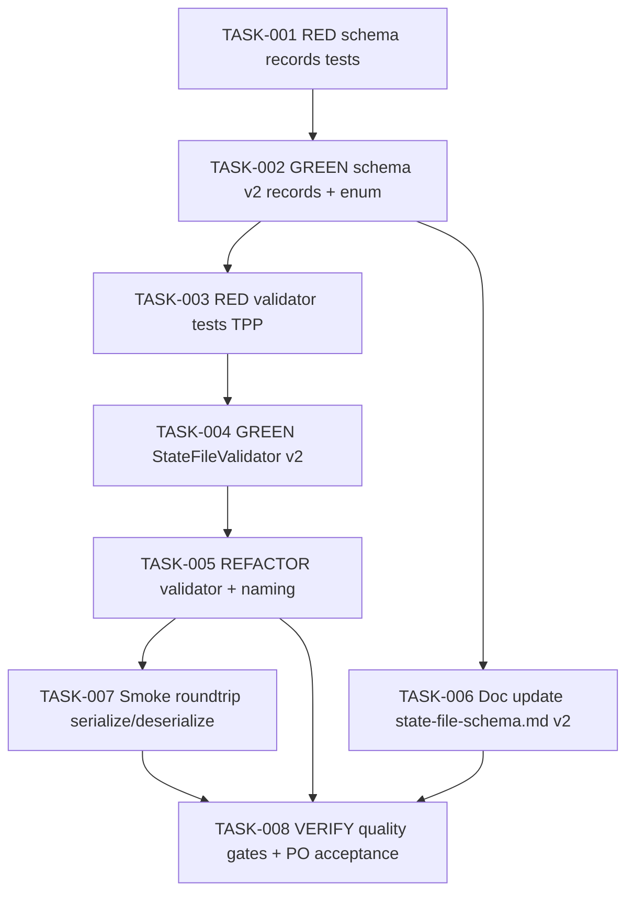

# Task Breakdown — story-0039-0002

## Header

| Field | Value |
|-------|-------|
| Story ID | story-0039-0002 |
| Epic ID | 0039 |
| Date | 2026-04-15 |
| Author | x-story-plan (multi-agent, v1 schema) |
| Template Version | 1.0.0 |

## Summary

| Metric | Value |
|--------|-------|
| Total Tasks | 8 |
| Parallelizable Tasks | 2 |
| Estimated Effort | M |
| Mode | multi-agent |
| Agents Participating | Architect, QA, Security, Tech Lead, PO |

## Dependency Graph

## Tasks Table

| Task ID | Source Agent | Type | TDD Phase | TPP Level | Layer | Components | Parallel | Depends On | Estimated Effort | DoD |
|---------|-------------|------|-----------|-----------|-------|-----------|----------|-----------|-----------------|-----|
| TASK-001 | QA | test | RED | nil/constant | domain | ReleaseStateTest, NextActionTest, WaitingForTest | no | — | S | Tests cover null/empty schemaVersion; enum WaitingFor has 6 values; records are immutable (Jackson @JsonCreator). Tests RED (no production code). |
| TASK-002 | merged(Architect,QA) | implementation | GREEN | constant | domain | ReleaseState record, NextAction record, WaitingFor enum | no | TASK-001 | S | Records immutable, Jackson-annotated; enum WaitingFor {NONE, PR_REVIEW, PR_MERGE, BACKMERGE_REVIEW, BACKMERGE_MERGE, USER_CONFIRMATION}; dependency direction domain→zero-deps; all TASK-001 tests GREEN. |
| TASK-003 | QA | test | RED | scalar/conditional | domain | StateFileValidatorTest | no | TASK-002 | M | RED tests: (1) schemaVersion=1 → STATE_SCHEMA_VERSION; (2) schemaVersion=2 → ok; (3) waitingFor="UNKNOWN" → STATE_INVALID_ENUM; (4) nextActions[].command not starting with "/" → STATE_INVALID_ACTION; (5) phaseDurations={} → ok; (6) nextActions roundtrip preserves label+command. 6 scenarios mapped 1:1 to Gherkin. |
| TASK-004 | merged(Architect,Security,QA) | implementation | GREEN | conditional | domain | StateFileValidator | no | TASK-003 | M | All TASK-003 tests GREEN; error codes STATE_SCHEMA_VERSION, STATE_INVALID_ENUM, STATE_INVALID_ACTION emitted; command regex ^/[a-z\-]+ enforced (SEC-augmented: input validation on external-origin command strings); rejection message includes migration hint "/x-release --abort". |
| TASK-005 | Architect | refactor | REFACTOR | n/a | domain | StateFileValidator, ReleaseState | no | TASK-004 | XS | Extract helper methods if >25 lines; intent-revealing names (validateSchemaVersion, validateWaitingFor, validateNextActions); zero behavior change; all prior tests still GREEN. |
| TASK-006 | merged(Architect,PO) | documentation | N/A | n/a | cross-cutting | references/state-file-schema.md, ReleaseStateFileSchemaTest | yes (with 005) | TASK-002 | M | Doc contains "Schema v2 Fields" section with tuple (field, type, origin, when-set) for 5 new fields; canonical JSON example parses as v2; ReleaseStateFileSchemaTest updated to assert all 5 new fields present in example; golden regen run (`mvn process-resources`) per project memory. |
| TASK-007 | QA | test | VERIFY | iteration | cross-cutting | StateFileRoundtripSmokeTest | no | TASK-005 | S | Smoke test serializes complete v2 state, deserializes, asserts field-by-field equality for all 20+ fields incl. 5 new ones; phaseDurations map non-empty; waitingFor exercised as enum and null. |
| TASK-008 | merged(TechLead,PO,Security) | quality-gate | VERIFY | n/a | cross-cutting | ALL | no | TASK-005, TASK-006, TASK-007 | S | Coverage ≥95% line / ≥90% branch on domain.state package; method length ≤25 lines; all 6 Gherkin scenarios validated by at least one test; SEC review sign-off on error message (no internal stack trace exposure per Rule 06 J7); DoD Local checklist fully ticked; Conventional Commits history shows test-first ordering per task. |

## Escalation Notes

| Task ID | Reason | Recommended Action |
|---------|--------|--------------------|
| TASK-004 | Breaking change by design (v1 rejected, no silent upgrade) — decision ratified in story §3.2 | No action; proceed as specified |
| TASK-006 | Requires golden file regen; per project memory run `mvn process-resources` BEFORE `GoldenFileRegenerator` | Documented in DoD |

## Consolidation Notes

- **MERGE**: Story's 4 pre-written tasks (TASK-0039-0002-001..004) consolidated with multi-agent perspective into 8 TDD-ordered tasks (RED/GREEN pairs + REFACTOR + VERIFY).
- **AUGMENT**: TASK-004 augmented with SEC criteria (input validation on `nextActions[].command` — user-originated string, Rule 12 J6 path-traversal family mitigated by regex allowlist).
- **PAIR**: TASK-001→002 and TASK-003→004 are RED/GREEN pairs per Rule 05 test-first.
- **TL WINS**: Quality gates (TASK-008) govern final sign-off.
- **PO AMENDMENTS**: No amendments needed; 6 Gherkin scenarios already cover degenerate/happy/boundary/error categories per story §7.2.
