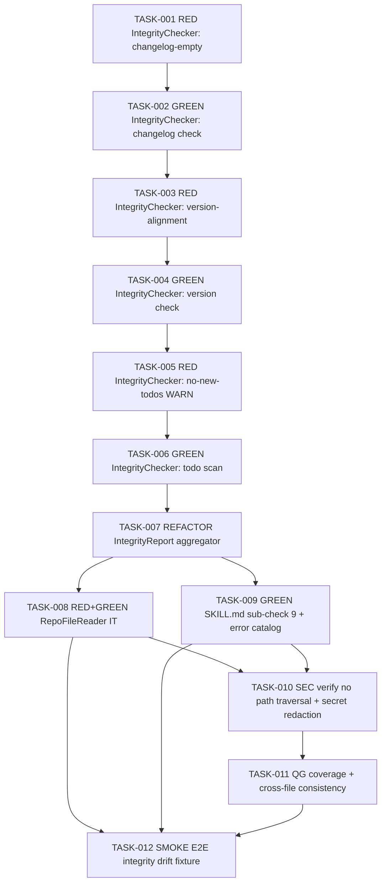

# Task Breakdown -- story-0039-0003

## Header

| Field | Value |
|-------|-------|
| Story ID | story-0039-0003 |
| Epic ID | 0039 |
| Date | 2026-04-15 |
| Author | x-story-plan (multi-agent, v1 schema) |
| Template Version | 1.0.0 |

## Summary

| Metric | Value |
|--------|-------|
| Total Tasks | 12 |
| Parallelizable Tasks | 4 |
| Estimated Effort | M (story-level) |
| Mode | multi-agent |
| Agents Participating | Architect, QA Engineer, Security Engineer, Tech Lead, Product Owner |

## Dependency Graph

## Tasks Table

| Task ID | Source Agent | Type | TDD Phase | TPP Level | Layer | Components | Parallel | Depends On | Estimated Effort | DoD |
|---------|-------------|------|-----------|-----------|-------|-----------|----------|-----------|-----------------|-----|
| TASK-001 | QA | test | RED | nil | domain | IntegrityChecker, IntegrityReport | no | — | S | Failing test asserts empty `[Unreleased]` section yields `changelog_unreleased_non_empty=FAIL`; test name follows `methodUnderTest_scenario_expected` |
| TASK-002 | merged(ARCH,QA) | implementation | GREEN | nil | domain | IntegrityChecker#checkChangelogUnreleased | no | TASK-001 | S | Domain class has zero external deps; method ≤ 25 lines; returns CheckResult with PASS/FAIL + file refs; input is parsed CHANGELOG content (String), not file I/O |
| TASK-003 | QA | test | RED | constant | domain | IntegrityChecker#checkVersionAlignment | no | TASK-002 | S | Failing test: pom.xml v=3.1.0 vs README badge v=3.0.0 → FAIL with both file:line refs in result |
| TASK-004 | merged(ARCH,QA,SEC) | implementation | GREEN | constant | domain | IntegrityChecker#checkVersionAlignment | no | TASK-003 | M | Regex extracts `vX.Y.Z` and `X.Y.Z`; compares against pom version; returns divergent files; NO filesystem access (pure function over Map<String,String>); rejects path traversal by never touching paths |
| TASK-005 | QA | test | RED | scalar | domain | IntegrityChecker#checkNoNewTodos | no | TASK-004 | S | Failing test: diff text containing `+ // TODO new thing` in .java → WARN (not FAIL); documented `TODO(future)` excluded |
| TASK-006 | merged(ARCH,QA,TL) | implementation | GREEN | scalar | domain | IntegrityChecker#checkNoNewTodos | no | TASK-005 | S | Regex `(TODO\|FIXME\|HACK\|XXX)` with negative lookahead for `TODO\(`; scope limited to .java/.md/.peb; returns WARN status (never FAIL); test files excluded |
| TASK-007 | ARCH | refactor | REFACTOR | collection | domain | IntegrityReport, IntegrityChecker.run() | no | TASK-006 | S | Aggregator computes overallStatus = FAIL if any FAIL, PASS otherwise (WARN does not demote); errorCode=`VALIDATE_INTEGRITY_DRIFT` only when FAIL; serializable to JSON via port |
| TASK-008 | merged(ARCH,QA) | test+implementation | RED→GREEN | conditional | adapter.outbound | RepoFileReader + RepoFileReaderIT | yes-with-T009 | TASK-007 | M | Integration test reads real CHANGELOG.md/pom.xml/README.md fixtures with UTF-8; missing file → Optional.empty (graceful); port interface `RepoFilePort` in domain |
| TASK-009 | merged(ARCH,TL,PO) | documentation | GREEN | conditional | config | SKILL.md x-release source | yes-with-T008 | TASK-007 | S | Sub-check 9 section added in source (`java/src/main/resources/targets/claude/skills/core/x-release/SKILL.md`); `VALIDATE_INTEGRITY_DRIFT` in error catalog; `--skip-integrity` documented with "not recommended" warning |
| TASK-010 | SEC | security | VERIFY | iteration | cross-cutting | IntegrityChecker, RepoFileReader | no | TASK-008, TASK-009 | S | Verify: (a) no path traversal - reader rejects paths with `..`; (b) pom.xml content treated as data (no XXE — use safe XML parser or simple regex); (c) error messages do not leak file contents (only paths) |
| TASK-011 | TL | quality-gate | VERIFY | iteration | cross-cutting | all new classes | no | TASK-010 | S | Coverage ≥95% line / ≥90% branch on `dev.iadev.release.integrity.*`; all classes ≤250 lines; methods ≤25 lines; no wildcard imports; uniform error handling (Optional, never null) |
| TASK-012 | merged(QA,PO) | validation | VERIFY | iteration | test (smoke) | IntegrityCheckSmokeTest | no | TASK-008, TASK-009, TASK-011 | S | Smoke fixture with cumulative drift (changelog empty + version divergent) exits 1 with `VALIDATE_INTEGRITY_DRIFT`; clean fixture passes; `--skip-integrity` bypasses and logs warn |

## Consolidation Notes

- **Rule 2 AUGMENT applied**: TASK-004 absorbed SEC input-validation criteria (file path handling). TASK-010 retained as VERIFY task depending on TASK-008/009.
- **Rule 3 PAIR applied**: Every QA-RED has paired GREEN (001↔002, 003↔004, 005↔006).
- **Rule 4 TL wins**: TL preferred pure-domain IntegrityChecker with adapter separation (port/adapter pattern) over ARCH's initial "IntegrityChecker reads files directly" proposal. Rationale preserved in TASK-002/008 DoD.
- **Rule 5 PO amends**: Existing 5 Gherkin scenarios cover degenerate/happy/error/boundary. PO confirmed no amendments needed; added TASK-012 to validate story-level AC end-to-end.

## Escalation Notes

| Task ID | Reason | Recommended Action |
|---------|--------|--------------------|
| TASK-009 | Edits source SKILL.md (RULE-001 source-of-truth); requires golden regen per RULE-008 (deferred to story-0039-0015) | Confirm regen is NOT run in this story; only source edited |
| TASK-010 | XXE risk if pom.xml parsed with default XML parser | Use regex-based version extraction (no DOM/SAX); documented in TASK-004 DoD |
