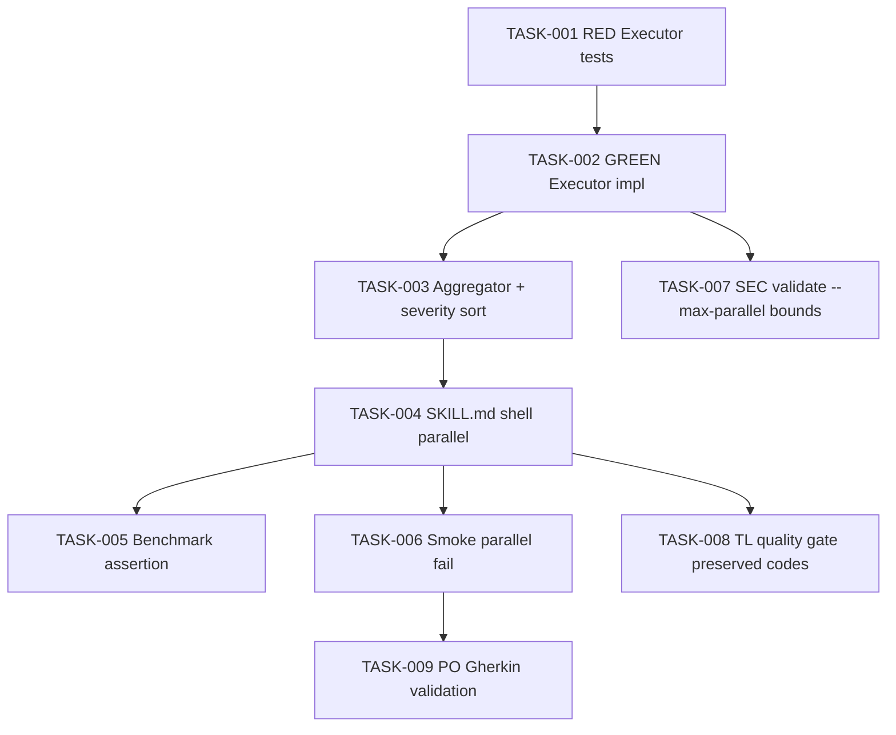

# Task Breakdown -- story-0039-0004

## Header

| Field | Value |
|-------|-------|
| Story ID | story-0039-0004 |
| Epic ID | 0039 |
| Date | 2026-04-15 |
| Author | x-story-plan (multi-agent) |
| Template Version | 1.0.0 |

## Summary

| Metric | Value |
|--------|-------|
| Total Tasks | 9 |
| Parallelizable Tasks | 3 |
| Estimated Effort | L (M+M+S+L+M+S+XS+XS+XS) |
| Mode | multi-agent |
| Agents Participating | Architect, QA, Security, Tech Lead, PO |

## Dependency Graph

## Tasks Table

| Task ID | Source Agent | Type | TDD Phase | TPP Level | Layer | Components | Parallel | Depends On | Estimated Effort | DoD |
|---------|--------------|------|-----------|-----------|-------|------------|----------|------------|-----------------|-----|
| TASK-001 | QA | test | RED | scalar | application | ParallelCheckExecutorTest | no | — | S | Test fails; covers degenerate (0 checks), single check, N checks in pool; exit-code capture asserted |
| TASK-002 | merged(Architect,QA) | implementation | GREEN | collection | application | ParallelCheckExecutor | no | TASK-001 | M | Class ≤ 250 lines; methods ≤ 25 lines; pool size `min(CPU,4)`; captures exit+duration; coverage ≥ 95% line / ≥ 90% branch; input `--max-parallel` validated 1..16 |
| TASK-003 | Architect | implementation | GREEN | conditional | application | ResultAggregator | no | TASK-002 | S | Sorts FAIL→WARN→PASS; deterministic alphabetic secondary sort; preserves all VALIDATE_* codes |
| TASK-004 | merged(Architect,TL) | implementation | GREEN | iteration | cross-cutting | x-release SKILL.md | no | TASK-003 | L | Bash block uses `&` + `wait $PID` for 7 checks; captures exit codes per PID; `--max-parallel N` honored; documented in SKILL.md |
| TASK-005 | QA | test | VERIFY | iteration | cross-cutting | ValidateDeepBenchmarkTest | yes | TASK-004 | M | Measures sequential vs parallel on fixture; asserts ≥ 40% reduction; stable under CI jitter (5 runs median) |
| TASK-006 | QA | test | VERIFY | conditional | cross-cutting | ValidateDeepParallelSmokeTest | yes | TASK-004 | S | Force-fails golden check; asserts abort with VALIDATE_GOLDEN_DRIFT; other checks still execute (captured) |
| TASK-007 | Security | security | VERIFY | scalar | application | input validator | yes | TASK-002 | XS | Rejects `--max-parallel 0`, `--max-parallel 17`, non-integer; error ABORT_INVALID_PARALLELISM; no injection via arg |
| TASK-008 | Tech Lead | quality-gate | VERIFY | N/A | cross-cutting | VALIDATE_* code set | no | TASK-004 | XS | grep confirms all 7 original VALIDATE_* codes present in new code; no renames; coverage threshold met |
| TASK-009 | PO | validation | VERIFY | N/A | cross-cutting | Gherkin scenarios | no | TASK-006 | XS | All 5 Gherkin scenarios from story §7 mapped 1:1 to acceptance tests; TPP ordering respected |

## Escalation Notes

| Task ID | Reason | Recommended Action |
|---------|--------|--------------------|
| TASK-005 | CI jitter may cause flaky ≥40% assertion | Use median of 5 runs; skip on constrained CPU env (document in test) |
| TASK-004 | Shell `&`+`wait` portability on Windows | Document bash/zsh requirement; skill already assumes POSIX shell |
