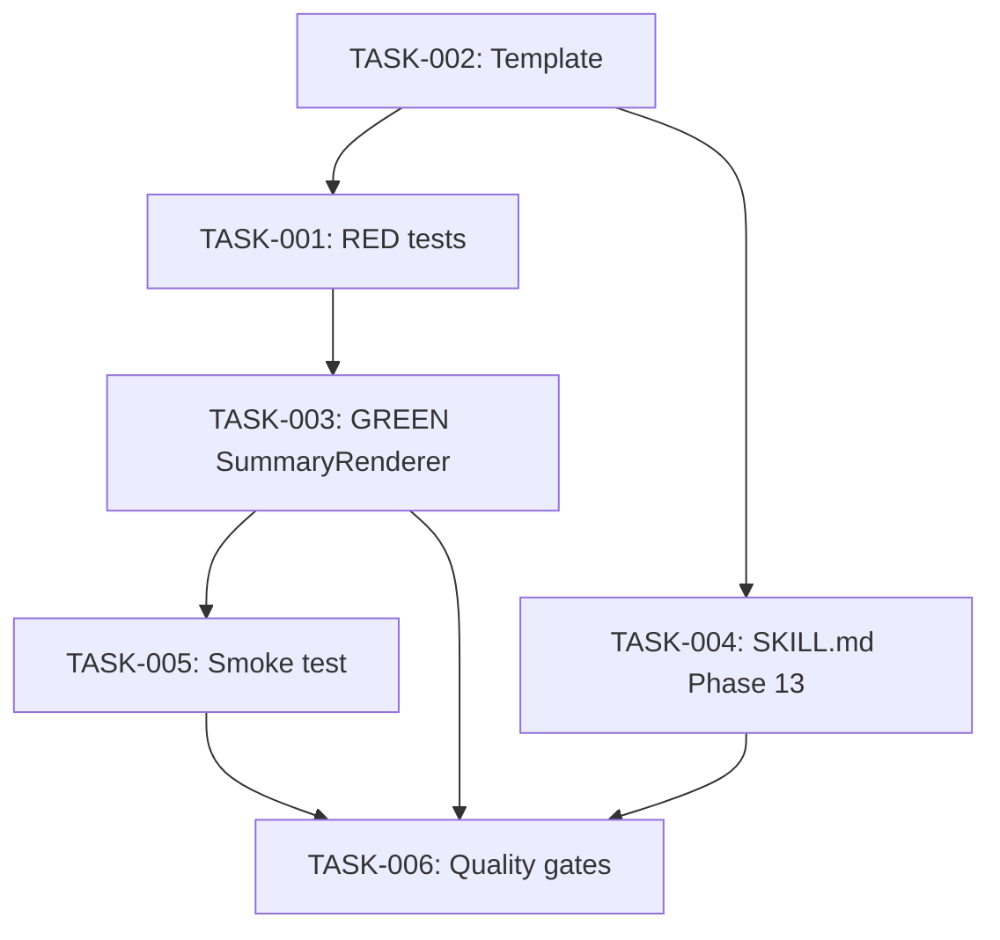

# Task Breakdown — story-0039-0005

## Header

| Field | Value |
|-------|-------|
| Story ID | story-0039-0005 |
| Epic ID | 0039 |
| Date | 2026-04-15 |
| Author | x-story-plan (multi-agent) |
| Template Version | 1.0.0 |
| Schema Version | v1 (legacy; execution-state.json has no planningSchemaVersion field) |

## Summary

| Metric | Value |
|--------|-------|
| Total Tasks | 6 |
| Parallelizable Tasks | 2 (TASK-002 and TASK-004 after TASK-001) |
| Estimated Effort | M (~1-2 days) |
| Mode | multi-agent |
| Agents Participating | Architect, QA, Security, Tech Lead, PO |

## Dependency Graph

## Tasks Table

| Task ID | Source Agent | Type | TDD Phase | TPP Level | Layer | Components | Parallel | Depends On | Estimated Effort | DoD |
|---------|-------------|------|-----------|-----------|-------|-----------|----------|-----------|-----------------|-----|
| TASK-001 | merged(QA,SEC) | test | RED | 1→6 (all) | application | `SummaryRendererTest` | no | TASK-002 | S | Tests for all 5 Gherkin scenarios in TPP order (happy, --no-summary, GitHub URL absent, 80-col, corrupted state); assertions specific (no weak isNotNull); no secrets/PII in fixtures |
| TASK-002 | ARCH | architecture | N/A | N/A | cross-cutting/doc | `references/git-flow-cycle-explainer.md` | yes (with TASK-004 after TASK-002) | — | S | Template has exactly 6 placeholders (LAST_TAG, NEW_TAG, NEXT_SNAPSHOT, RELEASE_PR, BACKMERGE_PR, GITHUB_RELEASE_URL); every line ≤80 cols; ASCII diagram follows story §5.2 layout; file committed under `java/src/main/resources/targets/claude/skills/core/x-release/references/` (RULE-001 source-of-truth) |
| TASK-003 | merged(ARCH,QA,TL,SEC) | implementation | GREEN | N/A | application | `SummaryRenderer.java` | no | TASK-001 | M | All TASK-001 tests green; method ≤25 lines; class ≤250 lines; placeholder substitution treats state fields as literal strings (no eval/template-injection); missing fields degrade gracefully to `—`; no `System.out` (returns String); constructor injection only; no static mutable state |
| TASK-004 | merged(ARCH,PO) | architecture | N/A | N/A | cross-cutting/doc | `SKILL.md` | yes (with TASK-002) | TASK-002 | S | Phase 13 SUMMARY documented in phase list; `--no-summary` flag documented with CI rationale (RULE-004); RULE-001 respected (edit source, not `.claude/`) |
| TASK-005 | QA | test | VERIFY | 6 (iteration/integration) | cross-cutting/test | `SummaryRenderSmokeTest.java` | no | TASK-003 | S | Smoke test renders full cycle with realistic state file; asserts all 6 placeholder substitutions present in output; asserts no line exceeds 80 cols |
| TASK-006 | merged(TL,PO) | quality-gate | VERIFY | N/A | cross-cutting | All of the above | no | TASK-003, TASK-004, TASK-005 | XS | Coverage on SummaryRenderer ≥95% line / ≥90% branch (Rule 05); all 5 Gherkin scenarios mapped to tests (PO-001); `--no-summary` documented in SKILL.md (PO-002); no 80-col violations anywhere in rendered output; cross-file consistency: template placeholder names identical between template file, renderer constants, and SKILL.md reference |

## Escalation Notes

| Task ID | Reason | Recommended Action |
|---------|--------|--------------------|
| — | No escalations; story is well-scoped | — |

## Consolidation Trace

- MERGE: QA test scenarios + SEC input-as-data criterion → TASK-001 DoD includes "no template injection" check
- MERGE: ARCH SummaryRenderer + QA GREEN impl + TL method length + SEC literal substitution → TASK-003 (single consolidated GREEN task)
- MERGE: ARCH SKILL.md update + PO `--no-summary` flag documentation → TASK-004
- AUGMENT: Security literal-substitution criterion injected into TASK-003 (renderer handles state-file input)
- PAIR: TASK-001 (RED) precedes TASK-003 (GREEN) — enforced by dependency edge
- TL wins: No ARCH/TL conflict in this story
- PO amends: Acceptance criteria already complete (5 scenarios cover all categories per §7.2); no story-file amendments needed
