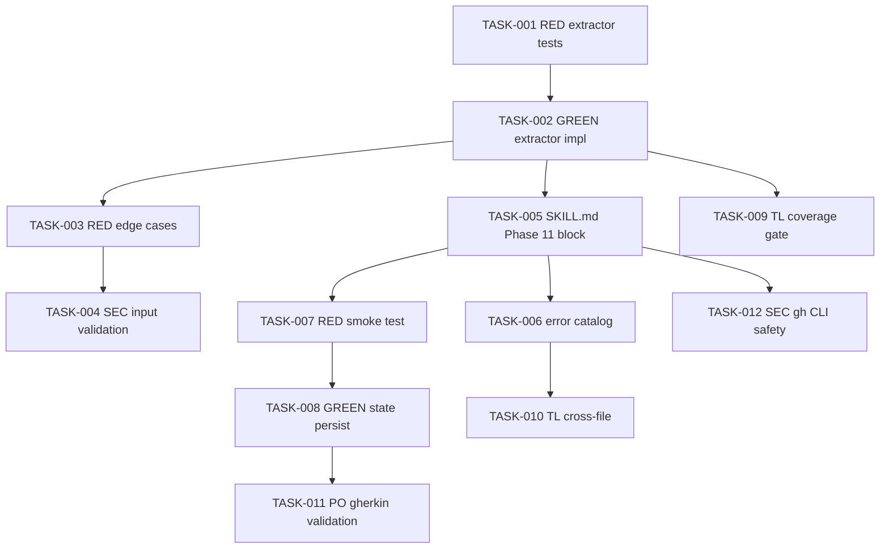

# Task Breakdown -- story-0039-0006

## Header

| Field | Value |
|-------|-------|
| Story ID | story-0039-0006 |
| Epic ID | 0039 |
| Date | 2026-04-15 |
| Author | x-story-plan (multi-agent) |
| Template Version | 1.0.0 |
| Schema | v1 (planningSchemaVersion absent -> FALLBACK_MISSING_FIELD) |

## Summary

| Metric | Value |
|--------|-------|
| Total Tasks | 12 |
| Parallelizable Tasks | 4 |
| Estimated Effort | M |
| Mode | multi-agent |
| Agents Participating | Architect, QA, Security, Tech Lead, PO |

## Dependency Graph

## Tasks Table

| Task ID | Source Agent | Type | TDD Phase | TPP Level | Layer | Components | Parallel | Depends On | Effort | DoD |
|---------|-------------|------|-----------|-----------|-------|-----------|----------|-----------|--------|-----|
| TASK-001 | QA | test | RED | nil | domain | ChangelogBodyExtractorTest | yes | — | S | Test class exists with degenerate (empty/null) cases; fails with NoClassDefFoundError |
| TASK-002 | merged(ARCH,QA) | implementation | GREEN | constant | domain | ChangelogBodyExtractor | no | TASK-001 | S | Regex matches `## [X.Y.Z]` up to next `## [`; returns Optional<String>; all TASK-001 tests green; method <=25 lines |
| TASK-003 | QA | test | RED | scalar | domain | ChangelogBodyExtractorTest | yes | TASK-002 | XS | Missing version returns Optional.empty; last-version-at-EOF works; multiline body preserved |
| TASK-004 | SEC | security | VERIFY | N/A | domain | ChangelogBodyExtractor | yes | TASK-002 | XS | Version arg validated against SemVer pattern before regex compile; no ReDoS risk (bounded repetition); OWASP A03 |
| TASK-005 | ARCH | architecture | N/A | N/A | config | SKILL.md Phase 11 PUBLISH | no | TASK-002 | M | Bash block with 3 paths (--no-github-release / interactive Y / interactive n); AskUserQuestion wired; flag mutex documented |
| TASK-006 | ARCH | architecture | N/A | N/A | config | error-catalog | yes | TASK-005 | XS | PUBLISH_GH_RELEASE_FAILED entry (warn-only); PUBLISH_UNKNOWN_FLAG entry (exit 1) |
| TASK-007 | QA | test | RED | collection | adapter.outbound | GithubReleaseSmokeTest | yes | TASK-005 | M | Mocked gh invocation asserts --notes + --title args; verifies state update call |
| TASK-008 | merged(ARCH,QA) | implementation | GREEN | scalar | adapter.outbound | StateFile githubReleaseUrl | no | TASK-007 | S | state JSON gains nullable String githubReleaseUrl; null when skipped; URL when created |
| TASK-009 | TL | quality-gate | VERIFY | N/A | cross-cutting | coverage | yes | TASK-002 | XS | ChangelogBodyExtractor line >=95%; branch >=90%; no method >25 lines |
| TASK-010 | TL | quality-gate | VERIFY | N/A | cross-cutting | error-catalog consistency | yes | TASK-006 | XS | New codes follow existing PUBLISH_* naming + warn-only vs fatal convention |
| TASK-011 | PO | validation | VERIFY | N/A | cross-cutting | gherkin coverage | yes | TASK-008 | XS | Each of 5 Gherkin scenarios in Section 7 has at least one executable test asserting the expected outcome |
| TASK-012 | SEC | security | VERIFY | N/A | adapter.outbound | gh CLI invocation | yes | TASK-005 | XS | --notes body passed via argv (not shell-interpolated); no token leakage in logs; stderr filtered |

## Escalation Notes

| Task ID | Reason | Recommended Action |
|---------|--------|--------------------|
| TASK-005 | SKILL.md is a generator resource (RULE-001); changes ripple to .claude/ via regen | Run `mvn process-resources` + GoldenFileRegenerator after edit |
| TASK-007 | Smoke test invokes real `gh` in some envs; must be fully mocked | Use ProcessRunner port + test double; never invoke real gh in CI |
